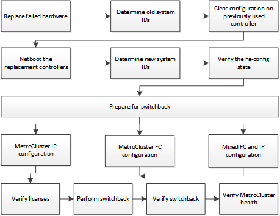

= Recuperando-se de uma falha de vários controladores ou de armazenamento
:allow-uri-read: 
:icons: font
:imagesdir: ../media/

[role="lead"]
Se a falha da controladora se estender a todos os módulos de controladora de um lado de um grupo de DR em uma configuração MetroCluster (incluindo um único controlador em uma configuração de MetroCluster de dois nós) ou o storage tiver sido substituído, você precisará substituir o equipamento e reatribuir a propriedade das unidades para recuperação do desastre.

Verifique se você verificou e executou as seguintes tarefas antes de usar este procedimento:

* Reveja os procedimentos de recuperação disponíveis antes de decidir utilizar este procedimento.
+
link:concept_choosing_the_correct_recovery_procedure_parent_concept.html["Escolher o procedimento de recuperação correto"]

* Confirme se o registo da consola está ativado nos seus dispositivos.
+
link:task-enable-console-logging.html["Ativar o registo da consola"]

* Certifique-se de que o local do desastre esteja vedado.
+
link:task_perform_a_forced_switchover_after_a_disaster.html#fencing-off-the-disaster-site["Esgrima fora do local do desastre"].

* Verifique se o switchover foi realizado.
+
link:task_perform_a_forced_switchover_after_a_disaster.html#performing-a-forced-switchover["Realizar uma comutação forçada"].

* Verifique se as unidades de substituição e os módulos do controlador são novos e não devem ter sido atribuídos propriedade anteriormente.
* Os exemplos deste procedimento mostram configurações de dois ou quatro nós. Se você tiver uma configuração de oito nós (dois grupos de DR), terá que levar em conta todas as falhas e executar a tarefa de recuperação necessária nos módulos adicionais da controladora.

Este procedimento utiliza o seguinte fluxo de trabalho:

Este procedimento pode ser usado ao executar a recuperação em um sistema que estava em transição intermediária quando a falha ocorreu. Nesse caso, você deve executar as etapas apropriadas ao se preparar para o switchback, como indicado no procedimento.
