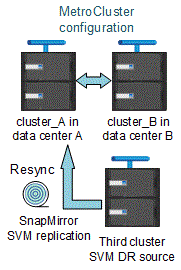

= Considerações ao usar o ONTAP em uma configuração do MetroCluster
:allow-uri-read: 
:icons: font
:imagesdir: ../media/

[role="lead"]
Ao usar o ONTAP em uma configuração do MetroCluster, você deve estar ciente de certas considerações sobre licenciamento, peering para clusters fora da configuração do MetroCluster, execução de operações de volume, operações NVFAIL e outras operações do ONTAP.

.Considerações sobre licenciamento
* Ambos os sites devem ser licenciados para os mesmos recursos licenciados pelo site.
* Todos os nós devem ser licenciados para os mesmos recursos de bloqueio de nó.

.Consideração de SnapMirror
* A recuperação de desastres do SnapMirror SVM só é compatível com configurações do MetroCluster executando versões do ONTAP 9.5 ou posterior.

== Suporte FlexCache em uma configuração MetroCluster

A partir do ONTAP 9.7, os volumes FlexCache são compatíveis com configurações do MetroCluster. Você deve estar ciente dos requisitos para a repetibilidade manual após operações de comutação ou switchback.

=== Repetibilidade da SVM após o switchover quando a origem e o cache do FlexCache estão no mesmo local do MetroCluster

Após um switchover negociado ou não planejado, qualquer relacionamento de peering SVM FlexCache no cluster deve ser configurado manualmente.

Por exemplo, SVMs "VS1" (cache) e "VS2" (origem) estão no site_A. Esses SVMs são peered.

Após o switchover, os SVMs "VS1-mc" e "VS2-mc" são ativados no local do parceiro (site_B). Eles devem ser manualmente repelidos para que o FlexCache funcione usando o `vserver peer repeer` comando.

=== Repetibilidade da SVM após switchover ou switchback quando um destino FlexCache está em um terceiro cluster e no modo desconetado

Para relacionamentos do FlexCache com um cluster fora da configuração do MetroCluster, o peering deve ser sempre reconfigurado manualmente após um switchover, se os clusters envolvidos estiverem no modo desconetado durante o switchover.

Por exemplo:

* Um fim do FlexCache (cache_1 no VS1) está alojado no MetroCluster site_A.
* A outra extremidade do FlexCache (origin_1 no VS2) reside no site_C (não na configuração do MetroCluster).

Quando o switchover é acionado e se o site_A e o site_C não estiverem conetados, você deverá repelir manualmente os SVMs no site_B (o cluster de switchover) e site_C usando o `vserver peer repeer` comando após o switchover.

Quando o switchback é executado, você deve repelir novamente os SVMs no site_A (o cluster original) e site_C.

.Informações relacionadas
link:https://docs.netapp.com/us-en/ontap/flexcache/index.html["Gerenciamento de volumes do FlexCache com a CLI"^]

== Suporte FabricPool em configurações MetroCluster

A partir do ONTAP 9.7, as configurações do MetroCluster são compatíveis com camadas de storage FabricPool.

Para obter informações gerais sobre como usar o FabricPools, link:https://docs.netapp.com/us-en/ontap/disks-aggregates/index.html["Gerenciamento de disco e camada (agregado)"^]consulte .

=== Considerações ao usar FabricPools

* Os clusters precisam ter licenças FabricPool com limites de capacidade correspondentes.
* Os clusters devem ter IPspaces com nomes correspondentes.
+
Esse pode ser o IPspace padrão ou um IPspace criado por um administrador. Este espaço IPspace será usado para configurações de armazenamento de objetos FabricPool.

* Para o espaço IPspace selecionado, cada cluster deve ter um LIF entre clusters definido que possa alcançar o armazenamento de objetos externo.
* A migração para SVM não é compatível com FabricPool quando a origem ou o destino é um cluster do MetroCluster.
+
link:https://docs.netapp.com/us-en/ontap/svm-migrate/index.html["Saiba mais sobre a mobilidade de dados do SVM"^].

=== Configurando um agregado para uso em um FabricPool espelhado

NOTE: Antes de configurar o agregado, você deve configurar armazenamentos de objetos conforme descrito em link:https://docs.netapp.com/us-en/ontap/fabricpool/setup-object-stores-mcc-task.html["Configurar armazenamentos de objetos para FabricPool em uma configuração MetroCluster"^].

.Passos
Para configurar um agregado para uso em um FabricPool:

. Crie o agregado ou selecione um agregado existente.
. Espelhe o agregado como um agregado espelhado típico na configuração do MetroCluster.
. Crie o espelho FabricPool com o agregado, conforme descrito em https://docs.netapp.com/ontap-9/topic/com.netapp.doc.dot-cm-psmg/home.html["Gerenciamento de discos e agregados"]
+
.. Anexe um armazenamento de objetos primário.
+
Este armazenamento de objetos está fisicamente mais perto do cluster.

.. Adicione um armazenamento de objetos espelhados.
+
Este armazenamento de objetos está fisicamente mais distante do cluster do que o armazenamento de objetos primário.

NOTE: É recomendável manter pelo menos 20% de espaço livre para agregados espelhados para performance e disponibilidade ideais de storage. Embora a recomendação seja de 10% para agregados não espelhados, os 10% adicionais de espaço podem ser usados pelo sistema de arquivos para absorver alterações incrementais. Mudanças incrementais aumentam a utilização de espaço para agregados espelhados devido à arquitetura baseada em Snapshot copy-on-write da ONTAP. O não cumprimento destas práticas recomendadas pode ter um impactos negativo no desempenho.

== Suporte FlexGroup em configurações MetroCluster

A partir do ONTAP 9.6, as configurações do MetroCluster são compatíveis com volumes FlexGroup.

== Suporte a grupos de consistência nas configurações do MetroCluster

A partir do ONTAP 9.11,1, link:https://docs.netapp.com/us-en/ontap/consistency-groups/index.html["grupos de consistência"^] são suportados nas configurações do MetroCluster.

== Programações de trabalhos em uma configuração MetroCluster

No ONTAP 9.3 e posterior, as programações de tarefas criadas pelo usuário são replicadas automaticamente entre clusters em uma configuração do MetroCluster. Se você criar, modificar ou excluir um agendamento de trabalho em um cluster, o mesmo agendamento será criado automaticamente no cluster de parceiros, usando o CRS (Configuration Replication Service).

NOTE: As programações criadas pelo sistema não são replicadas e você deve executar manualmente a mesma operação no cluster de parceiros para que as programações de tarefas em ambos os clusters sejam idênticas.

== Peering de cluster do site MetroCluster para um terceiro cluster

Como a configuração de peering não é replicada, se você identificar um dos clusters na configuração do MetroCluster para um terceiro cluster fora dessa configuração, você também deverá configurar o peering no cluster do MetroCluster parceiro. Isso é para que o peering possa ser mantido se ocorrer um switchover.

O cluster que não é MetroCluster deve estar executando o ONTAP 8,3 ou posterior. Caso contrário, o peering é perdido se ocorrer um switchover, mesmo que o peering tenha sido configurado em ambos os parceiros da MetroCluster.

== Replicação de configuração de cliente LDAP em uma configuração MetroCluster

Uma configuração de cliente LDAP criada em uma máquina virtual de storage (SVM) em um cluster local é replicada para os dados de parceiros SVM no cluster remoto. Por exemplo, se a configuração do cliente LDAP for criada no SVM admin no cluster local, ela será replicada para todos os SVMs de dados administrativos no cluster remoto. Esse recurso do MetroCluster é intencional para que a configuração do cliente LDAP esteja ativa em todos os SVMs de parceiros no cluster remoto.

== Diretrizes de criação de LIF e rede para configurações do MetroCluster

Você deve estar ciente de como LIFs são criados e replicados em uma configuração do MetroCluster. Você também deve saber sobre o requisito de consistência para que você possa tomar as decisões adequadas ao configurar sua rede.

.Informações relacionadas
* link:https://docs.netapp.com/us-en/ontap/network-management/index.html["Gerenciamento de rede e LIF"^]
* Você deve estar ciente dos requisitos para replicar objetos IPspace no cluster de parceiros e para configurar sub-redes e IPv6 em uma configuração do MetroCluster.
+
<<ipspace_obj_rep,Requisitos de replicação de objeto IPspace e configuração de sub-rede>>

* Você deve estar ciente dos requisitos para criar LIFs ao configurar sua rede em uma configuração do MetroCluster.
+
<<reqs_lif_create,Requisitos para criação de LIF em uma configuração MetroCluster>>

* Você deve estar ciente dos requisitos de replicação do LIF em uma configuração do MetroCluster. Você também deve saber como um LIF replicado é colocado em um cluster de parceiros e estar ciente dos problemas que ocorrem quando a replicação LIF ou o posicionamento de LIF falha.
+
<<lif_rep_place,Requisitos e problemas de replicação e posicionamento de LIF>>

=== Requisitos de replicação de objeto IPspace e configuração de sub-rede

Você deve estar ciente dos requisitos para replicar objetos IPspace no cluster de parceiros e para configurar sub-redes e IPv6 em uma configuração do MetroCluster.

==== Replicação IPspace

Você deve considerar as diretrizes a seguir enquanto replica objetos IPspace para o cluster de parceiros:

* Os nomes de IPspace dos dois locais devem corresponder.
* Os objetos IPspace devem ser replicados manualmente para o cluster do parceiro.
+
Quaisquer máquinas virtuais de armazenamento (SVMs) que sejam criadas e atribuídas a um IPspace antes que o IPspace seja replicado não serão replicadas para o cluster de parceiros.

==== Configuração de sub-rede

Você deve considerar as seguintes diretrizes ao configurar sub-redes em uma configuração do MetroCluster:

* Ambos os clusters da configuração do MetroCluster devem ter uma sub-rede no mesmo espaço IPspace com o mesmo nome de sub-rede, sub-rede, domínio de broadcast e gateway.
* Os intervalos de IP dos dois clusters devem ser diferentes.
+
No exemplo a seguir, os intervalos de IP são diferentes:

+
[listing]
----
cluster_A::> network subnet show

IPspace: Default
Subnet                     Broadcast                   Avail/
Name      Subnet           Domain    Gateway           Total    Ranges
--------- ---------------- --------- ------------      -------  ---------------
subnet1   192.168.2.0/24   Default   192.168.2.1       10/10    192.168.2.11-192.168.2.20

cluster_B::> network subnet show
 IPspace: Default
Subnet                     Broadcast                   Avail/
Name      Subnet           Domain    Gateway           Total    Ranges
--------- ---------------- --------- ------------     --------  ---------------
subnet1   192.168.2.0/24   Default   192.168.2.1       10/10    192.168.2.21-192.168.2.30
----

==== Configuração IPv6

Se o IPv6 estiver configurado em um site, o IPv6 também deve ser configurado no outro site.

.Informações relacionadas
* Você deve estar ciente dos requisitos para criar LIFs ao configurar sua rede em uma configuração do MetroCluster.
+
<<reqs_lif_create,Requisitos para criação de LIF em uma configuração MetroCluster>>

* Você deve estar ciente dos requisitos de replicação do LIF em uma configuração do MetroCluster. Você também deve saber como um LIF replicado é colocado em um cluster de parceiros e estar ciente dos problemas que ocorrem quando a replicação LIF ou o posicionamento de LIF falha.
+
<<lif_rep_place,Requisitos e problemas de replicação e posicionamento de LIF>>

=== Requisitos para criação de LIF em uma configuração MetroCluster

Você deve estar ciente dos requisitos para criar LIFs ao configurar sua rede em uma configuração do MetroCluster.

Você deve considerar as seguintes diretrizes ao criar LIFs:

* Fibre Channel: Você precisa usar VSAN esticada ou tecidos esticados
* IP/iSCSI: Você deve usar a rede estendida da camada 2
* Broadcasts ARP: Você deve habilitar broadcasts ARP entre os dois clusters
* LIFs duplicadas: Você não deve criar vários LIFs com o mesmo endereço IP (LIFs duplicadas) em um espaço IPspace
* Configurações NFS e SAN: Você precisa usar diferentes máquinas virtuais de storage (SVMs) para agregados sem espelhamento e espelhados
* Você deve criar um objeto de sub-rede antes de criar um LIF. Um objeto de sub-rede permite que o ONTAP determine destinos de failover no cluster de destino porque tem um domínio de broadcast associado.

==== Verifique a criação de LIF

Você pode confirmar a criação bem-sucedida de um LIF em uma configuração do MetroCluster executando o `metrocluster check lif show` comando. Se você encontrar algum problema ao criar o LIF, você pode usar o `metrocluster check lif repair-placement` comando para corrigir os problemas.

.Informações relacionadas
* Você deve estar ciente dos requisitos para replicar objetos IPspace no cluster de parceiros e para configurar sub-redes e IPv6 em uma configuração do MetroCluster.
+
<<ipspace_obj_rep,Requisitos de replicação de objeto IPspace e configuração de sub-rede>>

* Você deve estar ciente dos requisitos de replicação do LIF em uma configuração do MetroCluster. Você também deve saber como um LIF replicado é colocado em um cluster de parceiros e estar ciente dos problemas que ocorrem quando a replicação LIF ou o posicionamento de LIF falha.
+
<<lif_rep_place,Requisitos e problemas de replicação e posicionamento de LIF>>

=== Requisitos e problemas de replicação e posicionamento de LIF

Você deve estar ciente dos requisitos de replicação do LIF em uma configuração do MetroCluster. Você também deve saber como um LIF replicado é colocado em um cluster de parceiros e estar ciente dos problemas que ocorrem quando a replicação LIF ou o posicionamento de LIF falha.

==== Replicação de LIFs para o cluster de parceiros

Quando você cria um LIF em um cluster em uma configuração do MetroCluster, o LIF é replicado no cluster de parceiros. LIFs não são colocados em uma base de nome individual. Para disponibilidade de LIFs após uma operação de switchover, o processo de colocação de LIF verifica se as portas são capazes de hospedar o LIF com base em verificações de acessibilidade e atributos de porta.

O sistema deve atender às seguintes condições para colocar as LIFs replicadas no cluster de parceiros:

|===

| Condição | Tipo de LIF: FC | Tipo de LIF: IP/iSCSI 

 a| 
Identificação do nó
 a| 
O ONTAP tenta colocar o LIF replicado no parceiro de recuperação de desastres (DR) do nó no qual ele foi criado. Se o parceiro de DR não estiver disponível, o parceiro auxiliar de DR será usado para colocação.
 a| 
O ONTAP tenta colocar o LIF replicado no parceiro de DR do nó no qual ele foi criado. Se o parceiro de DR não estiver disponível, o parceiro auxiliar de DR será usado para colocação.

 a| 
Identificação da porta
 a| 
O ONTAP identifica as portas de destino FC conectadas no cluster de DR.
 a| 
As portas no cluster de DR que estão no mesmo espaço IPspace que o LIF de origem são selecionadas para uma verificação de acessibilidade.

Se não houver portas no cluster de DR no mesmo IPspace, o LIF não pode ser colocado.

Todas as portas no cluster de DR que já estão hospedando um LIF no mesmo espaço IPspace e sub-rede são marcadas automaticamente como alcançáveis e podem ser usadas para o posicionamento. Essas portas não estão incluídas na verificação de acessibilidade.

 a| 
Verificação de acessibilidade
 a| 
A acessibilidade é determinada verificando a conetividade da malha de origem WWN nas portas do cluster de DR.

Se a mesma malha não estiver presente no local de DR, o LIF será colocado em uma porta aleatória no parceiro de DR.
 a| 
A acessibilidade é determinada pela resposta a um broadcast ARP (Address Resolution Protocol) de cada porta identificada anteriormente no cluster de DR para o endereço IP de origem do LIF a ser colocado.

Para que as verificações de acessibilidade sejam bem-sucedidas, os broadcasts ARP devem ser permitidos entre os dois clusters.

Cada porta que recebe uma resposta do LIF de origem será marcada como possível para o posicionamento.

 a| 
Seleção da porta
 a| 
O ONTAP categoriza as portas com base em atributos como tipo e velocidade do adaptador e, em seguida, seleciona as portas com atributos correspondentes.

Se nenhuma porta com atributos correspondentes for encontrada, o LIF será colocado em uma porta conetada aleatória no parceiro DR.
 a| 
A partir das portas marcadas como alcançáveis durante a verificação de acessibilidade, o ONTAP prefere as portas que estão no domínio de broadcast associado à sub-rede do LIF.

Se não houver portas de rede disponíveis no cluster de DR que estejam no domínio de broadcast associado à sub-rede do LIF, o ONTAP selecionará portas que tenham acessibilidade ao LIF de origem.

Se não houver portas com acessibilidade ao LIF de origem, uma porta será selecionada do domínio de broadcast associado à sub-rede do LIF de origem e, se nenhum domínio de broadcast existir, uma porta aleatória será selecionada.

O ONTAP categoriza as portas com base em atributos como tipo de adaptador, tipo de interface e velocidade e, em seguida, seleciona as portas com atributos correspondentes.

 a| 
Colocação de LIF
 a| 
A partir das portas alcançáveis, o ONTAP seleciona a porta menos carregada para colocação.
 a| 
A partir das portas selecionadas, o ONTAP seleciona a porta menos carregada para colocação.

|===

==== Colocação de LIFs replicadas quando o nó do parceiro de DR está inativo

Quando um iSCSI ou FC LIF é criado em um nó cujo parceiro de DR foi assumido, o LIF replicado é colocado no nó do parceiro auxiliar de DR. Após uma operação subsequente de giveback, os LIFs não são movidos automaticamente para o parceiro DR. Isso pode levar a que os LIFs se concentrem em um único nó no cluster de parceiros. Durante uma operação de switchover do MetroCluster, tentativas subsequentes de mapear LUNs pertencentes à máquina virtual de storage (SVM) falham.

Você deve executar o `metrocluster check lif show` comando após uma operação de aquisição ou operação de giveback para verificar se o posicionamento de LIF está correto. Se existirem erros, pode executar o `metrocluster check lif repair-placement` comando para resolver os problemas.

==== Erros de colocação de LIF

Os erros de colocação de LIF que são exibidos pelo `metrocluster check lif show` comando são retidos após uma operação de comutação. Se o `network interface modify` comando , `network interface rename` ou `network interface delete` for emitido para um LIF com um erro de posicionamento, o erro será removido e não aparecerá na saída do `metrocluster check lif show` comando.

==== Falha de replicação de LIF

Você também pode verificar se a replicação do LIF foi bem-sucedida usando o `metrocluster check lif show` comando. Uma mensagem EMS é exibida se a replicação LIF falhar.

Você pode corrigir uma falha de replicação executando o `metrocluster check lif repair-placement` comando para qualquer LIF que não consiga encontrar uma porta correta. Você deve resolver quaisquer falhas de replicação de LIF o mais rápido possível para verificar a disponibilidade de LIF durante uma operação de switchover de MetroCluster.

NOTE: Mesmo que o SVM de origem esteja inativo, o posicionamento de LIF pode continuar normalmente se houver um LIF pertencente a um SVM diferente em uma porta com o mesmo espaço IPspace e rede no SVM de destino.

==== LIFs inacessíveis após uma mudança

Se for feita alguma alteração na malha de switch FC à qual as portas de destino FC dos nós de origem e DR estão conectadas, as LIFs FC colocadas no parceiro de DR podem ficar inacessíveis aos hosts após uma operação de switchover.

Você deve executar o `metrocluster check lif repair-placement` comando na origem e nos nós de DR após uma alteração na malha do switch FC para verificar a conectividade de host dos LIFs. As alterações na malha do switch podem resultar na colocação de LIFs em diferentes portas FC de destino no nó do parceiro de DR.

.Informações relacionadas
* Você deve estar ciente dos requisitos para replicar objetos IPspace no cluster de parceiros e para configurar sub-redes e IPv6 em uma configuração do MetroCluster.
+
<<ipspace_obj_rep,Requisitos de replicação de objeto IPspace e configuração de sub-rede>>

* Você deve estar ciente dos requisitos para criar LIFs ao configurar sua rede em uma configuração do MetroCluster.
+
<<reqs_lif_create,Requisitos para criação de LIF em uma configuração MetroCluster>>

=== Criação de volume em um agregado raiz

O sistema não permite a criação de novos volumes no agregado raiz (um agregado com uma política de HA do CFO) de um nó em uma configuração do MetroCluster.

Devido a essa restrição, os agregados de raiz não podem ser adicionados a um SVM usando o `vserver add-aggregates` comando.

== Recuperação de desastres do SVM em uma configuração de MetroCluster

A partir do ONTAP 9.5, as máquinas virtuais de storage ativo (SVMs) em uma configuração do MetroCluster podem ser usadas como fontes com o recurso de recuperação de desastres do SnapMirror SVM. O SVM de destino deve estar no terceiro cluster fora da configuração do MetroCluster.

A partir do ONTAP 9.11,1, ambos os locais em uma configuração do MetroCluster podem ser a origem de uma relação de SVM DR com um cluster de destino FAS ou AFF, conforme mostrado na imagem a seguir.

image:../media/svmdr_new_topology-2.png["Nova topologia do SVM DR"]

Você deve estar ciente dos seguintes requisitos e limitações de uso de SVMs com recuperação de desastres do SnapMirror:

* Somente um SVM ativo em uma configuração do MetroCluster pode ser a fonte de uma relação de recuperação de desastres do SVM.
+
Uma fonte pode ser uma SVM de origem sincronizada antes do switchover ou um SVM de destino de sincronização após o switchover.

* Quando uma configuração do MetroCluster está em um estado estável, o SVM de destino de sincronização do MetroCluster não pode ser a fonte de uma relação de recuperação de desastres do SVM, já que os volumes não estão online.
+
A imagem a seguir mostra o comportamento de recuperação de desastres do SVM em um estado estável:

+
image::../media/svm_dr_normal_behavior.gif[comportamento normal do svm dr]

* Quando o SVM de origem sincronizada é a fonte de uma relação SVM DR, as informações de origem no relacionamento de SVM DR são replicadas para o parceiro MetroCluster.
+
Isso permite que as atualizações do SVM DR continuem após um switchover, conforme mostrado na imagem a seguir:

+
image::../media/svm_dr_image_2.gif[imagem svm dr 2]

* Durante os processos de switchover e switchback, a replicação para o destino SVM DR pode falhar.
+
No entanto, após a conclusão do processo de comutação ou switchback, as próximas atualizações agendadas do SVM DR serão bem-sucedidas.

Consulte a seção ""replicando a configuração do SVM"" no link:http://docs.netapp.com/ontap-9/topic/com.netapp.doc.pow-dap/home.html["Proteção de dados com a CLI"] para obter detalhes sobre como configurar um relacionamento de DR do SVM.

=== Ressincronização da SVM em um local de recuperação de desastre

Durante a ressincronização, a fonte de recuperação de desastres (DR) de máquinas virtuais de storage (SVMs) na configuração MetroCluster é restaurada a partir do SVM de destino no local que não é MetroCluster.

Durante a ressincronização, o SVM de origem (cluster_A) atua temporariamente como SVM de destino, conforme mostrado na imagem a seguir:

==== Se um switchover não planejado ocorrer durante a ressincronização

Switchovers não planejados que ocorrem durante a ressincronização interromperão a transferência de ressincronização. Se ocorrer um switchover não planejado, as seguintes condições são verdadeiras:

* O SVM de destino no local do MetroCluster (que era uma fonte SVM antes da ressincronização) permanece como um SVM de destino. O SVM no cluster de parceiros continuará mantendo seu subtipo e inativo.
* A relação do SnapMirror deve ser recriada manualmente com o SVM de destino de sincronização como destino.
* A relação SnapMirror não aparece na saída do show do SnapMirror após um switchover no local sobrevivente, a menos que uma operação de criação do SnapMirror seja executada.

==== Execução do switchback após um switchover não planejado durante a ressincronização

Para executar com sucesso o processo de switchback, a relação de ressincronização deve ser quebrada e excluída. O switchback não é permitido se houver algum SVMs de destino de DR do SnapMirror na configuração do MetroCluster ou se o cluster tiver um SVM de subtipo "dp-destination".

== A saída para o comando "storage Aggregate plex show" é indeterminada após um switchover do MetroCluster

Quando você executa o `storage aggregate plex show` comando após um switchover MetroCluster, o status de plex0 do agregado raiz comutada é indeterminado e é exibido como "failed". Durante este tempo, a raiz comutada não é atualizada. O estado real deste Plex só pode ser determinado após a fase de cicatrização do MetroCluster.

== Modificação de volumes para definir o sinalizador NVFAIL em caso de comutação

Você pode modificar um volume para que o sinalizador NVFAIL seja definido no volume em caso de um switchover MetroCluster. O sinalizador NVFAIL faz com que o volume seja vedado de qualquer modificação. Isso é necessário para volumes que precisam ser tratados como se as gravações confirmadas no volume fossem perdidas após o switchover.

.Sobre esta tarefa
--
[NOTE]
====
Nas versões do ONTAP anteriores a 9,0, o sinalizador NVFAIL é usado para cada switchover. No ONTAP 9.0 e versões posteriores, o switchover não planejado (USO) é usado.

====
--
.Passo
. Ative a configuração do MetroCluster para acionar o NVFAIL no switchover definindo o `vol -dr-force-nvfail` parâmetro para "On":
+
`*vol modify -vserver _vserver-name_ -volume _volume-name_ -dr-force-nvfail on*`

