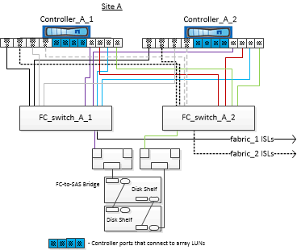

= Exemplo de uma configuração de MetroCluster de quatro nós com discos e LUNs de array
:allow-uri-read: 
:icons: font
:imagesdir: ../media/

[role="lead"]
Para configurar uma configuração de MetroCluster de quatro nós com discos nativos e LUNs de array, é necessário usar pontes FC para SAS para conectar os sistemas ONTAP aos compartimentos de disco por meio dos switches FC. É possível conectar LUNs de array por meio dos switches FC aos sistemas ONTAP.

É necessário um mínimo de oito portas de iniciador para que um sistema ONTAP se conete a discos nativos e LUNs de storage.

As ilustrações a seguir representam exemplos de uma configuração MetroCluster com discos e LUNs de array. Ambas representam a mesma configuração MetroCluster; as representações para discos e LUNs de array são separadas apenas para simplificação.

Na ilustração a seguir, que mostra a conectividade entre sistemas ONTAP e discos, as portas HBA 1a a 1D são usadas para conetividade com discos por meio das pontes FC-para-SAS:

Na ilustração a seguir, que mostra a conetividade entre sistemas ONTAP e LUNs de storage, as portas HBA 0a a 0d são usadas para conetividade com LUNs de storage porque as portas 1a a 1D são usadas para conetividade com discos:

image::../media/mcc_configuration_with_disks_and_array_luns_ii.gif[Este gráfico mostra um exemplo de configuração do MetroCluster. O gráfico é explicado no texto circundante.]
