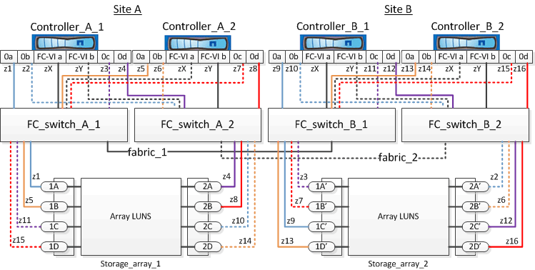

= Exemplo de zoneamento de switch em uma configuração de MetroCluster de quatro nós com LUNs de array
:allow-uri-read: 
:icons: font
:imagesdir: ../media/

[role="lead"]
O zoneamento do switch define caminhos entre nós conetados. A configuração do zoneamento permite definir quais LUNs de array podem ser visualizados por sistemas ONTAP específicos.

Você pode usar o exemplo a seguir como referência ao determinar zoneamento para uma configuração de MetroCluster de quatro nós com LUNs de array. O exemplo mostra um único iniciador para um zoneamento de destino único para uma configuração do MetroCluster. As linhas no exemplo a seguir representam zonas em vez de conexões; cada linha é rotulada com seu número de zona:

Na ilustração, os LUNs de array são alocados em cada storage array para a configuração do MetroCluster. LUNs de igual tamanho são provisionados nos storage arrays de ambos os locais, o que é um requisito do SyncMirror. Cada sistema ONTAP tem dois caminhos para LUNs de array. As portas na matriz de armazenamento são redundantes.

Na ilustração, os pares de portas de matriz redundantes para ambos os sites são os seguintes:

* Storage array no local A:
+
** Portas 1A e 2A
** Portas 1B e 2B
** Portas 1C e 2C
** Portas 1D e 2D

* Storage array no local B:
+
** Portas 1A' e 2A'
** Portas 1B' e 2B'
** Portas 1C' e 2C'
** Portas 1D' e 2D'

Os pares de portas redundantes em cada storage array formam caminhos alternativos. Portanto, ambas as portas dos pares de portas podem acessar os LUNs nas respetivas matrizes de armazenamento.

As tabelas a seguir mostram as zonas para este exemplo:

== Zonas para FC_switch_A_1

|===

| Zona | Controlador ONTAP e porta do iniciador | Porta do array de storage 

 a| 
z1
 a| 
Controller_A_1: Porta 0a
 a| 
Porta 1A

 a| 
z3
 a| 
Controller_A_1: Porta 0C
 a| 
Porta 1A'

 a| 
z5
 a| 
Controller_A_2: Porta 0a
 a| 
Porta 1B

 a| 
z7
 a| 
Controller_A_2: Porta 0C
 a| 
Porta 1B'

|===

== Zonas para FC_switch_A_2

|===

| Zona | Controlador ONTAP e porta do iniciador | Porta do array de storage 

 a| 
z2
 a| 
Controller_A_1: Porta 0b
 a| 
Porta 2A'

 a| 
z4
 a| 
Controller_A_1: Porta 0d
 a| 
Porta 2A

 a| 
z6
 a| 
Controller_A_2: Porta 0b
 a| 
Porta 2B'

 a| 
z8
 a| 
Controller_A_2: Porta 0d
 a| 
Porta 2B

|===

== Zonas para FC_switch_B_1

|===

| Zona | Controlador ONTAP e porta do iniciador | Porta do array de storage 

 a| 
z9
 a| 
Controller_B_1: Porta 0a
 a| 
Porta 1C'

 a| 
z11
 a| 
Controller_B_1: Porta 0C
 a| 
Porta 1C

 a| 
z13
 a| 
Controller_B_2: Porta 0a
 a| 
Porta 1D'

 a| 
z15
 a| 
Controller_B_2: Porta 0C
 a| 
Porta 1D

|===

== Zonas para FC_switch_B_2

|===

| Zona | Controlador ONTAP e porta do iniciador | Porta do array de storage 

 a| 
z10
 a| 
Controller_B_1: Porta 0b
 a| 
Porta 2C

 a| 
z12
 a| 
Controller_B_1: Porta 0d
 a| 
Porta 2C'

 a| 
z14
 a| 
Controller_B_2: Porta 0b
 a| 
Porta 2D

 a| 
z16
 a| 
Controller_B_2: Porta 0d
 a| 
Porta 2D'

|===

== Zonas para as conexões FC-VI no local A

|===

| Zona | Controlador ONTAP e porta do iniciador FC | Interrutor 

 a| 
ZX
 a| 
Controller_A_1: Porta FC-VI a
 a| 
FC_switch_A_1

 a| 
Zy
 a| 
Controller_A_1: Porta FC-VI b
 a| 
FC_switch_A_2

 a| 
ZX
 a| 
Controller_A_2: Porta FC-VI a
 a| 
FC_switch_A_1

 a| 
Zy
 a| 
Controller_A_2: Porta FC-VI b
 a| 
FC_switch_A_2

|===

== Zonas para as ligações FC-VI no local B.

|===

| Zona | Controlador ONTAP e porta do iniciador FC | Interrutor 

 a| 
ZX
 a| 
Controller_B_1: Porta FC-VI a
 a| 
FC_switch_B_1

 a| 
Zy
 a| 
Controller_B_1: Porta FC-VI b
 a| 
FC_switch_B_2

 a| 
ZX
 a| 
Controller_B_2: Porta FC-VI a
 a| 
FC_switch_B_1

 a| 
Zy
 a| 
Controller_B_2: Porta FC-VI b
 a| 
FC_switch_B_2

|===
.Informações relacionadas
* O zoneamento do switch define caminhos entre nós conetados. A configuração do zoneamento permite definir quais LUNs de array podem ser visualizados por sistemas ONTAP específicos.
+
link:concept_example_of_switch_zoning_in_a_two_node_mcc_configuration_with_array_luns.html["Exemplo de zoneamento de switch em uma configuração de MetroCluster de dois nós com LUNs de array"]

+
link:concept_example_of_switch_zoning_in_an_eight_node_mcc_configuration_with_array_luns.html["Exemplo de zoneamento de switch em uma configuração de MetroCluster de oito nós com LUNs de array"]

* Ao usar o zoneamento de switch em uma configuração do MetroCluster com LUNs de array, você deve garantir que certos requisitos básicos sejam seguidos.
+
link:reference_requirements_for_switch_zoning_in_a_mcc_configuration_with_array_luns.html["Requisitos para zoneamento de switch em uma configuração MetroCluster com LUNs de array"]

