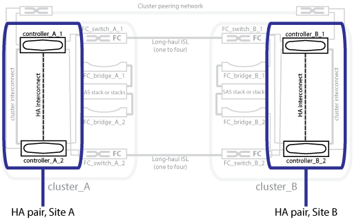

= Ilustração dos pares de HA locais em uma configuração do MetroCluster
:allow-uri-read: 
:icons: font
:imagesdir: ../media/

[role="lead"]
Em configurações de MetroCluster de oito ou quatro nós, cada local consiste em controladores de storage configurados como um ou dois pares de HA. Isso permite redundância local para que, se um controlador de storage falhar, seu parceiro de HA local possa assumir o controle. Essas falhas podem ser tratadas sem uma operação de switchover do MetroCluster.

As operações de failover de HA local e giveback são executadas com os comandos de failover de storage, da mesma maneira que uma configuração que não é MetroCluster.

.Informações relacionadas
link:concept_illustration_of_redundant_fc_to_sas_bridges.html["Ilustração de pontes FC para SAS redundantes"]

link:concept_redundant_fc_switch_fabrics.html["Malhas de switches FC redundantes"]

link:concept_cluster_peering_network_mcc.html["Ilustração da rede de peering de cluster"]

https://docs.netapp.com/ontap-9/topic/com.netapp.doc.dot-cm-concepts/home.html["Conceitos de ONTAP"^]
