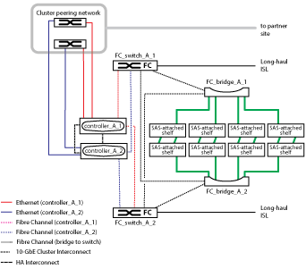
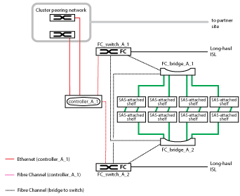

= Partes de uma configuração de Fabric MetroCluster
:allow-uri-read: 
:icons: font
:imagesdir: ../media/

[role="lead"]
Ao Planejar sua configuração do MetroCluster, você deve entender os componentes de hardware e como eles se interconetam.

== Grupos de recuperação de desastres (DR)

Uma configuração do Fabric MetroCluster consiste em um ou dois grupos de DR, dependendo do número de nós na configuração do MetroCluster. Cada grupo de DR consiste em quatro nós.

* Uma configuração do MetroCluster de oito nós consiste em dois grupos de DR.
* Uma configuração de MetroCluster de quatro nós consiste em um grupo de DR.

A ilustração a seguir mostra a organização de nós em uma configuração de MetroCluster de oito nós:

image::../media/mcc_dr_groups_8_node.gif[nó de grupos de dr de mcc 8]

A ilustração a seguir mostra a organização de nós em uma configuração de MetroCluster de quatro nós:

image::../media/mcc_dr_groups_4_node.gif[nó de grupos de dr de mcc 4]

== Principais elementos de hardware

Uma configuração do MetroCluster inclui os seguintes elementos-chave de hardware:

* Controladores de storage
+
As controladoras de storage não são conectadas diretamente ao storage, mas conectadas a duas malhas de switches FC redundantes.

* Pontes FC para SAS
+
As pontes FC para SAS conectam as stacks de storage SAS aos switches FC, fornecendo uma ponte entre os dois protocolos.

* Switches FC
+
Os switches FC fornecem o backbone de longo curso ISL entre os dois locais. Os switches FC fornecem as duas malhas de storage que permitem o espelhamento de dados para os pools de storage remoto.

* Rede de peering de cluster
+
A rede de peering de cluster fornece conetividade para espelhamento da configuração do cluster, que inclui a configuração de máquina virtual de storage (SVM). A configuração de todos os SVMs em um cluster é espelhada para o cluster de parceiros.

== Configuração de MetroCluster de malha de oito nós

Uma configuração de oito nós consiste em dois clusters, um em cada local geograficamente separado. O cluster_A está localizado no primeiro site do MetroCluster. O cluster_B está localizado no segundo site do MetroCluster. Cada local tem uma pilha de storage SAS. São suportadas stacks de armazenamento adicionais, mas apenas uma é mostrada em cada local. Os pares de HA são configurados como clusters sem switch, sem switches de interconexão de cluster. É suportada uma configuração comutada, mas não é apresentada.

Uma configuração de oito nós inclui as seguintes conexões:

* Conexões FC de cada controlador HBAs e adaptadores FC-VI para cada um dos switches FC
* Uma conexão FC de cada bridge FC para SAS e um switch FC
* Conexões SAS entre cada compartimento SAS e da parte superior e inferior de cada stack até uma ponte FC para SAS
* Uma interconexão de HA entre cada controlador no par de HA local
+
Se os controladores suportarem um par de HA de chassi único, a interconexão de HA será interna, ocorrendo através do backplane, o que significa que não é necessária uma interconexão externa.

* Conexões Ethernet dos controladores para a rede fornecida pelo cliente que é usada para peering de cluster
+
A configuração da SVM é replicada na rede de peering de cluster.

* Uma interconexão de cluster entre cada controlador no cluster local

== Configuração de MetroCluster de malha de quatro nós

A ilustração a seguir mostra uma visualização simplificada de uma configuração de MetroCluster de malha de quatro nós. Para algumas conexões, uma única linha representa várias conexões redundantes entre os componentes. As conexões de rede de gerenciamento e dados não são mostradas.

image::../media/mcc_hardware_architecture_both_clusters.gif[arquitetura de hardware mcc nos dois clusters]

A ilustração a seguir mostra uma visão mais detalhada da conectividade em um único cluster MetroCluster (ambos os clusters têm a mesma configuração):

== Configuração de MetroCluster de malha de dois nós

A ilustração a seguir mostra uma visualização simplificada de uma configuração de MetroCluster de malha de dois nós. Para algumas conexões, uma única linha representa várias conexões redundantes entre os componentes. As conexões de rede de gerenciamento e dados não são mostradas.

image::../media/mcc_hardware_architecture_both_clusters_2_node_fabric.gif[arquitetura de hardware mcc nos dois clusters malha de 2 nós]

Uma configuração de dois nós consiste em dois clusters, um em cada local geograficamente separado. O cluster_A está localizado no primeiro site do MetroCluster. O cluster_B está localizado no segundo site do MetroCluster. Cada local tem uma pilha de storage SAS. São suportadas stacks de armazenamento adicionais, mas apenas uma é mostrada em cada local.

NOTE: Em uma configuração de dois nós, os nós não são configurados como um par de HA.

A ilustração a seguir mostra uma visão mais detalhada da conectividade em um único cluster MetroCluster (ambos os clusters têm a mesma configuração):

Uma configuração de dois nós inclui as seguintes conexões:

* Conexões FC entre o adaptador FC-VI em cada módulo de controladora
* Conexões FC de HBAs de cada módulo de controladora à ponte FC-para-SAS para cada stack de gaveta SAS
* Conexões SAS entre cada compartimento SAS e da parte superior e inferior de cada stack até uma ponte FC para SAS
* Conexões Ethernet dos controladores para a rede fornecida pelo cliente que é usada para peering de cluster
+
A configuração da SVM é replicada na rede de peering de cluster.

