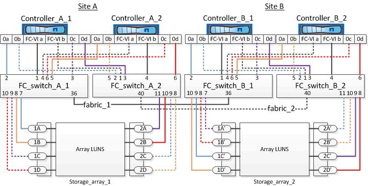

= Exemplo de cabeamento de portas de storage array para switches FC em uma configuração de MetroCluster de quatro nós
:allow-uri-read: 
:icons: font
:imagesdir: ../media/

[role="lead"]
Em uma configuração MetroCluster com LUNs de array, você precisa conectar as portas de storage array que formam um par de portas redundante a switches FC alternativos.

A ilustração de referência a seguir mostra as conexões entre storage arrays e switches FC em uma configuração de MetroCluster de quatro nós com LUNs de array:

[NOTE]
====
Se você planeja usar discos além dos LUNs de storage na configuração do MetroCluster, use as portas de switch especificadas para a configuração com discos.

link:concept_port_assignments_for_fc_switches_when_using_ontap_9_1_and_later.html["Atribuições de portas para switches FC ao usar o ONTAP 9.1 e posterior"]

====
Na ilustração, os pares de portas de matriz redundantes para ambos os sites são os seguintes:

* Storage array no local A:
+
** Portas 1A e 2A
** Portas 1B e 2B
** Portas 1C e 2C
** Portas 1D e 2D

* Storage array no local B:
+
** Portas 1A' e 2A'
** Portas 1B' e 2B'
** Portas 1C' e 2C'
** Portas 1D' e 2D'

FC_switch_A_1 no local A e FC_switch_B_1 no local B estão conetados ao form Fabric_1. Da mesma forma, FC_switch_A_2 no local A e FC_switch_B_2 estão conetados ao form Fabric_2.

A tabela a seguir lista as conexões entre as portas do storage array e os switches FC para a ilustração MetroCluster:

|===

| Portas LUN de array | Portas de switch FC | Troque de tecidos 

3+| *Site A* 

 a| 
1A
 a| 
FC_switch_A_1, porta 7
 a| 
fabric_1

 a| 
2A
 a| 
FC_switch_A_2, porta 11
 a| 
fabric_2

 a| 
1B
 a| 
FC_switch_A_1, porta 8
 a| 
fabric_1

 a| 
2B
 a| 
FC_switch_A_2, porta 10
 a| 
fabric_2

 a| 
1C
 a| 
FC_switch_A_1, porta 9
 a| 
fabric_1

 a| 
2C
 a| 
FC_switch_A_2, porta 9
 a| 
fabric_2

 a| 
1D
 a| 
FC_switch_A_1, porta 10
 a| 
fabric_1

 a| 
2D
 a| 
FC_switch_A_2, porta 8
 a| 
fabric_2

3+| *Site B* 

 a| 
1A'
 a| 
FC_switch_B_1, porta 7
 a| 
fabric_1

 a| 
2A'
 a| 
FC_switch_B_2, porta 11
 a| 
fabric_2

 a| 
1B'
 a| 
FC_switch_B_1, porta 8
 a| 
fabric_1

 a| 
2B'
 a| 
FC_switch_B_2, porta 10
 a| 
fabric_2

 a| 
1C'
 a| 
FC_switch_B_1, porta 9
 a| 
fabric_1

 a| 
2C'
 a| 
FC_switch_B_2, porta 9
 a| 
fabric_2

 a| 
1D'
 a| 
FC_switch_B_1, porta 10
 a| 
fabric_1

 a| 
2D'
 a| 
FC_switch_B_2, porta 8
 a| 
fabric_2

|===