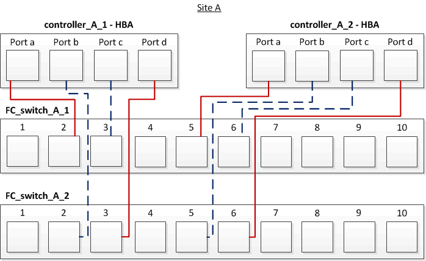

= Fazer o cabeamento das portas FC-VI e HBA em uma configuração de MetroCluster conectada à malha de quatro nós com LUNs de array
:allow-uri-read: 
:icons: font
:imagesdir: ../media/

[role="lead"]
Se você estiver configurando uma configuração MetroCluster conectada à malha de quatro nós com LUNs de array, será necessário enviar por cabo as portas FC-VI e as portas HBA às portas do switch.

.Sobre esta tarefa
* Você deve repetir esta tarefa para cada controlador em ambos os sites do MetroCluster.
* Se você planeja usar discos além de LUNs de storage na configuração do MetroCluster, use as portas HBA e as portas de switch especificadas para configuração com discos.
+
** link:concept_port_assignments_for_fc_switches_when_using_ontap_9_1_and_later.html["Atribuições de portas para switches FC ao usar o ONTAP 9.1 e posterior"]

.Passos
. Faça o cabeamento das portas FC-VI de cada controlador para as portas em switches FC alternativos.
+
O exemplo a seguir mostra as conexões entre as portas FC-VI e as portas do switch no local A:

+
image::../media/four_node_mcc_fc_vi_switch_connections.gif[conexões de switch mcc fc vi de quatro nós]

. Execute o cabeamento de controlador para switch em ambos os locais do MetroCluster.
+
Você deve garantir redundância nas conexões do controlador para os switches. Portanto, para cada controlador em um local, você deve garantir que ambas as portas HBA no mesmo par de portas estejam conetadas a switches FC alternativos.

+
O exemplo a seguir mostra as conexões entre as portas HBA e as portas do switch no local A:

+

+
A tabela a seguir lista as conexões entre as portas HBA em controller_A_1 e as portas do switch FC na ilustração:

+
|===

| Portas HBA | Portas do switch 

2+| *Par de portas* 

 a| 
Porta a
 a| 
FC_switch_A_1, porta 2

 a| 
Porta d
 a| 
FC_switch_A_2, porta 3

2+| *Par de portas* 

 a| 
Porto b
 a| 
FC_switch_A_2, porta 2

 a| 
Porta c
 a| 
FC_switch_A_1, porta 3

|===
+
A tabela a seguir lista as conexões entre as portas HBA em controller_A_2 e as portas do switch FC na ilustração:

+
|===

| Portas HBA | Portas do switch 

2+| *Par de portas* 

 a| 
Porta a
 a| 
FC_switch_A_1, porta 5

 a| 
Porta d
 a| 
FC_switch_A_2, porta 6

2+| *Par de portas* 

 a| 
Porto b
 a| 
FC_switch_A_2, porta 5

 a| 
Porta c
 a| 
FC_switch_A_1, porta 6

|===

.Depois de terminar
Você deve fazer o cabeamento das ISLs entre os switches FC nos locais do MetroCluster.

.Informações relacionadas
Quando você conecta sistemas ONTAP a switches FC para configurar uma configuração MetroCluster com LUNs de array, é necessário conectar portas FC-VI e HBA de cada controladora a portas de switch específicas.

link:concept_switch_ports_required_for_a_eight_node_mcc_configuration_with_array_luns.html["Portas de switch necessárias para uma configuração MetroCluster com LUNs de array"]
