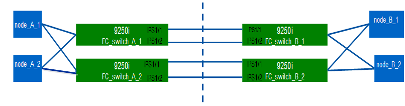

= Configuração manual dos switches Cisco FC
:allow-uri-read: 
:icons: font
:imagesdir: ../media/

[role="lead"]
Cada switch Cisco na configuração do MetroCluster deve ser configurado adequadamente para as conexões ISL e de armazenamento.

.Antes de começar
Os requisitos a seguir se aplicam aos switches Cisco FC:

* Você deve usar quatro switches Cisco compatíveis do mesmo modelo com a mesma versão e licenciamento do NX-os.
* A configuração do MetroCluster requer quatro switches.
+
Os quatro switches devem ser conectados em duas malhas de dois switches cada, com cada malha abrangendo ambos os locais.

* O switch deve suportar conetividade com o modelo ATTO FibreBridge.
* Não é possível usar a criptografia ou a compactação na malha de storage Cisco FC. Não é suportado na configuração MetroCluster.

No https://mysupport.netapp.com/matrix["Ferramenta de Matriz de interoperabilidade NetApp (IMT)"], você pode usar o campo solução de armazenamento para selecionar sua solução MetroCluster. Use o *Explorador de componentes* para selecionar os componentes e a versão do ONTAP para refinar sua pesquisa. Você pode clicar em *Mostrar resultados* para exibir a lista de configurações compatíveis que correspondem aos critérios.

.Sobre esta tarefa
O seguinte requisito aplica-se às ligações ISL (Inter-Switch Link):

* Todos os ISLs devem ter o mesmo comprimento e a mesma velocidade em um tecido.
+
Diferentes comprimentos de ISLs podem ser usados nos diferentes tecidos. A mesma velocidade deve ser usada em todos os tecidos.

O seguinte requisito aplica-se às ligações de armazenamento:

* Cada controlador de storage deve ter quatro portas do iniciador disponíveis para conexão às malhas do switch.
+
Duas portas de iniciador devem ser conectadas de cada controlador de storage a cada malha.

+
[NOTE]
====
Você pode configurar sistemas FAS8020, AFF8020, FAS8200 e AFF A300 com duas portas de iniciadores por controladora (uma única porta de iniciador para cada malha) se todos os critérios a seguir forem atendidos:

** Há menos de quatro portas do iniciador FC disponíveis para conetar o armazenamento de disco e nenhuma porta adicional pode ser configurada como iniciadores FC.
** Todos os slots estão em uso e nenhuma placa de iniciador FC pode ser adicionada.

====

.Informações relacionadas
https://mysupport.netapp.com/matrix["Ferramenta de Matriz de interoperabilidade do NetApp"]

== Requisitos de licença de switch Cisco

Certas licenças baseadas em recursos podem ser necessárias para os switches Cisco em uma configuração MetroCluster conetada à malha. Essas licenças permitem que você use recursos como QoS ou créditos de modo de longa distância nos switches. Você deve instalar as licenças baseadas em recursos necessárias em todos os quatro switches em uma configuração do MetroCluster.

As seguintes licenças baseadas em recursos podem ser necessárias em uma configuração do MetroCluster:

* ENTERPRISE_PKG
+
Essa licença permite que você use o recurso QoS em switches Cisco.

* PORT_ACTIVATION_PKG
+
Você pode usar esta licença para switches Cisco 9148. Esta licença permite-lhe ativar ou desativar portas nos switches, desde que apenas 16 portas estejam ativas a qualquer momento. Por padrão, as portas 16 são habilitadas nos switches Cisco MDS 9148.

* FM_SERVER_PKG
+
Essa licença permite que você gerencie malhas simultaneamente e gerencie switches por meio de um navegador da Web.

+
A licença FM_Server_PKG também permite recursos de gerenciamento de desempenho, como limites de desempenho e monitoramento de limites. Para obter mais informações sobre essa licença, consulte o Pacote de servidor do Gerenciador de malha do Cisco.

Você pode verificar se as licenças estão instaladas usando o comando show license use. Se não tiver estas licenças, contacte o seu representante de vendas antes de prosseguir com a instalação.

NOTE: Os switches Cisco MDS 9250i têm duas portas fixas de serviços de storage IP de 1/10 GbE. Não são necessárias licenças adicionais para estas portas. O pacote de aplicativos Cisco SAN Extension over IP é uma licença padrão nesses switches que permite recursos como FCIP e compactação.

== Definir o switch Cisco FC para os padrões de fábrica

Para garantir uma configuração bem-sucedida, você deve definir o switch para seus padrões de fábrica. Isso garante que o switch esteja começando a partir de uma configuração limpa.

.Sobre esta tarefa
Esta tarefa deve ser executada em todos os switches na configuração do MetroCluster.

.Passos
. Faça uma conexão de console e faça login em ambos os switches na mesma malha.
. Volte a colocar o interrutor nas predefinições:
+
`write erase`

+
Você pode responder "y" quando solicitado a confirmar o comando. Isso apaga todas as licenças e informações de configuração no switch.

. Reinicie o switch:
+
`reload`

+
Você pode responder "y" quando solicitado a confirmar o comando.

. Repita os `write erase` comandos e `reload` no outro interrutor.
+
Depois de emitir o `reload` comando, o switch reinicializa e, em seguida, solicita as perguntas de configuração. Nesse ponto, prossiga para a próxima seção.

.Exemplo
O exemplo a seguir mostra o processo em uma malha que consiste em FC_switch_A_1 e FC_switch_B_1.

[listing]
----
FC_Switch_A_1# write erase
    Warning: This command will erase the startup-configuration.
    Do you wish to proceed anyway? (y/n)  [n] y
    FC_Switch_A_1# reload
    This command will reboot the system. (y/n)?  [n] y

FC_Switch_B_1# write erase
    Warning: This command will erase the startup-configuration.
    Do you wish to proceed anyway? (y/n)  [n] y
    FC_Switch_B_1# reload
    This command will reboot the system. (y/n)?  [n] y
----

== Configure as configurações básicas do switch Cisco FC e a cadeia de carateres da comunidade

Você deve especificar as configurações básicas com o `setup` comando ou depois de emitir o `reload` comando.

.Passos
. Se o switch não exibir as perguntas de configuração, configure as configurações básicas do switch:
+
`setup`

. Aceite as respostas padrão às perguntas de configuração até que você seja solicitado a fornecer a string da comunidade SNMP.
. Defina a cadeia de carateres da comunidade como "'public'" (todas minúsculas) para permitir o acesso a partir dos monitores de saúde do ONTAP.
+
Você pode definir a cadeia de carateres da comunidade para um valor diferente de "público", mas você deve configurar os monitores de integridade do ONTAP usando a cadeia de carateres da comunidade especificada.

+
O exemplo a seguir mostra os comandos em FC_switch_A_1:

+
[listing]
----
FC_switch_A_1# setup
    Configure read-only SNMP community string (yes/no) [n]: y
    SNMP community string : public
    Note:  Please set the SNMP community string to "Public" or another value of your choosing.
    Configure default switchport interface state (shut/noshut) [shut]: noshut
    Configure default switchport port mode F (yes/no) [n]: n
    Configure default zone policy (permit/deny) [deny]: deny
    Enable full zoneset distribution? (yes/no) [n]: yes
----
+
O exemplo a seguir mostra os comandos em FC_switch_B_1:

+
[listing]
----
FC_switch_B_1# setup
    Configure read-only SNMP community string (yes/no) [n]: y
    SNMP community string : public
    Note:  Please set the SNMP community string to "Public" or another value of your choosing.
    Configure default switchport interface state (shut/noshut) [shut]: noshut
    Configure default switchport port mode F (yes/no) [n]: n
    Configure default zone policy (permit/deny) [deny]: deny
    Enable full zoneset distribution? (yes/no) [n]: yes
----

== Adquirir licenças para portas

Você não precisa usar licenças de switch Cisco em um intervalo contínuo de portas; em vez disso, você pode adquirir licenças para portas específicas que são usadas e remover licenças de portas não utilizadas.

.Antes de começar
Você deve verificar o número de portas licenciadas na configuração do switch e, se necessário, mover licenças de uma porta para outra, conforme necessário.

.Passos
. Exibir o uso da licença para uma estrutura de switch:
+
`show port-resources module 1`

+
Determine quais portas exigem licenças. Se algumas dessas portas não forem licenciadas, determine se você tem portas licenciadas extras e considere remover as licenças delas.

. Entre no modo de configuração:
+
`config t`

. Remova a licença da porta selecionada:
+
.. Selecione a porta a ser não licenciada:
+
`interface _interface-name_`

.. Remova a licença da porta:
+
`no port-license acquire`

.. Saia da interface de configuração da porta:
+
`exit`

. Adquira a licença para a porta selecionada:
+
.. Selecione a porta a ser não licenciada:
+
`interface _interface-name_`

.. Torne a porta elegível para adquirir uma licença:
+
`port-license`

.. Adquira a licença na porta:
+
`port-license acquire`

.. Saia da interface de configuração da porta:
+
`exit`

. Repita para quaisquer portas adicionais.
. Sair do modo de configuração:
+
`exit`

=== Removendo e adquirindo uma licença em uma porta

Este exemplo mostra uma licença que está sendo removida da porta FC1/2, a porta FC1/1 que está sendo elegível para adquirir uma licença e a licença que está sendo adquirida na porta FC1/1:

[listing]
----
Switch_A_1# conf t
    Switch_A_1(config)# interface fc1/2
    Switch_A_1(config)# shut
    Switch_A_1(config-if)# no port-license acquire
    Switch_A_1(config-if)# exit
    Switch_A_1(config)# interface fc1/1
    Switch_A_1(config-if)# port-license
    Switch_A_1(config-if)# port-license acquire
    Switch_A_1(config-if)# no shut
    Switch_A_1(config-if)# end
    Switch_A_1# copy running-config startup-config

    Switch_B_1# conf t
    Switch_B_1(config)# interface fc1/2
    Switch_B_1(config)# shut
    Switch_B_1(config-if)# no port-license acquire
    Switch_B_1(config-if)# exit
    Switch_B_1(config)# interface fc1/1
    Switch_B_1(config-if)# port-license
    Switch_B_1(config-if)# port-license acquire
    Switch_B_1(config-if)# no shut
    Switch_B_1(config-if)# end
    Switch_B_1# copy running-config startup-config
----
O exemplo a seguir mostra o uso da licença de porta sendo verificado:

[listing]
----
Switch_A_1# show port-resources module 1
    Switch_B_1# show port-resources module 1
----

== Habilitando portas em um switch Cisco MDS 9148 ou 9148S

Nos switches Cisco MDS 9148 ou 9148S, é necessário habilitar manualmente as portas necessárias em uma configuração do MetroCluster.

.Sobre esta tarefa
* Você pode ativar manualmente portas 16 em um switch Cisco MDS 9148 ou 9148S.
* Os switches Cisco permitem que você aplique a licença DO POD em portas aleatórias, em vez de aplicá-las em sequência.
* Os switches Cisco exigem que você use uma porta de cada grupo de portas, a menos que você precise de mais de 12 portas.

.Passos
. Veja os grupos de portas disponíveis em um switch Cisco:
+
`show port-resources module _blade_number_`

. Licencie e adquira a porta necessária em um grupo de portas:
+
`config t`

+
`interface _port_number_`

+
`shut`

+
`port-license acquire`

+
`no shut`

+
Por exemplo, a seguinte sequência de comandos licencia e adquire a porta fc 1/45:

+
[listing]
----
switch# config t
switch(config)#
switch(config)# interface fc 1/45
switch(config-if)#
switch(config-if)# shut
switch(config-if)# port-license acquire
switch(config-if)# no shut
switch(config-if)# end
----
. Guardar a configuração:
+
`copy running-config startup-config`

== Configurando as portas F em um switch Cisco FC

Você deve configurar as portas F no switch FC.

.Sobre esta tarefa
Em uma configuração MetroCluster, as portas F são as portas que conetam o switch aos iniciadores HBA, interconexões FC-VI e pontes FC-para-SAS.

Cada porta deve ser configurada individualmente.

Consulte as seções a seguir para identificar as portas F (switch-to-node) para sua configuração:

* link:concept_port_assignments_for_fc_switches_when_using_ontap_9_1_and_later.html["Atribuições de portas para switches FC ao usar o ONTAP 9.1 e posterior"]

Esta tarefa deve ser executada em cada switch na configuração do MetroCluster.

.Passos
. Entre no modo de configuração:
+
`config t`

. Entre no modo de configuração da interface para a porta:
+
`interface _port-ID_`

. Desligue a porta:
+
`shutdown`

. Defina as portas para o modo F:
+
`switchport mode F`

. Defina as portas para velocidade fixa:
+
`switchport speed _speed-value_`

+
`_speed-value_` é `8000` ou `16000`

. Defina o modo de taxa da porta do switch para dedicado:
+
`switchport rate-mode dedicated`

. Reinicie a porta:
+
`no shutdown`

. Sair do modo de configuração:
+
`end`

.Exemplo
O exemplo a seguir mostra os comandos nos dois switches:

[listing]
----
Switch_A_1# config  t
FC_switch_A_1(config)# interface fc 1/1
FC_switch_A_1(config-if)# shutdown
FC_switch_A_1(config-if)# switchport mode F
FC_switch_A_1(config-if)# switchport speed 8000
FC_switch_A_1(config-if)# switchport rate-mode dedicated
FC_switch_A_1(config-if)# no shutdown
FC_switch_A_1(config-if)# end
FC_switch_A_1# copy running-config startup-config

FC_switch_B_1# config  t
FC_switch_B_1(config)# interface fc 1/1
FC_switch_B_1(config-if)# switchport mode F
FC_switch_B_1(config-if)# switchport speed 8000
FC_switch_B_1(config-if)# switchport rate-mode dedicated
FC_switch_B_1(config-if)# no shutdown
FC_switch_B_1(config-if)# end
FC_switch_B_1# copy running-config startup-config
----

== Atribuição de créditos de buffer a buffer a portas F no mesmo grupo de portas que o ISL

Você deve atribuir os créditos buffer a buffer às portas F se estiverem no mesmo grupo de portas que o ISL. Se as portas não tiverem os créditos buffer-to-buffer necessários, o ISL pode estar inoperacional.

.Sobre esta tarefa
Esta tarefa não é necessária se as portas F não estiverem no mesmo grupo de portas que a porta ISL.

Se as portas F estiverem em um grupo de portas que contenha o ISL, essa tarefa deve ser executada em cada switch FC na configuração do MetroCluster.

.Passos
. Entre no modo de configuração:
+
`config t`

. Defina o modo de configuração da interface para a porta:
+
`interface _port-ID_`

. Desative a porta:
+
`shut`

. Se a porta ainda não estiver no modo F, defina a porta para o modo F:
+
`switchport mode F`

. Defina o crédito buffer-to-buffer das portas não e como 1:
+
`switchport fcrxbbcredit 1`

. Reative a porta:
+
`no shut`

. Sair do modo de configuração:
+
`exit`

. Copie a configuração atualizada para a configuração de inicialização:
+
`copy running-config startup-config`

. Verifique o crédito buffer-to-buffer atribuído a uma porta:
+
`show port-resources module 1`

. Sair do modo de configuração:
+
`exit`

. Repita estes passos no outro interrutor do tecido.
. Verifique as configurações:
+
`show port-resource module 1`

.Exemplo
Neste exemplo, a porta FC1/40 é o ISL. As portas FC1/37, FC1/38 e FC1/39 estão no mesmo grupo de portas e devem ser configuradas.

Os comandos a seguir mostram o intervalo de portas que está sendo configurado para FC1/37 até FC1/39:

[listing]
----
FC_switch_A_1# conf t
FC_switch_A_1(config)# interface fc1/37-39
FC_switch_A_1(config-if)# shut
FC_switch_A_1(config-if)# switchport mode F
FC_switch_A_1(config-if)# switchport fcrxbbcredit 1
FC_switch_A_1(config-if)# no shut
FC_switch_A_1(config-if)# exit
FC_switch_A_1# copy running-config startup-config

FC_switch_B_1# conf t
FC_switch_B_1(config)# interface fc1/37-39
FC_switch_B_1(config-if)# shut
FC_switch_B_1(config-if)# switchport mode F
FC_switch_B_1(config-if)# switchport fcrxbbcredit 1
FC_switch_A_1(config-if)# no shut
FC_switch_A_1(config-if)# exit
FC_switch_B_1# copy running-config startup-config
----
Os comandos a seguir e a saída do sistema mostram que as configurações são aplicadas corretamente:

[listing]
----
FC_switch_A_1# show port-resource module 1
...
Port-Group 11
 Available dedicated buffers are 93

--------------------------------------------------------------------
Interfaces in the Port-Group       B2B Credit  Bandwidth  Rate Mode
                                      Buffers     (Gbps)

--------------------------------------------------------------------
fc1/37                                     32        8.0  dedicated
fc1/38                                      1        8.0  dedicated
fc1/39                                      1        8.0  dedicated
...

FC_switch_B_1# port-resource module
...
Port-Group 11
 Available dedicated buffers are 93

--------------------------------------------------------------------
Interfaces in the Port-Group       B2B Credit  Bandwidth  Rate Mode
                                     Buffers     (Gbps)

--------------------------------------------------------------------
fc1/37                                     32        8.0  dedicated
fc1/38                                      1        8.0  dedicated
fc1/39                                      1        8.0 dedicated
...
----

== Criando e configurando VSANs em switches Cisco FC

É necessário criar um VSAN para as portas FC-VI e um VSAN para as portas de storage em cada switch FC na configuração MetroCluster.

.Sobre esta tarefa
Os VSANs devem ter um número e um nome exclusivos. Você deve fazer uma configuração adicional se estiver usando dois ISLs com entrega em ordem de quadros.

Os exemplos desta tarefa usam as seguintes convenções de nomenclatura:

[cols="1,2,1"]
|===

| Malha de switch | Nome VSAN | Número de ID 

 a| 
1
 a| 
FCVI_1_10
 a| 
10

 a| 
STOR_1_20
 a| 
20

 a| 
2
 a| 
FCVI_2_30
 a| 
30

 a| 
STOR_2_20
 a| 
40

|===
Essa tarefa deve ser executada em cada malha de switch FC.

.Passos
. Configure o FC-VI VSAN:
+
.. Entre no modo de configuração se ainda não o tiver feito:
+
`config t`

.. Edite o banco de dados VSAN:
+
`vsan database`

.. Defina a ID VSAN:
+
`vsan _vsan-ID_`

.. Defina o nome VSAN:
+
`vsan _vsan-ID_ name _vsan_name_`

. Adicionar portas ao VSAN FC-VI:
+
.. Adicione as interfaces para cada porta no VSAN:
+
`vsan _vsan-ID_ interface _interface_name_`

+
Para o VSAN FC-VI, as portas que conetam as portas FC-VI locais serão adicionadas.

.. Sair do modo de configuração:
+
`end`

.. Copie o running-config para o startup-config:
+
`copy running-config startup-config`

+
No exemplo a seguir, as portas são FC1/1 e FC1/13:

+
[listing]
----
FC_switch_A_1# conf t
FC_switch_A_1(config)# vsan database
FC_switch_A_1(config)# vsan 10 interface fc1/1
FC_switch_A_1(config)# vsan 10 interface fc1/13
FC_switch_A_1(config)# end
FC_switch_A_1# copy running-config startup-config
FC_switch_B_1# conf t
FC_switch_B_1(config)# vsan database
FC_switch_B_1(config)# vsan 10 interface fc1/1
FC_switch_B_1(config)# vsan 10 interface fc1/13
FC_switch_B_1(config)# end
FC_switch_B_1# copy running-config startup-config
----

. Verifique a associação da porta do VSAN:
+
`show vsan member`

+
[listing]
----
FC_switch_A_1# show vsan member
FC_switch_B_1# show vsan member
----
. Configure o VSAN para garantir a entrega em ordem de quadros ou entrega fora de ordem de quadros:
+

NOTE: As configurações padrão de IOD são recomendadas. Você deve configurar ODE somente se necessário.

+
link:concept_prepare_for_the_mcc_installation.html["Considerações sobre o uso de equipamentos TDM/WDM com configurações MetroCluster conetadas à malha"]

+
** As etapas a seguir devem ser executadas para configurar a entrega em ordem de quadros:
+
... Entre no modo de configuração:
+
`conf t`

... Ativar a garantia em ordem das trocas para o VSAN:
+
`in-order-guarantee vsan _vsan-ID_`

+

IMPORTANT: Para VSANs FC-VI (FCVI_1_10 e FCVI_2_30), você deve habilitar a garantia em ordem de quadros e trocas somente no VSAN 10.

... Ative o balanceamento de carga para o VSAN:
+
`vsan _vsan-ID_ loadbalancing src-dst-id`

... Sair do modo de configuração:
+
`end`

... Copie o running-config para o startup-config:
+
`copy running-config startup-config`

+
Os comandos para configurar a entrega em ordem de quadros em FC_switch_A_1:

+
[listing]
----
FC_switch_A_1# config t
FC_switch_A_1(config)# in-order-guarantee vsan 10
FC_switch_A_1(config)# vsan database
FC_switch_A_1(config-vsan-db)# vsan 10 loadbalancing src-dst-id
FC_switch_A_1(config-vsan-db)# end
FC_switch_A_1# copy running-config startup-config
----
+
Os comandos para configurar a entrega em ordem de quadros em FC_switch_B_1:

+
[listing]
----
FC_switch_B_1# config t
FC_switch_B_1(config)# in-order-guarantee vsan 10
FC_switch_B_1(config)# vsan database
FC_switch_B_1(config-vsan-db)# vsan 10 loadbalancing src-dst-id
FC_switch_B_1(config-vsan-db)# end
FC_switch_B_1# copy running-config startup-config
----

** As etapas a seguir devem ser executadas para configurar a entrega fora do pedido de quadros:
+
... Entre no modo de configuração:
+
`conf t`

... Desative a garantia de troca por encomenda para o VSAN:
+
`no in-order-guarantee vsan _vsan-ID_`

... Ative o balanceamento de carga para o VSAN:
+
`vsan _vsan-ID_ loadbalancing src-dst-id`

... Sair do modo de configuração:
+
`end`

... Copie o running-config para o startup-config:
+
`copy running-config startup-config`

+
Os comandos para configurar a entrega fora de ordem de quadros em FC_switch_A_1:

+
[listing]
----
FC_switch_A_1# config t
FC_switch_A_1(config)# no in-order-guarantee vsan 10
FC_switch_A_1(config)# vsan database
FC_switch_A_1(config-vsan-db)# vsan 10 loadbalancing src-dst-id
FC_switch_A_1(config-vsan-db)# end
FC_switch_A_1# copy running-config startup-config
----
+
Os comandos para configurar a entrega fora de ordem de quadros em FC_switch_B_1:

+
[listing]
----
FC_switch_B_1# config t
FC_switch_B_1(config)# no in-order-guarantee vsan 10
FC_switch_B_1(config)# vsan database
FC_switch_B_1(config-vsan-db)# vsan 10 loadbalancing src-dst-id
FC_switch_B_1(config-vsan-db)# end
FC_switch_B_1# copy running-config startup-config
----
+

NOTE: Ao configurar o ONTAP nos módulos do controlador, O AID deve ser explicitamente configurado em cada módulo do controlador na configuração do MetroCluster.

+
link:concept_configure_the_mcc_software_in_ontap.html#configuring-in-order-delivery-or-out-of-order-delivery-of-frames-on-ontap-software["Configuração da entrega em ordem ou entrega fora de ordem de quadros no software ONTAP"]

. Defina políticas de QoS para o VSAN FC-VI:
+
--
.. Entre no modo de configuração:
+
`conf t`

.. Ative a QoS e crie um mapa de classes inserindo os seguintes comandos em sequência:
+
`qos enable`

+
`qos class-map _class_name_ match-any`

.. Adicione o mapa de classe criado em uma etapa anterior ao mapa de políticas:
+
`class _class_name_`

.. Defina a prioridade:
+
`priority high`

.. Adicione o VSAN ao mapa de políticas criado anteriormente neste procedimento:
+
`qos service policy _policy_name_ vsan _vsan-id_`

.. Copie a configuração atualizada para a configuração de inicialização:
+
`copy running-config startup-config`

--
+
Os comandos para definir as políticas de QoS em FC_switch_A_1:

+
[listing]
----
FC_switch_A_1# conf t
FC_switch_A_1(config)# qos enable
FC_switch_A_1(config)# qos class-map FCVI_1_10_Class match-any
FC_switch_A_1(config)# qos policy-map FCVI_1_10_Policy
FC_switch_A_1(config-pmap)# class FCVI_1_10_Class
FC_switch_A_1(config-pmap-c)# priority high
FC_switch_A_1(config-pmap-c)# exit
FC_switch_A_1(config)# exit
FC_switch_A_1(config)# qos service policy FCVI_1_10_Policy vsan 10
FC_switch_A_1(config)# end
FC_switch_A_1# copy running-config startup-config
----
+
Os comandos para definir as políticas de QoS em FC_switch_B_1:

+
[listing]
----
FC_switch_B_1# conf t
FC_switch_B_1(config)# qos enable
FC_switch_B_1(config)# qos class-map FCVI_1_10_Class match-any
FC_switch_B_1(config)# qos policy-map FCVI_1_10_Policy
FC_switch_B_1(config-pmap)# class FCVI_1_10_Class
FC_switch_B_1(config-pmap-c)# priority high
FC_switch_B_1(config-pmap-c)# exit
FC_switch_B_1(config)# exit
FC_switch_B_1(config)# qos service policy FCVI_1_10_Policy vsan 10
FC_switch_B_1(config)# end
FC_switch_B_1# copy running-config startup-config
----
. Configurar o armazenamento VSAN:
+
--
.. Defina a ID VSAN:
+
`vsan _vsan-ID_`

.. Defina o nome VSAN:
+
`vsan _vsan-ID_ name _vsan_name_`

--
+
Os comandos para configurar o VSAN de armazenamento em FC_switch_A_1:

+
[listing]
----
FC_switch_A_1# conf t
FC_switch_A_1(config)# vsan database
FC_switch_A_1(config-vsan-db)# vsan 20
FC_switch_A_1(config-vsan-db)# vsan 20 name STOR_1_20
FC_switch_A_1(config-vsan-db)# end
FC_switch_A_1# copy running-config startup-config
----
+
Os comandos para configurar o VSAN de armazenamento em FC_switch_B_1:

+
[listing]
----
FC_switch_B_1# conf t
FC_switch_B_1(config)# vsan database
FC_switch_B_1(config-vsan-db)# vsan 20
FC_switch_B_1(config-vsan-db)# vsan 20 name STOR_1_20
FC_switch_B_1(config-vsan-db)# end
FC_switch_B_1# copy running-config startup-config
----
. Adicione portas ao VSAN de armazenamento.
+
Para o VSAN de storage, todas as portas que conectam pontes HBA ou FC a SAS devem ser adicionadas. Neste exemplo FC1/5, FC1/FC1, FC1/17, FC1/21. FC1/25, FC1/29, 9/33 e FC1/37 estão sendo adicionados.

+
Os comandos para adicionar portas ao VSAN de armazenamento em FC_switch_A_1:

+
[listing]
----
FC_switch_A_1# conf t
FC_switch_A_1(config)# vsan database
FC_switch_A_1(config)# vsan 20 interface fc1/5
FC_switch_A_1(config)# vsan 20 interface fc1/9
FC_switch_A_1(config)# vsan 20 interface fc1/17
FC_switch_A_1(config)# vsan 20 interface fc1/21
FC_switch_A_1(config)# vsan 20 interface fc1/25
FC_switch_A_1(config)# vsan 20 interface fc1/29
FC_switch_A_1(config)# vsan 20 interface fc1/33
FC_switch_A_1(config)# vsan 20 interface fc1/37
FC_switch_A_1(config)# end
FC_switch_A_1# copy running-config startup-config
----
+
Os comandos para adicionar portas ao VSAN de armazenamento em FC_switch_B_1:

+
[listing]
----
FC_switch_B_1# conf t
FC_switch_B_1(config)# vsan database
FC_switch_B_1(config)# vsan 20 interface fc1/5
FC_switch_B_1(config)# vsan 20 interface fc1/9
FC_switch_B_1(config)# vsan 20 interface fc1/17
FC_switch_B_1(config)# vsan 20 interface fc1/21
FC_switch_B_1(config)# vsan 20 interface fc1/25
FC_switch_B_1(config)# vsan 20 interface fc1/29
FC_switch_B_1(config)# vsan 20 interface fc1/33
FC_switch_B_1(config)# vsan 20 interface fc1/37
FC_switch_B_1(config)# end
FC_switch_B_1# copy running-config startup-config
----

== Configurando portas e

Você deve configurar as portas do switch que conetam o ISL (estas são as portas e).

.Sobre esta tarefa
O procedimento utilizado depende do interrutor que está a utilizar:

* <<config-e-ports-cisco-fc,Configuração das portas e no switch Cisco FC>>
* <<config-fcip-ports-single-isl-cisco-9250i,Configuração de portas FCIP para um único ISL em switches FC Cisco 9250i>>
* <<config-fcip-ports-dual-isl-cisco-9250i,Configuração de portas FCIP para um ISL duplo em switches FC Cisco 9250i>>

=== Configuração das portas e no switch Cisco FC

Você deve configurar as portas do switch FC que conetam o link inter-switch (ISL).

.Sobre esta tarefa
Estas são as portas e, e a configuração deve ser feita para cada porta. Para fazer isso, você deve calcular o número correto de créditos de buffer a buffer (BBCs).

Todos os ISLs na malha devem ser configurados com as mesmas configurações de velocidade e distância.

Esta tarefa deve ser executada em cada porta ISL.

.Passos
. Use a tabela a seguir para determinar as BBCs necessárias ajustadas por quilômetro para possíveis velocidades da porta.
+
Para determinar o número correto de BBCs, multiplique as BBCs ajustadas necessárias (determinadas a partir da tabela a seguir) pela distância em quilômetros entre os switches. Um fator de ajuste de 1,5 é necessário para considerar o comportamento de enquadramento FC-VI.

+
|===

| Velocidade em Gbps | BBCs necessários por quilômetro | BBCs ajustados necessários (BBCs por km x 1,5) 

 a| 
1
 a| 
0,5
 a| 
0,75

 a| 
2
 a| 
1
 a| 
1,5

 a| 
4
 a| 
2
 a| 
3

 a| 
8
 a| 
4
 a| 
6

 a| 
16
 a| 
8
 a| 
12

|===

Por exemplo, para calcular o número necessário de créditos para uma distância de 30 km em um link de 4 Gbps, faça o seguinte cálculo:

* `Speed in Gbps` é 4
* `Adjusted BBCs required` é 3
* `Distance in kilometers between switches` é de 30 km
* 3 x 30: 90
+
.. Entre no modo de configuração:
+
`config t`

.. Especifique a porta que você está configurando:
+
`interface _port-name_`

.. Desligue a porta:
+
`shutdown`

.. Defina o modo de taxa da porta para "dedicado":
+
`switchport rate-mode dedicated`

.. Defina a velocidade para a porta:
+
`switchport speed _speed-value_`

.. Defina os créditos buffer-to-buffer para a porta:
+
`switchport fcrxbbcredit _number_of_buffers_`

.. Defina a porta para o modo e:
+
`switchport mode E`

.. Ative o modo de tronco para a porta:
+
`switchport trunk mode on`

.. Adicione as redes de área de armazenamento virtual ISL (VSANs) ao tronco:
+
`switchport trunk allowed vsan 10`

+
`switchport trunk allowed vsan add 20`

.. Adicione a porta ao canal de porta 1:
+
`channel-group 1`

.. Repita as etapas anteriores para a porta ISL correspondente no switch parceiro na malha.
+
O exemplo a seguir mostra a porta FC1/41 configurada para uma distância de 30 km e 8 Gbps:

+
[listing]
----
FC_switch_A_1# conf t
FC_switch_A_1# shutdown
FC_switch_A_1# switchport rate-mode dedicated
FC_switch_A_1# switchport speed 8000
FC_switch_A_1# switchport fcrxbbcredit 60
FC_switch_A_1# switchport mode E
FC_switch_A_1# switchport trunk mode on
FC_switch_A_1# switchport trunk allowed vsan 10
FC_switch_A_1# switchport trunk allowed vsan add 20
FC_switch_A_1# channel-group 1
fc1/36 added to port-channel 1 and disabled

FC_switch_B_1# conf t
FC_switch_B_1# shutdown
FC_switch_B_1# switchport rate-mode dedicated
FC_switch_B_1# switchport speed 8000
FC_switch_B_1# switchport fcrxbbcredit 60
FC_switch_B_1# switchport mode E
FC_switch_B_1# switchport trunk mode on
FC_switch_B_1# switchport trunk allowed vsan 10
FC_switch_B_1# switchport trunk allowed vsan add 20
FC_switch_B_1# channel-group 1
fc1/36 added to port-channel 1 and disabled
----
.. Execute o seguinte comando em ambos os switches para reiniciar as portas:
+
`no shutdown`

.. Repita os passos anteriores para as outras portas ISL na estrutura.
.. Adicione o VSAN nativo à interface de canal de porta em ambos os switches na mesma estrutura:
+
`interface port-channel _number_`

+
`switchport trunk allowed vsan add _native_san_id_`

.. Verifique a configuração do canal de porta:
+
`show interface port-channel _number_`

+
O canal da porta deve ter os seguintes atributos:

* O canal de porta é "entroncamento".
* O modo de porta de administrador é e, o modo de tronco está ativado.
* Speed (velocidade) mostra o valor cumulativo de todas as velocidades de ligação ISL.
+
Por exemplo, duas portas ISL operando a 4 Gbps devem mostrar uma velocidade de 8 Gbps.

* `Trunk vsans (admin allowed and active)` Mostra todos os VSANs permitidos.
* `Trunk vsans (up)` Mostra todos os VSANs permitidos.
* A lista de membros mostra todas as portas ISL que foram adicionadas ao canal de porta.
* O número VSAN da porta deve ser o mesmo que o VSAN que contém os ISLs (normalmente vsan 1 nativo).
+
[listing]
----
FC_switch_A_1(config-if)# show int port-channel 1
port-channel 1 is trunking
    Hardware is Fibre Channel
    Port WWN is 24:01:54:7f:ee:e2:8d:a0
    Admin port mode is E, trunk mode is on
    snmp link state traps are enabled
    Port mode is TE
    Port vsan is 1
    Speed is 8 Gbps
    Trunk vsans (admin allowed and active) (1,10,20)
    Trunk vsans (up)                       (1,10,20)
    Trunk vsans (isolated)                 ()
    Trunk vsans (initializing)             ()
    5 minutes input rate 1154832 bits/sec,144354 bytes/sec, 170 frames/sec
    5 minutes output rate 1299152 bits/sec,162394 bytes/sec, 183 frames/sec
      535724861 frames input,1069616011292 bytes
        0 discards,0 errors
        0 invalid CRC/FCS,0 unknown class
        0 too long,0 too short
      572290295 frames output,1144869385204 bytes
        0 discards,0 errors
      5 input OLS,11  LRR,2 NOS,0 loop inits
      14 output OLS,5 LRR, 0 NOS, 0 loop inits
    Member[1] : fc1/36
    Member[2] : fc1/40
    Interface last changed at Thu Oct 16 11:48:00 2014
----
+
.. Sair da configuração da interface em ambos os switches:
+
`end`

.. Copie a configuração atualizada para a configuração de inicialização em ambas as malhas:
+
`copy running-config startup-config`

+
[listing]
----
FC_switch_A_1(config-if)# end
FC_switch_A_1# copy running-config startup-config

FC_switch_B_1(config-if)# end
FC_switch_B_1# copy running-config startup-config
----
.. Repita os passos anteriores no segundo tecido do interrutor.

.Informações relacionadas
Você precisa verificar se está usando as atribuições de portas especificadas quando você faz o cabeamento dos switches FC ao usar o ONTAP 9.1 e posterior. Consulte link:concept_port_assignments_for_fc_switches_when_using_ontap_9_1_and_later.html["Atribuições de portas para switches FC ao usar o ONTAP 9.1 e posterior"]

=== Configuração de portas FCIP para um único ISL em switches FC Cisco 9250i

Você deve configurar as portas do switch FCIP que conetam o ISL (e-ports) criando perfis e interfaces FCIP e atribuindo-os à interface IPStorage1/1 GbE.

.Sobre esta tarefa
Esta tarefa é apenas para configurações que usam um único ISL por malha de switch, usando a interface IPStorage1/1 em cada switch.

Essa tarefa deve ser executada em cada switch FC.

Dois perfis FCIP são criados em cada switch:

* Tecido 1
+
** FC_switch_A_1 é configurado com os perfis FCIP 11 e 111.
** FC_switch_B_1 é configurado com os perfis FCIP 12 e 121.

* Tecido 2
+
** FC_switch_A_2 é configurado com os perfis FCIP 13 e 131.
** FC_switch_B_2 é configurado com os perfis FCIP 14 e 141.

.Passos
. Entre no modo de configuração:
+
`config t`

. Ativar FCIP:
+
`feature fcip`

. Configure a interface IPStorage1/1 GbE:
+
--
.. Entre no modo de configuração:
+
`conf t`

.. Especifique a interface IPStorage1/1:
+
`interface IPStorage1/1`

.. Especifique o endereço IP e a máscara de sub-rede:
+
`interface _ip-address_ _subnet-mask_`

.. Especifique o tamanho da MTU de 2500:
+
`switchport mtu 2500`

.. Ativar a porta:
+
`no shutdown`

.. Sair do modo de configuração:
+
`exit`

--
+
O exemplo a seguir mostra a configuração de uma porta IPStorage1/1:

+
[listing]
----
conf t
interface IPStorage1/1
  ip address 192.168.1.201 255.255.255.0
  switchport mtu 2500
  no shutdown
exit
----
. Configure o perfil FCIP para tráfego FC-VI:
+
--
.. Configure um perfil FCIP e entre no modo de configuração do perfil FCIP:
+
`fcip profile _FCIP-profile-name_`

+
O nome do perfil depende de qual switch está sendo configurado.

.. Atribua o endereço IP da interface IPStorage1/1 ao perfil FCIP:
+
`ip address _ip-address_`

.. Atribua o perfil FCIP à porta TCP 3227:
+
`port 3227`

.. Defina as configurações TCP:
+
`tcp keepalive-timeout 1`

+
`tcp max-retransmissions 3`

+
`max-bandwidth-mbps 5000 min-available-bandwidth-mbps 4500 round-trip-time-ms 3`

+
`tcp min-retransmit-time 200`

+
`tcp keepalive-timeout 1`

+
`tcp pmtu-enable reset-timeout 3600`

+
`tcp sack-enable``no tcp cwm`

--
+
O exemplo a seguir mostra a configuração do perfil FCIP:

+
[listing]
----
conf t
fcip profile 11
  ip address 192.168.1.333
  port 3227
  tcp keepalive-timeout 1
tcp max-retransmissions 3
max-bandwidth-mbps 5000 min-available-bandwidth-mbps 4500 round-trip-time-ms 3
  tcp min-retransmit-time 200
  tcp keepalive-timeout 1
  tcp pmtu-enable reset-timeout 3600
  tcp sack-enable
  no tcp cwm
----
. Configure o perfil FCIP para o tráfego de armazenamento:
+
--
.. Configure um perfil FCIP com o nome 111 e entre no modo de configuração do perfil FCIP:
+
`fcip profile 111`

.. Atribua o endereço IP da interface IPStorage1/1 ao perfil FCIP:
+
`ip address _ip-address_`

.. Atribua o perfil FCIP à porta TCP 3229:
+
`port 3229`

.. Defina as configurações TCP:
+
`tcp keepalive-timeout 1`

+
`tcp max-retransmissions 3`

+
`max-bandwidth-mbps 5000 min-available-bandwidth-mbps 4500 round-trip-time-ms 3`

+
`tcp min-retransmit-time 200`

+
`tcp keepalive-timeout 1`

+
`tcp pmtu-enable reset-timeout 3600`

+
`tcp sack-enable``no tcp cwm`

--
+
O exemplo a seguir mostra a configuração do perfil FCIP:

+
[listing]
----
conf t
fcip profile 111
  ip address 192.168.1.334
  port 3229
  tcp keepalive-timeout 1
tcp max-retransmissions 3
max-bandwidth-mbps 5000 min-available-bandwidth-mbps 4500 round-trip-time-ms 3
  tcp min-retransmit-time 200
  tcp keepalive-timeout 1
  tcp pmtu-enable reset-timeout 3600
  tcp sack-enable
  no tcp cwm
----
. Crie a primeira de duas interfaces FCIP:
+
`interface fcip 1`

+
Esta interface é usada para tráfego FC-IV.

+
--
.. Selecione o perfil 11 criado anteriormente:
+
`use-profile 11`

.. Defina o endereço IP e a porta da porta IPStorage1/1 no switch parceiro:
+
`peer-info ipaddr _partner-switch-port-ip_ port 3227`

.. Selecione a ligação TCP 2:
+
`tcp-connection 2`

.. Desativar compressão:
+
`no ip-compression`

.. Ativar a interface:
+
`no shutdown`

.. Configure a conexão TCP de controle para 48 e a conexão de dados para 26 para marcar todos os pacotes nesse valor DSCP (Differentiated Services Code Point):
+
`qos control 48 data 26`

.. Sair do modo de configuração da interface:
+
`exit`

--
+
O exemplo a seguir mostra a configuração da interface FCIP:

+
[listing]
----
interface fcip  1
  use-profile 11
# the port # listed in this command is the port that the remote switch is listening on
 peer-info ipaddr 192.168.32.334   port 3227
  tcp-connection 2
  no ip-compression
  no shutdown
  qos control 48 data 26
exit
----
. Crie a segunda de duas interfaces FCIP:
+
`interface fcip 2`

+
Esta interface é usada para o tráfego de armazenamento.

+
--
.. Selecione o perfil 111 criado anteriormente:
+
`use-profile 111`

.. Defina o endereço IP e a porta da porta IPStorage1/1 no switch parceiro:
+
`peer-info ipaddr _partner-switch-port-ip_ port 3229`

.. Selecione a ligação TCP 2:
+
`tcp-connection 5`

.. Desativar compressão:
+
`no ip-compression`

.. Ativar a interface:
+
`no shutdown`

.. Configure a conexão TCP de controle para 48 e conexão de dados para 26 para marcar todos os pacotes nesse valor de ponto de código de serviços diferenciados (DSCP):
+
`qos control 48 data 26`

.. Sair do modo de configuração da interface:
+
`exit`

--
+
O exemplo a seguir mostra a configuração da interface FCIP:

+
[listing]
----
interface fcip  2
  use-profile 11
# the port # listed in this command is the port that the remote switch is listening on
 peer-info ipaddr 192.168.32.33e  port 3229
  tcp-connection 5
  no ip-compression
  no shutdown
  qos control 48 data 26
exit
----
. Configure as configurações de switchport na interface fcip 1:
+
.. Entre no modo de configuração:
+
`config t`

.. Especifique a porta que você está configurando:
+
`interface fcip 1`

.. Desligue a porta:
+
`shutdown`

.. Defina a porta para o modo e:
+
`switchport mode E`

.. Ative o modo de tronco para a porta:
+
`switchport trunk mode on`

.. Defina o tronco permitido vsan para 10:
+
`switchport trunk allowed vsan 10`

.. Defina a velocidade para a porta:
+
`switchport speed _speed-value_`

. Configure as configurações de switchport na interface fcip 2:
+
.. Entre no modo de configuração:
+
`config t`

.. Especifique a porta que você está configurando:
+
`interface fcip 2`

.. Desligue a porta:
+
`shutdown`

.. Defina a porta para o modo e:
+
`switchport mode E`

.. Ative o modo de tronco para a porta:
+
`switchport trunk mode on`

.. Defina o tronco permitido vsan para 20:
+
`switchport trunk allowed vsan 20`

.. Defina a velocidade para a porta:
+
`switchport speed _speed-value_`

. Repita os passos anteriores no segundo interrutor.
+
As únicas diferenças são os endereços IP apropriados e os nomes de perfil FCIP exclusivos.

+
** Ao configurar a primeira malha de switch, FC_switch_B_1 é configurado com os perfis FCIP 12 e 121.
** Ao configurar a primeira malha de switch, FC_switch_A_2 é configurado com os perfis FCIP 13 e 131 e FC_switch_B_2 é configurado com os perfis FCIP 14 e 141.

. Reinicie as portas em ambos os switches:
+
`no shutdown`

. Saia da configuração da interface em ambos os switches:
+
`end`

. Copie a configuração atualizada para a configuração de inicialização em ambos os switches:
+
`copy running-config startup-config`

+
[listing]
----
FC_switch_A_1(config-if)# end
FC_switch_A_1# copy running-config startup-config

FC_switch_B_1(config-if)# end
FC_switch_B_1# copy running-config startup-config
----
. Repita os passos anteriores no segundo tecido do interrutor.

=== Configuração de portas FCIP para um ISL duplo em switches FC Cisco 9250i

Você deve configurar as portas do switch FCIP que conetam o ISL (e-ports) criando perfis e interfaces FCIP e atribuindo-os às interfaces IPStorage1/1 e IPStorage1/2 GbE.

.Sobre esta tarefa
Essa tarefa é apenas para configurações que usam um ISL duplo por malha de switch, usando as interfaces IPStorage1/1 e IPStorage1/2 GbE em cada switch.

Essa tarefa deve ser executada em cada switch FC.

A tarefa e os exemplos usam as seguintes tabelas de configuração de perfil:

* <<fabric1_table>>
* <<fabric2_table>>

* Tabela de configuração de perfil de tecido 1 *

|===

| Malha de switch | Interface IPStorage | Endereço IP | Tipo de porta | Interface FCIP | Perfil FCIP | Porta | IP/porta peer | ID VSAN 

 a| 
FC_switch_A_1
 a| 
IPStorage1/1
 a| 
a.a.a.a.
 a| 
FC-VI
 a| 
fcip 1
 a| 
15
 a| 
3220
 a| 
c.c.c.c/3230
 a| 
10

 a| 
Armazenamento
 a| 
fcip 2
 a| 
20
 a| 
3221
 a| 
c.c.c.c/3231
 a| 
20

 a| 
IPStorage1/2
 a| 
b.b.b.b
 a| 
FC-VI
 a| 
fcip 3
 a| 
25
 a| 
3222
 a| 
d.dd.d/3232
 a| 
10

 a| 
Armazenamento
 a| 
fcip 4
 a| 
30
 a| 
3223
 a| 
d.dd.d/3233
 a| 
20

 a| 
FC_switch_B_1
 a| 
IPStorage1/1
 a| 
c.c.c.c
 a| 
FC-VI
 a| 
fcip 1
 a| 
15
 a| 
3230
 a| 
a.a.a.a.a/3220
 a| 
10

 a| 
Armazenamento
 a| 
fcip 2
 a| 
20
 a| 
3231
 a| 
a.a.a.a.a/3221
 a| 
20

 a| 
IPStorage1/2
 a| 
d.d.d.d
 a| 
FC-VI
 a| 
fcip 3
 a| 
25
 a| 
3232
 a| 
b.b.b.b/3222
 a| 
10

 a| 
Armazenamento
 a| 
fcip 4
 a| 
30
 a| 
3233
 a| 
b.b.b.b/3223
 a| 
20

|===
* Tabela de configuração de perfil de tecido 2 *

|===

| Malha de switch | Interface IPStorage | Endereço IP | Tipo de porta | Interface FCIP | Perfil FCIP | Porta | IP/porta peer | ID VSAN 

 a| 
FC_switch_A_2
 a| 
IPStorage1/1
 a| 
por exemplo
 a| 
FC-VI
 a| 
fcip 1
 a| 
15
 a| 
3220
 a| 
g. g.g.g/3230
 a| 
10

 a| 
Armazenamento
 a| 
fcip 2
 a| 
20
 a| 
3221
 a| 
g. g.g.g/3231
 a| 
20

 a| 
IPStorage1/2
 a| 
f.f.f.f
 a| 
FC-VI
 a| 
fcip 3
 a| 
25
 a| 
3222
 a| 
h.h.h.h. h/3232
 a| 
10

 a| 
Armazenamento
 a| 
fcip 4
 a| 
30
 a| 
3223
 a| 
h.h.h.h. h/3233
 a| 
20

 a| 
FC_switch_B_2
 a| 
IPStorage1/1
 a| 
g.g.g.g
 a| 
FC-VI
 a| 
fcip 1
 a| 
15
 a| 
3230
 a| 
e.e.e.e/3220
 a| 
10

 a| 
Armazenamento
 a| 
fcip 2
 a| 
20
 a| 
3231
 a| 
e.e.e.e/3221
 a| 
20

 a| 
IPStorage1/2
 a| 
h.h.h.h
 a| 
FC-VI
 a| 
fcip 3
 a| 
25
 a| 
3232
 a| 
f.f. f/3222
 a| 
10

 a| 
Armazenamento
 a| 
fcip 4
 a| 
30
 a| 
3233
 a| 
f.f. f/3223
 a| 
20

|===
.Passos
. Entre no modo de configuração:
+
`config t`

. Ativar FCIP:
+
`feature fcip`

. Em cada switch, configure as duas interfaces IPStorage ("'IPStorage1/1" e "'IPStorage1/2"):
+
.. [[substep_a,substep "'a']]entrar no modo de configuração:
+
`conf t`

.. Especifique a interface IPStorage para criar:
+
`interface _ipstorage_`

+
O `_ipstorage_` valor do parâmetro é "'IPStorage1/1" ou "'IPStorage1/2".

.. Especifique o endereço IP e a máscara de sub-rede da interface IPStorage especificada anteriormente:
+
`interface _ip-address_ _subnet-mask_`

+

NOTE: Em cada switch, as interfaces IPStorage "'IPStorage1/1" e "'IPStorage1/2" devem ter endereços IP diferentes.

.. Especifique o tamanho da MTU como 2500:
+
`switchport mtu 2500`

.. Ativar a porta:
+
`no shutdown`

.. [[substep_f,substep "'f']] Sair do modo de configuração:
+
`exit`

.. Repita <<substep_a>> até <<substep_f>> para configurar a interface IPStorage1/2 GbE com um endereço IP diferente.

. Configure os perfis FCIP para FC-VI e tráfego de storage com os nomes de perfil fornecidos na tabela de configuração de perfil:
+
.. Entre no modo de configuração:
+
`conf t`

.. Configure os perfis FCIP com os seguintes nomes de perfil:
+
`fcip profile _FCIP-profile-name_`

+
A lista a seguir fornece os valores para o `_FCIP-profile-name_` parâmetro:

+
*** 15 para FC-VI em IPStorage1/1
*** 20 para armazenamento em IPStorage1/1
*** 25 para FC-VI em IPStorage1/2
*** 30 para armazenamento em IPStorage1/2

.. Atribua as portas do perfil FCIP de acordo com a tabela de configuração do perfil:
+
`port _port_number_`

.. Defina as configurações TCP:
+
`tcp keepalive-timeout 1`

+
`tcp max-retransmissions 3`

+
`max-bandwidth-mbps 5000 min-available-bandwidth-mbps 4500 round-trip-time-ms 3`

+
`tcp min-retransmit-time 200`

+
`tcp keepalive-timeout 1`

+
`tcp pmtu-enable reset-timeout 3600`

+
`tcp sack-enable`

+
`no tcp cwm`

. Criar interfaces FCIP:
+
`interface fcip _FCIP_interface_`

+
O `_FCIP_interface_` valor do parâmetro é ""1"", ""2"", ""3"", ou ""4"", como mostrado na tabela de configuração do perfil.

+
.. Mapeie interfaces para os perfis criados anteriormente:
+
`use-profile _profile_`

.. Defina o endereço IP de ponto e o número da porta do perfil de ponto:
+
`peer-info _peer_ IPstorage _ipaddr_ port _peer_profile_port_number_`

.. Selecione as conexões TCP:
+
`tcp-connection _connection-#_`

+
O `_connection-#_` valor do parâmetro é "'2'" para perfis FC-VI e "'5" para perfis de armazenamento.

.. Desativar compressão:
+
`no ip-compression`

.. Ativar a interface:
+
`no shutdown`

.. Configure a conexão TCP de controle como "'48'" e a conexão de dados como "'26'" para marcar todos os pacotes que têm valor de ponto de código de serviços diferenciados (DSCP):
+
`qos control 48 data 26`

.. Sair do modo de configuração:
+
`exit`

. Configure as configurações de switchport em cada interface FCIP:
+
.. Entre no modo de configuração:
+
`config t`

.. Especifique a porta que você está configurando:
+
`interface fcip 1`

.. Desligue a porta:
+
`shutdown`

.. Defina a porta para o modo e:
+
`switchport mode E`

.. Ative o modo de tronco para a porta:
+
`switchport trunk mode on`

.. Especifique o tronco permitido em um VSAN específico:
+
`switchport trunk allowed vsan _vsan_id_`

+
O valor do parâmetro _vsan_id_ é "VSAN 10" para perfis FC-VI e "VSAN 20" para perfis de armazenamento.

.. Defina a velocidade para a porta:
+
`switchport speed _speed-value_`

.. Sair do modo de configuração:
+
`exit`

. Copie a configuração atualizada para a configuração de inicialização em ambos os switches:
+
`copy running-config startup-config`

Os exemplos a seguir mostram a configuração de portas FCIP para um ISL duplo em switches de malha 1 FC_switch_A_1 e FC_switch_B_1.

*Para FC_switch_A_1*:

[listing]
----
FC_switch_A_1# config t
FC_switch_A_1(config)# no in-order-guarantee vsan 10
FC_switch_A_1(config-vsan-db)# end
FC_switch_A_1# copy running-config startup-config

# fcip settings

feature  fcip

conf t
interface IPStorage1/1
#  IP address:  a.a.a.a
#  Mask:  y.y.y.y
  ip address <a.a.a.a   y.y.y.y>
  switchport mtu 2500
  no shutdown
exit
conf t
fcip profile 15
  ip address <a.a.a.a>
  port 3220
  tcp keepalive-timeout 1
tcp max-retransmissions 3
max-bandwidth-mbps 5000 min-available-bandwidth-mbps 4500 round-trip-time-ms 3
  tcp min-retransmit-time 200
  tcp keepalive-timeout 1
  tcp pmtu-enable reset-timeout 3600
  tcp sack-enable
  no tcp cwm

conf t
fcip profile 20
  ip address <a.a.a.a>
  port 3221
  tcp keepalive-timeout 1
tcp max-retransmissions 3
max-bandwidth-mbps 5000 min-available-bandwidth-mbps 4500 round-trip-time-ms 3
  tcp min-retransmit-time 200
  tcp keepalive-timeout 1
  tcp pmtu-enable reset-timeout 3600
  tcp sack-enable
  no tcp cwm

conf t
interface IPStorage1/2
#  IP address:  b.b.b.b
#  Mask:  y.y.y.y
  ip address <b.b.b.b   y.y.y.y>
  switchport mtu 2500
  no shutdown
exit

conf t
fcip profile 25
  ip address <b.b.b.b>
  port 3222
tcp keepalive-timeout 1
tcp max-retransmissions 3
max-bandwidth-mbps 5000 min-available-bandwidth-mbps 4500 round-trip-time-ms 3
  tcp min-retransmit-time 200
  tcp keepalive-timeout 1
  tcp pmtu-enable reset-timeout 3600
  tcp sack-enable
  no tcp cwm

conf t
fcip profile 30
  ip address <b.b.b.b>
  port 3223
tcp keepalive-timeout 1
tcp max-retransmissions 3
max-bandwidth-mbps 5000 min-available-bandwidth-mbps 4500 round-trip-time-ms 3
  tcp min-retransmit-time 200
  tcp keepalive-timeout 1
  tcp pmtu-enable reset-timeout 3600
  tcp sack-enable
  no tcp cwm
interface fcip  1
  use-profile 15
# the port # listed in this command is the port that the remote switch is listening on
 peer-info ipaddr <c.c.c.c>  port 3230
  tcp-connection 2
  no ip-compression
  no shutdown
  qos control 48 data 26
exit

interface fcip  2
  use-profile 20
# the port # listed in this command is the port that the remote switch is listening on
 peer-info ipaddr <c.c.c.c>  port 3231
  tcp-connection 5
  no ip-compression
  no shutdown
  qos control 48 data 26
exit

interface fcip  3
  use-profile 25
# the port # listed in this command is the port that the remote switch is listening on
 peer-info ipaddr < d.d.d.d >  port 3232
  tcp-connection 2
  no ip-compression
  no shutdown
  qos control 48 data 26
exit

interface fcip  4
  use-profile 30
# the port # listed in this command is the port that the remote switch is listening on
 peer-info ipaddr < d.d.d.d >  port 3233
  tcp-connection 5
  no ip-compression
  no shutdown
  qos control 48 data 26
exit

conf t
interface fcip  1
shutdown
switchport mode E
switchport trunk mode on
switchport trunk allowed vsan 10
no shutdown
exit

conf t
interface fcip  2
shutdown
switchport mode E
switchport trunk mode on
switchport trunk allowed vsan 20
no shutdown
exit

conf t
interface fcip  3
shutdown
switchport mode E
switchport trunk mode on
switchport trunk allowed vsan 10
no shutdown
exit

conf t
interface fcip  4
shutdown
switchport mode E
switchport trunk mode on
switchport trunk allowed vsan 20
no shutdown
exit
----
*Para FC_switch_B_1*:

[listing]
----

FC_switch_A_1# config t
FC_switch_A_1(config)# in-order-guarantee vsan 10
FC_switch_A_1(config-vsan-db)# end
FC_switch_A_1# copy running-config startup-config

# fcip settings

feature  fcip

conf t
interface IPStorage1/1
#  IP address:  c.c.c.c
#  Mask:  y.y.y.y
  ip address <c.c.c.c   y.y.y.y>
  switchport mtu 2500
  no shutdown
exit

conf t
fcip profile 15
  ip address <c.c.c.c>
  port 3230
  tcp keepalive-timeout 1
tcp max-retransmissions 3
max-bandwidth-mbps 5000 min-available-bandwidth-mbps 4500 round-trip-time-ms 3
  tcp min-retransmit-time 200
  tcp keepalive-timeout 1
  tcp pmtu-enable reset-timeout 3600
  tcp sack-enable
  no tcp cwm

conf t
fcip profile 20
  ip address <c.c.c.c>
  port 3231
  tcp keepalive-timeout 1
tcp max-retransmissions 3
max-bandwidth-mbps 5000 min-available-bandwidth-mbps 4500 round-trip-time-ms 3
  tcp min-retransmit-time 200
  tcp keepalive-timeout 1
  tcp pmtu-enable reset-timeout 3600
  tcp sack-enable
  no tcp cwm

conf t
interface IPStorage1/2
#  IP address:  d.d.d.d
#  Mask:  y.y.y.y
  ip address <b.b.b.b   y.y.y.y>
  switchport mtu 2500
  no shutdown
exit

conf t
fcip profile 25
  ip address <d.d.d.d>
  port 3232
tcp keepalive-timeout 1
tcp max-retransmissions 3
max-bandwidth-mbps 5000 min-available-bandwidth-mbps 4500 round-trip-time-ms 3
  tcp min-retransmit-time 200
  tcp keepalive-timeout 1
  tcp pmtu-enable reset-timeout 3600
  tcp sack-enable
  no tcp cwm

conf t
fcip profile 30
  ip address <d.d.d.d>
  port 3233
tcp keepalive-timeout 1
tcp max-retransmissions 3
max-bandwidth-mbps 5000 min-available-bandwidth-mbps 4500 round-trip-time-ms 3
  tcp min-retransmit-time 200
  tcp keepalive-timeout 1
  tcp pmtu-enable reset-timeout 3600
  tcp sack-enable
  no tcp cwm

interface fcip  1
  use-profile 15
# the port # listed in this command is the port that the remote switch is listening on
 peer-info ipaddr <a.a.a.a>  port 3220
  tcp-connection 2
  no ip-compression
  no shutdown
  qos control 48 data 26
exit

interface fcip  2
  use-profile 20
# the port # listed in this command is the port that the remote switch is listening on
 peer-info ipaddr <a.a.a.a>  port 3221
  tcp-connection 5
  no ip-compression
  no shutdown
  qos control 48 data 26
exit

interface fcip  3
  use-profile 25
# the port # listed in this command is the port that the remote switch is listening on
 peer-info ipaddr < b.b.b.b >  port 3222
  tcp-connection 2
  no ip-compression
  no shutdown
  qos control 48 data 26
exit

interface fcip  4
  use-profile 30
# the port # listed in this command is the port that the remote switch is listening on
 peer-info ipaddr < b.b.b.b >  port 3223
  tcp-connection 5
  no ip-compression
  no shutdown
  qos control 48 data 26
exit

conf t
interface fcip  1
shutdown
switchport mode E
switchport trunk mode on
switchport trunk allowed vsan 10
no shutdown
exit

conf t
interface fcip  2
shutdown
switchport mode E
switchport trunk mode on
switchport trunk allowed vsan 20
no shutdown
exit

conf t
interface fcip  3
shutdown
switchport mode E
switchport trunk mode on
switchport trunk allowed vsan 10
no shutdown
exit

conf t
interface fcip  4
shutdown
switchport mode E
switchport trunk mode on
switchport trunk allowed vsan 20
no shutdown
exit
----

== Configurando o zoneamento em um switch Cisco FC

É necessário atribuir as portas do switch a zonas separadas para isolar o tráfego de storage (HBA) e controlador (FC-VI).

.Sobre esta tarefa
Essas etapas devem ser executadas em ambas as malhas de switches FC.

As etapas a seguir usam o zoneamento descrito na seção Zoneamento para um FibreBridge 7500N em uma configuração de MetroCluster de quatro nós. link:task_fcsw_cisco_configure_a_cisco_switch_supertask.html#configuring-fcip-ports-for-a-dual-isl-on-cisco-9250i-fc-switches["Zoneamento para portas FC-VI"]Consulte a .

.Passos
. Limpe as zonas existentes e o conjunto de zonas, se existir.
+
.. Determine quais zonas e conjuntos de zonas estão ativos:
+
`show zoneset active`

+
[listing]
----
FC_switch_A_1# show zoneset active

FC_switch_B_1# show zoneset active
----
.. Desative os conjuntos de zonas ativas identificados na etapa anterior:
+
`no zoneset activate name _zoneset_name_ vsan _vsan_id_`

+
O exemplo a seguir mostra dois conjuntos de zonas sendo desabilitados:

+
*** ZoneSet_A em FC_switch_A_1 no VSAN 10
*** ZoneSet_B no FC_switch_B_1 no VSAN 20

+
[listing]
----
FC_switch_A_1# no zoneset activate name ZoneSet_A vsan 10

FC_switch_B_1# no zoneset activate name ZoneSet_B vsan 20
----
.. Depois de todos os conjuntos de zonas serem desativados, limpe a base de dados de zonas:
+
`clear zone database _zone-name_`

+
[listing]
----
FC_switch_A_1# clear zone database 10
FC_switch_A_1# copy running-config startup-config

FC_switch_B_1# clear zone database 20
FC_switch_B_1# copy running-config startup-config
----

. Obtenha o nome mundial do switch (WWN):
+
`show wwn switch`

. Configure as definições básicas de zona:
+
--
.. Defina a política de zoneamento padrão como ""permissão"":
+
`no system default zone default-zone permit`

.. Ative a distribuição completa da zona:
+
`system default zone distribute full`

.. Defina a política de zoneamento padrão para cada VSAN:
+
`no zone default-zone permit _vsanid_`

.. Defina a distribuição de zona completa padrão para cada VSAN:
+
`zoneset distribute full _vsanid_`

--
+
[listing]
----
FC_switch_A_1# conf t
FC_switch_A_1(config)# no system default zone default-zone permit
FC_switch_A_1(config)# system default zone distribute full
FC_switch_A_1(config)# no zone default-zone permit 10
FC_switch_A_1(config)# no zone default-zone permit 20
FC_switch_A_1(config)# zoneset distribute full vsan 10
FC_switch_A_1(config)# zoneset distribute full vsan 20
FC_switch_A_1(config)# end
FC_switch_A_1# copy running-config startup-config

FC_switch_B_1# conf t
FC_switch_B_1(config)# no system default zone default-zone permit
FC_switch_B_1(config)# system default zone distribute full
FC_switch_B_1(config)# no zone default-zone permit 10
FC_switch_B_1(config)# no zone default-zone permit 20
FC_switch_B_1(config)# zoneset distribute full vsan 10
FC_switch_B_1(config)# zoneset distribute full vsan 20
FC_switch_B_1(config)# end
FC_switch_B_1# copy running-config startup-config
----
. Crie zonas de armazenamento e adicione as portas de armazenamento a elas.
+

NOTE: Execute estas etapas em apenas um switch em cada malha.

+
O zoneamento depende do modelo de ponte FC-para-SAS que você está usando. Para obter detalhes, consulte a seção para sua ponte modelo. Os exemplos mostram portas de switch Brocade, então ajuste suas portas de acordo.

+
--
** link:task_fcsw_brocade_configure_the_brocade_fc_switches_supertask.html["Zoneamento para pontes FibreBridge 7500N ou 7600N usando uma porta FC"]
** link:task_fcsw_brocade_configure_the_brocade_fc_switches_supertask.html["Zoneamento para pontes FibreBridge 7500N usando ambas as portas FC"]

--
+
Cada zona de storage contém as portas do iniciador HBA de todos os controladores e uma única porta que conecta uma ponte FC a SAS.

+
.. Crie as zonas de armazenamento:
+
`zone name _STOR-zone-name_ vsan _vsanid_`

.. Adicionar portas de armazenamento à zona:
+
`member portswitch WWN`

.. Ative o conjunto de zonas:
+
`zoneset activate name _STOR-zone-name-setname_ vsan  _vsan-id_`

+
[listing]
----
FC_switch_A_1# conf t
FC_switch_A_1(config)# zone name STOR_Zone_1_20_25 vsan 20
FC_switch_A_1(config-zone)# member interface fc1/5 swwn 20:00:00:05:9b:24:cb:78
FC_switch_A_1(config-zone)# member interface fc1/9 swwn 20:00:00:05:9b:24:cb:78
FC_switch_A_1(config-zone)# member interface fc1/17 swwn 20:00:00:05:9b:24:cb:78
FC_switch_A_1(config-zone)# member interface fc1/21 swwn 20:00:00:05:9b:24:cb:78
FC_switch_A_1(config-zone)# member interface fc1/5 swwn 20:00:00:05:9b:24:12:99
FC_switch_A_1(config-zone)# member interface fc1/9 swwn 20:00:00:05:9b:24:12:99
FC_switch_A_1(config-zone)# member interface fc1/17 swwn 20:00:00:05:9b:24:12:99
FC_switch_A_1(config-zone)# member interface fc1/21 swwn 20:00:00:05:9b:24:12:99
FC_switch_A_1(config-zone)# member interface fc1/25 swwn 20:00:00:05:9b:24:cb:78
FC_switch_A_1(config-zone)# end
FC_switch_A_1# copy running-config startup-config
----
. Crie um conjunto de zonas de armazenamento e adicione as zonas de armazenamento ao novo conjunto.
+

NOTE: Execute estas etapas em apenas um switch na malha.

+
.. Crie o conjunto de zonas de armazenamento:
+
`zoneset name _STOR-zone-set-name_ vsan _vsan-id_`

.. Adicione zonas de armazenamento ao conjunto de zonas:
+
`member _STOR-zone-name_`

.. Ative o conjunto de zonas:
+
`zoneset activate name _STOR-zone-set-name_ vsan _vsanid_`

+
[listing]
----
FC_switch_A_1# conf t
FC_switch_A_1(config)# zoneset name STORI_Zoneset_1_20 vsan 20
FC_switch_A_1(config-zoneset)# member STOR_Zone_1_20_25
...
FC_switch_A_1(config-zoneset)# exit
FC_switch_A_1(config)# zoneset activate name STOR_ZoneSet_1_20 vsan 20
FC_switch_A_1(config)# exit
FC_switch_A_1# copy running-config startup-config
----

. Crie zonas FCVI e adicione as portas FCVI a elas.
+
Cada zona FCVI contém as portas FCVI de todos os controladores de um grupo de RD.

+

NOTE: Execute estas etapas em apenas um switch na malha.

+
O zoneamento depende do modelo de ponte FC-para-SAS que você está usando. Para obter detalhes, consulte a seção para sua ponte modelo. Os exemplos mostram portas de switch Brocade, então ajuste suas portas de acordo.

+
--
** link:task_fcsw_brocade_configure_the_brocade_fc_switches_supertask.html["Zoneamento para pontes FibreBridge 7500N ou 7600N usando uma porta FC"]
** link:task_fcsw_brocade_configure_the_brocade_fc_switches_supertask.html["Zoneamento para pontes FibreBridge 7500N usando ambas as portas FC"]

--
+
Cada zona de storage contém as portas do iniciador HBA de todos os controladores e uma única porta que conecta uma ponte FC a SAS.

+
.. Crie as zonas FCVI:
+
`zone name _FCVI-zone-name_ vsan _vsanid_`

.. Adicione portas FCVI à zona:
+
`member _FCVI-zone-name_`

.. Ative o conjunto de zonas:
+
`zoneset activate name _FCVI-zone-name-set-name_ vsan _vsanid_`

+
[listing]
----
FC_switch_A_1# conf t
FC_switch_A_1(config)# zone name FCVI_Zone_1_10_25 vsan 10
FC_switch_A_1(config-zone)# member interface fc1/1 swwn20:00:00:05:9b:24:cb:78
FC_switch_A_1(config-zone)# member interface fc1/2 swwn20:00:00:05:9b:24:cb:78
FC_switch_A_1(config-zone)# member interface fc1/1 swwn20:00:00:05:9b:24:12:99
FC_switch_A_1(config-zone)# member interface fc1/2 swwn20:00:00:05:9b:24:12:99
FC_switch_A_1(config-zone)# end
FC_switch_A_1# copy running-config startup-config
----
. Crie um conjunto de zonas FCVI e adicione as zonas FCVI a ele:
+

NOTE: Execute estas etapas em apenas um switch na malha.

+
.. Crie o conjunto de zonas FCVI:
+
`zoneset name _FCVI_zone_set_name_ vsan _vsan-id_`

.. Adicione zonas FCVI ao conjunto de zonas:
+
`member _FCVI_zonename_`

.. Ative o conjunto de zonas:
+
`zoneset activate name _FCVI_zone_set_name_ vsan _vsan-id_`

+
[listing]
----
FC_switch_A_1# conf t
FC_switch_A_1(config)# zoneset name FCVI_Zoneset_1_10 vsan 10
FC_switch_A_1(config-zoneset)# member FCVI_Zone_1_10_25
FC_switch_A_1(config-zoneset)# member FCVI_Zone_1_10_29
    ...
FC_switch_A_1(config-zoneset)# exit
FC_switch_A_1(config)# zoneset activate name FCVI_ZoneSet_1_10 vsan 10
FC_switch_A_1(config)# exit
FC_switch_A_1# copy running-config startup-config
----
. Verifique o zoneamento:
+
`show zone`

. Repita as etapas anteriores na segunda malha de switch FC.

== Garantir que a configuração do switch FC seja salva

Você deve garantir que a configuração do switch FC esteja salva na configuração de inicialização em todos os switches.

.Passo
Execute o seguinte comando em ambas as malhas de switch FC:

`copy running-config startup-config`

[listing]
----
FC_switch_A_1# copy running-config startup-config

FC_switch_B_1# copy running-config startup-config
----