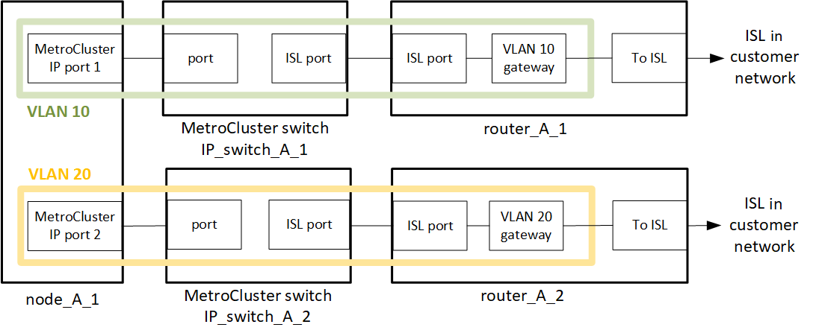
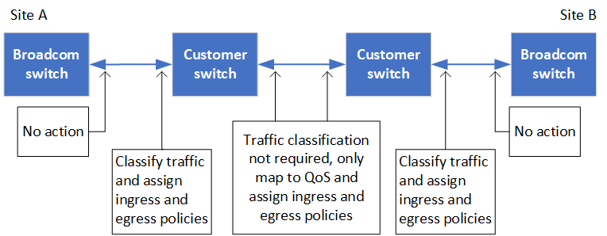

= Considerações ao implantar o MetroCluster em redes compartilhadas da camada 2 ou da camada 3
:allow-uri-read: 

[role="lead"]
Dependendo dos seus requisitos, você pode usar redes compartilhadas da camada 2 ou da camada 3 para implantar o MetroCluster.

A partir do ONTAP 9.6, as configurações IP do MetroCluster com switches suportados podem compartilhar redes existentes para links interswitches (ISLs) em vez de usar ISLs MetroCluster dedicados. Essa topologia é conhecida como _shared layer 2 networks_.

A partir do ONTAP 9.9,1, as configurações IP do MetroCluster podem ser implementadas com conexões de back-end roteadas por IP (camada 3). Essa topologia é conhecida como _shared layer 3 networks_.

[NOTE]
====
* Nem todos os recursos são suportados em todas as topologias de rede.
* Você deve verificar se tem capacidade de rede adequada e se o tamanho ISL é apropriado para sua configuração. A baixa latência é essencial para a replicação de dados entre os locais do MetroCluster. Problemas de latência nessas conexões podem afetar a e/S do cliente
* Todas as referências a switches de back-end MetroCluster referem-se a switches validados por NetApp ou compatíveis com MetroCluster. link:mcc-compliant-netapp-validated-switches.html["Switches validados pela NetApp e compatíveis com MetroCluster"]Consulte para obter mais detalhes.

====

== Requisitos de ISL para redes de camada 2 e camada 3

O seguinte se aplica às redes da camada 2 e da camada 3:

* A velocidade e o número de ISLs entre os switches MetroCluster e os switches de rede intermediários não precisam ser compatíveis. Da mesma forma, a velocidade entre os switches de rede intermediária não precisa corresponder.
+
Por exemplo, os switches MetroCluster podem se conetar usando um 40Gbps ISL aos interrutores intermediários, e os interrutores intermediários podem se conetar usando dois ISLs de 100Gbps.

* O monitoramento de rede deve ser configurado na rede intermediária para monitorar os ISLs para utilização, erros (quedas, flaps de link, corrupção, etc.) e falhas.
* O tamanho da MTU deve ser definido como 9216 em todas as portas que transportam tráfego MetroCluster de ponta a ponta.
* Nenhum outro tráfego pode ser configurado com uma prioridade mais alta do que a classe de serviço (COS) 5.
* A notificação explícita de congestionamento (ECN) deve ser configurada em todos os caminhos que transportam tráfego MetroCluster de ponta a ponta.
* Os ISLs que transportam tráfego MetroCluster devem ser links nativos entre os switches.
+
Os serviços de compartilhamento de links, como os links MPLS (Multiprotocol Label Switching), não são suportados.

* As VLANs de camada 2 devem abranger nativamente os locais. A sobreposição de VLAN, como a Virtual Extensible LAN (VXLAN), não é suportada.
* O número de interrutores intermédios não é limitado. No entanto, a NetApp recomenda que você mantenha o número de switches ao mínimo necessário.
* Os ISLs nos switches MetroCluster são configurados com o seguinte:
+
** Modo de porta do switch 'trunk' como parte de um canal de porta LACP
** O tamanho da MTU é 9216
** Nenhuma VLAN nativa está configurada
** Somente VLANs que transportam tráfego MetroCluster entre locais são permitidas
** A VLAN padrão do switch não é permitida

== Considerações para redes de camada 2

Os switches de back-end MetroCluster são conetados à rede do cliente.

image::../media/MCC_layer2.png[MCC layer2]

Os interrutores intermediários fornecidos pelo cliente devem cumprir os seguintes requisitos:

* A rede intermediária deve fornecer as mesmas VLANs entre os locais. Isso deve corresponder às VLANs MetroCluster definidas no arquivo RCF.
* O RcfFileGenerator não permite a criação de um arquivo RCF usando VLANs que não são suportadas pela plataforma.
* O RcfFileGenerator pode restringir o uso de certos IDs de VLAN, por exemplo, se eles são destinados para uso futuro. Geralmente, as VLANs reservadas são até 100.1X, inclusive.
* As VLANs de camada 2 com IDs que correspondam às IDs de VLAN MetroCluster devem abranger a rede compartilhada.

.Configuração de VLAN no ONTAP
Você só pode especificar a VLAN durante a criação da interface. Você pode configurar as VLANs padrão 10 e 20 ou VLANs dentro do intervalo de 101 a 4096 (ou o número suportado pelo fornecedor do switch, o que for o número menor). Depois que as interfaces MetroCluster forem criadas, você não poderá alterar o ID da VLAN.

NOTE: Alguns fornecedores de switches podem reservar o uso de certas VLANs.

Os sistemas a seguir não exigem configuração de VLAN no ONTAP. A VLAN é especificada pela configuração da porta do switch:

* FAS8200 e AFF A300
* AFF A320
* FAS9000 e AFF A700
* AFF A800, ASA A800, AFF C800 e ASA C800
+

NOTE: Os sistemas listados acima podem ser configurados usando VLANs 100 e abaixo. No entanto, algumas VLANs nesse intervalo podem ser reservadas para uso futuro ou outro.

Para todos os outros sistemas, você deve configurar a VLAN ao criar as interfaces MetroCluster no ONTAP. Aplicam-se as seguintes restrições:

* A VLAN padrão é 10 e 20
* Se você estiver executando o ONTAP 9.7 ou anterior, você só poderá usar a VLAN 10 e 20 padrão.
* Se você estiver executando o ONTAP 9.8 ou posterior, você pode usar a VLAN 10 e 20 padrão e uma VLAN acima de 100 (101 e superior) também pode ser usada.

== Considerações para redes de camada 3

Os switches de back-end MetroCluster são conetados à rede IP roteada, diretamente aos roteadores (como mostrado no exemplo simplificado a seguir) ou por meio de outros switches intervenientes.

O ambiente MetroCluster é configurado e cabeado como uma configuração IP MetroCluster padrão, conforme descrito em link:https://docs.netapp.com/us-en/ontap-metrocluster/install-ip/concept_parts_of_an_ip_mcc_configuration_mcc_ip.html["Configure os componentes de hardware do MetroCluster"]. Ao executar o procedimento de instalação e cabeamento, você deve executar as etapas específicas de uma configuração de camada 3. O seguinte se aplica às configurações da camada 3:

* Você pode conetar switches MetroCluster diretamente ao roteador ou a um ou mais switches intervenientes.
* Você pode conetar interfaces IP MetroCluster diretamente ao roteador ou a um dos switches intervenientes.
* A VLAN deve ser estendida ao dispositivo de gateway.
* Utilize o `-gateway parameter` para configurar o endereço de interface IP do MetroCluster com um endereço de gateway IP.
* Os IDs de VLAN para as VLANs MetroCluster devem ser os mesmos em cada local. No entanto, as sub-redes podem ser diferentes.
* O roteamento dinâmico não é suportado para o tráfego MetroCluster.
* Os seguintes recursos não são suportados:
+
** Configurações de MetroCluster de oito nós
** Atualizando uma configuração de MetroCluster de quatro nós
** Transição do MetroCluster FC para o MetroCluster IP

* São necessárias duas sub-redes em cada local do MetroCluster, uma em cada rede.
* A atribuição Auto-IP não é suportada.

Ao configurar roteadores e endereços IP de gateway, você deve atender aos seguintes requisitos:

* Duas interfaces em um nó não podem ter o mesmo endereço IP de gateway.
* As interfaces correspondentes nos pares de HA em cada local devem ter o mesmo endereço IP de gateway.
* As interfaces correspondentes em um nó e seus parceiros DR e AUX não podem ter o mesmo endereço IP de gateway.
* As interfaces correspondentes em um nó e seus parceiros DR e AUX devem ter o mesmo ID VLAN.

== Definições necessárias para interrutores intermédios

Quando o tráfego MetroCluster atravessa um ISL em uma rede intermediária, você deve verificar se a configuração dos switches intermediários garante que o tráfego MetroCluster (RDMA e armazenamento) atenda aos níveis de serviço necessários em todo o caminho entre os locais do MetroCluster.

O diagrama a seguir fornece uma visão geral das configurações necessárias ao usar switches Cisco validados da NetApp:

image::../media/switch_traffic_with_cisco_switches.png[troque o tráfego com os switches Cisco]

O diagrama a seguir apresenta uma visão geral das configurações necessárias para uma rede compartilhada quando os switches externos são switches IP Broadcom.

Neste exemplo, as seguintes políticas e mapas são criados para o tráfego MetroCluster:

* A `MetroClusterIP_ISL_Ingress` política é aplicada a portas no switch intermediário que se coneta aos switches IP MetroCluster.
+
A `MetroClusterIP_ISL_Ingress` política mapeia o tráfego marcado de entrada para a fila apropriada no switch intermediário.

* Uma `MetroClusterIP_ISL_Egress` política é aplicada a portas no switch intermediário que se conetam a ISLs entre switches intermediários.
* Você deve configurar as centrais intermediárias com mapas de acesso QoS correspondentes, mapas de classe e mapas de políticas ao longo do caminho entre os switches IP MetroCluster. Os switches intermediários mapeiam o tráfego RDMA para COS5 e o tráfego de armazenamento para COS4.

Os exemplos a seguir são para os switches Cisco Nexus 3232C e 9336C-FX2. Dependendo do fornecedor e do modelo do switch, você deve verificar se os switches intermediários têm uma configuração apropriada.

.Configure o mapa de classe para a porta ISL do interrutor intermediário
O exemplo a seguir mostra as definições do mapa de classes, dependendo se você precisa classificar ou corresponder o tráfego na entrada.

[role="tabbed-block"]
====
.Classificar o tráfego na entrada:
--
[listing]
----
ip access-list rdma
  10 permit tcp any eq 10006 any
  20 permit tcp any any eq 10006
ip access-list storage
  10 permit tcp any eq 65200 any
  20 permit tcp any any eq 65200

class-map type qos match-all rdma
  match access-group name rdma
class-map type qos match-all storage
  match access-group name storage
----
--
.Correspondência de tráfego no ingresso:
--
[listing]
----
class-map type qos match-any c5
  match cos 5
  match dscp 40
class-map type qos match-any c4
  match cos 4
  match dscp 32
----
--
====
.Crie um mapa de políticas de entrada na porta ISL do switch intermediário:
Os exemplos a seguir mostram como criar um mapa de políticas de ingresso, dependendo se você precisa classificar ou corresponder o tráfego no ingresso.

[role="tabbed-block"]
====
.Classifique o tráfego no ingresso:
--
[listing]
----
policy-map type qos MetroClusterIP_ISL_Ingress_Classify
  class rdma
    set dscp 40
    set cos 5
    set qos-group 5
  class storage
    set dscp 32
    set cos 4
    set qos-group 4
  class class-default
    set qos-group 0
----
--
.Faça corresponder o tráfego no ingresso:
--
[listing]
----
policy-map type qos MetroClusterIP_ISL_Ingress_Match
  class c5
    set dscp 40
    set cos 5
    set qos-group 5
  class c4
    set dscp 32
    set cos 4
    set qos-group 4
  class class-default
    set qos-group 0
----
--
====
.Configure a política de enfileiramento de saída para as portas ISL
O exemplo a seguir mostra como configurar a política de enfileiramento de saída:

[listing]
----
policy-map type queuing MetroClusterIP_ISL_Egress
   class type queuing c-out-8q-q7
      priority level 1
   class type queuing c-out-8q-q6
      priority level 2
   class type queuing c-out-8q-q5
      priority level 3
      random-detect threshold burst-optimized ecn
   class type queuing c-out-8q-q4
      priority level 4
      random-detect threshold burst-optimized ecn
   class type queuing c-out-8q-q3
      priority level 5
   class type queuing c-out-8q-q2
      priority level 6
   class type queuing c-out-8q-q1
      priority level 7
   class type queuing c-out-8q-q-default
      bandwidth remaining percent 100
      random-detect threshold burst-optimized ecn
----
Estas definições têm de ser aplicadas em todos os interrutores e ISLs que transportam tráfego MetroCluster.

Neste exemplo, Q4 e Q5 são configurados com `random-detect threshold burst-optimized ecn`. Dependendo da configuração, talvez seja necessário definir os limites mínimo e máximo, como mostrado no exemplo a seguir:

[listing]
----
class type queuing c-out-8q-q5
  priority level 3
  random-detect minimum-threshold 3000 kbytes maximum-threshold 4000 kbytes drop-probability 0 weight 0 ecn
class type queuing c-out-8q-q4
  priority level 4
  random-detect minimum-threshold 2000 kbytes maximum-threshold 3000 kbytes drop-probability 0 weight 0 ecn
----

NOTE: Os valores mínimo e máximo variam de acordo com o switch e seus requisitos.

.Exemplo 1: Cisco
Se sua configuração tiver switches Cisco, você não precisará classificar na primeira porta de entrada do switch intermediário. Em seguida, configure os seguintes mapas e políticas:

* `class-map type qos match-any c5`
* `class-map type qos match-any c4`
* `MetroClusterIP_ISL_Ingress_Match`

Atribua o `MetroClusterIP_ISL_Ingress_Match` mapa de políticas às portas ISL que transportam tráfego MetroCluster.

.Exemplo 2: Broadcom
Se sua configuração tiver switches Broadcom, você deve classificar na primeira porta de entrada do switch intermediário. Em seguida, configure os seguintes mapas e políticas:

* `ip access-list rdma`
* `ip access-list storage`
* `class-map type qos match-all rdma`
* `class-map type qos match-all storage`
* `MetroClusterIP_ISL_Ingress_Classify`
* `MetroClusterIP_ISL_Ingress_Match`

Você atribui `the MetroClusterIP_ISL_Ingress_Classify` o mapa de políticas às portas ISL no switch intermediário que coneta o switch Broadcom.

Você atribui o `MetroClusterIP_ISL_Ingress_Match` mapa de políticas às portas ISL no switch intermediário que está transportando tráfego MetroCluster, mas não coneta o switch Broadcom.
