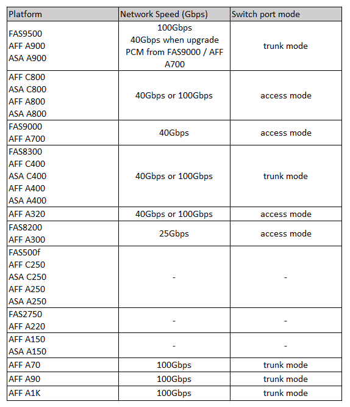

= Velocidades de rede específicas da plataforma e modos de porta de switch para switches compatíveis com MetroCluster
:allow-uri-read: 
:icons: font
:imagesdir: ../media/

[role="lead"]
Se você estiver usando switches compatíveis com MetroCluster, deve estar ciente das velocidades de rede específicas da plataforma e dos requisitos do modo de porta do switch.

A tabela a seguir fornece velocidades de rede específicas da plataforma e modos de porta de switch para switches compatíveis com MetroCluster. Você deve configurar o modo de porta do switch de acordo com a tabela.

NOTE: Valores ausentes indicam que a plataforma não pode ser usada com um switch compatível com MetroCluster.

