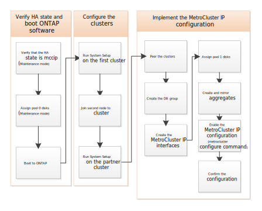

= Configurar os nós e clusters ONTAP na configuração de IP do MetroCluster
:allow-uri-read: 
:icons: font
:imagesdir: ../media/

[role="lead"]
É necessário configurar cada nó na configuração do MetroCluster no ONTAP, incluindo as configurações no nível do nó e a configuração dos nós em dois locais. Você também deve implementar a relação MetroCluster entre os dois sites.

Se um módulo do controlador falhar durante a configuração, link:../disaster-recovery/concept_choosing_the_correct_recovery_procedure_parent_concept.html#controller-module-failure-scenarios-during-metrocluster-installation["Cenários de falha do módulo do controlador durante a instalação do MetroCluster"]consulte a .

== Configurar configurações de IP do MetroCluster de oito nós

Uma configuração do MetroCluster de oito nós consiste em dois grupos de DR. Para configurar o primeiro grupo de DR, conclua as tarefas desta seção. Após configurar o primeiro grupo de DR, você pode seguir as etapas para link:../upgrade/task_expand_a_four_node_mcc_ip_configuration.html["expandir uma configuração de IP MetroCluster de quatro nós para uma configuração de oito nós"] .
