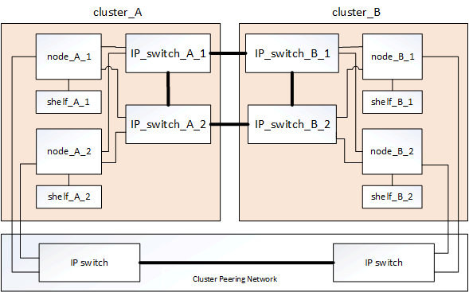
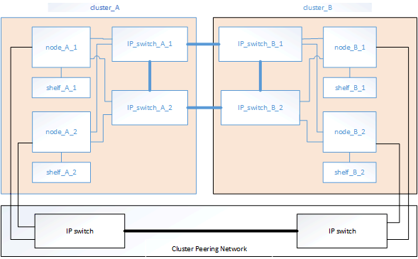

= Aprenda sobre interconexões de componentes de hardware em uma configuração de IP do MetroCluster
:allow-uri-read: 
:icons: font
:imagesdir: ../media/

[role="lead"]
Ao Planejar sua configuração IP do MetroCluster, você deve entender os componentes de hardware e como eles se interconetam.

== Principais elementos de hardware

Uma configuração IP do MetroCluster inclui os seguintes elementos-chave de hardware:

* Controladores de storage
+
As controladoras de storage são configuradas como dois clusters de dois nós.

* Rede IP
+
Esta rede IP back-end fornece conetividade para dois usos distintos:

+
** Conetividade de cluster padrão para comunicações intra-cluster.
+
Essa é a mesma funcionalidade de switch de cluster usada em clusters ONTAP não comutados da MetroCluster.

** Conectividade de back-end MetroCluster para replicação de dados de storage e cache não volátil.

* Rede de peering de cluster
+
A rede de peering de cluster fornece conetividade para espelhamento da configuração do cluster, que inclui a configuração de máquina virtual de storage (SVM). A configuração de todos os SVMs em um cluster é espelhada para o cluster de parceiros.

== Grupos de recuperação de desastres (DR)

Uma configuração IP do MetroCluster consiste em um grupo de DR de quatro nós.

A ilustração a seguir mostra a organização de nós em uma configuração de MetroCluster de quatro nós:

image::../media/mcc_dr_groups_4_node.gif[Grupos de DR do MetroCluster em uma configuração de quatro nós]

== Ilustração dos pares de HA locais em uma configuração do MetroCluster

Cada local do MetroCluster consiste em controladores de storage configurados como um par de HA. Isso permite redundância local para que, se um controlador de storage falhar, seu parceiro de HA local possa assumir o controle. Essas falhas podem ser tratadas sem uma operação de switchover do MetroCluster.

As operações de failover de HA local e giveback são executadas com os comandos de failover de storage, da mesma maneira que uma configuração que não é MetroCluster.

image::../media/mcc_ip_hardware_architecture_ha_pairs.gif[Pares de HA de arquitetura de hardware IP do MetroCluster]

.Informações relacionadas
https://docs.netapp.com/ontap-9/topic/com.netapp.doc.dot-cm-concepts/home.html["Conceitos de ONTAP"]

== Ilustração da rede de interligação de cluster e IP MetroCluster

Os clusters do ONTAP geralmente incluem uma rede de interconexão de cluster para tráfego entre os nós no cluster. Nas configurações IP do MetroCluster, essa rede também é usada para transportar tráfego de replicação de dados entre os sites do MetroCluster.

image::../media/mcc_ip_hardware_architecture_ip_interconnect.png[Arquitetura de hardware IP do MetroCluster Interconexão IP]

Cada nó na configuração IP do MetroCluster tem interfaces dedicadas para conexão com a rede IP de back-end:

* Duas interfaces IP MetroCluster
* Duas interfaces de cluster locais

A ilustração a seguir mostra essas interfaces. O uso da porta mostrado é para um sistema AFF A700 ou FAS9000.

image::../media/mcc_ip_lif_usage.gif[Uso do MetroCluster IP LIF]

.Informações relacionadas
link:concept_considerations_mcip.html["Considerações para configurações IP do MetroCluster"]

== Ilustração da rede de peering de cluster

Os dois clusters na configuração do MetroCluster são direcionados por meio de uma rede de peering de cluster fornecida pelo cliente. O peering de cluster suporta o espelhamento síncrono de máquinas virtuais de armazenamento (SVMs, anteriormente conhecido como VServers) entre os sites.

As LIFs entre clusters devem ser configuradas em cada nó na configuração do MetroCluster e os clusters devem ser configurados para peering. As portas com os LIFs entre clusters são conetadas à rede de peering de cluster fornecida pelo cliente. A replicação da configuração SVM é realizada por meio dessa rede por meio do Configuration Replication Service.

.Informações relacionadas
http://docs.netapp.com/ontap-9/topic/com.netapp.doc.exp-clus-peer/home.html["Configuração expressa de peering de cluster e SVM"]

link:concept_considerations_peering.html["Considerações para configurar o peering de cluster"]

link:task_cable_other_connections.html["Cabeamento das conexões de peering de cluster"]

link:task_sw_config_configure_clusters.html#peering-the-clusters["Peering dos clusters"]
