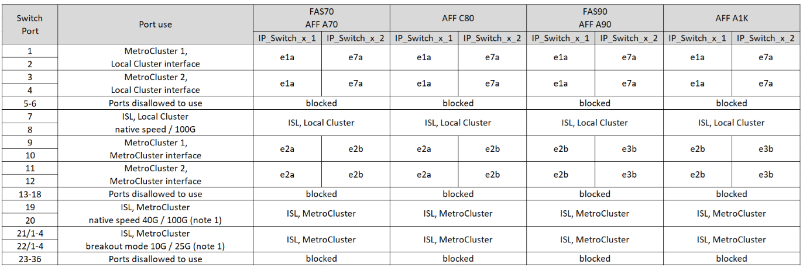

= Atribuições de portas de plataforma para switches Cisco 9336C-FX2 de 12 portas em uma configuração IP MetroCluster
:allow-uri-read: 
:icons: font
:imagesdir: ../media/

[role="lead"]
O uso da porta em uma configuração IP do MetroCluster depende do modelo do switch e do tipo de plataforma.

Revise as seguintes considerações antes de usar as tabelas de configuração:

* As tabelas nesta seção são para switches Cisco 9336C-FX2 de 12 portas.
+
Se você tiver um switch Cisco 9336C-FX2 de 36 portas que não esteja conectando prateleiras NS224, use as tabelas em link:port_usage_3232c_9336c.html["Atribuições de portas de plataforma para switches Cisco 3232C ou Cisco 9336C-FX2 de 36 portas"] .

+
Se você tiver um switch Cisco 9336C-FX2 de 36 portas e pelo menos uma configuração MetroCluster ou grupo DR estiver conectando prateleiras NS224 ao switch MetroCluster, use as tabelas em link:port_usage_9336c_shared.html["Atribuições de porta de plataforma para um switch Cisco 9336C-FX2 de 36 portas conectando armazenamento NS224"] .

NOTE: O switch Cisco 9336C-FX2 de 12 portas não suporta a conexão de prateleiras NS224 ao switch MetroCluster.

* As tabelas a seguir mostram o uso da porta para o local A. o mesmo cabeamento é usado para o local B.
* Não é possível configurar os switches com portas de velocidades diferentes (por exemplo, uma mistura de portas de 100 Gbps e portas de 40 Gbps).
* Se você estiver configurando um único MetroCluster com os switches, use o grupo de portas *MetroCluster 1*.
+
Monitore o grupo de portas do MetroCluster (MetroCluster 1, MetroCluster 2). Você precisará dele ao usar a ferramenta RcfFileGenerator, conforme descrito posteriormente neste procedimento de configuração.

* O RcfFileGenerator para MetroCluster IP também fornece uma visão geral de cabeamento por porta para cada switch.

== Escolha a tabela de cabeamento correta para sua configuração

Use a tabela a seguir para determinar qual tabela de cabeamento você deve seguir.

[cols="25,75"]
|===
| Se o seu sistema é... | Use esta tabela de cabeamento... 

| AFF A150, ASA A150 FAS500f AFF C250, ASA C250 AFF A250, ASA A250 | <<table_1_cisco_12port_9336c,Atribuições de porta da plataforma Cisco 9336C-FX2 de 12 portas (grupo 1)>> 

| AFF A20 | <<table_2_cisco_12port_9336c,Atribuições de porta da plataforma Cisco 9336C-FX2 de 12 portas (grupo 2)>> 

| AFF A30, AFF C30 FAS50 AFF C60  a| 
A tabela a seguir depende se você está usando uma placa Ethernet 25G (grupo 3a) ou 100g (grupo 3b).

* <<table_3a_cisco_12port_9336c,Atribuições de porta da plataforma Cisco 9336C-FX2 de 12 portas (grupo 3a - 25G)>>
* <<table_3b_cisco_12port_9336c,Atribuições de porta da plataforma Cisco 9336C-FX2 de 12 portas (grupo 3b - 100G)>>

| FAS8300, AFF C400, ASA C400, FAS8700 AFF A400, ASA A400 | <<table_4_cisco_12port_9336c,Atribuições de porta da plataforma Cisco 9336C-FX2 de 12 portas (grupo 4)>> 

| AFF A50 | <<table_5_cisco_12port_9336c,Atribuições de porta da plataforma Cisco 9336C-FX2 de 12 portas (grupo 5)>> 

| AFF C800, ASA C800, AFF A800, ASA A800 FAS9500, AFF A900, ASA A900 | <<table_6_cisco_12port_9336c,Atribuições de porta da plataforma Cisco 9336C-FX2 de 12 portas (grupo 6)>> 

| FAS70, AFF A70 AFF C80 FAS90, AFF A90 AFF A1K | <<table_7_cisco_12port_9336c,Atribuições de portas da plataforma Cisco 9336C-FX2 de 12 portas (grupo 7)>> 
|===
.Atribuições de porta da plataforma Cisco 9336C-FX2 de 12 portas (grupo 1)
Revise as atribuições de porta da plataforma para cabear um sistema AFF A150, ASA A150, FAS500f, AFF C250, ASA C250, AFF A250 ou ASA A250 a um switch Cisco 9336C-FX2 de 12 portas:

image:../media/mccip-cabling-9336c-12-port-a150-fas500f-a250-c250.png["Mostra as atribuições de porta da plataforma Cisco 9336C-FX2 de 12 portas"]

*Observação 1:* Você só pode configurar as portas 19 e 20 *ou* as portas 21 e 22. Se você usar as portas 19 e 20 primeiro, as portas 21 e 22 serão bloqueadas. Se você usar as portas 21 e 22 primeiro, as portas 19 e 20 serão bloqueadas.

.Atribuições de porta da plataforma Cisco 9336C-FX2 de 12 portas (grupo 2)
Revise as atribuições de porta da plataforma para cabear um sistema AFF A20 a um switch Cisco 9336C-FX2 de 12 portas:

image:../media/mccip-cabling-9336c-12-port-a20.png["Mostra as atribuições de porta da plataforma Cisco 9336C-FX2 de 12 portas"]

*Observação 1:* Você só pode configurar as portas 19 e 20 *ou* as portas 21 e 22. Se você usar as portas 19 e 20 primeiro, as portas 21 e 22 serão bloqueadas. Se você usar as portas 21 e 22 primeiro, as portas 19 e 20 serão bloqueadas.

.Atribuições de porta da plataforma Cisco 9336C-FX2 de 12 portas (grupo 3a)
Revise as atribuições de porta da plataforma para conectar um sistema AFF A30, AFF C30, AFF C60 ou FAS50 a um switch Cisco 9336C-FX2 de 12 portas usando uma placa Ethernet 25G de quatro portas.

NOTE: Essa configuração requer uma placa Ethernet 25G de quatro portas no slot 4 para conetar o cluster local e as interfaces HA.

image:../media/mccip-cabling-9336c-12-port-a30-c30-fas50-c60-25g.png["Mostra as atribuições de porta da plataforma Cisco 9336C-FX2 de 12 portas"]

*Observação 1:* Você só pode configurar as portas 19 e 20 *ou* as portas 21 e 22. Se você usar as portas 19 e 20 primeiro, as portas 21 e 22 serão bloqueadas. Se você usar as portas 21 e 22 primeiro, as portas 19 e 20 serão bloqueadas.

.Atribuições de porta da plataforma Cisco 9336C-FX2 de 12 portas (grupo 3b)
Revise as atribuições de porta da plataforma para conectar um sistema AFF A30, AFF C30, AFF C60 ou FAS50 a um switch Cisco 9336C-FX2 de 12 portas usando uma placa Ethernet 100G de duas portas.

NOTE: Essa configuração requer uma placa ETHERNET 100g de duas portas no slot 4 para conetar o cluster local e as interfaces HA.

image:../media/mccip-cabling-9336c-12-port-a30-c30-fas50-c60-100g.png["Mostra as atribuições de porta da plataforma Cisco 9336C-FX2 de 12 portas"]

*Observação 1:* Você só pode configurar as portas 19 e 20 *ou* as portas 21 e 22. Se você usar as portas 19 e 20 primeiro, as portas 21 e 22 serão bloqueadas. Se você usar as portas 21 e 22 primeiro, as portas 19 e 20 serão bloqueadas.

.Atribuições de porta da plataforma Cisco 9336C-FX2 de 12 portas (grupo 4)
Revise as atribuições de porta da plataforma para cabear um sistema FAS8300, AFF C400, ASA C400, FAS8700, AFF A400 ou ASA A400 a um switch Cisco 9336C-FX2 de 12 portas:

image::../media/mccip-cabling-9336c-12-port-a400-c400-fas8300-fas8700.png[Mostra as atribuições de porta da plataforma Cisco 9336C-FX2 de 12 portas]

*Observação 1:* Você só pode configurar as portas 19 e 20 *ou* as portas 21 e 22. Se você usar as portas 19 e 20 primeiro, as portas 21 e 22 serão bloqueadas. Se você usar as portas 21 e 22 primeiro, as portas 19 e 20 serão bloqueadas.

.Atribuições de porta da plataforma Cisco 9336C-FX2 de 12 portas (grupo 5)
Revise as atribuições de porta da plataforma para cabear um sistema AFF A50 a um switch Cisco 9336C-FX2 de 12 portas:

image::../media/mccip-cabling-9336c-12-port-a50.png[Mostra as atribuições de porta da plataforma Cisco 9336C-FX2 de 12 portas]

*Observação 1:* Você só pode configurar as portas 19 e 20 *ou* as portas 21 e 22. Se você usar as portas 19 e 20 primeiro, as portas 21 e 22 serão bloqueadas. Se você usar as portas 21 e 22 primeiro, as portas 19 e 20 serão bloqueadas.

.Atribuições de porta da plataforma Cisco 9336C-FX2 de 12 portas (grupo 6)
Revise as atribuições de porta da plataforma para cabear um sistema AFF C800, ASA C800, AFF A800, ASA A800, FAS9500, AFF A900 ou ASA A900 a um switch Cisco 9336C-FX2 de 12 portas:

image::../media/mccip-cabling-9336c-12-port-c800-a800-fas9500-a900.png[Mostra as atribuições de porta da plataforma Cisco 9336C-FX2 de 12 portas]

*Observação 1:* Você só pode configurar as portas 19 e 20 *ou* as portas 21 e 22. Se você usar as portas 19 e 20 primeiro, as portas 21 e 22 serão bloqueadas. Se você usar as portas 21 e 22 primeiro, as portas 19 e 20 serão bloqueadas.

*Nota 2:* Use as portas e4a e e4e ou e4a e e8a se estiver usando um adaptador X91440A (40 Gbps). Utilize as portas e4a e e4b ou e4a e e8a se estiver a utilizar um adaptador X91153A (100Gbps).

.Atribuições de portas da plataforma Cisco 9336C-FX2 de 12 portas (grupo 7)
Revise as atribuições de porta da plataforma para cabear um sistema AFF A70, FAS70, AFF C80, FAS90, AFF A90 ou AFF A1K a um switch Cisco 9336C-FX2 de 12 portas:

*Observação 1:* Você só pode configurar as portas 19 e 20 *ou* as portas 21 e 22. Se você usar as portas 19 e 20 primeiro, as portas 21 e 22 serão bloqueadas. Se você usar as portas 21 e 22 primeiro, as portas 19 e 20 serão bloqueadas.
