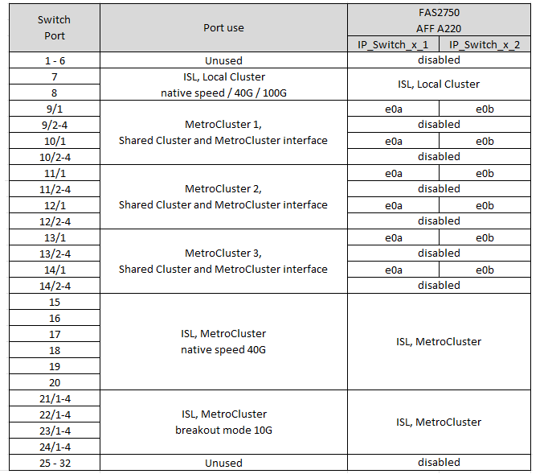

= Atribuições de porta de plataforma para switches Cisco 3132Q-V.
:allow-uri-read: 
:icons: font
:imagesdir: ../media/

[role="lead"]
O uso da porta em uma configuração IP do MetroCluster depende do modelo do switch e do tipo de plataforma.

Reveja estas diretrizes antes de utilizar as tabelas:

* Se você configurar o switch para a transição MetroCluster FC para IP, a porta 5, a porta 6, a porta 13 ou a porta 14 podem ser usadas para conetar as interfaces de cluster locais do nó MetroCluster FC. Consulte link:https://mysupport.netapp.com/site/tools/tool-eula/rcffilegenerator["RcfFileGenerator"^]o e os arquivos de cabeamento gerados para obter mais detalhes sobre o cabeamento dessa configuração. Para todas as outras conexões, você pode usar as atribuições de uso de portas listadas nas tabelas.

== Escolha a tabela de cabeamento correta para sua configuração

Use a tabela a seguir para determinar qual tabela de cabeamento você deve seguir.

[cols="2*"]
|===
| Se o seu sistema é... | Use esta tabela de cabeamento... 

 a| 
FAS2750, AFF A220
| <<table_1_cisco_3132q,Atribuições de porta de plataforma Cisco 3132Q-V (grupo 1)>> 

| FAS9000, AFF A700 | <<table_2_cisco_3132q,Atribuições de porta de plataforma Cisco 3132Q-V (grupo 2)>> 

| AFF A800, ASA A800 | <<table_3_cisco_3132q,Atribuições de porta de plataforma Cisco 3132Q-V (grupo 3)>> 
|===
.Atribuições de porta de plataforma Cisco 3132Q-V (grupo 1)
Revise as atribuições de portas da plataforma para fazer o cabo de um sistema FAS2750 ou AFF A220 para um switch Cisco 3132Q-V:

.Atribuições de porta de plataforma Cisco 3132Q-V (grupo 2)
Revise as atribuições de portas da plataforma para fazer o cabo de um sistema FAS9000 ou AFF A700 para um switch Cisco 3132Q-V:

image::../media/mcc-ip-cabling-a-fas9000-or-aff-a700-to-a-cisco-3132q-v-switch.png[Mostra as atribuições de porta da plataforma Cisco 3132Q-V.]

.Atribuições de porta de plataforma Cisco 3132Q-V (grupo 3)
Revise as atribuições de portas da plataforma para fazer o cabo de um sistema AFF A800 ou ASA A800 para um switch Cisco 3132Q-V:

image::../media/cabling-an-aff-a800-to-a-cisco-3132q-v-switch.png[Mostra as atribuições de porta da plataforma Cisco 3132Q-V.]
