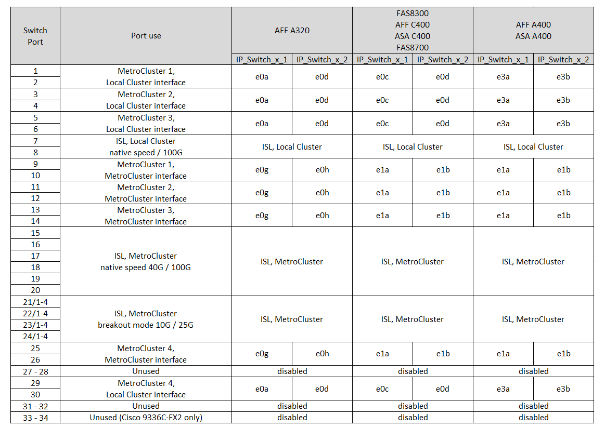

= Atribuições de portas de plataforma para switches Cisco 3232C ou Cisco 9336C
:allow-uri-read: 
:icons: font
:imagesdir: ../media/

[role="lead"]
O uso da porta em uma configuração IP do MetroCluster depende do modelo do switch e do tipo de plataforma.

Reveja estas considerações antes de utilizar as tabelas:

* As tabelas a seguir mostram o uso da porta para o local A. o mesmo cabeamento é usado para o local B.
* Os switches não podem ser configurados com portas de velocidades diferentes (por exemplo, uma combinação de portas de 100 Gbps e portas de 40 Gbps).
* Se você estiver configurando um único MetroCluster com os switches, use o grupo de portas *MetroCluster 1*.
+
Mantenha o controle do grupo de portas MetroCluster (MetroCluster 1, MetroCluster 2, MetroCluster 3 ou MetroCluster 4). Você precisará dele ao usar a ferramenta RcfFileGenerator como descrito mais adiante neste procedimento de configuração.

* O RcfFileGenerator para MetroCluster IP também fornece uma visão geral de cabeamento por porta para cada switch.
+
Use esta visão geral do cabeamento para verificar o cabeamento.

* O arquivo RCF versão v2,10 ou posterior é necessário para o modo breakout 25G para ISLs MetroCluster.
* O ONTAP 9.13,1 ou posterior e o arquivo RCF versão 2,00 são necessários para usar uma plataforma diferente do FAS8200 ou do AFF A300 no grupo "MetroCluster 4".

NOTE: A versão do arquivo RCF é diferente da versão da ferramenta RCFfilegerator usada para gerar o arquivo. Por exemplo, você pode gerar um arquivo RCF versão 2,00 usando o RCFfilegerator v1,6c.

== Cabeamento de duas configurações MetroCluster para os switches

Ao fazer o cabeamento de mais de uma configuração MetroCluster para um switch Cisco 3132Q-V, você deve fazer o cabeamento de cada MetroCluster de acordo com a tabela apropriada. Por exemplo, se estiver cabendo um FAS2750 e um AFF A700 ao mesmo switch Cisco 3132Q-V. Em seguida, você faz o cabo do FAS2750 de acordo com "MetroCluster 1" na Tabela 1, e do AFF A700 de acordo com "MetroCluster 2" ou "MetroCluster 3" na Tabela 2. Não é possível ligar fisicamente o FAS2750 e o AFF A700 como "MetroCluster 1".

== Escolha a tabela de cabeamento correta para sua configuração

Use a tabela a seguir para determinar qual tabela de cabeamento você deve seguir.

[cols="2*"]
|===
| Se o seu sistema é... | Use esta tabela de cabeamento... 

 a| 
AFF A150, ASA A150, FAS2750, AFF A220

FAS500f, AFF C250, ASA C250, AFF A250, ASA A250
| <<table_1_cisco_3232c_9336c,Atribuições de porta da plataforma Cisco 3232C ou Cisco 9336C (grupo 1)>> 

| FAS8200, AFF A300 | <<table_2_cisco_3232c_9336c,Atribuições de porta da plataforma Cisco 3232C ou Cisco 9336C (grupo 2)>> 

| AFF A320 FAS8300, AFF C400, ASA C400, FAS8700 AFF A400, ASA A400 | <<table_3_cisco_3232c_9336c,Atribuições de porta da plataforma Cisco 3232C ou Cisco 9336C (grupo 3)>> 

| FAS9000, AFF A700 AFF C800, ASA C800, AFF A800, ASA A800 FAS9500, AFF A900, ASA A900 | <<table_4_cisco_3232c_9336c,Atribuições de porta da plataforma Cisco 3232C ou Cisco 9336C (grupo 4)>> 

| AFF A70 AFF A90 AFF A1K *Nota:* estes sistemas requerem o ONTAP 9.15,1 ou posterior. | <<table_5_cisco_3232c_9336c,Atribuições de porta da plataforma Cisco 3232C ou Cisco 9336C (grupo 5)>> 
|===
.Atribuições de porta da plataforma Cisco 3232C ou Cisco 9336C (grupo 1)
Revise as atribuições de portas da plataforma para enviar um sistema AFF A150, ASA A150, FAS2750, AFF A220, FAS500f, AFF C250, ASA C250, AFF A250 ou ASA A250 para um switch Cisco 3232C ou 9336C:

image::../media/mcc-ip-cabling-a150-a220-a250-to-a-cisco-3232c-or-cisco-9336c-switch.png[Mostra atribuições de porta da plataforma Cisco 3232C ou Cisco 9336C]

.Atribuições de porta da plataforma Cisco 3232C ou Cisco 9336C (grupo 2)
Revise as atribuições de portas da plataforma para fazer o cabo de um sistema FAS8200 ou AFF A300 para um switch Cisco 3232C ou 9336C:

image::../media/mcc-ip-cabling-a-aff-a300-or-fas8200-to-a-cisco-3232c-or-cisco-9336c-switch.png[Mostra atribuições de porta da plataforma Cisco 3232C ou Cisco 9336C]

Se você estiver atualizando a partir de arquivos RCF mais antigos, a configuração de cabeamento pode estar usando portas no grupo "MetroCluster 4" (portas 25/26 e 29/30).

.Atribuições de porta da plataforma Cisco 3232C ou Cisco 9336C (grupo 3)
Revise as atribuições de portas da plataforma para enviar um sistema AFF A320, FAS8300, AFF C400, ASA C400, FAS8700, AFF A400 ou ASA A400 para um switch Cisco 3232C ou 9336C:

*Nota 1*: Se estiver a utilizar um adaptador X91440A (40Gbps), utilize as portas e4a e e4e ou e4a e e8a. Se você estiver usando um adaptador X91153A (100Gbps), use as portas e4a e e4b ou e4a e e8a.

NOTE: O uso de portas no grupo "MetroCluster 4" requer o ONTAP 9.13,1 ou posterior.

.Atribuições de porta da plataforma Cisco 3232C ou Cisco 9336C (grupo 4)
Revise as atribuições de portas da plataforma para enviar um sistema FAS9000, AFF A700, AFF C800, ASA C800, AFF A800, ASA A800, FAS9500, AFF A900 ou ASA A900 para um switch Cisco 3232C ou 9336C:

image::../media/mcc_ip_cabling_fas9000_a700_fas9500_a800_a900_cisco_3232C_or_9336c_switch.png[Mostra atribuições de porta da plataforma Cisco 3232C ou Cisco 9336C]

*Nota 1*: Se estiver a utilizar um adaptador X91440A (40Gbps), utilize as portas e4a e e4e ou e4a e e8a. Se você estiver usando um adaptador X91153A (100Gbps), use as portas e4a e e4b ou e4a e e8a.

NOTE: O uso de portas no grupo "MetroCluster 4" requer o ONTAP 9.13,1 ou posterior.

.Atribuições de porta da plataforma Cisco 3232C ou Cisco 9336C (grupo 5)
Revise as atribuições de portas da plataforma para enviar um sistema AFF A70, AFF A90 ou AFF A1K para um switch Cisco 3232C ou 9336C:

NOTE: Os sistemas nesta tabela requerem ONTAP 9.15,1 ou posterior.

image:../media/mcc-ip-cabling-a90-a70-a1k-cisco-3232C-or-9336c-switch.png["Mostra atribuições de porta da plataforma Cisco 3232C ou Cisco 9336C"]
