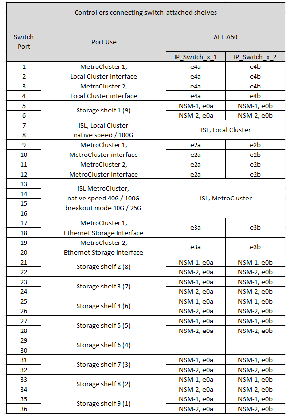
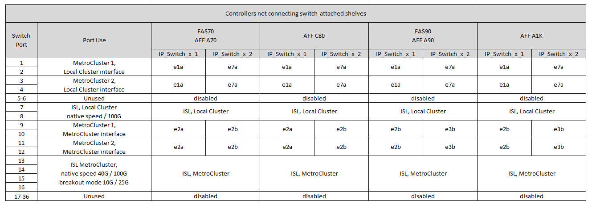

= Atribuições de porta de plataforma para um switch compartilhado Cisco 9336C-FX2
:allow-uri-read: 
:icons: font
:imagesdir: ../media/

[role="lead"]
O uso da porta em uma configuração IP do MetroCluster depende do modelo do switch e do tipo de plataforma.

Revise as seguintes considerações antes de usar as tabelas de configuração:

* Pelo menos uma configuração do MetroCluster ou grupo de DR deve ser compatível com gavetas NS224 conectadas ao switch.
* As plataformas que não dão suporte a gavetas NS224 conectadas a switch só podem ser conectadas como uma segunda configuração MetroCluster ou como um segundo grupo de DR.
* O RcfFileGenerator só mostra as plataformas elegíveis quando a primeira plataforma é selecionada.
* A conexão de configurações de um MetroCluster de oito ou dois de quatro nós requer o ONTAP 9.14,1 ou posterior.

== Escolha a tabela de cabeamento correta para sua configuração

Reveja a tabela de atribuições de portas correta para a sua configuração. Existem dois conjuntos de tabelas de cabeamento nesta seção:

* <<tables_connecting_ns224,Tabelas de cabeamento para controladores que se conectam às gavetas NS224 conectadas ao switch>>
* <<tables_not_connecting_ns224,Tabelas de cabeamento para controladores que não se conectam às gavetas NS224 conectadas ao switch>>

=== Controladoras conectadas às gavetas NS224 conectadas ao switch

Determine a tabela de atribuições de portas que você deve seguir para os controladores que se conetam às gavetas NS224 conectadas ao switch.

[cols="2*"]
|===
| Plataforma | Use esta tabela de cabeamento... 

| AFF C30, AFF A30 AFF C60 | <<table_1_cisco_9336c_fx2,Atribuições de porta de plataforma de switch compartilhado Cisco 9336C-FX2 (grupo 1)>> 

| AFF A320 AFF C400, ASA C400 AFF A400, ASA A400 | <<table_2_cisco_9336c_fx2,Atribuições de porta de plataforma de switch compartilhado Cisco 9336C-FX2 (grupo 2)>> 

| AFF A50 | <<table_3_cisco_9336c_fx2,Atribuições de porta de plataforma de switch compartilhado Cisco 9336C-FX2 (grupo 3)>> 

| AFF A700 AFF C800, ASA C800, AFF A800 AFF A900, ASA A900 | <<table_4_cisco_9336c_fx2,Atribuições de porta de plataforma de switch compartilhado Cisco 9336C-FX2 (grupo 4)>> 

| AFF A70 AFF C80 AFF A90 AFF A1K | <<table_5_cisco_9336c_fx2,Atribuições de porta de plataforma de switch compartilhado Cisco 9336C-FX2 (grupo 5)>> 
|===
.Atribuições de porta de plataforma de switch compartilhado Cisco 9336C-FX2 (grupo 1)
Revise as atribuições de portas da plataforma para fazer o cabeamento de um sistema AFF C30, AFF A30 ou AFF C60 que esteja conetando gavetas NSS24 conetadas a switch a um switch compartilhado Cisco 9336C-FX2:

image::../media/mcc-ip-affa30-c30-c60-cisco-9336fx2-switch-attached.png[Mostra as atribuições de portas da plataforma de switch compartilhada do Cisco 9336C-FX2]

.Atribuições de porta de plataforma de switch compartilhado Cisco 9336C-FX2 (grupo 2)
Revise as atribuições de portas da plataforma para fazer o cabeamento de um sistema AFF A320, AFF C400, ASA C400, AFF A400 ou ASA A400 que esteja conetando gavetas NSS24 conetadas a switch a um switch compartilhado Cisco 9336C-FX2:

image::../media/mcc_ip_cabling_a320_c400_a400_to_cisco_9336c_shared_switch.png[Mostra as atribuições de portas da plataforma de switch compartilhada do Cisco 9336C-FX2]

.Atribuições de porta de plataforma de switch compartilhado Cisco 9336C-FX2 (grupo 3)
Revise as atribuições de portas da plataforma para fazer o cabeamento de um sistema AFF A50 que esteja conetando prateleiras NSS24 conetadas a um switch compartilhado Cisco 9336C-FX2:

.Atribuições de porta de plataforma de switch compartilhado Cisco 9336C-FX2 (grupo 4)
Revise as atribuições de portas da plataforma para fazer o cabeamento de um sistema AFF A700, AFF C800, ASA C800, AFF A800, AFF A900 ou ASA A900 que esteja conetando gavetas NSS24 conetadas a switch a um switch compartilhado Cisco 9336C-FX2:

image:../media/mcc_ip_cabling_a700_c800_a800_a900_to_cisco_9336c_shared_switch.png["Mostra as atribuições de portas da plataforma de switch compartilhada do Cisco 9336C-FX2"]

*Nota 1*: Utilize as portas e4a e e4e ou e4a e e8a se estiver a utilizar um adaptador X91440A (40Gbps). Utilize as portas e4a e e4b ou e4a e e8a se estiver a utilizar um adaptador X91153A (100Gbps).

.Atribuições de porta de plataforma de switch compartilhado Cisco 9336C-FX2 (grupo 5)
Revise as atribuições de portas da plataforma para fazer o cabeamento de um sistema AFF A70, AFF C80, AFF A90 ou AFF A1K que esteja conetando gavetas NSS24 conetadas a um switch compartilhado Cisco 9336C-FX2:

image::../media/mcc-ip-cabling-a70-c80-a90-a1k-to-cisco-9336c-shared-switch-updated.png[Mostra as atribuições de portas da plataforma de switch compartilhada do Cisco 9336C-FX2]

=== Controladores não se conectam às gavetas NS224 conectadas por switch

Determine a tabela de atribuições de portas que você deve seguir para os controladores que não estão se conetando às gavetas NS224 conectadas ao switch.

[cols="2*"]
|===
| Plataforma | Use esta tabela de cabeamento... 

| AFF A150, ASA A150 FAS2750, AFF A220 | <<table_6_cisco_9336c_fx2,Atribuições de porta de plataforma de switch compartilhado Cisco 9336C-FX2 (grupo 6)>> 

| AFF A20 | <<table_7_cisco_9336c_fx2,Atribuições de porta de plataforma de switch compartilhado Cisco 9336C-FX2 (grupo 7)>> 

| FAS500f AFF C250, ASA C250 AFF A250, ASA A250 | <<table_8_cisco_9336c_fx2,Atribuições de porta de plataforma de switch compartilhado Cisco 9336C-FX2 (grupo 8)>> 

| AFF C30, AFF A30 AFF C60 | <<table_9_cisco_9336c_fx2,Atribuições de porta de plataforma de switch compartilhado Cisco 9336C-FX2 (grupo 9)>> 

| FAS8200, AFF A300 | <<table_10_cisco_9336c_fx2,Atribuições de porta de plataforma de switch compartilhado Cisco 9336C-FX2 (grupo 10)>> 

| AFF A320 FAS8300, AFF C400, ASA C400, FAS8700 AFF A400, ASA A400 | <<table_11_cisco_9336c_fx2,Atribuições de porta de plataforma de switch compartilhado Cisco 9336C-FX2 (grupo 11)>> 

| AFF A50 | <<table_12_cisco_9336c_fx2,Atribuições de porta de plataforma de switch compartilhado Cisco 9336C-FX2 (grupo 12)>> 

| FAS9000, AFF A700 AFF C800, ASA C800, AFF A800, ASA A800 FAS9500, AFF A900, ASA A900 | <<table_13_cisco_9336c_fx2,Atribuições de porta de plataforma de switch compartilhado Cisco 9336C-FX2 (grupo 13)>> 

| FAS70, AFF A70 AFF C80 FAS90, AFF A90 AFF A1K | <<table_14_cisco_9336c_fx2,Atribuições de porta de plataforma de switch compartilhado Cisco 9336C-FX2 (grupo 14)>> 
|===
.Atribuições de porta de plataforma de switch compartilhado Cisco 9336C-FX2 (grupo 6)
Revise as atribuições de portas da plataforma para fazer o cabeamento de um sistema AFF A150, ASA A150, FAS2750 ou AFF A220 que não esteja conetando gavetas NSS24 conetadas a switch a um switch compartilhado Cisco 9336C-FX2:

image::../media/mcc-ip-cabling-a-aff-a150-asa-a150-fas2750-aff-a220-to-a-cisco-9336c-shared-switch.png[Mostra as atribuições de portas da plataforma de switch compartilhada do Cisco 9336C-FX2]

.Atribuições de porta de plataforma de switch compartilhado Cisco 9336C-FX2 (grupo 7)
Revise as atribuições de portas da plataforma para fazer o cabeamento de um sistema AFF A20 que não esteja conetando prateleiras NSS24 conetadas a um switch compartilhado Cisco 9336C-FX2:

image:../media/mcc-ip-aff-a20-to-a-cisco-9336c-shared-switch-not-connecting.png["Mostra as atribuições de portas da plataforma de switch compartilhada do Cisco 9336C-FX2"]

.Atribuições de porta de plataforma de switch compartilhado Cisco 9336C-FX2 (grupo 8)
Revise as atribuições de portas da plataforma para fazer o cabo de um sistema FAS500f, AFF C250, ASA C250, AFF A250 ou ASA A250 que não esteja conetando as gavetas NSS24 conetadas a switch a um switch compartilhado Cisco 9336C-FX2:

image::../media/mcc-ip-cabling-c250-asa-c250-a250-asa-a250-to-cisco-9336c-shared-switch.png[Mostra as atribuições de portas da plataforma de switch compartilhada do Cisco 9336C-FX2]

.Atribuições de porta de plataforma de switch compartilhado Cisco 9336C-FX2 (grupo 9)
Revise as atribuições de portas da plataforma para fazer o cabeamento de um sistema AFF A30, AFF C30 ou AFF C60 que não esteja conetando gavetas NSS24 conetadas a switch a um switch compartilhado Cisco 9336C-FX2:

image:../media/mcc-ip-cabling-affa30-c30-c60a-cisco-9336c-shared-switch-not-connecting.png["Mostra as atribuições de portas da plataforma de switch compartilhada do Cisco 9336C-FX2"]

.Atribuições de porta de plataforma de switch compartilhado Cisco 9336C-FX2 (grupo 10)
Revise as atribuições de portas da plataforma para fazer o cabo de um sistema FAS8200 ou AFF A300 que não esteja conetando as gavetas NSS24 conetadas a switch a um switch compartilhado Cisco 9336C-FX2:

image::../media/mcc-ip-cabling-fas8200-affa300-to-cisco-9336c-shared-switch.png[Mostra as atribuições de portas da plataforma de switch compartilhada do Cisco 9336C-FX2]

.Atribuições de porta de plataforma de switch compartilhado Cisco 9336C-FX2 (grupo 11)
Revise as atribuições de portas da plataforma para fazer cabo de um sistema AFF A320, FAS8300, AFF C400, ASA C400, FAS8700, AFF A400 ou ASA A400 que não esteja conetando gavetas NSS24 conetadas a switch a um switch compartilhado Cisco 9336C-FX2:

image::../media/mcc_ip_cabling_a320_fas8300_a400_fas8700_to_a_cisco_9336c_shared_switch.png[Mostra as atribuições de portas da plataforma de switch compartilhada do Cisco 9336C-FX2]

.Atribuições de porta de plataforma de switch compartilhado Cisco 9336C-FX2 (grupo 12)
Revise as atribuições de portas da plataforma para fazer o cabeamento de um sistema AFF A50 que não esteja conetando prateleiras NSS24 conetadas a um switch compartilhado Cisco 9336C-FX2:

image::../media/mcc-ip-cabling-aff-a50-cisco-9336c-shared-switch-not-connecting.png[Mostra as atribuições de portas da plataforma de switch compartilhada do Cisco 9336C-FX2]

.Atribuições de porta de plataforma de switch compartilhado Cisco 9336C-FX2 (grupo 13)
Revise as atribuições de portas da plataforma para fazer o cabo de um sistema FAS9000 Cisco, AFF A800 AFF A900, ASA A800 ASA A900, FAS9500, AFF A700 ou AFF C800 que não esteja conetando gavetas NSS24 conetadas a switch a um switch compartilhado ASA C800 9336C-FX2:

image::../media/mcc_ip_cabling_a700_a800_fas9000_fas9500_to_cisco_9336c_shared_switch.png[Mostra as atribuições de portas da plataforma de switch compartilhada do Cisco 9336C-FX2]

*Nota 1*: Utilize as portas e4a e e4e ou e4a e e8a se estiver a utilizar um adaptador X91440A (40Gbps). Utilize as portas e4a e e4b ou e4a e e8a se estiver a utilizar um adaptador X91153A (100Gbps).

.Atribuições de porta de plataforma de switch compartilhado Cisco 9336C-FX2 (grupo 14)
Revise as atribuições de portas da plataforma para fazer o cabeamento de um sistema AFF A70, FAS70, AFF C80, FAS90, AFF A90 ou AFF A1K que não esteja conetando as gavetas NSS24 conetadas a um switch compartilhado Cisco 9336C-FX2:

