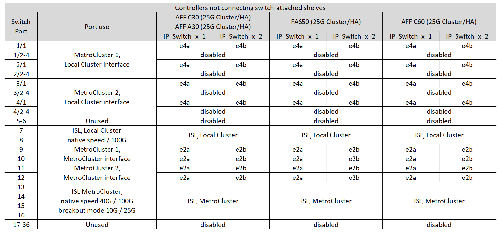
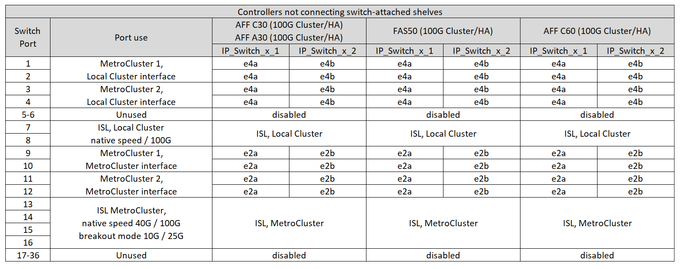

= Atribuições de porta de plataforma para um switch Cisco 9336C-FX2 de 36 portas conectando armazenamento NS224 em uma configuração IP MetroCluster
:allow-uri-read: 
:icons: font
:imagesdir: ../media/

[role="lead"]
O uso da porta em uma configuração IP do MetroCluster depende do modelo do switch e do tipo de plataforma.

Revise as seguintes considerações antes de usar as tabelas de configuração:

* As tabelas nesta seção são para switches Cisco 9336C-FX2 de 36 portas quando pelo menos uma configuração MetroCluster ou grupo DR está conectando prateleiras NS224 ao switch MetroCluster.
+
Se você tiver um switch Cisco 9336C-FX2 de 36 portas e não planeja conectar o armazenamento NS224 ao switch, use as tabelas em link:port_usage_3232c_9336c.html["Atribuições de portas de plataforma para switches Cisco 3232C ou Cisco 9336C-FX2 de 36 portas"].

+
Se você tiver um switch Cisco 9336C-FX2 de 12 portas, use as tabelas em link:port-usage-9336c-fx-2-12-port.html["Atribuições de portas de plataforma para switches Cisco 9336C-FX2 de 12 portas"] .

+

NOTE: O switch Cisco 9336C-FX2 de 12 portas não suporta a conexão de prateleiras NS224 ao switch MetroCluster.

* Ao cabear um switch Cisco 9336C-FX2 conectando o armazenamento NS224, você pode ter no máximo duas configurações ou grupos de DR MetroCluster. Pelo menos uma configuração ou grupo de DR MetroCluster deve estar conectando os shelves NS224 ao switch MetroCluster.
+
Se uma de suas MetroCluster configurações ou grupos de DR não conectar os gabinetes NS224 ao MetroCluster switch, siga o <<tables_not_connecting_ns224,tabelas de cabeamento para controladores que não conectam prateleiras NS224 conectadas a switches>>.

* O RcfFileGenerator só mostra as plataformas elegíveis quando a primeira plataforma é selecionada.
* Se você estiver expandindo uma configuração MetroCluster padrão que não oferece suporte ao armazenamento NS224 conectado a um switch e quiser adicionar uma configuração MetroCluster que tenha armazenamento NS224 conectado a um switch, revise as seguintes informações:
+
** Na link:https://mysupport.netapp.com/site/tools/tool-eula/rcffilegenerator["RcfFileGenerator"^] ferramenta, primeiro você deve selecionar a plataforma que suporta armazenamento NS224 conectado a switch e, em seguida, selecionar a plataforma que não suporta armazenamento NS224 conectado a switch.
+
Isso significa que, ao gerar o RCF para sua nova configuração, você pode precisar selecionar as plataformas na ferramenta RcfFileGenerator na seguinte ordem:

+
... Selecione a plataforma que suporta o armazenamento NS224 conectado ao switch no *segundo campo suspenso*.
... Selecione a plataforma que não suporta armazenamento NS224 conectado por switch no *primeiro campo suspenso*.

* A conexão de configurações de um MetroCluster de oito ou dois de quatro nós requer o ONTAP 9.14,1 ou posterior.

== Escolha a tabela de cabeamento correta para sua configuração

Reveja a tabela de atribuições de portas correta para a sua configuração. Existem dois conjuntos de tabelas de cabeamento nesta seção:

* <<tables_connecting_ns224,Tabelas de cabeamento para controladores que conectam as gavetas NS224 conectadas ao switch>>
* <<tables_not_connecting_ns224,Tabelas de cabeamento para controladores que não conectam as gavetas NS224 conectadas ao switch>>

=== Controladores que conectam as NS224 gavetas conectadas ao switch

Determine a tabela de atribuições de portas que você deve seguir para os controladores que conectam as gavetas NS224 conectadas ao switch.

[cols="25,75"]
|===
| Plataforma | Use esta tabela de cabeamento... 

| AFF C30, AFF A30 AFF C60  a| 
A tabela a seguir depende se você está usando uma placa Ethernet 25G (grupo 1a) ou 100g (grupo 1b).

* <<table_1a_cisco_9336c_fx2,Switch Cisco 9336C-FX2 que coneta atribuições de portas de plataforma de storage NS224 (grupo 1a - 25G)>>
* <<table_1b_cisco_9336c_fx2,Switch Cisco 9336C-FX2 que coneta atribuições de portas de plataforma de storage NS224 (grupo 1b - 100g)>>

| AFF A320 AFF C400, ASA C400 AFF A400, ASA A400 | <<table_2_cisco_9336c_fx2,Switch Cisco 9336C-FX2 que coneta atribuições de portas de plataforma de storage NS224 (grupo 2)>> 

| AFF A50 | <<table_3_cisco_9336c_fx2,Switch Cisco 9336C-FX2 que coneta atribuições de portas de plataforma de storage NS224 (grupo 3)>> 

| AFF A700 AFF C800, ASA C800, AFF A800 AFF A900, ASA A900 | <<table_4_cisco_9336c_fx2,Switch Cisco 9336C-FX2 que coneta atribuições de portas de plataforma de storage NS224 (grupo 4)>> 

| AFF A70 AFF C80 AFF A90 AFF A1K | <<table_5_cisco_9336c_fx2,Switch Cisco 9336C-FX2 que coneta atribuições de portas de plataforma de storage NS224 (grupo 5)>> 
|===
.Switch Cisco 9336C-FX2 que coneta atribuições de portas de plataforma de storage NS224 (grupo 1a)
Revise as atribuições de portas da plataforma para fazer um cabo de um sistema AFF A30, AFF C30 ou AFF C60 que esteja conetando prateleiras NSS24 conetadas a switches a um switch Cisco 9336C-FX2 usando uma placa Ethernet 25G de quatro portas.

NOTE: Essa configuração requer uma placa Ethernet 25G de quatro portas no slot 4 para conetar o cluster local e as interfaces HA.

image:../media/mccip-cabling-greeley-connecting-a30-c30-fas50-c60-25G.png["Mostra o switch Cisco 9336C-FX2 que coneta atribuições de porta de plataforma de armazenamento NS224"]

.Switch Cisco 9336C-FX2 que coneta atribuições de portas de plataforma de storage NS224 (grupo 1b)
Revise as atribuições de portas da plataforma para fazer um cabo de um sistema AFF A30, AFF C30 ou AFF C60 que esteja conetando prateleiras NSS24 conetadas a switches a um switch Cisco 9336C-FX2 usando uma placa Ethernet 100g de duas portas.

NOTE: Essa configuração requer uma placa ETHERNET 100g de duas portas no slot 4 para conetar o cluster local e as interfaces HA.

image:../media/mccip-cabling-greeley-connecting-a30-c30-fas50-c60-100G.png["Mostra o switch Cisco 9336C-FX2 que coneta atribuições de porta de plataforma de armazenamento NS224"]

.Switch Cisco 9336C-FX2 que coneta atribuições de portas de plataforma de storage NS224 (grupo 2)
Revise as atribuições de portas da plataforma para fazer o cabeamento de um sistema AFF A320, AFF C400, ASA C400, AFF A400 ou ASA A400 que esteja conetando gavetas NSS24 conetadas a um switch Cisco 9336C-FX2:

image::../media/mcc_ip_cabling_a320_c400_a400_to_cisco_9336c_shared_switch.png[Mostra o switch Cisco 9336C-FX2 que coneta atribuições de porta de plataforma de armazenamento NS224]

.Switch Cisco 9336C-FX2 que coneta atribuições de portas de plataforma de storage NS224 (grupo 3)
Revise as atribuições de portas da plataforma para fazer o cabeamento de um sistema AFF A50 que esteja conetando prateleiras NSS24 conetadas a um switch Cisco 9336C-FX2:

image:../media/mccip-cabling-greeley-connecting-a50-updated.png["Mostra o switch Cisco 9336C-FX2 que coneta atribuições de porta de plataforma de armazenamento NS224"]

.Switch Cisco 9336C-FX2 que coneta atribuições de portas de plataforma de storage NS224 (grupo 4)
Revise as atribuições de portas da plataforma para fazer o cabeamento de um sistema AFF A700, AFF C800, ASA C800, AFF A800, AFF A900 ou ASA A900 que esteja conetando as gavetas NSS24 conetadas a um switch Cisco 9336C-FX2:

image:../media/mcc_ip_cabling_a700_c800_a800_a900_to_cisco_9336c_shared_switch.png["Mostra o switch Cisco 9336C-FX2 que coneta atribuições de porta de plataforma de armazenamento NS224"]

*Nota 1*: Utilize as portas e4a e e4e ou e4a e e8a se estiver a utilizar um adaptador X91440A (40Gbps). Utilize as portas e4a e e4b ou e4a e e8a se estiver a utilizar um adaptador X91153A (100Gbps).

.Switch Cisco 9336C-FX2 que coneta atribuições de portas de plataforma de storage NS224 (grupo 5)
Revise as atribuições de portas da plataforma para fazer o cabeamento de um sistema AFF A70, AFF C80, AFF A90 ou AFF A1K que esteja conetando gavetas NSS24 conetadas a um switch Cisco 9336C-FX2:

image::../media/mccip-cabling-greeley-connecting-a70-c80-a-90-fas90-a1k.png[Mostra o switch Cisco 9336C-FX2 que coneta atribuições de porta de plataforma de armazenamento NS224]

=== Controladores não conectando gavetas NS224 conectadas por switch

Determine a tabela de atribuições de portas que você deve seguir para os controladores que não estão conetando as gavetas NS224 conetadas a switch.

[cols="25,75"]
|===
| Plataforma | Use esta tabela de cabeamento... 

| AFF A150, ASA A150 FAS2750, AFF A220 | <<table_6_cisco_9336c_fx2,O switch Cisco 9336C-FX2 não coneta atribuições de portas da plataforma de storage NS224 (grupo 6)>> 

| AFF A20 | <<table_7_cisco_9336c_fx2,O switch Cisco 9336C-FX2 não coneta atribuições de portas da plataforma de storage NS224 (grupo 7)>> 

| FAS500f AFF C250, ASA C250 AFF A250, ASA A250 | <<table_8_cisco_9336c_fx2,O switch Cisco 9336C-FX2 não coneta atribuições de portas da plataforma de storage NS224 (grupo 8)>> 

| AFF C30, AFF A30 FAS50 AFF C60  a| 
A tabela a seguir depende se você está usando uma placa Ethernet 25G (grupo 9a) ou 100g (grupo 9b).

* <<table_9a_cisco_9336c_fx2,O switch Cisco 9336C-FX2 não coneta atribuições de portas da plataforma de storage NS224 (grupo 9a)>>
* <<table_9b_cisco_9336c_fx2,O switch Cisco 9336C-FX2 não coneta atribuições de portas da plataforma de storage NS224 (grupo 9b)>>

| FAS8200, AFF A300 | <<table_10_cisco_9336c_fx2,O switch Cisco 9336C-FX2 não coneta atribuições de portas da plataforma de storage NS224 (grupo 10)>> 

| AFF A320 FAS8300, AFF C400, ASA C400, FAS8700 AFF A400, ASA A400 | <<table_11_cisco_9336c_fx2,O switch Cisco 9336C-FX2 não coneta atribuições de portas da plataforma de storage NS224 (grupo 11)>> 

| AFF A50 | <<table_12_cisco_9336c_fx2,O switch Cisco 9336C-FX2 não coneta atribuições de portas da plataforma de storage NS224 (grupo 12)>> 

| FAS9000, AFF A700 AFF C800, ASA C800, AFF A800, ASA A800 FAS9500, AFF A900, ASA A900 | <<table_13_cisco_9336c_fx2,O switch Cisco 9336C-FX2 não coneta atribuições de portas da plataforma de storage NS224 (grupo 13)>> 

| FAS70, AFF A70 AFF C80 FAS90, AFF A90 AFF A1K | <<table_14_cisco_9336c_fx2,O switch Cisco 9336C-FX2 não coneta atribuições de portas da plataforma de storage NS224 (grupo 14)>> 
|===
.O switch Cisco 9336C-FX2 não coneta atribuições de portas da plataforma de storage NS224 (grupo 6)
Revise as atribuições de portas da plataforma para fazer o cabeamento de um sistema AFF A150, ASA A150, FAS2750 ou AFF A220 que não esteja conetando prateleiras NSS24 conetadas a um switch Cisco 9336C-FX2:

image::../media/mcc-ip-cabling-a-aff-a150-asa-a150-fas2750-aff-a220-to-a-cisco-9336c-shared-switch.png[Mostra o switch Cisco 9336C-FX2 não conetando atribuições de porta da plataforma de armazenamento NS224]

.O switch Cisco 9336C-FX2 não coneta atribuições de portas da plataforma de storage NS224 (grupo 7)
Revise as atribuições de portas da plataforma para fazer o cabeamento de um sistema AFF A20 que não esteja conetando prateleiras NSS24 conetadas a um switch Cisco 9336C-FX2:

image:../media/mcc-ip-aff-a20-to-a-cisco-9336c-shared-switch-not-connecting.png["Mostra o switch Cisco 9336C-FX2 não conetando atribuições de porta da plataforma de armazenamento NS224"]

.O switch Cisco 9336C-FX2 não coneta atribuições de portas da plataforma de storage NS224 (grupo 8)
Revise as atribuições de portas da plataforma para fazer o cabeamento de um sistema FAS500f, AFF C250, ASA C250, AFF A250 ou ASA A250 que não esteja conetando as gavetas NSS24 conetadas a switch a um switch Cisco 9336C-FX2:

image::../media/mcc-ip-cabling-c250-asa-c250-a250-asa-a250-to-cisco-9336c-shared-switch.png[Mostra o switch Cisco 9336C-FX2 não conetando atribuições de porta da plataforma de armazenamento NS224]

.O switch Cisco 9336C-FX2 não coneta atribuições de portas da plataforma de storage NS224 (grupo 9a)
Revise as atribuições de portas da plataforma para realizar um sistema AFF A30, AFF C30, AFF C60 ou FAS50 que não esteja conetando prateleiras NSS24 conetadas a um switch Cisco 9336C-FX2 usando uma placa Ethernet 25G de quatro portas:

NOTE: Essa configuração requer uma placa Ethernet 25G de quatro portas no slot 4 para conetar o cluster local e as interfaces HA.

.O switch Cisco 9336C-FX2 não coneta atribuições de portas da plataforma de storage NS224 (grupo 9b)
Revise as atribuições de portas da plataforma para realizar um sistema AFF A30, AFF C30, AFF C60 ou FAS50 que não esteja conetando prateleiras NSS24 conetadas a um switch Cisco 9336C-FX2 usando uma placa Ethernet 100g de duas portas:

NOTE: Essa configuração requer uma placa ETHERNET 100g de duas portas no slot 4 para conetar o cluster local e as interfaces HA.

.O switch Cisco 9336C-FX2 não coneta atribuições de portas da plataforma de storage NS224 (grupo 10)
Revise as atribuições de portas da plataforma para fazer o cabeamento de um sistema FAS8200 ou AFF A300 que não esteja conetando as gavetas NSS24 conetadas a switch a um switch Cisco 9336C-FX2:

image::../media/mcc-ip-cabling-fas8200-affa300-to-cisco-9336c-shared-switch.png[Mostra o switch Cisco 9336C-FX2 que coneta atribuições de porta de plataforma de armazenamento NS224]

.O switch Cisco 9336C-FX2 não coneta atribuições de portas da plataforma de storage NS224 (grupo 11)
Revise as atribuições de portas da plataforma para fazer o cabeamento de um sistema AFF A320 ASA A400, FAS8700 Cisco, AFF C400 AFF A400 ou ASA C400 que não esteja conetando as gavetas NSS24 conetadas a um switch FAS8300 9336C-FX2:

image::../media/mcc_ip_cabling_a320_fas8300_a400_fas8700_to_a_cisco_9336c_shared_switch.png[Mostra o switch Cisco 9336C-FX2 não conetando atribuições de porta da plataforma de armazenamento NS224]

.O switch Cisco 9336C-FX2 não coneta atribuições de portas da plataforma de storage NS224 (grupo 12)
Revise as atribuições de portas da plataforma para fazer o cabeamento de um sistema AFF A50 que não esteja conetando prateleiras NSS24 conetadas a um switch Cisco 9336C-FX2:

image::../media/mcc-ip-cabling-aff-a50-cisco-9336c-shared-switch-not-connecting.png[Mostra o switch Cisco 9336C-FX2 não conetando atribuições de porta da plataforma de armazenamento NS224]

.O switch Cisco 9336C-FX2 não coneta atribuições de portas da plataforma de storage NS224 (grupo 13)
Revise as atribuições de portas da plataforma para fazer o cabo de um sistema FAS9000 Cisco, AFF A800 AFF A900, ASA A800 ASA A900, FAS9500, AFF A700 ou AFF C800 que não esteja conetando as gavetas NSS24 conetadas a um switch ASA C800 9336C-FX2:

image::../media/mcc_ip_cabling_a700_a800_fas9000_fas9500_to_cisco_9336c_shared_switch.png[Mostra o switch Cisco 9336C-FX2 não conetando atribuições de porta da plataforma de armazenamento NS224]

*Nota 1*: Utilize as portas e4a e e4e ou e4a e e8a se estiver a utilizar um adaptador X91440A (40Gbps). Utilize as portas e4a e e4b ou e4a e e8a se estiver a utilizar um adaptador X91153A (100Gbps).

.O switch Cisco 9336C-FX2 não coneta atribuições de portas da plataforma de storage NS224 (grupo 14)
Revise as atribuições de portas da plataforma para fazer o cabeamento de um sistema AFF A70, FAS70, AFF C80, FAS90, AFF A90 ou AFF A1K que não esteja conetando as gavetas NSS24 conetadas a um switch Cisco 9336C-FX2:

image::../media/mccip-cabling-greeley-not-connecting-a70-c80-a-90-fas90-a1k.png[Mostra o switch Cisco 9336C-FX2 não conetando atribuições de porta da plataforma de armazenamento NS224]
