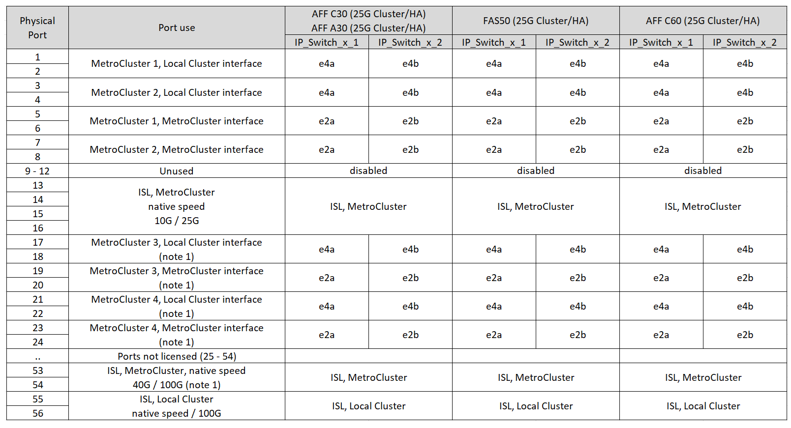

= Atribuições de portas de plataforma para switches IP BES-53248 com suporte da Broadcom
:allow-uri-read: 
:icons: font
:imagesdir: ../media/

[role="lead"]
O uso da porta em uma configuração IP do MetroCluster depende do modelo do switch e do tipo de plataforma.

Revise as seguintes considerações antes de usar as tabelas de configuração:

* Não é possível usar os switches com portas ISL remotas de diferentes velocidades (por exemplo, uma porta de 25 Gbps conetada a uma porta ISL de 10 Gbps).
* Se você configurar o switch para a transição MetroCluster FC para IP, as seguintes portas serão usadas dependendo da plataforma de destino escolhida:
+
[cols="75,25"]
|===
| Plataforma-alvo | Porta 

| Plataformas FAS500f, AFF C250, ASA C250, AFF A250, ASA A250, FAS8300, AFF C400, ASA C400, AFF A400, ASA A400 ou FAS8700 | Portas 1 - 6, 10Gbps 

| Plataformas FAS8200 ou AFF A300 | Portas 3 - 4 e 9 - 12, 10Gbps 
|===
* Os sistemas AFF A320 configurados com switches BES-53248 Broadcom podem não suportar todos os recursos.
+
Qualquer configuração ou recurso que exija que as conexões do cluster local estejam conetadas a um switch não é suportado. Por exemplo, as seguintes configurações e procedimentos não são suportados:

+
** Configurações de MetroCluster de oito nós
** Transição das configurações MetroCluster FC para MetroCluster IP
** Atualizando uma configuração de IP MetroCluster de quatro nós (ONTAP 9.8 e posterior)

== Escolha a tabela de cabeamento correta para sua configuração

Use a tabela a seguir para determinar qual tabela de cabeamento você deve seguir.

[cols="25,75"]
|===
| Se o seu sistema é... | Use esta tabela de cabeamento... 

 a| 
AFF A150, ASA A150

FAS2750

AFF A220
| <<table_1_bes_53248,Atribuições de porta de plataforma Broadcom BES-53248 (grupo 1)>> 

| FAS500f AFF C250, ASA C250 AFF A250, ASA A250 | <<table_2_bes_53248,Atribuições de porta de plataforma Broadcom BES-53248 (grupo 2)>> 

| AFF A20 | <<table_3_bes_53248,Atribuições de porta de plataforma Broadcom BES-53248 (grupo 3)>> 

| AFF C30, AFF A30 FAS50 AFF C60 | <<table_4_bes_53248,Atribuições de porta de plataforma Broadcom BES-53248 (grupo 4)>> 

| FAS8200, AFF A300 | <<table_5_bes_53248,Atribuições de porta de plataforma Broadcom BES-53248 (grupo 5)>> 

| AFF A320 | <<table_6_bes_53248,Atribuições de porta de plataforma Broadcom BES-53248 (grupo 6)>> 

| FAS8300 AFF C400, ASA C400 AFF A400, ASA A400 FAS8700 | <<table_7_bes_53248,Atribuições de porta de plataforma Broadcom BES-53248 (grupo 7)>> 
|===
.Atribuições de porta de plataforma Broadcom BES-53248 (grupo 1)
Revise as atribuições de portas da plataforma para fazer o cabeamento de um sistema AFF A150, ASA A150, FAS2750 ou AFF A220 para um switch BES-53248 da Broadcom:

image::../media/mcc_ip_cabling_a_aff_asa_a150_a220_fas2750_to_a_broadcom_bes_53248_switch.png[Mostra atribuições de porta de plataforma Broadcom BES-53248]

* *Nota 1*: O uso dessas portas requer uma licença adicional.
* Se ambas as configurações do MetroCluster estiverem usando a mesma plataforma, a NetApp recomenda selecionar o grupo "MetroCluster 3" para uma configuração e o grupo "MetroCluster 4" para a outra configuração. Se as plataformas forem diferentes, você deve selecionar "MetroCluster 3" ou "MetroCluster 4" para a primeira configuração e "MetroCluster 1" ou "MetroCluster 2" para a segunda configuração.

.Atribuições de porta de plataforma Broadcom BES-53248 (grupo 2)
Revise as atribuições de portas da plataforma para fazer o cabeamento de um sistema FAS500f, AFF C250, ASA C250, AFF A250 ou ASA A250 para um switch BES-53248 da Broadcom:

image::../media/mcc_ip_cabling_a_aff_asa_c250_a250_fas500f_to_a_broadcom_bes_53248_switch.png[Mostra atribuições de porta de plataforma Broadcom BES-53248]

* *Nota 1*: O uso dessas portas requer uma licença adicional.
* Se ambas as configurações do MetroCluster estiverem usando a mesma plataforma, a NetApp recomenda selecionar o grupo "MetroCluster 3" para uma configuração e o grupo "MetroCluster 4" para a outra configuração. Se as plataformas forem diferentes, você deve selecionar "MetroCluster 3" ou "MetroCluster 4" para a primeira configuração e "MetroCluster 1" ou "MetroCluster 2" para a segunda configuração.

.Atribuições de porta de plataforma Broadcom BES-53248 (grupo 3)
Revise as atribuições de portas da plataforma para fazer o cabo de um sistema AFF A20 para um switch BES-53248 Broadcom:

image:../media/mccip-cabling-bes-a20-updated.png["Mostra atribuições de porta de plataforma Broadcom BES-53248"]

* *Nota 1*: O uso dessas portas requer uma licença adicional.

.Atribuições de porta de plataforma Broadcom BES-53248 (grupo 4)
Revise as atribuições de portas da plataforma para fazer o cabeamento de um sistema AFF A30, AFF C30, AFF C60 ou FAS50 para um switch BES-53248 Broadcom usando uma placa Ethernet 25G de quatro portas.

[NOTE]
====
* Essa configuração requer uma placa Ethernet 25G de quatro portas no slot 4 para conetar o cluster local e as interfaces HA.
* Esta configuração requer um adaptador QSFP-to-SFP na placa do controlador para suportar uma velocidade de rede de 25GbpsMbps.

====

* *Nota 1*: O uso dessas portas requer uma licença adicional.

.Atribuições de porta de plataforma Broadcom BES-53248 (grupo 5)
Revise as atribuições de portas da plataforma para fazer o cabo de um sistema FAS8200 ou AFF A300 para um switch BES-53248 da Broadcom:

image::../media/mcc-ip-cabling-a-aff-a300-or-fas8200-to-a-broadcom-bes-53248-switch-9161.png[Mostra atribuições de porta de plataforma Broadcom BES-53248]

* *Nota 1*: O uso dessas portas requer uma licença adicional.

.Atribuições de porta de plataforma Broadcom BES-53248 (grupo 6)
Revise as atribuições de portas da plataforma para fazer o cabo de um sistema AFF A320 para um switch BES-53248 Broadcom:

image::../media/mcc-ip-cabling-a-aff-a320-to-a-broadcom-bes-53248-switch.png[Mostra atribuições de porta de plataforma Broadcom BES-53248]

* *Nota 1*: O uso dessas portas requer uma licença adicional.
* *Nota 2*: Apenas um único MetroCluster de quatro nós usando sistemas AFF A320 pode ser conetado ao switch.
+
Os recursos que exigem um cluster comutado não são suportados nesta configuração. Isso inclui os procedimentos de transição FC para IP do MetroCluster e atualização técnica.

.Atribuições de porta de plataforma Broadcom BES-53248 (grupo 7)
Revise as atribuições de portas da plataforma para fazer o cabeamento de um sistema FAS8300, AFF C400, ASA C400, AFF A400, ASA A400 ou FAS8700 para um switch BES-53248 da Broadcom:

image::../media/mcc-ip-cabling-a-fas8300-a400-c400-or-fas8700-to-a-broadcom-bes-53248-switch.png[Mostra atribuições de porta de plataforma Broadcom BES-53248]

* *Nota 1*: O uso dessas portas requer uma licença adicional.
* *Nota 2*: Apenas um único MetroCluster de quatro nós usando sistemas AFF A320 pode ser conetado ao switch.
+
Os recursos que exigem um cluster comutado não são suportados nesta configuração. Isso inclui os procedimentos de transição FC para IP do MetroCluster e atualização técnica.

