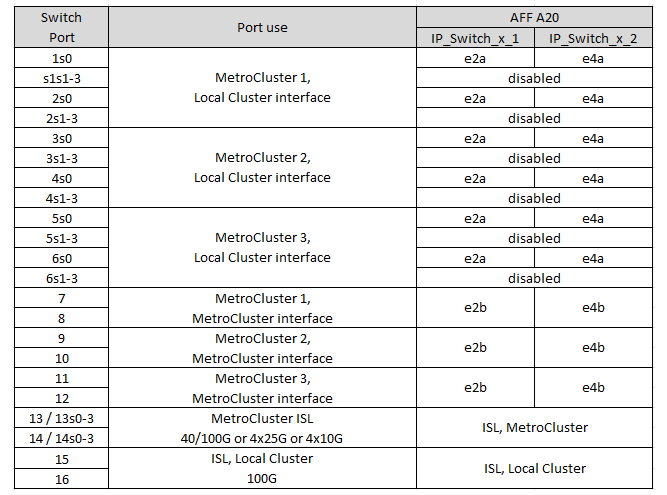
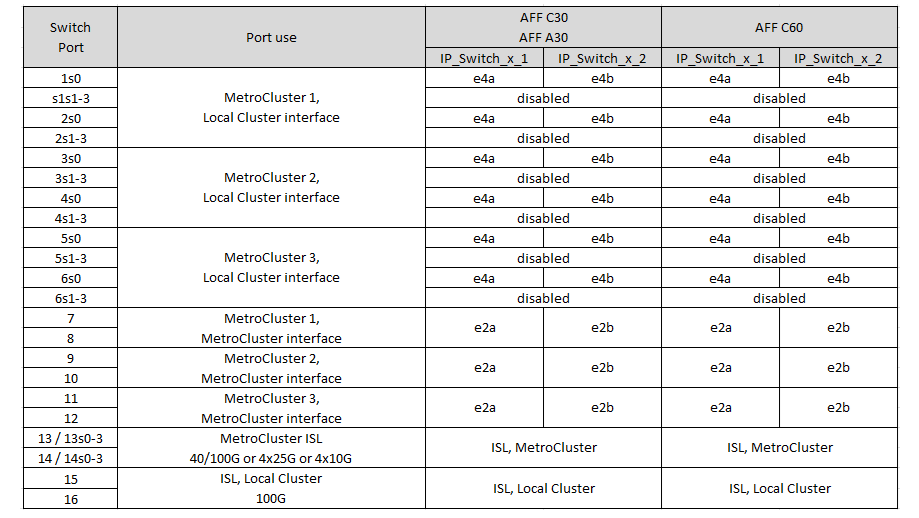
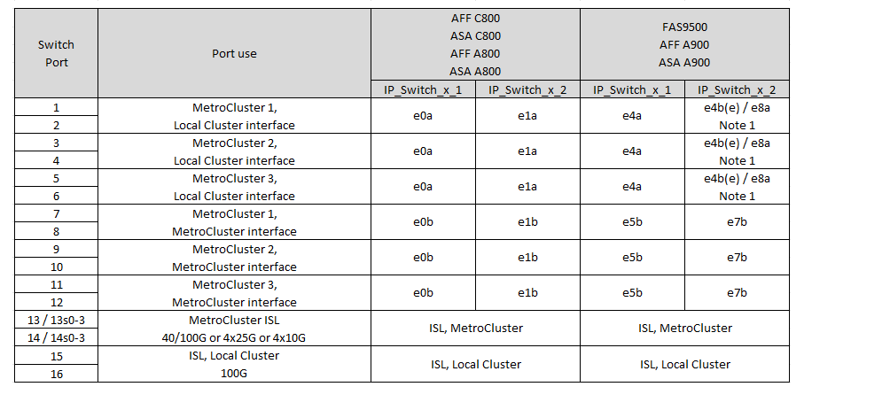
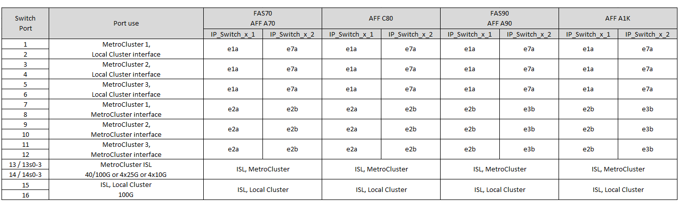

= Atribuições de porta de plataforma para switches IP SN2100 compatíveis com NVIDIA
:allow-uri-read: 
:icons: font
:imagesdir: ../media/

[role="lead"]
O uso da porta em uma configuração IP do MetroCluster depende do modelo do switch e do tipo de plataforma.

Revise as seguintes considerações antes de usar as tabelas de configuração:

* A conexão de configurações de MetroCluster de oito ou dois nós requer o ONTAP 9.14,1 ou posterior e o arquivo RCF versão 2,00 ou posterior.
+

NOTE: A versão do arquivo RCF é diferente da versão da ferramenta RCFfilegerator usada para gerar o arquivo. Por exemplo, você pode gerar um arquivo RCF versão 2,00 usando o RCFfilegerator v1,6c.

* Se você fizer o cabo de várias configurações do MetroCluster, siga a respetiva tabela. Por exemplo:
+
** Se você fizer o cabo de duas configurações MetroCluster de quatro nós do tipo AFF A700, conete o primeiro MetroCluster mostrado como "MetroCluster 1" e o segundo MetroCluster mostrado como "MetroCluster 2" na tabela AFF A700.

NOTE: As portas 13 e 14 podem ser usadas no modo de velocidade nativo que suporta 40 Gbps e 100 Gbps, ou no modo de breakout para suportar 4 x 25 Gbps ou 4 x 10 Gbps. Se eles usam o modo de velocidade nativa, eles são representados como portas 13 e 14. Se eles usam o modo breakout, 4 x 25 Gbps ou 4 x 10 Gbps, então eles são representados como portas 13s0-3 e 14s0-3.

As seções a seguir descrevem o contorno físico do cabeamento. Você também pode consultar o https://mysupport.netapp.com/site/tools/tool-eula/rcffilegenerator["RcfFileGenerator"] para obter informações detalhadas sobre cabeamento.

== Escolha a tabela de cabeamento correta para sua configuração

Use a tabela a seguir para determinar qual tabela de cabeamento você deve seguir.

[cols="2*"]
|===
| Se o seu sistema é... | Use esta tabela de cabeamento... 

 a| 
AFF A150, ASA A150

FAS500f

AFF C250, ASA C250

AFF A250, ASA A250
| <<table_1_nvidia_sn2100,Atribuições de portas da plataforma NVIDIA SN2100 (grupo 1)>> 

| AFF A20 | <<table_2_nvidia_sn2100,Atribuições de portas da plataforma NVIDIA SN2100 (grupo 2)>> 

| AFF C30, AFF A30 AFF C60 | <<table_3_nvidia_sn2100,Atribuições de portas da plataforma NVIDIA SN2100 (grupo 3)>> 

| FAS8300 AFF C400, ASA C400 AFF A400, ASA A400 FAS8700 FAS9000, AFF A700 | <<table_4_nvidia_sn2100,Atribuições de portas da plataforma NVIDIA SN2100 (grupo 4)>> 

| AFF A50 | <<table_5_nvidia_sn2100,Atribuições de portas da plataforma NVIDIA SN2100 (grupo 5)>> 

| AFF C800, ASA C800 AFF A800, ASA A800 FAS9500 AFF A900, ASA A900 | <<table_6_nvidia_sn2100,Atribuições de portas da plataforma NVIDIA SN2100 (grupo 6)>> 

| FAS70, AFF A70 AFF C80 FAS90, AFF A90 AFF A1K | <<table_7_nvidia_sn2100,Atribuições de portas da plataforma NVIDIA SN2100 (grupo 7)>> 
|===
.Atribuições de portas da plataforma NVIDIA SN2100 (grupo 1)
Revise as atribuições de portas da plataforma para enviar um sistema AFF A150, ASA A150, FAS500f, AFF C250, ASA C250, AFF A250 ou ASA A250 para um switch NVIDIA SN2100:

[#table_1_nvidia_sn2100]
image::../media/mcc-ip-cabling-aff-asa-a150-fas500f-a25-c250-MSN2100.png[Mostra atribuições de porta da plataforma NVIDIA SN2100]

.Atribuições de portas da plataforma NVIDIA SN2100 (grupo 2)
Revise as atribuições de portas da plataforma para enviar um sistema AFF A20 para um switch NVIDIA SN2100:

[#table_2_nvidia_sn2100]

.Atribuições de portas da plataforma NVIDIA SN2100 (grupo 3)
Revise as atribuições de portas da plataforma para enviar um sistema AFF C30, AFF A30 ou AFF C60 para um switch NVIDIA SN2100:

[#table_3_nvidia_sn2100]

.Atribuições de portas da plataforma NVIDIA SN2100 (grupo 4)
Revise as atribuições de portas da plataforma para enviar um sistema FAS8300, AFF C400, ASA C400, AFF A400, ASA A400, FAS8700, FAS9000 ou AFF A700 para um switch NVIDIA SN2100:

image::../media/mccip-cabling-fas8300-aff-a400-c400-a700-fas900-nvidaia-sn2100.png[Mostra atribuições de porta da plataforma NVIDIA SN2100]

*Nota 1*: Utilize as portas e4a e e4e ou e4a e e8a se estiver a utilizar um adaptador X91440A (40Gbps). Utilize as portas e4a e e4b ou e4a e e8a se estiver a utilizar um adaptador X91153A (100Gbps).

.Atribuições de portas da plataforma NVIDIA SN2100 (grupo 5)
Revise as atribuições de portas da plataforma para enviar um sistema AFF A50 para um switch NVIDIA SN2100:

[#table_5_nvidia_sn2100]
image::../media/mccip-cabling-aff-a50-nvidia-sn2100.png[Mostra atribuições de porta da plataforma NVIDIA SN2100]

.Atribuições de portas da plataforma NVIDIA SN2100 (grupo 6)
Revise as atribuições de portas da plataforma para enviar um sistema AFF C800, ASA C800, AFF A800, ASA A800, FAS9500, AFF A900 ou ASA A900 para um switch NVIDIA SN2100:

*Nota 1*: Utilize as portas e4a e e4e ou e4a e e8a se estiver a utilizar um adaptador X91440A (40Gbps). Utilize as portas e4a e e4b ou e4a e e8a se estiver a utilizar um adaptador X91153A (100Gbps).

.Atribuições de portas da plataforma NVIDIA SN2100 (grupo 7)
Reveja as atribuições de portas da plataforma para o cabo de um sistema FAS70, AFF A70, AFF C80, FAS90, AFF A90 ou AFF A1K para um switch NVIDIA SN2100:

