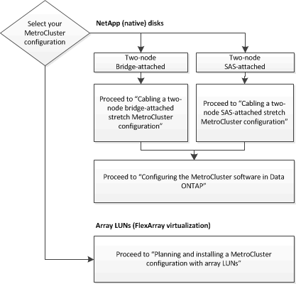

= Escolhendo o procedimento de instalação correto para sua configuração
:allow-uri-read: 
:icons: font
:imagesdir: ../media/

[role="lead"]
Você deve escolher o procedimento de instalação correto com base no uso de LUNs FlexArray e na forma como os controladores de storage se conetam às gavetas de storage.

|===

| Para este tipo de instalação... | Utilize estes procedimentos... 

 a| 
Configuração elástica de dois nós com pontes FC para SAS
 a| 
. link:task_configure_the_mcc_hardware_components_2_node_stretch_atto.html["Cabeamento de uma configuração Stretch MetroCluster de dois nós conetada em ponte"]
. link:concept_configuring_the_mcc_software_in_ontap.html["Configurando o software MetroCluster no ONTAP"]

 a| 
Configuração elástica de dois nós com cabeamento SAS de conexão direta
 a| 
. link:task_configure_the_mcc_hardware_components_2_node_stretch_sas.html["Cabeamento de uma configuração Stretch MetroCluster com conexão SAS de dois nós"]
. link:concept_configuring_the_mcc_software_in_ontap.html["Configurando o software MetroCluster no ONTAP"]

 a| 
Instalação com LUNs de array
 a| 
link:concept_stretch_mcc_configuration_with_array_luns.html["Conexões em configurações Stretch MetroCluster com LUNs de array"]

|===