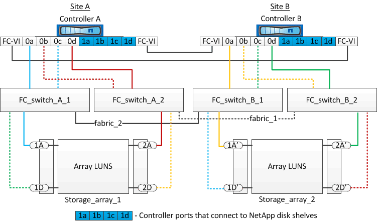

= Exemplos de configurações Stretch MetroCluster de dois nós com discos e LUNs de array
:allow-uri-read: 
:icons: font
:imagesdir: ../media/

[role="lead"]
Para configurar uma configuração Stretch MetroCluster com discos nativos e LUNs de array, você precisa usar pontes FC para SAS ou cabos óticos SAS para conectar os sistemas ONTAP às gavetas de disco. Além disso, os switches FC devem ser usados para conectar LUNs de array aos sistemas ONTAP.

É necessário um mínimo de oito portas HBA para que um sistema ONTAP se conete a discos nativos e LUNs de storage.

Nos exemplos a seguir que representam configurações de MetroCluster alongadas de dois nós com discos e LUNs de array, as portas HBA de 0a a 0d são usadas para conexão com LUNs de array. As portas HBA 1a a 1D são usadas para conexões com discos nativos.

A ilustração a seguir mostra uma configuração Stretch MetroCluster de dois nós na qual os discos nativos são conetados aos sistemas ONTAP usando cabos óticos SAS:

image::../media/two_node_mcc_combined_glowworm.gif[dois nós mcc combinado glowworm]

A ilustração a seguir mostra uma configuração Stretch MetroCluster de dois nós na qual os discos nativos são conetados aos sistemas ONTAP usando bridges FC-para-SAS:

image::../media/two_node_mcc_combined_armadillo.gif[dois nós mcc combinado tatu]

A ilustração a seguir mostra uma configuração Stretch MetroCluster de dois nós com as conexões LUN de array:

NOTE: Se necessário, você também pode usar os mesmos switches FC para conectar discos nativos e LUNs de array às controladoras na configuração MetroCluster.

https://docs.netapp.com/us-en/ontap-metrocluster/install-fc/index.html["Instalação e configuração do MetroCluster conectado à malha"]
