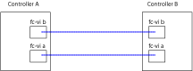

= Fazer o cabeamento das controladoras umas para as outras
:allow-uri-read: 
:icons: font
:imagesdir: ../media/

[role="lead"]
Os adaptadores FC-VI de cada controladora devem ser cabeados diretamente ao parceiro.

.Passos
. Cable as portas FC-VI.
+

+
A ilustração acima é uma representação típica do cabeamento necessário. As portas FC-VI específicas variam de acordo com o módulo do controlador.

+
** Os módulos de controladora AFF A300 e FAS8200 podem ser solicitados com uma das duas opções de conectividade FC-VI:
+
*** Portas integradas 0e e 0f configuradas no modo FC-VI.
*** Portas 1a e 1b em uma placa FC-VI no slot 1.

** Os módulos dos controladores de sistemas de storage AFF A700 e FAS9000 usam quatro portas FC-VI cada uma.

