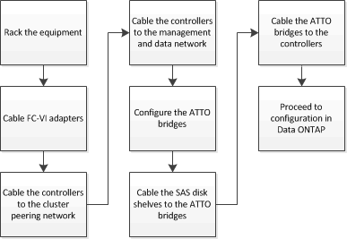

= Cable uma configuração Stretch MetroCluster com conexão em ponte de dois nós
:allow-uri-read: 
:icons: font
:imagesdir: ../media/

[role="lead"]
Os componentes do MetroCluster devem ser fisicamente instalados, cabeados e configurados em ambos os locais geográficos.

