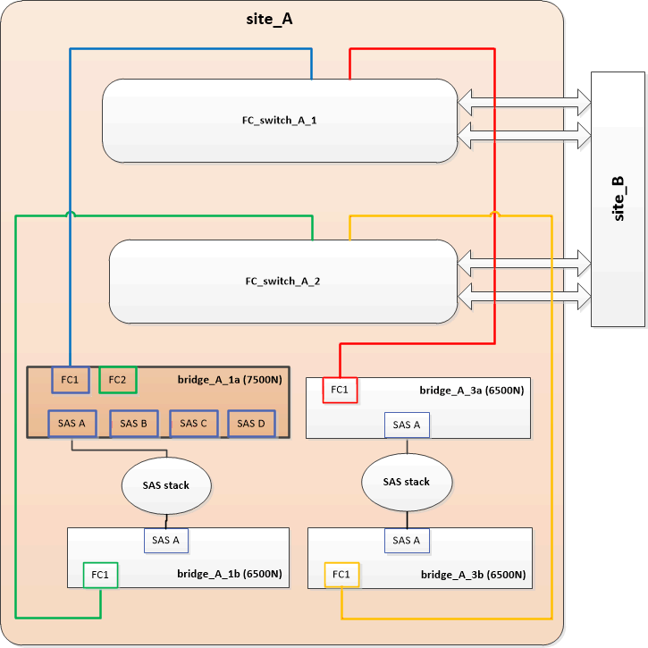
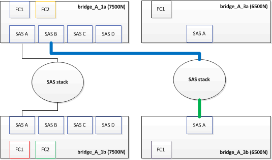
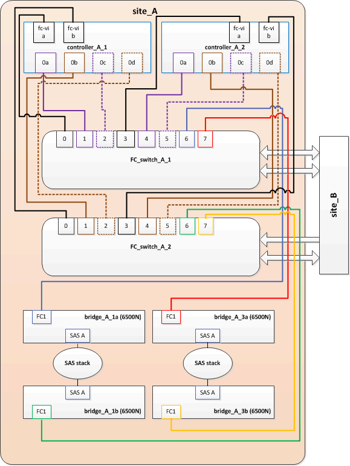

= Substituição de um par de pontes FibreBridge 6500N por pontes 7600N ou 7500N
:allow-uri-read: 
:icons: font
:imagesdir: ../media/

[role="lead"]
Para aproveitar a porta FC2 adicional nas pontes FibreBridge 7600N ou 7500N e reduzir a utilização de rack, você pode substituir 6500N pontes sem interrupções e consolidar até quatro stacks de storage atrás de um único par de pontes FibreBridge 7600N ou 7500N.

.Antes de começar
Você precisa da senha de administrador e acesso a um servidor FTP ou SCP.

.Sobre esta tarefa
Deve utilizar este procedimento se:

* Você está substituindo um par de pontes FibreBridge 6500N por pontes FibreBridge 7600N ou 7500N.
+
Após a substituição, ambas as pontes no par devem ser do mesmo modelo.

* Você substituiu anteriormente uma única ponte FibreBridge 6500N por uma ponte 7600N ou 7500N e agora está substituindo a segunda ponte no par.
* Você tem um par de bridgeBridge 7600N ou 7500N com portas SAS disponíveis e está consolidando stacks de armazenamento SAS que estão atualmente conetadas usando bridgeBridge 6500N.

Esse procedimento não causa interrupções e leva aproximadamente duas horas para ser concluído.

.Informações relacionadas
link:task_replace_a_sle_fc_to_sas_bridge.html["Substituição de uma única ponte FC para SAS"]

== Verificando a conetividade de armazenamento

Antes de substituir bridges, você deve verificar a conetividade de bridge e armazenamento. Familiarizar-se com a saída do comando permite confirmar a conetividade depois de fazer alterações na configuração.

Você pode emitir esses comandos a partir do prompt de administrador de qualquer um dos módulos do controlador na configuração do MetroCluster no site em manutenção.

. Confirme a conetividade com os discos inserindo o seguinte comando em qualquer um dos nós MetroCluster:
+
`run local sysconfig -v`

+
A saída mostra os discos conectados às portas do iniciador na controladora e identifica as gavetas conetadas às pontes FC para SAS:

+
[listing]
----

node_A_1> run local sysconfig -v
NetApp Release 9.3.2X18: Sun Dec 13 01:23:24 PST 2017
System ID: 4068741258 (node_A_1); partner ID: 4068741260 (node_B_1)
System Serial Number: 940001025471 (node_A_1)
System Rev: 70
System Storage Configuration: Multi-Path HA**<=== Configuration should be multi-path HA**
.
.
.
slot 0: FC Host Adapter 0g (QLogic 8324 rev. 2, N-port, <UP>)**<=== Initiator port**
		Firmware rev:      7.5.0
		Flash rev:         0.0.0
		Host Port Id:      0x60130
		FC Node Name:      5:00a:098201:bae312
		FC Port Name:      5:00a:098201:bae312
		SFP Vendor:        UTILITIES CORP.
		SFP Part Number:   FTLF8529P3BCVAN1
		SFP Serial Number: URQ0Q9R
		SFP Capabilities:  4, 8 or 16 Gbit
		Link Data Rate:    16 Gbit
		Switch Port:       brcd6505-fcs40:1
  **<List of disks visible to port\>**
		 ID     Vendor   Model            FW    Size
		brcd6505-fcs29:12.126L1527     : NETAPP   X302_HJUPI01TSSM NA04 847.5GB (1953525168 512B/sect)
		brcd6505-fcs29:12.126L1528     : NETAPP   X302_HJUPI01TSSA NA02 847.5GB (1953525168 512B/sect)
		.
		.
		.
		**<List of FC-to-SAS bridges visible to port\>**
		FC-to-SAS Bridge:
		brcd6505-fcs40:12.126L0        : ATTO     FibreBridge6500N 1.61  FB6500N102980
		brcd6505-fcs42:13.126L0        : ATTO     FibreBridge6500N 1.61  FB6500N102980
		brcd6505-fcs42:6.126L0         : ATTO     FibreBridge6500N 1.61  FB6500N101167
		brcd6505-fcs42:7.126L0         : ATTO     FibreBridge6500N 1.61  FB6500N102974
		.
		.
		.
  **<List of storage shelves visible to port\>**
		brcd6505-fcs40:12.shelf6: DS4243  Firmware rev. IOM3 A: 0200  IOM3 B: 0200
		brcd6505-fcs40:12.shelf8: DS4243  Firmware rev. IOM3 A: 0200  IOM3 B: 0200
		.
		.
		.
----

== Ponte FibreBridge 6500N pontes para criar um par de pontes FibreBridge 7600N ou 7500N

Para trocar a quente uma ou duas pontes FibreBridge 6500N para criar uma configuração com um par de pontes FibreBridge 7600N ou 7500N, você deve substituir as pontes uma de cada vez e seguir o procedimento de cabeamento correto. O novo cabeamento é diferente do cabeamento original.

.Sobre esta tarefa
Você também pode usar este procedimento se as seguintes condições forem verdadeiras:

* Você está substituindo um par de bridges do FibreBridge 6500N que estão conetadas à mesma pilha de armazenamento SAS.
* Você substituiu anteriormente uma ponte FibreBridge 6500N no par e sua pilha de armazenamento está configurada com uma ponte FibreBridge 6500N e uma ponte FibreBridge 7600N ou 7500N.
+
Neste caso, você deve começar com o passo abaixo para trocar a ponte FibreBridge 6500N inferior com uma ponte FibreBridge 7600N ou 7500N.

O diagrama a seguir mostra um exemplo da configuração inicial, na qual quatro bridgeBridge 6500N estão conetando duas stacks de armazenamento SAS:

image::../media/consolidating_stacks_before.gif[Consolidação de pilhas antes da substituição do FibreBridge]

.Passos
. Usando as diretrizes a seguir, troque a ponte FibreBridge 6500N superior por uma ponte FibreBridge 7600N ou 7500N usando o procedimento em link:task_replace_a_sle_fc_to_sas_bridge.html#hot_swap_6500n["Troca quente de uma ponte FibreBridge 6500N com uma ponte FibreBridge 7600N ou 7500N"]:
+
** Ligue a porta FibreBridge 7600N ou 7500N bridge FC1 ao comutador ou controlador.
+
Esta é a mesma conexão que foi feita ao porto da ponte FC1 de FibreBridge 6500N.

** Não conete a porta FibreBridge 7600N ou 7500N bridge FC2 neste momento. O diagrama a seguir mostra que bridge_A_1a foi substituída e agora é uma ponte FibreBridge 7600N ou 7500N:

+

. Confirme a conetividade com os discos conetados em ponte e se o novo FibreBridge 7500N está visível na configuração:
+
`run local sysconfig -v`

+
[listing]
----

node_A_1> run local sysconfig -v
NetApp Release 9.3.2X18: Sun Dec 13 01:23:24 PST 2015
System ID: 0536872165 (node_A_1); partner ID: 0536872141 (node_B_1)
System Serial Number: 940001025465 (node_A_1)
System Rev: 70
System Storage Configuration: Multi-Path HA**<=== Configuration should be multi-path HA**
.
.
.
slot 0: FC Host Adapter 0g (QLogic 8324 rev. 2, N-port, <UP>)**<=== Initiator port**
		Firmware rev:      7.5.0
		Flash rev:         0.0.0
		Host Port Id:      0x60100
		FC Node Name:      5:00a:098201:bae312
		FC Port Name:      5:00a:098201:bae312
		SFP Vendor:        FINISAR CORP.
		SFP Part Number:   FTLF8529P3BCVAN1
		SFP Serial Number: URQ0R1R
		SFP Capabilities:  4, 8 or 16 Gbit
		Link Data Rate:    16 Gbit
		Switch Port:       brcd6505-fcs40:1
  **<List of disks visible to port\>**
		 ID     Vendor   Model            FW    Size
		brcd6505-fcs40:12.126L1527     : NETAPP   X302_HJUPI01TSSM NA04 847.5GB (1953525168 512B/sect)
		brcd6505-fcs40:12.126L1528     : NETAPP   X302_HJUPI01TSSA NA02 847.5GB (1953525168 512B/sect)
		.
		.
		.
		**<List of FC-to-SAS bridges visible to port\>**
		FC-to-SAS Bridge:
		brcd6505-fcs40:12.126L0        : ATTO     FibreBridge7500N A30H  FB7500N100104**<===**
		brcd6505-fcs42:13.126L0        : ATTO     FibreBridge6500N 1.61  FB6500N102980
		brcd6505-fcs42:6.126L0         : ATTO     FibreBridge6500N 1.61  FB6500N101167
		brcd6505-fcs42:7.126L0         : ATTO     FibreBridge6500N 1.61  FB6500N102974
		.
		.
		.
  **<List of storage shelves visible to port\>**
		brcd6505-fcs40:12.shelf6: DS4243  Firmware rev. IOM3 A: 0200  IOM3 B: 0200
		brcd6505-fcs40:12.shelf8: DS4243  Firmware rev. IOM3 A: 0200  IOM3 B: 0200
		.
		.
		.
----
. Usando as diretrizes a seguir, troque a ponte FibreBridge 6500N inferior por uma ponte FibreBridge 7600N ou 7500N usando o procedimento em link:task_replace_a_sle_fc_to_sas_bridge.html#hot_swap_6500n["Troca quente de uma ponte FibreBridge 6500N com uma ponte FibreBridge 7600N ou 7500N"]:
+
** Ligue a porta FibreBridge 7600N ou 7500N bridge FC2 ao comutador ou controlador.
+
Esta é a mesma conexão que foi feita ao porto da ponte FC1 de FibreBridge 6500N.

** Não conecte a porta FC1 da ponte FibreBridge 7600N ou 7500N neste momento.image:../media/consolidating_stacks_2nd_7500n_in_place.gif["Consolidando pilhas com o segundo FibreBridge 7500N instalado"]

. Confirme a conetividade com os discos conetados em ponte:
+
`run local sysconfig -v`

+
A saída mostra os discos conectados às portas do iniciador na controladora e identifica as gavetas conetadas às pontes FC para SAS:

+
[listing]
----

node_A_1> run local sysconfig -v
NetApp Release 9.3.2X18: Sun Dec 13 01:23:24 PST 2015
System ID: 0536872165 (node_A_1); partner ID: 0536872141 (node_B_1)
System Serial Number: 940001025465 (node_A_1)
System Rev: 70
System Storage Configuration: Multi-Path HA**<=== Configuration should be multi-path HA**
.
.
.
slot 0: FC Host Adapter 0g (QLogic 8324 rev. 2, N-port, <UP>)**<=== Initiator port**
		Firmware rev:      7.5.0
		Flash rev:         0.0.0
		Host Port Id:      0x60100
		FC Node Name:      5:00a:098201:bae312
		FC Port Name:      5:00a:098201:bae312
		SFP Vendor:        FINISAR CORP.
		SFP Part Number:   FTLF8529P3BCVAN1
		SFP Serial Number: URQ0R1R
		SFP Capabilities:  4, 8 or 16 Gbit
		Link Data Rate:    16 Gbit
		Switch Port:       brcd6505-fcs40:1
  **<List of disks visible to port\>**
		 ID     Vendor   Model            FW    Size
		brcd6505-fcs40:12.126L1527     : NETAPP   X302_HJUPI01TSSM NA04 847.5GB (1953525168 512B/sect)
		brcd6505-fcs40:12.126L1528     : NETAPP   X302_HJUPI01TSSA NA02 847.5GB (1953525168 512B/sect)
		.
		.
		.
		**<List of FC-to-SAS bridges visible to port\>**
		FC-to-SAS Bridge:
		brcd6505-fcs40:12.126L0        : ATTO     FibreBridge7500N A30H  FB7500N100104
		brcd6505-fcs42:13.126L0        : ATTO     FibreBridge7500N A30H  FB7500N100104
		.
		.
		.
  **<List of storage shelves visible to port\>**
		brcd6505-fcs40:12.shelf6: DS4243  Firmware rev. IOM3 A: 0200  IOM3 B: 0200
		brcd6505-fcs40:12.shelf8: DS4243  Firmware rev. IOM3 A: 0200  IOM3 B: 0200
		.
		.
		.
----

== Cabeamento das portas SAS da ponte ao consolidar o armazenamento por trás das pontes FibreBridge 7600N ou 7500N

Ao consolidar várias stacks de storage SAS atrás de um único par de pontes FibreBridge 7600N ou 7500N com portas SAS disponíveis, você precisa mover os cabos SAS superior e inferior para as novas pontes.

.Sobre esta tarefa
As portas SAS da ponte FibreBridge 6500N usam conetores QSFP. As portas SAS de ponte FibreBridge 7600N ou 7500N usam conetores mini-SAS.

IMPORTANT: Se você inserir um cabo SAS na porta errada, ao remover o cabo de uma porta SAS, deverá aguardar pelo menos 120 segundos antes de conetar o cabo a uma porta SAS diferente. Se não o fizer, o sistema não reconhecerá que o cabo foi movido para outra porta.

NOTE: Aguarde pelo menos 10 segundos antes de ligar a porta. Os conetores de cabo SAS são chaveados; quando orientados corretamente para uma porta SAS, o conetor se encaixa no lugar e o LED LNK da porta SAS do compartimento de disco fica verde. Para compartimentos de disco, você insere um conetor de cabo SAS com a aba de puxar orientada para baixo (na parte inferior do conetor).

.Passos
. Remova o cabo que coneta a porta SAS A da ponte FibreBridge 6500N superior à gaveta SAS superior, certificando-se de anotar a porta SAS na gaveta de armazenamento à qual ela se coneta.
+
O cabo é mostrado em azul no exemplo a seguir:

+
image::../media/consolidating_stacks_sas_top_before.gif[Consolidação de pilhas SAS antes do cabeamento para FibreBridge 7500N]

. Usando um cabo com um conetor mini-SAS, conete a mesma porta SAS no compartimento de armazenamento à porta SAS B da ponte FibreBridge 7600N ou 7500N superior.
+
O cabo é mostrado em azul no exemplo a seguir:

+
image::../media/consolidating_stacks_sas_top_after.gif[Cabeamento superior SAS após consolidação]

. Remova o cabo que coneta a porta SAS A da ponte FibreBridge 6500N inferior à gaveta SAS superior, certificando-se de anotar a porta SAS na gaveta de armazenamento à qual ela se coneta.
+
Este cabo é apresentado a verde no seguinte exemplo:

+

. Usando um cabo com um conetor mini-SAS, conete a mesma porta SAS no compartimento de armazenamento à porta SAS B da ponte FibreBridge 7600N ou 7500N inferior.
+
Este cabo é apresentado a verde no seguinte exemplo:

+
image::../media/consolidating_stacks_sas_bottom_after.gif[Cabeamento inferior SAS após consolidação]

. Confirme a conetividade com os discos conetados em ponte:
+
`run local sysconfig -v`

+
A saída mostra os discos conectados às portas do iniciador na controladora e identifica as gavetas conetadas às pontes FC para SAS:

+
[listing]
----

node_A_1> run local sysconfig -v
NetApp Release 9.3.2X18: Sun Dec 13 01:23:24 PST 2015
System ID: 0536872165 (node_A_1); partner ID: 0536872141 (node_B_1)
System Serial Number: 940001025465 (node_A_1)
System Rev: 70
System Storage Configuration: Multi-Path HA**<=== Configuration should be multi-path HA**
.
.
.
slot 0: FC Host Adapter 0g (QLogic 8324 rev. 2, N-port, <UP>)**<=== Initiator port**
		Firmware rev:      7.5.0
		Flash rev:         0.0.0
		Host Port Id:      0x60100
		FC Node Name:      5:00a:098201:bae312
		FC Port Name:      5:00a:098201:bae312
		SFP Vendor:        FINISAR CORP.
		SFP Part Number:   FTLF8529P3BCVAN1
		SFP Serial Number: URQ0R1R
		SFP Capabilities:  4, 8 or 16 Gbit
		Link Data Rate:    16 Gbit
		Switch Port:       brcd6505-fcs40:1
  **<List of disks visible to port\>**
		 ID     Vendor   Model            FW    Size
		brcd6505-fcs40:12.126L1527     : NETAPP   X302_HJUPI01TSSM NA04 847.5GB (1953525168 512B/sect)
		brcd6505-fcs40:12.126L1528     : NETAPP   X302_HJUPI01TSSA NA02 847.5GB (1953525168 512B/sect)
		.
		.
		.
		**<List of FC-to-SAS bridges visible to port\>**
		FC-to-SAS Bridge:
		brcd6505-fcs40:12.126L0        : ATTO     FibreBridge7500N A30H  FB7500N100104
		brcd6505-fcs42:13.126L0        : ATTO     FibreBridge7500N A30H  FB7500N100104
		.
		.
		.
  **<List of storage shelves visible to port\>**
		brcd6505-fcs40:12.shelf6: DS4243  Firmware rev. IOM3 A: 0200  IOM3 B: 0200
		brcd6505-fcs40:12.shelf8: DS4243  Firmware rev. IOM3 A: 0200  IOM3 B: 0200
		.
		.
		.
----
. Remova as pontes antigas do FibreBridge 6500N que não estão mais conetadas ao armazenamento SAS.
. Aguarde dois minutos para que o sistema reconheça as alterações.
. Se o sistema tiver sido cabeado incorretamente, remova o cabo, corrija o cabeamento e, em seguida, reconete o cabo correto.
. Se necessário, repita as etapas anteriores para mover até duas stacks SAS adicionais atrás das novas bridges 7600N ou 7500N do FibreBridge, usando as portas SAS C e d..
+
Cada pilha SAS deve ser conetada à mesma porta SAS na ponte superior e inferior. Por exemplo, se a conexão superior da pilha estiver conetada à porta SAS B da ponte superior, a conexão inferior deverá ser conetada à porta SAS B da ponte inferior.

+
image::../media/consolidation_sas_bottom_connection_4_stacks.gif[Cabeamento inferior SAS para quatro pilhas]

== Atualizando zoneamento ao adicionar bridgeBridge 7600N ou 7500N bridges a uma configuração

O zoneamento deve ser alterado quando você estiver substituindo as pontes FibreBridge 6500N por pontes FibreBridge 7600N ou 7500N e usando ambas as portas FC nas pontes FibreBridge 7600N ou 7500N. As alterações necessárias dependem se você está executando uma versão do ONTAP anterior a 9,1 ou 9,1 e posterior.

=== Atualizando o zoneamento ao adicionar bridgeBridge 7500N a uma configuração (antes do ONTAP 9.1)

O zoneamento deve ser alterado quando você estiver substituindo as pontes FibreBridge 6500N por pontes FibreBridge 7500N e usando ambas as portas FC nas pontes FibreBridge 7500N. Cada zona não pode ter mais de quatro portas de iniciador. O zoneamento que você usa depende se você está executando o ONTAP antes da versão 9,1 ou 9,1 e posterior

.Sobre esta tarefa
O zoneamento específico nesta tarefa é para versões do ONTAP anteriores à versão 9,1.

As alterações de zoneamento são necessárias para evitar problemas com o ONTAP, o que requer que não mais de quatro portas de iniciador FC possam ter um caminho para um disco. Após a desativação para consolidar as gavetas, o zoneamento existente resultaria em cada disco ser acessível por oito portas FC. Você deve alterar o zoneamento para reduzir as portas do iniciador em cada zona para quatro.

O diagrama a seguir mostra o zoneamento no site_A antes das alterações:

.Passos
. Atualize as zonas de armazenamento dos switches FC removendo metade das portas do iniciador de cada zona existente e criando novas zonas para as portas do FibreBridge 7500N FC2.
+
As zonas para as novas portas FC2 conterão as portas do iniciador removidas das zonas existentes. Nos diagramas, estas zonas são apresentadas com linhas tracejadas.

+
Para obter detalhes sobre os comandos de zoneamento, consulte as seções de switch FC do link:../install-fc/index.html["Instalação e configuração do MetroCluster conectado à malha"] ou link:../install-stretch/concept_considerations_differences.html["Instalação e configuração do Stretch MetroCluster"].

+
Os exemplos a seguir mostram as zonas de armazenamento e as portas em cada zona antes e depois da consolidação. As portas são identificadas por _domain, port_ pairs.

+
** O domínio 5 consiste no switch FC_switch_A_1.
** O domínio 6 consiste no switch FC_switch_A_2.
** O domínio 7 consiste no switch FC_switch_B_1.
** O domínio 8 consiste no switch FC_switch_B_2.

|===

| Antes ou depois da consolidação | Zona | Domínios e portas | Cores nos diagramas (os diagramas mostram apenas o local A) 

 a| 
Zonas antes da consolidação. Há uma zona para cada porta FC nas quatro pontes FibreBridge 6500N.
 a| 
STOR_A_1a-FC1
 a| 
5,1; 5,2; 5,4; 5,5; 7,1; 7,2; 7,4; 7,5; 5,6
 a| 
Roxo, roxo e azul

 a| 
STOR_A_1b-FC1
 a| 
6,1; 6,2; 6,4; 6,5; 8,1; 8,2; 8,4; 8,5; 6,6
 a| 
Castanho e castanho tracejado e verde

 a| 
STOR_A_2a-FC1
 a| 
5,1; 5,2; 5,4; 5,5; 7,1; 7,2; 7,4; 7,5; 5,7
 a| 
Roxo e vermelho

 a| 
STOR_A_2b-FC1
 a| 
6,1; 6,2; 6,4; 6,5; 8,1; 8,2; 8,4; 8,5; 6,7
 a| 
Castanho e castanho tracejado e laranja

 a| 
Zonas após a consolidação. Há uma zona para cada porta FC nas duas pontes FibreBridge 7500N.
 a| 
STOR_A_1a-FC1
 a| 
7,1; 7,4; 5,1; 5,4; 5,6
 a| 
Roxo e azul

 a| 
STOR_A_1b-FC1
 a| 
7,2; 7,5; 5,2; 5,5; 5,7
 a| 
Puré roxo e vermelho

 a| 
STOR_A_1a-FC2
 a| 
8,1; 8,4; 6,1; 6,4; 6,6
 a| 
Castanho e verde

 a| 
STOR_A_1b-FC2
 a| 
8,2; 8,5; 6,2; 6,5; 6,7
 a| 
Castanho tracejado e laranja

|===
O diagrama a seguir mostra zoneamento no site_A após a consolidação:

image::../media/zoning_consolidation_site_a_after.gif[Consolidação de zoneamento no local A após mudanças na FibreBridge]

=== Atualizando zoneamento ao adicionar bridgeBridge 7600N ou 7500N bridges a uma configuração (ONTAP 9.1 e posterior)

O zoneamento deve ser alterado quando você estiver substituindo as pontes FibreBridge 6500N por pontes FibreBridge 7600N ou 7500N e usando ambas as portas FC nas pontes FibreBridge 7600N ou 7500N. Cada zona não pode ter mais de quatro portas de iniciador.

.Sobre esta tarefa
* Esta tarefa aplica-se ao ONTAP 9.1 e posterior.
* As pontes FibreBridge 7600N são suportadas no ONTAP 9.6 e posterior.
* O zoneamento específico nesta tarefa é para o ONTAP 9.1 e posterior.
* As alterações de zoneamento são necessárias para evitar problemas com o ONTAP, o que requer que não mais de quatro portas de iniciador FC possam ter um caminho para um disco.
+
Após a desativação para consolidar as gavetas, o zoneamento existente resultaria em cada disco ser acessível por oito portas FC. Você deve alterar o zoneamento para reduzir as portas do iniciador em cada zona para quatro.

.Passo
. Atualize as zonas de armazenamento dos switches FC removendo metade das portas do iniciador de cada zona existente e criando novas zonas para as portas FibreBridge 7600N ou 7500N FC2.
+
As zonas para as novas portas FC2 conterão as portas do iniciador removidas das zonas existentes.

+
Consulte a seção de switch FC de link:../install-fc/index.html["Instalação e configuração do MetroCluster conectado à malha"] para obter detalhes sobre os comandos de zoneamento.

== Fazer o cabeamento da segunda porta FC de ponte ao adicionar pontes FibreBridge 7600N ou 7500N a uma configuração

Para fornecer vários caminhos para as stacks de storage, você pode fazer o cabeamento da segunda porta FC em cada bridge do FibreBridge 7600N ou 7500N quando tiver adicionado a ponte FibreBridge 7600N ou 7500N à sua configuração.

.Antes de começar
O zoneamento deve ter sido ajustado para fornecer zonas para as segundas portas FC.

.Passos
. Faça o cabo da porta FC2 da ponte superior para a porta correta no FC_switch_A_2.
+
image::../media/consolidating_stacks_sas_ports_recabled.gif[Cabeamento da porta FC2 após consolidação para FC_switch_A_2]

. Faça o cabo da porta FC1 da ponte inferior para a porta correta em FC_switch_A_1.
+
image::../media/consolidating_stacks_final.gif[Cabeamento de consolidação de pilha final]

. Confirme a conetividade com os discos conetados em ponte:
+
`run local sysconfig -v`

+
A saída mostra os discos conectados às portas do iniciador na controladora e identifica as gavetas conetadas às pontes FC para SAS:

+
[listing]
----

node_A_1> run local sysconfig -v
NetApp Release 9.3.2X18: Sun Dec 13 01:23:24 PST 2015
System ID: 0536872165 (node_A_1); partner ID: 0536872141 (node_B_1)
System Serial Number: 940001025465 (node_A_1)
System Rev: 70
System Storage Configuration: Multi-Path HA**<=== Configuration should be multi-path HA**
.
.
.
slot 0: FC Host Adapter 0g (QLogic 8324 rev. 2, N-port, <UP>)**<=== Initiator port**
		Firmware rev:      7.5.0
		Flash rev:         0.0.0
		Host Port Id:      0x60100
		FC Node Name:      5:00a:098201:bae312
		FC Port Name:      5:00a:098201:bae312
		SFP Vendor:        FINISAR CORP.
		SFP Part Number:   FTLF8529P3BCVAN1
		SFP Serial Number: URQ0R1R
		SFP Capabilities:  4, 8 or 16 Gbit
		Link Data Rate:    16 Gbit
		Switch Port:       brcd6505-fcs40:1
  **<List of disks visible to port\>**
		 ID     Vendor   Model            FW    Size
		brcd6505-fcs40:12.126L1527     : NETAPP   X302_HJUPI01TSSM NA04 847.5GB (1953525168 512B/sect)
		brcd6505-fcs40:12.126L1528     : NETAPP   X302_HJUPI01TSSA NA02 847.5GB (1953525168 512B/sect)
		.
		.
		.
		**<List of FC-to-SAS bridges visible to port\>**
		FC-to-SAS Bridge:
		brcd6505-fcs40:12.126L0        : ATTO     FibreBridge7500N A30H  FB7500N100104
		brcd6505-fcs42:13.126L0        : ATTO     FibreBridge7500N A30H  FB7500N100104
		.
		.
		.
  **<List of storage shelves visible to port\>**
		brcd6505-fcs40:12.shelf6: DS4243  Firmware rev. IOM3 A: 0200  IOM3 B: 0200
		brcd6505-fcs40:12.shelf8: DS4243  Firmware rev. IOM3 A: 0200  IOM3 B: 0200
		.
		.
		.
----

== Desativação de portas SAS não usadas nas pontes FC para SAS

Depois de fazer alterações de cabeamento na ponte, você deve desativar todas as portas SAS não utilizadas em pontes FC para SAS para evitar alertas de monitor de integridade relacionados às portas não utilizadas.

.Passos
. Desative portas SAS não utilizadas na ponte FC para SAS superior:
+
.. Faça login na ponte CLI.
.. Desative quaisquer portas não utilizadas.
+
[NOTE]
====
Se você tiver configurado uma ponte ATTO 7500N, todas as portas SAS (A a D) serão ativadas por padrão e você deverá desativar as portas SAS que não estão sendo usadas:

`SASPortDisable _sas port_`

====
+
Se as portas SAS A e B forem usadas, as portas SAS C e D devem ser desativadas. No exemplo a seguir, as portas SAS C e D não utilizadas são desativadas:

+
[listing]
----
Ready. *
SASPortDisable C

SAS Port C has been disabled.

Ready. *
SASPortDisable D

SAS Port D has been disabled.

Ready. *
----
.. Salve a configuração da ponte
`SaveConfiguration`
+
O exemplo a seguir mostra que as portas SAS C e D foram desativadas. Observe que o asterisco não aparece mais, indicando que a configuração foi salva.

+
[listing]
----
Ready. *
SaveConfiguration

Ready.
----

. Repita a etapa anterior na ponte FC-para-SAS inferior.

