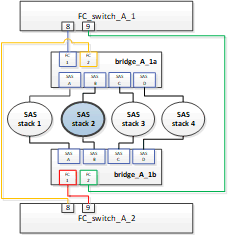

= Substituição de uma gaveta sem interrupções em uma configuração MetroCluster conectada à malha
:allow-uri-read: 
:icons: font
:imagesdir: ../media/

[role="lead"]
Talvez seja necessário saber como substituir uma gaveta sem interrupções em uma configuração MetroCluster conectada à malha.

NOTE: Este procedimento é apenas para uso em uma configuração MetroCluster conetada à malha.

== Desativando o acesso ao compartimento

Você deve desativar o acesso ao compartimento antes de substituir os módulos do compartimento.

Verifique a integridade geral da configuração. Se o sistema não parecer saudável, aborde o problema primeiro antes de prosseguir.

.Passos
. Em ambos os clusters, todos os plexos off-line com discos na pilha de gaveta afetada:
+
`aggr offline _plex_name_`

+
O exemplo mostra os comandos para offlining plexes para um controlador que executa o ONTAP.

+
[listing]
----

cluster_A_1::> storage aggregate plex offline -aggr aggrA_1_0 -plex plex0
cluster_A_1::> storage aggregate plex offline -aggr dataA_1_data -plex plex0
cluster_A_2::> storage aggregate plex offline -aggr aggrA_2_0 -plex plex0
cluster_A_2::> storage aggregate plex offline -aggr dataA_2_data -plex plex0
----
. Verifique se os plexes estão offline:
+
`aggr status _-raggr_name_`

+
O exemplo mostra os comandos para verificar se os agregados estão offline para uma controladora executando o cMode.

+
[listing]
----

Cluster_A_1::> storage aggregate show -aggr aggrA_1_0
Cluster_A_1::> storage aggregate show -aggr dataA_1_data
Cluster_A_2::> storage aggregate show -aggr aggrA_2_0
Cluster_A_2::> storage aggregate show -aggr dataA_2_data
----
. Desative as portas SAS ou as portas do switch dependendo se as pontes que conetam o compartimento de destino estão conetando uma única pilha SAS ou duas ou mais pilhas SAS:
+
** Se as bridges estiverem conetando uma única pilha SAS, desative as portas do switch às quais as bridges estão conetadas usando o comando apropriado para o switch.
+
O exemplo a seguir mostra um par de bridges que conetam uma única pilha SAS, que contém o compartimento de destino:

+
image::../media/mcc_shelf_replacement_bridges_with_a_single_stack.gif[pontes de substituição de prateleira mcc com uma única pilha]

+
As portas de switch 8 e 9 em cada switch conetam as pontes à rede.

+
O exemplo a seguir mostra as portas 8 e 9 sendo desativadas em um switch Brocade.

+
[listing]
----
FC_switch_A_1:admin> portDisable 8
FC_switch_A_1:admin> portDisable 9

FC_switch_A_2:admin> portDisable 8
FC_switch_A_2:admin> portDisable 9
----
+
O exemplo a seguir mostra as portas 8 e 9 sendo desativadas em um switch Cisco.

+
[listing]
----
FC_switch_A_1# conf t
FC_switch_A_1(config)# int fc1/8
FC_switch_A_1(config)# shut
FC_switch_A_1(config)# int fc1/9
FC_switch_A_1(config)# shut
FC_switch_A_1(config)# end

FC_switch_A_2# conf t
FC_switch_A_2(config)# int fc1/8
FC_switch_A_2(config)# shut
FC_switch_A_2(config)# int fc1/9
FC_switch_A_2(config)# shut
FC_switch_A_2(config)# end
----
** Se as bridges estiverem conetando duas ou mais pilhas SAS, desative as portas SAS conetando as bridges ao compartimento de destino
`SASportDisable _port number_`
+
O exemplo a seguir mostra um par de bridges que conetam quatro stacks SAS. A pilha SAS 2 contém o compartimento de destino:

+

+
A porta SAS B coneta as pontes ao compartimento de destino. Ao desativar apenas a porta B SAS em ambas as gavetas, as outras stacks SAS podem continuar fornecendo dados durante o procedimento de substituição.

+
Nesse caso, desative a porta SAS conetando a ponte ao compartimento de destino:

+
`SASportDisable _port number_`

+
O exemplo a seguir mostra que a porta SAS B está sendo desativada da ponte e também verifica se ela está desativada. Você deve repetir o comando em ambas as pontes.

+
[listing]
----
Ready. *
SASPortDisable B

SAS Port B has been disabled.
----

. Se você desativou anteriormente as portas do switch, verifique se elas estão desativadas:
+
`switchShow`

+
O exemplo mostra que as portas do switch estão desativadas em um switch Brocade.

+
[listing]
----

FC_switch_A_1:admin> switchShow
FC_switch_A_2:admin> switchShow
----
+
O exemplo mostra que as portas do switch estão desativadas em um switch Cisco.

+
[listing]
----

FC_switch_A_1# show interface fc1/6
FC_switch_A_2# show interface fc1/6
----
. Aguarde que o ONTAP perceba que o disco está faltando.
. Desligue a gaveta que você deseja substituir.

== Substituição da prateleira

Você precisa remover fisicamente todos os cabos e a gaveta antes de inserir e fazer o cabeamento dos novos módulos de gaveta e gaveta.

.Passos
. Remova todos os discos e desconete todos os cabos da prateleira que está sendo substituída.
. Retire os módulos das prateleiras.
. Insira a nova prateleira.
. Insira os novos discos na nova gaveta.
. Insira os módulos das prateleiras.
. Cable a gaveta (SAS ou alimentação).
. Ligue a prateleira.

== Reativando o acesso e verificando a operação

Após a substituição do compartimento, você precisa reativar o acesso e verificar se o novo compartimento está funcionando corretamente.

.Passos
. Verifique se a gaveta é alimentada corretamente e se os links nos módulos IOM estão presentes.
. Ative as portas do switch ou a porta SAS de acordo com os seguintes cenários:
+
[cols="1,3"]
|===

| Opção | Passo 

 a| 
*Se você desativou anteriormente as portas do switch*
 a| 
.. Ativar as portas do switch:
+
`portEnable _port number_`

+
O exemplo mostra a porta do switch sendo ativada em um switch Brocade.

+
[listing]
----

Switch_A_1:admin> portEnable 6
Switch_A_2:admin> portEnable 6
----
+
O exemplo mostra a porta do switch sendo ativada em um switch Cisco.

+
[listing]
----

Switch_A_1# conf t
Switch_A_1(config)# int fc1/6
Switch_A_1(config)# no shut
Switch_A_1(config)# end

Switch_A_2# conf t
Switch_A_2(config)# int fc1/6
Switch_A_2(config)# no shut
Switch_A_2(config)# end
----

 a| 
*Se você desativou anteriormente uma porta SAS*
 a| 
.. Habilite a porta SAS conetando a pilha ao local do compartimento:
+
`SASportEnable _port number_`

+
O exemplo mostra que a porta SAS A está sendo ativada a partir da ponte e também verifica se ela está ativada.

+
[listing]
----
Ready. *
SASPortEnable A

SAS Port A has been enabled.
----

|===
. Se você desativou anteriormente as portas do switch, verifique se elas estão ativadas e on-line e se todos os dispositivos estão conetados corretamente:
+
`switchShow`

+
O exemplo mostra o `switchShow` comando para verificar se um switch Brocade está on-line.

+
[listing]
----

Switch_A_1:admin> SwitchShow
Switch_A_2:admin> SwitchShow
----
+
O exemplo mostra o `switchShow` comando para verificar se um switch Cisco está on-line.

+
[listing]
----

Switch_A_1# show interface fc1/6
Switch_A_2# show interface fc1/6
----
+

NOTE: Após vários minutos, o ONTAP deteta que novos discos foram inseridos e exibe uma mensagem para cada novo disco.

. Verifique se os discos foram detetados pelo ONTAP:
+
`sysconfig -a`

. Online os plexes que estavam offline anteriormente:
+
`aggr online__plex_name__`

+
O exemplo mostra os comandos para colocar plexes em um controlador executando cMode de volta on-line.

+
[listing]
----

Cluster_A_1::> storage aggregate plex online -aggr aggr1 -plex plex2
Cluster_A_1::> storage aggregate plex online -aggr aggr2 -plex plex6
Cluster_A_1::> storage aggregate plex online -aggr aggr3 -plex plex1
----
+
Os plexos começam a ressincronizar.

+

NOTE: Você pode monitorar o progresso da ressincronização usando o `aggr status _-raggr_name_` comando.

