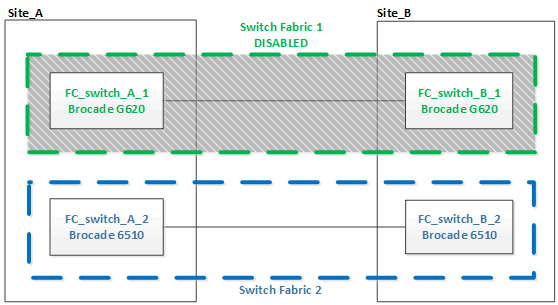

= Atualização para novos switches Brocade FC
:allow-uri-read: 
:icons: font
:imagesdir: ../media/

[role="lead"]
Se estiver atualizando para novos switches Brocade FC, substitua os switches na primeira malha, verifique se a configuração MetroCluster está totalmente operacional e substitua os switches na segunda malha.

* A configuração do MetroCluster deve estar em bom estado e em funcionamento normal.
* As malhas de switch MetroCluster consistem em quatro switches Brocade.
+
As ilustrações nos passos seguintes mostram os interrutores atuais.

* Os switches devem estar executando o firmware suportado mais recente.
+
https://mysupport.netapp.com/matrix["Ferramenta de Matriz de interoperabilidade do NetApp"^]

* Esse procedimento não causa interrupções e leva aproximadamente duas horas para ser concluído.
* Você precisa da senha de administrador e acesso a um servidor FTP ou SCP.
* link:enable-console-logging-before-maintenance.html["Ativar o registo da consola"] antes de executar esta tarefa.

Os tecidos de troca são atualizados um de cada vez.

No final deste procedimento, todos os quatro interrutores serão atualizados para novos interrutores.

image::../media/brocade_upgr_to_g620_replacement_completed.gif[atualização do Brocade para a substituição g620 concluída]

.Passos
. Desative o primeiro tecido do switch:
+
`*FC_switch_A_1:admin> switchCfgPersistentDisable*`

+
[listing]
----
FC_switch_A_1:admin> switchCfgPersistentDisable
----
+
image::../media/brocade_upgr_to_g620_fab_1_down.gif[Brocade upgr para g620 fab 1 para baixo]

. Substitua os interrutores antigos em um local do MetroCluster.
+
.. Solte o cabo e retire o interrutor desativado.
.. Instale o novo interrutor no rack.
+
image::../media/brocade_upgr_to_g620_replaced_a_1.gif[Brocade upgr para g620 substituiu um 1]

.. Desative os novos switches executando o seguinte comando em ambos os switches:
+
`switchCfgPersistentDisable`

+
[listing]
----
FC_switch_A_1:admin> switchCfgPersistentDisable
----
.. Faça o cabo do novo switch usando as atribuições de portas recomendadas.
+
link:concept_port_assignments_for_fc_switches_when_using_ontap_9_1_and_later.html["Atribuições de portas para switches FC"]

.. Repita essas subetapas no site do parceiro MetroCluster para substituir o segundo switch na primeira malha de switch.
+
Ambos os switches na malha 1 foram substituídos.

+

. Ligue os novos interrutores e deixe-os arrancar.
. Configure os switches Brocade FC usando um dos seguintes procedimentos:
+
link:../install-fc/task_reset_the_brocade_fc_switch_to_factory_defaults.html["Configurar switches Brocade FC com arquivos RCF"]

+
link:../install-fc/task_fcsw_brocade_configure_the_brocade_fc_switches_supertask.html["Configure os switches Brocade FC manualmente"]

. Guardar a configuração do interrutor:
+
`cfgSave`

. Aguarde 10 minutos para que a configuração se estabilize.
. Confirme a conetividade com os discos inserindo o seguinte comando em qualquer um dos nós MetroCluster:
+
`run local sysconfig -v`

+
A saída mostra os discos conectados às portas do iniciador na controladora e identifica as gavetas conetadas às pontes FC para SAS:

+
[listing]
----

node_A_1> run local sysconfig -v
NetApp Release 9.3.2X18: Sun Dec 13 01:23:24 PST 2017
System ID: 4068741258 (node_A_1); partner ID: 4068741260 (node_B_1)
System Serial Number: 940001025471 (node_A_1)
System Rev: 70
System Storage Configuration: Multi-Path HA**<=== Configuration should be multi-path HA**
.
.
.
slot 0: FC Host Adapter 0g (QLogic 8324 rev. 2, N-port, <UP>)**<=== Initiator port**
		Firmware rev:      7.5.0
		Flash rev:         0.0.0
		Host Port Id:      0x60130
		FC Node Name:      5:00a:098201:bae312
		FC Port Name:      5:00a:098201:bae312
		SFP Vendor:        UTILITIES CORP.
		SFP Part Number:   FTLF8529P3BCVAN1
		SFP Serial Number: URQ0Q9R
		SFP Capabilities:  4, 8 or 16 Gbit
		Link Data Rate:    16 Gbit
		Switch Port:       brcd6505-fcs40:1
  **<List of disks visible to port\>**
		 ID     Vendor   Model            FW    Size
		brcd6505-fcs29:12.126L1527     : NETAPP   X302_HJUPI01TSSM NA04 847.5GB (1953525168 512B/sect)
		brcd6505-fcs29:12.126L1528     : NETAPP   X302_HJUPI01TSSA NA02 847.5GB (1953525168 512B/sect)
		.
		.
		.
		**<List of FC-to-SAS bridges visible to port\>**
		FC-to-SAS Bridge:
		brcd6505-fcs40:12.126L0        : ATTO     FibreBridge6500N 1.61  FB6500N102980
		brcd6505-fcs42:13.126L0        : ATTO     FibreBridge6500N 1.61  FB6500N102980
		brcd6505-fcs42:6.126L0         : ATTO     FibreBridge6500N 1.61  FB6500N101167
		brcd6505-fcs42:7.126L0         : ATTO     FibreBridge6500N 1.61  FB6500N102974
		.
		.
		.
  **<List of storage shelves visible to port\>**
		brcd6505-fcs40:12.shelf6: DS4243  Firmware rev. IOM3 A: 0200  IOM3 B: 0200
		brcd6505-fcs40:12.shelf8: DS4243  Firmware rev. IOM3 A: 0200  IOM3 B: 0200
		.
		.
		.
----
. Voltando ao prompt do switch, verifique a versão do firmware do switch:
+
`firmwareShow`

+
Os switches devem estar executando o firmware suportado mais recente.

+
https://mysupport.netapp.com/matrix["Ferramenta de Matriz de interoperabilidade do NetApp"]

. Simular uma operação de comutação:
+
.. A partir do prompt de qualquer nó, altere para o nível de privilégio avançado
`set -privilege advanced`
+
Você precisa responder com "'y'" quando solicitado para continuar no modo avançado e ver o prompt do modo avançado (*>).

.. Efectuar a operação de comutação com o `-simulate` parâmetro:
+
`metrocluster switchover -simulate`

.. Voltar ao nível de privilégio de administrador:
+
`set -privilege admin`

. Repita os passos anteriores no segundo tecido do interrutor.

Depois de repetir as etapas, todos os quatro switches foram atualizados e a configuração do MetroCluster está em operação normal.

image::../media/brocade_upgr_to_g620_replacement_completed.gif[atualização do Brocade para a substituição g620 concluída]
