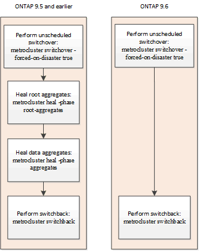

= Compreender a proteção de dados e a recuperação de desastres da MetroCluster
:allow-uri-read: 
:icons: font
:imagesdir: ../media/

[role="lead"]
É útil entender como o MetroCluster protege os dados e fornece recuperação transparente contra falhas para que você possa gerenciar suas atividades de switchover e comutação de forma fácil e eficiente.

O MetroCluster usa o espelhamento para proteger os dados em um cluster. Ele fornece recuperação de desastres por meio de um único comando MetroCluster que ativa um secundário no site de sobreviventes para atender aos dados espelhados originalmente de um local principal afetado por desastre.

== Como as configurações do MetroCluster de oito e quatro nós fornecem failover e switchover locais

As configurações de MetroCluster de oito e quatro nós protegem os dados em nível local e no nível do cluster. Se você estiver configurando uma configuração do MetroCluster, precisará saber como as configurações do MetroCluster protegem seus dados.

As configurações do MetroCluster protegem os dados usando dois clusters espelhados separados fisicamente. Cada cluster espelha de forma síncrona a configuração de máquina virtual de storage e dados (SVM) do outro. Quando um desastre ocorre em um local, o administrador pode ativar o SVM espelhado e começar a fornecer os dados espelhados do local que sobreviveu. Além disso, os nós em cada cluster são configurados como um par de HA, fornecendo um nível de failover local.

=== Como a proteção de dados de HA local funciona em uma configuração do MetroCluster

Você precisa entender como os pares de HA funcionam na configuração do MetroCluster.

Os dois clusters na rede com peering fornecem recuperação de desastres bidirecional, onde cada cluster pode ser a origem e o backup do outro cluster. Cada cluster inclui dois nós, que são configurados como um par de HA. Em caso de falha ou manutenção necessária na configuração de um único nó, o failover de storage pode transferir as operações desse nó para seu parceiro de HA local.

A ilustração a seguir mostra uma configuração MetroCluster FC. A funcionalidade de HA é a mesma nas configurações IP do MetroCluster, exceto que a interconexão de HA é fornecida pelos switches do cluster.

image::../media/mcc_hw_architecture_local_ha.gif[arquitetura de hardware mcc local ha]

.Informações relacionadas
link:https://docs.netapp.com/us-en/ontap/high-availability/index.html["Configuração de alta disponibilidade"^]

== Como as configurações do MetroCluster fornecem replicação de dados e configuração

As configurações do MetroCluster usam vários recursos do ONTAP para fornecer replicação síncrona de dados e configuração entre os dois locais do MetroCluster.

=== Proteção de configuração com o serviço de replicação de configuração

O CRS (serviço de replicação de configuração) do ONTAP protege a configuração do MetroCluster replicando automaticamente as informações para o parceiro DR.

O CRS replica de forma síncrona a configuração do nó local para o parceiro de DR no cluster de parceiros. Essa replicação é realizada pela rede de peering de cluster.

As informações replicadas incluem a configuração de cluster e a configuração SVM.

=== Replicação de SVMs durante as operações do MetroCluster

O CRS (serviço de replicação de configuração) do ONTAP fornece configuração redundante de servidor de dados e espelhamento de volumes de dados pertencentes ao SVM. Se ocorrer um switchover, a SVM de origem será reduzida e o SVM de destino, localizado no cluster sobrevivente, ficará ativo.

NOTE: Os SVMs de destino na configuração do MetroCluster têm o sufixo "'-mc" automaticamente anexado ao seu nome para ajudar a identificá-los. Uma configuração MetroCluster anexa o sufixo "'-mc" ao nome dos SVMs de destino, se o nome da SVM contiver um ponto, o sufixo "'-mc" é aplicado antes do primeiro período. Por exemplo, se o nome do SVM for SVM.DNS.NAME, o sufixo "'-mc" será anexado como SVM-MC.DNS.NAME.

O exemplo a seguir mostra os SVMs para uma configuração do MetroCluster, em que "'SVM_cluster_A'" é um SVM no local de origem e "'SVM_cluster_A-mc'" é um agregado de destino de sincronização no local de recuperação de desastres.

* SVM_cluster_A serve dados no cluster A..
+
Ele é uma SVM de origem sincronizada que representa a configuração (LIFs, protocolos e serviços) e os dados em volumes pertencentes ao SVM. A configuração e os dados são replicados para SVM_cluster_A-mc, um SVM de destino de sincronização localizado no cluster B.

* SVM_cluster_B serve dados no cluster B..
+
É um SVM de origem sincronizada que representa a configuração e os dados do SVM_cluster_B-mc localizado no cluster A..

* SVM_cluster_B-mc é um SVM de destino de sincronização que é interrompido durante a operação normal e saudável da configuração do MetroCluster.
+
Em um switchover bem-sucedido do cluster B para o cluster A, SVM_cluster_B é interrompido e SVM_cluster_B-mc é ativado e começa a fornecer dados do cluster A.

* SVM_cluster_A-mc é um SVM de destino de sincronização que é interrompido durante a operação normal e saudável da configuração do MetroCluster.
+
Em um switchover bem-sucedido do cluster A para o cluster B, o SVM_cluster_A é interrompido e o SVM_cluster_A-mc é ativado e começa a fornecer dados do cluster B.

image::../media/mcc_mirroring_of_svms.gif[espelhamento mcc de svms]

Se ocorrer um switchover, o Plex remoto no cluster sobrevivente fica on-line e o SVM secundário começa a fornecer os dados.

image::../media/mcc_svms_after_switchover.gif[mcc svms após comutação]

A disponibilidade de plexes remotos após o switchover depende do tipo de configuração do MetroCluster:

* Para configurações MetroCluster FC, após o switchover, os plexos locais e remotos permanecem on-line se o storage no local de desastre estiver acessível por meio de ISLs.
+
Se os ISLs tiverem falhado e o storage do local de desastre não estiver disponível, o SVM de destino de sincronização começará a fornecer dados do local que sobreviveu.

* Para configurações IP do MetroCluster, a disponibilidade dos plexes remotos depende da versão do ONTAP:
+
** A partir do ONTAP 9.5, os plexos locais e remotos permanecem on-line se os nós do local de desastre permanecerem inicializados.
** Antes do ONTAP 9.5, o armazenamento está disponível apenas a partir de Plex local no local sobrevivente.
+
O SVM de sincronização de destino começa a fornecer dados do local que sobreviveu.

.Informações relacionadas
https://docs.netapp.com/ontap-9/topic/com.netapp.doc.dot-cm-sag/home.html["Administração do sistema"^]

=== Como as configurações do MetroCluster usam o SyncMirror para fornecer redundância de dados

Agregados espelhados que usam a funcionalidade SyncMirror fornecem redundância de dados e contêm os volumes de propriedade da máquina virtual de storage de origem e destino (SVM). Os dados são replicados em pools de discos no cluster de parceiros. Agregados não espelhados também são suportados.

A tabela a seguir mostra o estado (on-line ou off-line) de um agregado sem espelhamento após um switchover:

|===

| Tipo de comutação | Estado de configuração do MetroCluster FC | Estado de configuração IP do MetroCluster 

 a| 
Switchover negociado (NSO)
 a| 
Online
 a| 
Offline (Nota 1)

 a| 
Switchover não planejado automático (AUSO)
 a| 
Online
 a| 
Offline (Nota 1)

 a| 
Switchover não planejado (USO)
 a| 
* Se o armazenamento não estiver disponível: Offline
* Se o armazenamento estiver disponível: Online

 a| 
Offline (Nota 1)

|===
*Nota 1*: Nas configurações IP do MetroCluster, após a conclusão do switchover, você pode colocar manualmente os agregados sem espelhamento on-line.

Saiba mais <<Diferenças no switchover entre as configurações MetroCluster FC e IP>>sobre o .

NOTE: Após um switchover, se o agregado sem espelhamento estiver no nó do parceiro de DR e houver uma falha no enlace entre switches (ISL), esse nó local pode falhar.

A ilustração a seguir mostra como os pools de discos são espelhados entre os clusters de parceiros. Os dados em plexes locais (em pool0) são replicados para plexes remotos (em pool1).

IMPORTANT: Se agregados híbridos forem usados, a degradação do desempenho pode ocorrer depois que um Plex SyncMirror falhou devido ao preenchimento da camada de disco de estado sólido (SSD).

image::../media/mcc_mirroring_of_pools.gif[espelhamento de mcc de pools]

=== Como o espelhamento de cache NVRAM ou NVMEM e o espelhamento dinâmico funcionam nas configurações do MetroCluster

A memória não volátil (NVRAM ou NVMEM, dependendo do modelo da plataforma) nos controladores de storage é espelhada localmente para um parceiro de HA local e remotamente para um parceiro de recuperação de desastres (DR) remoto no local do parceiro. No caso de um failover local ou switchover, essa configuração permite que os dados no cache não volátil sejam preservados.

Em um par de HA que não faz parte de uma configuração do MetroCluster, cada controlador de storage mantém duas partições de cache não volátil: Uma para si e outra para seu parceiro de HA.

Em uma configuração de MetroCluster de quatro nós, o cache não volátil de cada controlador de storage é dividido em quatro partições. Em uma configuração de MetroCluster de dois nós, a partição do parceiro de HA e a partição auxiliar de DR não são usadas, porque os controladores de storage não são configurados como um par de HA.

|===

2+| Caches não voláteis para um controlador de storage 

| Em uma configuração MetroCluster | Em um par de HA que não seja da MetroCluster 

 a| 
image:../media/mcc_nvram_quartering.gif[""]
 a| 
image:../media/mcc_nvram_split_in_non_mcc_ha_pair.gif[""]

|===
Os caches não voláteis armazenam o seguinte conteúdo:

* A partição local mantém os dados que o controlador de armazenamento ainda não gravou no disco.
* A partição do parceiro HA contém uma cópia do cache local do parceiro HA do controlador de armazenamento.
+
Em uma configuração de MetroCluster de dois nós, não há nenhuma partição de parceiro de HA porque os controladores de storage não estão configurados como um par de HA.

* A partição do parceiro de DR contém uma cópia do cache local do parceiro de DR do controlador de armazenamento.
+
O parceiro de DR é um nó no cluster de parceiros que é emparelhado com o nó local.

* A partição do parceiro auxiliar DR contém uma cópia do cache local do parceiro auxiliar DR do controlador de armazenamento.
+
O parceiro auxiliar de DR é o parceiro de HA do parceiro de DR do nó local. Esse cache é necessário se houver um takeover de HA (quando a configuração estiver em operação normal ou após um switchover de MetroCluster).

+
Em uma configuração de MetroCluster de dois nós, não há nenhuma partição auxiliar de DR porque os controladores de storage não estão configurados como um par de HA.

Por exemplo, o cache local de um nó (node_A_1) é espelhado tanto localmente quanto remotamente nos sites da MetroCluster. A ilustração a seguir mostra que o cache local de node_A_1 é espelhado para o parceiro de HA (node_A_2) e o parceiro de DR (node_B_1):

image::../media/mcc_nvram_mirroring_example.gif[exemplo de espelhamento mcc NVRAM]

==== Espelhamento dinâmico em caso de takeover de HA local

Se um takeover de HA local ocorrer em uma configuração de MetroCluster de quatro nós, o nó assumido não poderá mais funcionar como um espelhamento para seu parceiro de DR. Para permitir que o espelhamento de DR continue, o espelhamento muda automaticamente para o parceiro auxiliar de DR. Depois de um giveback bem-sucedido, o espelhamento retorna automaticamente ao parceiro de DR.

Por exemplo, node_B_1 falha e é assumido por node_B_2. O cache local de node_A_1 não pode mais ser espelhado para node_B_1. O espelhamento muda para o parceiro auxiliar de DR, node_B_2.

image::../media/mcc_nvram_mirroring_example_dynamic_dr_aux.gif[exemplo de espelhamento mcc NVRAM dynamic dr aux]

== Tipos de desastres e métodos de recuperação

Você precisa estar familiarizado com diferentes tipos de falhas e desastres para usar a configuração do MetroCluster para responder adequadamente.

* Falha de nó único
+
Um único componente no par de HA local falha.

+
Em uma configuração de MetroCluster de quatro nós, essa falha pode levar a um takeover automático ou negociado do nó afetado, dependendo do componente que falhou. A recuperação de dados é descrita em link:https://docs.netapp.com/us-en/ontap/high-availability/index.html["Gerenciamento de pares de alta disponibilidade"^] .

+
Em uma configuração de MetroCluster de dois nós, essa falha leva a um switchover não planejado automático (AUSO).

* Falha no controlador em todo o local
+
Todos os módulos do controlador falham em um local devido à perda de energia, substituição de equipamentos ou desastre. Normalmente, as configurações do MetroCluster não conseguem diferenciar entre falhas e desastres. No entanto, o software Witness, como o software tiebreaker da MetroCluster, pode diferenciar entre eles. Uma condição de falha do controlador em todo o local pode levar a um switchover automático se os links e switches do Inter-Switch Link (ISL) estiverem ativos e o armazenamento estiver acessível.

+
link:https://docs.netapp.com/us-en/ontap/high-availability/index.html["Gerenciamento de pares de alta disponibilidade"^] tem mais informações sobre como recuperar de falhas de controladora em todo o local que não incluem falhas de controladora, bem como falhas que incluem um ou mais controladores.

* Falha ISL
+
Os links entre os sites falham. A configuração do MetroCluster não toma nenhuma ação. Cada nó continua fornecendo dados normalmente, mas os espelhos não são gravados nos respetivos locais de recuperação de desastres, pois o acesso a eles é perdido.

* Várias falhas sequenciais
+
Vários componentes falham em uma sequência. Por exemplo, um módulo de controladora, uma malha de switch e uma gaveta falham em uma sequência e resultam em um failover de storage, redundância de malha e proteção sequencial do SyncMirror contra tempo de inatividade e perda de dados.

A tabela a seguir mostra os tipos de falha e o mecanismo de recuperação de desastres (DR) correspondente e o método de recuperação:

NOTE: O AUSO (switchover não planejado automático) não é suportado em configurações IP do MetroCluster.

|===

.2+| Tipo de falha 2+| Mecanismo DR 2+| Resumo do método de recuperação 

| Configuração de quatro nós | Configuração de dois nós | Configuração de quatro nós | Configuração de dois nós 

| Falha de nó único | Failover local de HA | AUSO | Não é necessário se o failover automático e a giveback estiverem ativados. | Depois que o nó é restaurado, a recuperação manual e o switchback usando os `metrocluster heal -phase aggregates` comandos , `metrocluster heal -phase root-aggregates`, e `metrocluster switchback` são necessários. NOTA: Os `metrocluster heal` comandos não são necessários nas configurações IP do MetroCluster executando o ONTAP 9.5 ou posterior. 

| Falha do local 2+| Switchover do MetroCluster 2.3+| Depois que o nó é restaurado, a recuperação manual e o switchback usando os `metrocluster healing` comandos e `metrocluster switchback` são necessários. Os `metrocluster heal` comandos não são necessários nas configurações IP do MetroCluster que executam o ONTAP 9.5. 

| Falha no controlador em todo o local | AUSO apenas se o armazenamento no local de desastre estiver acessível. | AUSO (mesmo que falha de nó único) 

| Várias falhas sequenciais | Failover de HA local seguido de switchover forçado pelo MetroCluster usando o comando MetroCluster switchover - forçado no desastre. Nota: Dependendo do componente que falhou, pode não ser necessário um switchover forçado. | MetroCluster comutação forçada usando o `metrocluster switchover -forced-on-disaster` comando. 

| Falha ISL 2+| Sem switchover do MetroCluster; os dois clusters servem seus dados de forma independente 2+| Não é necessário para este tipo de falha. Depois de restaurar a conetividade, o armazenamento ressincroniza automaticamente. 
|===

== Como uma configuração de MetroCluster de oito ou quatro nós fornece operações ininterruptas

No caso de um problema limitado a um único nó, um failover e giveback no par de HA local fornecem operações ininterruptas contínuas. Nesse caso, a configuração do MetroCluster não requer um switchover para o local remoto.

Como a configuração do MetroCluster de oito ou quatro nós consiste em um ou mais par de HA em cada local, cada local pode resistir a falhas locais e executar operações ininterruptas sem exigir um switchover para o local do parceiro. A operação do par de HA é a mesma que os pares de HA em configurações que não sejam da MetroCluster.

Para configurações de MetroCluster de quatro e oito nós, falhas nos nós devido a pânico ou perda de energia podem causar um switchover automático.

link:https://docs.netapp.com/us-en/ontap/high-availability/index.html["Gerenciamento de pares de alta disponibilidade"^]

Se uma segunda falha ocorrer após um failover local, o evento de switchover do MetroCluster fornecerá operações ininterruptas contínuas. Da mesma forma, após uma operação de switchover, no caso de uma segunda falha em um dos nós sobreviventes, um evento de failover local fornece operações ininterruptas contínuas. Nesse caso, o nó único sobrevivente serve dados para os outros três nós no grupo de DR.

=== Comutação e switchback durante a transição do MetroCluster

A transição de FC para IP do MetroCluster envolve a adição de nós IP e switches IP do MetroCluster a uma configuração de FC do MetroCluster existente e a desativação dos nós FC do MetroCluster. Dependendo da etapa do processo de transição, as operações de comutação, recuperação e switchback do MetroCluster usam fluxos de trabalho diferentes.

 http://docs.netapp.com/ontap-9/topic/com.netapp.doc.dot-mcc-upgrade/GUID-1870FDC4-1774-4604-86A7-5C979C297ADA.html["Operações de switchover, recuperação e switchback durante a transição"^]Consulte .

=== Consequências do failover local após o switchover

Se ocorrer um switchover do MetroCluster e surgir um problema no local que sobreviveu, um failover local pode fornecer operações contínuas e sem interrupções. No entanto, o sistema está em risco porque não está mais em uma configuração redundante.

Se um failover local ocorrer após a ocorrência de um switchover, uma única controladora fornecerá dados para todos os sistemas de storage na configuração MetroCluster, levando a possíveis problemas de recursos, e estará vulnerável a falhas adicionais.

== Como uma configuração de MetroCluster de dois nós fornece operações ininterruptas

Se um dos dois locais apresentar algum problema devido a pânico, o switchover do MetroCluster fornece uma operação contínua sem interrupções. Se a perda de energia afetar o nó e o storage, o switchover não será automático e haverá interrupção até que o `metrocluster switchover` comando seja emitido.

Como todo o storage é espelhado, uma operação de switchover pode ser usada para fornecer resiliência sem interrupções no caso de uma falha no local semelhante à encontrada em um failover de storage em um par de HA para uma falha de nó.

Para configurações de dois nós, os mesmos eventos que acionam um failover automático de storage em um par de HA acionam um switchover automático não planejado (AUSO). Isso significa que uma configuração de MetroCluster de dois nós tem o mesmo nível de proteção que um par de HA.

.Informações relacionadas
link:concept_understanding_mcc_data_protection_and_disaster_recovery.html["Switchover automático não planejado em configurações de MetroCluster FC"]

== Visão geral do processo de transição

A operação de switchover do MetroCluster permite a retomada imediata dos serviços após um desastre, movendo o storage e o acesso do cliente do cluster de origem para o local remoto. Você precisa estar ciente das mudanças a esperar e quais ações você precisa executar se um switchover ocorrer.

Durante uma operação de comutação, o sistema executa as seguintes ações:

* A propriedade dos discos que pertencem ao local de desastre é alterada para o parceiro de recuperação de desastre (DR).
+
Isso é semelhante ao caso de um failover local em um par de alta disponibilidade (HA), no qual a propriedade dos discos pertencentes ao parceiro inativo é alterada para o parceiro íntegro.

* Os plexo sobreviventes que estão localizados no local sobrevivente, mas pertencem aos nós no cluster de desastres, são colocados on-line no cluster no local sobrevivente.
* A máquina virtual de storage de origem síncrona (SVM) que pertence ao local do desastre é reduzida apenas durante um switchover negociado.
+

NOTE: Isto é aplicável apenas a uma mudança negociada.

* É apresentada a SVM de sincronização de destino pertencente ao local do desastre.

Ao serem trocados, os agregados raiz do parceiro de DR não são disponibilizados online.

O `metrocluster switchover` comando alterna entre os nós em todos os grupos de DR na configuração MetroCluster. Por exemplo, em uma configuração de MetroCluster de oito nós, ele alterna entre os nós em ambos os grupos de DR.

Se você estiver trocando apenas serviços para o local remoto, você deve executar um switchover negociado sem cercar o local. Se o storage ou o equipamento não forem confiáveis, você deve cercar o local de desastre e, em seguida, executar um switchover não planejado. O cerco impede reconstruções RAID quando os discos são ligados de forma escalonada.

NOTE: Este procedimento só deve ser usado se o outro site for estável e não se pretende ficar offline.

=== Disponibilidade de comandos durante o switchover

A tabela a seguir mostra a disponibilidade de comandos durante o switchover:

|===

| Comando | Disponibilidade 

 a| 
`storage aggregate create`
 a| 
Você pode criar um agregado:

* Se for propriedade de um nó que faz parte do cluster sobrevivente

Não é possível criar um agregado:

* Para um nó no local do desastre
* Para um nó que faz parte do cluster sobrevivente

 a| 
`storage aggregate delete`
 a| 
Você pode excluir um agregado de dados.

 a| 
`storage aggregate mirror`
 a| 
Você pode criar um Plex para um agregado não espelhado.

 a| 
`storage aggregate plex delete`
 a| 
Você pode excluir um Plex para um agregado espelhado.

 a| 
`vserver create`
 a| 
Você pode criar um SVM:

* Se seu volume raiz reside em um agregado de dados de propriedade do cluster sobrevivente

Não é possível criar um SVM:

* Se o volume raiz dele residir em um agregado de dados de propriedade do cluster do local de desastre

 a| 
`vserver delete`
 a| 
Você pode excluir SVMs de origem e destino de sincronização.

 a| 
`network interface create -lif`
 a| 
Você pode criar um data SVM LIF para SVMs de sincronização e destino.

 a| 
`network interface delete -lif`
 a| 
Você pode excluir um data SVM LIF para SVMs de origem e destino de sincronização.

 a| 
`volume create`
 a| 
Você pode criar um volume para SVMs de origem sincronizada e destino de sincronização.

* Para uma SVM de origem sincronizada, o volume deve residir em um agregado de dados pertencente ao cluster sobrevivente
* Para uma SVM de destino sincronizado, o volume precisa residir em um agregado de dados de propriedade do cluster do local de desastre

 a| 
`volume delete`
 a| 
Você pode excluir um volume para SVMs de origem e destino de sincronização.

 a| 
`volume move`
 a| 
Você pode mover um volume para SVMs de origem sincronizada e destino de sincronização.

* Para uma SVM de origem sincronizada, o cluster sobrevivente deve possuir o agregado de destino
* Para uma SVM de destino sincronizado, o cluster do local de desastre precisa ser proprietário do agregado de destino

 a| 
`snapmirror break`
 a| 
Você pode quebrar uma relação do SnapMirror entre um ponto de extremidade de origem e destino de um espelho de proteção de dados.

|===

=== Diferenças no switchover entre as configurações MetroCluster FC e IP

Nas configurações IP do MetroCluster, como os discos remotos são acessados por meio dos nós de parceiros de DR remotos que atuam como destinos iSCSI, os discos remotos não são acessíveis quando os nós remotos são derrubados em uma operação de switchover. Isso resulta em diferenças com as configurações do MetroCluster FC:

* Agregados espelhados que são de propriedade do cluster local tornam-se degradados.
* Agregados espelhados que foram comutados pelo cluster remoto se degradam.

NOTE: Quando agregados sem espelhamento são suportados em uma configuração MetroCluster IP, os agregados sem espelhamento que não são comutados pelo cluster remoto não são acessíveis.

=== Alterações na propriedade do disco durante o takeover de HA e o switchover do MetroCluster em uma configuração de MetroCluster de quatro nós

A propriedade dos discos muda temporariamente automaticamente durante as operações de alta disponibilidade e MetroCluster. É útil saber como o sistema rastreia qual nó possui quais discos.

No ONTAP, o ID de sistema exclusivo de um módulo de controlador (obtido a partir da placa NVRAM ou da placa NVMEM de um nó) é usado para identificar qual nó possui um disco específico. Dependendo do estado de HA ou DR do sistema, a propriedade do disco pode mudar temporariamente. Se a propriedade mudar devido a uma tomada de controle de HA ou um switchover de DR, o sistema Registra qual nó é o proprietário original (chamado de "casa") do disco, de modo que ele possa retornar a propriedade após HA giveback ou DR switchback. O sistema utiliza os seguintes campos para controlar a propriedade do disco:

* Proprietário
* Proprietário da casa
* Proprietário do DR Home

Na configuração do MetroCluster, no caso de um switchover, um nó pode se apropriar de um agregado de propriedade original de nós no cluster de parceiros. Esses agregados são chamados de agregados estranhos em cluster. A caraterística distintiva de um agregado cluster-estrangeiro é que ele é um agregado não conhecido atualmente pelo cluster e, portanto, o campo proprietário do DR Home é usado para mostrar que ele é de propriedade de um nó do cluster de parceiros. Um agregado estrangeiro tradicional dentro de um par de HA é identificado pelo proprietário e os valores do proprietário do lar sendo diferentes, mas os valores do proprietário e do proprietário do lar são os mesmos para um agregado estrangeiro de cluster; assim, você pode identificar um agregado estrangeiro de cluster pelo valor do proprietário do lar DR.

À medida que o estado do sistema muda, os valores dos campos mudam, como mostrado na tabela a seguir:

|===

.2+| Campo 4+| Valor durante... 

| Funcionamento normal | Takeover local de HA | Switchover do MetroCluster | Aquisição durante o switchover 

 a| 
Proprietário
 a| 
ID do nó que tem acesso ao disco.
 a| 
ID do parceiro de HA, que tem temporariamente acesso ao disco.
 a| 
ID do parceiro DR, que tem acesso temporário ao disco.
 a| 
ID do parceiro auxiliar DR, que tem temporariamente acesso ao disco.

 a| 
Proprietário da casa
 a| 
ID do proprietário original do disco dentro do par de HA.
 a| 
ID do proprietário original do disco dentro do par de HA.
 a| 
ID do parceiro DR, que é o proprietário do lar no par de HA durante o switchover.
 a| 
ID do parceiro DR, que é o proprietário do lar no par de HA durante o switchover.

 a| 
Proprietário do DR Home
 a| 
Vazio
 a| 
Vazio
 a| 
ID do proprietário original do disco dentro da configuração do MetroCluster.
 a| 
ID do proprietário original do disco dentro da configuração do MetroCluster.

|===
A ilustração e tabela a seguir fornecem um exemplo de como a propriedade muda, para um disco no disco pool1 do node_A_1, localizado fisicamente no cluster_B.

image::../media/mcc_disk_ownership.gif[propriedade do disco mcc]

|===

| Estado de MetroCluster | Proprietário | Proprietário da casa | Proprietário do DR Home | Notas 

 a| 
Normal com todos os nós totalmente operacionais.
 a| 
node_A_1
 a| 
node_A_1
 a| 
não aplicável
 a| 

 a| 
Takeover de HA local, node_A_2 assumiu os discos pertencentes ao seu parceiro de HA node_A_1.
 a| 
node_A_2
 a| 
node_A_1
 a| 
não aplicável
 a| 

 a| 
O switchover de DR, node_B_1 assumiu o controle de discos pertencem a seu parceiro de DR, node_A_1.
 a| 
node_B_1
 a| 
node_B_1
 a| 
node_A_1
 a| 
O ID do nó inicial original é movido para o campo proprietário do DR Home. Após o switchback agregado ou a recuperação, a propriedade volta para node_A_1.

 a| 
No switchover de DR e no controle local de HA (falha dupla), o node_B_2 assumiu os discos pertencentes ao seu nó de HA_B_1.
 a| 
node_B_2
 a| 
node_B_1
 a| 
node_A_1
 a| 
Após a giveback, a propriedade volta para node_B_1. Após o switchback ou a recuperação, a propriedade volta para node_A_1.

 a| 
Após o switchback de recuperação de desastres e de HA, todos os nós estão totalmente operacionais.
 a| 
node_A_1
 a| 
node_A_1
 a| 
não aplicável
 a| 

|===

=== Considerações ao usar agregados sem espelhamento

Se a sua configuração incluir agregados sem espelhamento, você precisa estar ciente de possíveis problemas de acesso após as operações de switchover.

==== Considerações para agregados sem espelhamento ao fazer manutenção que requer desligamento de energia

Se você estiver executando o switchover negociado por motivos de manutenção que exigem desligamento de energia em todo o local, primeiro deverá ficar offline manualmente todos os agregados sem espelhamento pertencentes ao local de desastre.

Se você não fizer isso, os nós no local sobrevivente podem descer devido a panics de vários discos. Isso pode ocorrer se agregados sem espelhamento com comutação ficarem off-line ou estiverem ausentes devido à perda de conetividade ao storage no local de desastre devido ao desligamento de energia ou à perda de ISLs.

==== Considerações para agregados sem espelhamento e namespaces hierárquicos

Se você estiver usando namespaces hierárquicos, você deve configurar o caminho de junção para que todos os volumes nesse caminho estejam apenas em agregados espelhados ou apenas em agregados sem espelhamento. Configurar uma combinação de agregados sem espelhamento e espelhados no caminho de junção pode impedir o acesso aos agregados sem espelhamento após a operação de comutação.

==== Considerações para agregados sem espelhamento e volumes de metadados CRS e volumes raiz de dados SVM

O volume de metadados do serviço de replicação de configuração (CRS) e os volumes raiz de dados do SVM devem estar em um agregado espelhado. Não é possível mover esses volumes para agregado sem espelhamento. Se eles estiverem em operações de comutação e switchback negociadas sem espelhamento, serão vetadas. O `metrocluster check` comando fornece um aviso se for esse o caso.

==== Considerações para agregados sem espelhamento e SVMs

Os SVMs devem ser configurados somente em agregados espelhados ou somente em agregados sem espelhamento. Configurar uma combinação de agregados sem espelhamento e espelhados pode resultar em uma operação de switchover que excede 120 segundos e resultar em uma interrupção de dados se os agregados sem espelhamento não ficarem online.

==== Considerações para agregados sem espelhamento e SAN

Um LUN não deve estar localizado em um agregado sem espelhamento. Configurar um LUN em um agregado sem espelhamento pode resultar em uma operação de switchover que excede 120 segundos e uma interrupção de dados.

=== Switchover automático não planejado em configurações de MetroCluster FC

Em configurações de FC do MetroCluster, certos cenários podem acionar um switchover não planejado automático (AUSO) no caso de uma falha do controlador em todo o local para fornecer operações ininterruptas. O AUSO pode ser desativado se desejado.

NOTE: O switchover não planejado automático não é suportado nas configurações IP do MetroCluster.

Em uma configuração MetroCluster FC, um AUSO pode ser acionado se todos os nós de um local falharem devido aos seguintes motivos:

* Desligar
* Perda de energia
* Pânico

NOTE: Em uma configuração MetroCluster FC de oito nós, você pode definir uma opção para acionar um AUSO se ambos os nós em um par de HA falharem.

Como não há failover de HA local disponível em uma configuração de MetroCluster de dois nós, o sistema executa um AUSO para fornecer operação contínua após uma falha da controladora. Esse recurso é semelhante ao recurso de takeover de HA em um par de HA. Em uma configuração de MetroCluster de dois nós, um AUSO pode ser acionado nos seguintes cenários:

* Desativação do nó
* Perda de energia do nó
* Pânico do nó
* Reinicialização do nó

Se ocorrer um AUSO, a propriedade de disco para os discos pool0 e pool1 do nó prejudicado será alterada para o parceiro de recuperação de desastres (DR). Essa mudança de propriedade impede que os agregados entrem em um estado degradado após o switchover.

Após o switchover automático, você precisa prosseguir manualmente as operações de recuperação e switchback para retornar o controlador à operação normal.

==== AUSO assistido por hardware em configurações de MetroCluster de dois nós

Em uma configuração de MetroCluster de dois nós, o processador de serviço (SP) do módulo do controlador monitora a configuração. Em alguns cenários, o SP pode detetar uma falha mais rápida do que o software ONTAP. Neste caso, o SP aciona o AUSO. Esta funcionalidade é ativada automaticamente.

O SP envia e recebe tráfego SNMP de e para seu parceiro de DR para monitorar sua integridade.

==== Alteração da configuração AUSO nas configurações do MetroCluster FC

O AUSO está definido como "auso-on-cluster-disaster" por padrão. Seu status pode ser visto no `metrocluster show` comando.

NOTE: A configuração AUSO não se aplica às configurações IP do MetroCluster.

Você pode desativar o AUSO com o `metrocluster modify -auto-switchover-failure-domain auto-disabled` comando. Este comando impede o acionamento do AUSO na falha do controlador de todo o local de DR. Ele deve ser executado em ambos os sites se você quiser desativar o AUSO em ambos os sites.

AUSO pode ser reativado com o `metrocluster modify -auto-switchover-failure-domain auso-on-cluster-disaster` comando.

AUSO também pode ser definido como ""auso-on-dr-group-disaster". Esse comando de nível avançado aciona o AUSO no failover de HA em um local. Ele deve ser executado em ambos os sites com o `metrocluster modify -auto-switchover-failure-domain auso-on-dr-group-disaster` comando.

==== A definição AUSO durante o switchover

Quando o switchover ocorre, a configuração AUSO é desativada internamente porque, se um local estiver em switchover, ele não poderá alternar automaticamente.

==== Recuperando-se da AUSO

Para se recuperar de um AUSO, você executa os mesmos passos que para um switchover planejado.

link:task_perform_switchover_for_tests_or_maintenance.html["Realização de comutação para testes ou manutenção"]

=== Switchover não planejado e automático assistido por mediador em configurações de IP do MetroCluster

link:../install-ip/concept-ontap-mediator-supports-automatic-unplanned-switchover.html["Saiba mais sobre como o Mediador ONTAP suporta o switchover não planejado automático em configurações IP do MetroCluster"].

== O que acontece durante a recuperação (configurações de MetroCluster FC)

Durante a recuperação em configurações de MetroCluster FC, a ressincronização de agregados espelhados ocorre em um processo faseado que prepara os nós no local de desastre reparado para switchback. É um evento planejado, proporcionando controle total de cada etapa para minimizar o tempo de inatividade. A recuperação é um processo de duas etapas que ocorre nos componentes do storage e do controlador.

=== Recuperação de agregado de dados

Depois que o problema no local de desastre for resolvido, você inicia a fase de recuperação de storage:

. Verifica se todos os nós estão ativos e em execução no local sobrevivente.
. Altera a propriedade de todos os discos do pool 0 no local de desastre, incluindo agregados de raiz.

Durante essa fase de recuperação, o subsistema RAID ressincroniza agregados espelhados e o subsistema WAFL replica os arquivos nvsave de agregados espelhados que tinham um pool 1 Plex com falha no momento do switchover.

Se alguns componentes de armazenamento de origem falharem, o comando reportará os erros nos níveis aplicáveis: Armazenamento, Sanown ou RAID.

Se nenhum erro for relatado, os agregados serão ressincronizados com êxito. Este processo pode às vezes levar horas para ser concluído.

link:../manage/task_verifiy_that_your_system_is_ready_for_a_switchover.html["Recuperação da configuração"]

=== Recuperação de agregado de raiz

Depois que os agregados são sincronizados, você inicia a fase de recuperação da controladora devolvendo os agregados CFO e os agregados raiz aos respetivos parceiros de DR.

link:../manage/task_verifiy_that_your_system_is_ready_for_a_switchover.html["Recuperação da configuração"]

== O que acontece durante a recuperação (configurações MetroCluster IP)

Durante a recuperação em configurações MetroCluster IP, a ressincronização de agregados espelhados ocorre em um processo faseado que prepara os nós no local de desastre reparado para switchback. É um evento planejado, proporcionando controle total de cada etapa para minimizar o tempo de inatividade. A recuperação é um processo de duas etapas que ocorre nos componentes do storage e do controlador.

=== Diferenças nas configurações do MetroCluster FC

Nas configurações IP do MetroCluster, você deve inicializar os nós no cluster do local de desastre antes que a operação de recuperação seja executada.

Os nós no cluster do local de desastre devem estar em execução para que os discos iSCSI remotos possam ser acessados quando os agregados são ressincronizados.

Se os nós do local de desastre não estiverem em execução, a operação de recuperação falhará porque o nó de desastre não pode executar as alterações de propriedade do disco necessárias.

=== Recuperação de agregado de dados

Depois que o problema no local de desastre for resolvido, você inicia a fase de recuperação de storage:

. Verifica se todos os nós estão ativos e em execução no local sobrevivente.
. Altera a propriedade de todos os discos do pool 0 no local de desastre, incluindo agregados de raiz.

Durante essa fase de recuperação, o subsistema RAID ressincroniza agregados espelhados e o subsistema WAFL replica os arquivos nvsave de agregados espelhados que tinham um pool 1 Plex com falha no momento do switchover.

Se alguns componentes de armazenamento de origem falharem, o comando reportará os erros nos níveis aplicáveis: Armazenamento, Sanown ou RAID.

Se nenhum erro for relatado, os agregados serão ressincronizados com êxito. Este processo pode às vezes levar horas para ser concluído.

link:../manage/task_verifiy_that_your_system_is_ready_for_a_switchover.html["Recuperação da configuração"]

=== Recuperação de agregado de raiz

Depois que os agregados são sincronizados, você executa a fase de recuperação de agregados de raiz. Nas configurações IP do MetroCluster, essa fase confirma que os agregados foram curados.

link:../manage/task_verifiy_that_your_system_is_ready_for_a_switchover.html["Recuperação da configuração"]

== Recuperação automática de agregados em configurações MetroCluster IP após o switchover

A partir do ONTAP 9.5, a recuperação é automatizada durante operações de switchover negociado em configurações de IP do MetroCluster. A partir do ONTAP 9.6, a recuperação automatizada após o switchover não programado é suportada. Isso remove o requisito de emitir os `metrocluster heal` comandos.

=== Recuperação automática após comutação negociada (começando com ONTAP 9.5)

Depois de executar um switchover negociado (um comando de switchover emitido sem a opção -forced-on-disaster true), a funcionalidade de recuperação automática simplifica as etapas necessárias para retornar o sistema à operação normal. Em sistemas com recuperação automática, o seguinte ocorre após o switchover:

* Os nós do local de desastre permanecem ativos.
+
Como eles estão no estado de switchover, eles não estão fornecendo dados de seus plexos espelhados locais.

* Os nós do local de desastre são movidos para o estado "aguardando pelo switchback".
+
Você pode confirmar o status dos nós do local de desastre usando o comando MetroCluster operation show.

* Você pode executar a operação de switchback sem emitir os comandos de cura.

Esse recurso se aplica às configurações IP do MetroCluster executando o ONTAP 9.5 e posterior. Isso não se aplica às configurações do MetroCluster FC.

Os comandos de recuperação manual ainda são necessários em configurações IP do MetroCluster executando o ONTAP 9.4 e anteriores.

image::../media/mcc_so_sb_with_autoheal.gif[mcc so sb com autheal]

=== Recuperação automática após comutação não programada (começando com ONTAP 9.6)

A recuperação automática após um switchover não programado é suportada em configurações IP do MetroCluster a partir de ONTAP 9.6. Um switchover não programado é aquele em que em você emite o `switchover` comando com a `-forced-on-disaster true` opção.

A recuperação automática após um switchover não programado não é suportada nas configurações do MetroCluster FC, e os comandos de recuperação manual ainda são necessários após o switchover não programado nas configurações do MetroCluster IP que executam o ONTAP 9.5 e anteriores.

Em sistemas que executam o ONTAP 9.6 e posterior, o seguinte ocorre após o switchover não programado:

* Dependendo da extensão do desastre, os nós do local do desastre podem estar inativos.
+
Como eles estão no estado de comutação, eles não estão fornecendo dados de seus plexos espelhados locais, mesmo que estejam ligados.

* Se os locais de desastre estavam inativos, quando inicializados, os nós do local de desastre são movidos para o estado "aguardando pelo switchback".
+
Se os locais de desastre permaneceram altos, eles são imediatamente transferidos para o estado "esperando por switchback".

* As operações de cura são realizadas automaticamente.
+
Você pode confirmar o status dos nós do local de desastre e se as operações de recuperação foram bem-sucedidas usando o `metrocluster operation show` comando.

=== Se a recuperação automática falhar

Se a operação de recuperação automática falhar por qualquer motivo, você deve emitir os `metrocluster heal` comandos manualmente, como feito nas versões do ONTAP anteriores ao ONTAP 9.6. Você pode usar os `metrocluster operation show` comandos e `metrocluster operation history show -instance` para monitorar o status da recuperação e determinar a causa de uma falha.

== Criação de SVMs para uma configuração do MetroCluster

Você pode criar SVMs para uma configuração do MetroCluster para fornecer recuperação de desastres síncrona e alta disponibilidade de dados nos clusters configurados para uma configuração do MetroCluster.

* Os dois clusters precisam estar em uma configuração MetroCluster.
* Os agregados precisam estar disponíveis e on-line em ambos os clusters.
* Se necessário, os IPspaces com os mesmos nomes devem ser criados em ambos os clusters.
* Se um dos clusters que formam a configuração do MetroCluster for reinicializado sem utilizar um switchover, então os SVMs de fonte de sincronização podem ficar online como "coberto" em vez de ""cortado"".

Quando você cria um SVM em um dos clusters em uma configuração do MetroCluster, o SVM é criado como o SVM de origem e o SVM do parceiro é criado automaticamente com o mesmo nome, mas com o sufixo "'-mc" no cluster de parceiros. Se o nome do SVM contiver um ponto, o sufixo "'-mc" é aplicado antes do primeiro período, por exemplo, SVM-MC.DNS.NAME.

Em uma configuração do MetroCluster, você pode criar 64 SVMs em um cluster. Uma configuração do MetroCluster oferece suporte a 128 SVMs.

. Use o `vserver create` comando.
+
O exemplo a seguir mostra o SVM com o subtipo "sync-source" no local e o SVM com o subtipo "sync-destination" no local do parceiro:

+
[listing]
----
cluster_A::>vserver create -vserver vs4 -rootvolume vs4_root -aggregate aggr1
-rootvolume-security-style mixed
[Job 196] Job succeeded:
Vserver creation completed
----
+
O SVM "'VS4'" é criado no local e o SVM "'VS4-mc'" é criado no local do parceiro.

. Veja os SVMs recém-criados.
+
** No cluster local, verifique o estado de configuração das SVMs:
+
`metrocluster vserver show`

+
O exemplo a seguir mostra os SVMs do parceiro e seu estado de configuração:

+
[listing]
----
cluster_A::> metrocluster vserver show

                      Partner    Configuration
Cluster     Vserver   Vserver    State
---------  --------  --------- -----------------
cluster_A   vs4       vs4-mc     healthy
cluster_B   vs1       vs1-mc     healthy
----
** Nos clusters local e de parceiros, verifique o estado dos SVMs recém-configurados:
+
`vserver show command`

+
O exemplo a seguir exibe os estados administrativos e operacionais dos SVMs:

+
[listing]
----
cluster_A::> vserver show

                             Admin   Operational Root
Vserver Type  Subtype        State   State       Volume     Aggregate
------- ----- -------       ------- --------    ----------- ----------
vs4     data  sync-source   running   running    vs4_root   aggr1

cluster_B::> vserver show

                               Admin   Operational  Root
Vserver Type  Subtype          State   State        Volume      Aggregate
------- ----- -------          ------  ---------    ----------- ----------
vs4-mc  data  sync-destination running stopped      vs4_root    aggr1
----

+
A criação de SVM pode falhar se quaisquer operações intermediárias, como criação de volume raiz, falharem e o SVM estiver no estado ""inicializando"". Você precisa excluir o SVM e recriá-lo.

Os SVMs para a configuração MetroCluster são criados com um volume raiz de 1 GB. O SVM de origem sincronizada está no estado "em execução" e o SVM de destino de sincronização está no estado "coberto".

== O que acontece durante um switchback

Após a recuperação do local de desastre e a recuperação dos agregados, o processo de switchback do MetroCluster retorna o storage e o acesso do cliente do local de recuperação de desastres para o cluster doméstico.

O `metrocluster switchback` comando retorna o local principal para operação MetroCluster completa e normal. Quaisquer alterações de configuração são propagadas para os SVMs originais. A operação do servidor de dados é retornada às SVMs de origem sincronizada no local de desastre e os SVMs de destino de sincronização que estavam operando no site sobrevivente são desativados.

Se os SVMs foram excluídos no local sobrevivente enquanto a configuração do MetroCluster estava no estado de comutação, o processo de switchback faz o seguinte:

* Exclui os SVMs correspondentes no local do parceiro (o antigo local de desastre).
* Exclui quaisquer relações de peering dos SVMs excluídos.

