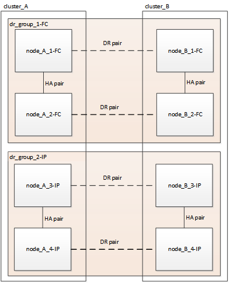

= Fluxo de trabalho para transição sem interrupções de MetroCluster
:allow-uri-read: 
:icons: font
:imagesdir: ../media/

[role="lead"]
Siga o fluxo de trabalho específico para garantir uma transição sem interrupções bem-sucedida. Escolha o fluxo de trabalho para sua configuração:

* <<Fluxo de trabalho de transição de configuração de FC de quatro nós>>
* <<Fluxo de trabalho de transição de configuração de FC de oito nós>>

== Fluxo de trabalho de transição de configuração de FC de quatro nós

O processo de transição começa com uma configuração MetroCluster FC de quatro nós íntegra.

image::../media/transition_dr_group_1_fc_nodes.png[Nós FC de transição no grupo DR 1]

Os novos nós IP do MetroCluster são adicionados como um segundo grupo de DR.

Os dados são transferidos do antigo grupo de DR para o novo grupo de DR. Depois, os nós antigos e o storage são removidos da configuração e desativados. O processo termina com uma configuração IP MetroCluster de quatro nós.

image::../media/transition_dr_group_2_ip.png[Nós IP do grupo DR 2 de transição]

== Fluxo de trabalho de transição de configuração de FC de oito nós

O processo de transição começa com uma configuração saudável de MetroCluster FC de oito nós.

image::../media/mcc_dr_group_c1.png[Configuração do MetroCluster FC de oito nós antes da transição]

Os novos nós IP do MetroCluster são adicionados como um terceiro grupo de DR.

image::../media/mcc_dr_group_c2.png[Configuração de oito nós com nós IP adicionados como terceiro grupo de DR]

Os dados são transferidos do DR_Group_1-FC para DR_Group_1-IP e, em seguida, os nós antigos e seu storage são removidos da configuração e desativados.

NOTE: Se você quiser fazer a transição de uma configuração FC de oito nós para uma configuração IP de quatro nós, será necessário fazer a transição de todos os dados em DR_Group_1-FC e DR_Group_2-FC para o novo grupo de DR IP (DR_Group_1-IP). Em seguida, é possível desativar os dois grupos de RD FC. Após a remoção dos grupos de DR FC, o processo termina com uma configuração IP MetroCluster de quatro nós.

image::../media/mcc_dr_group_c8.png[Configuração de oito nós após a primeira transição do grupo DR]

Adicione os nós IP restantes do MetroCluster à configuração do MetroCluster existente. Repita o processo para transferir dados dos nós DR_Group_2-FC para os nós DR_Group_2-IP.

image::../media/mcc_dr_group_c7.png[Configuração de oito nós com os nós IP restantes adicionados]

Depois de remover DR_Group_2-FC, o processo termina com uma configuração IP MetroCluster de oito nós.

image::../media/mcc_dr_group_c6.png[Configuração de IP do MetroCluster de oito nós após a transição]

== Fluxo de trabalho do processo de transição

Você usará o fluxo de trabalho a seguir para fazer a transição da configuração do MetroCluster.

image::../media/workflow_4n_transition_nondisruptive.png[Fluxo de trabalho para transição não disruptiva de quatro nós]
