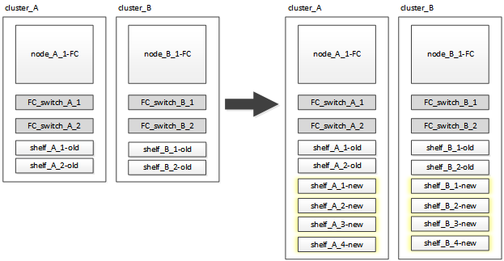

= Transição sem interrupções quando as gavetas atuais não são compatíveis com novos controladores (ONTAP 9.8 e posterior)
:allow-uri-read: 
:icons: font
:imagesdir: ../media/

[role="lead"]
A partir do ONTAP 9.8, você pode fazer a transição de uma configuração de FC MetroCluster de dois nós e mover dados das gavetas de unidades existentes, mesmo que as gavetas de storage existentes não sejam suportadas pelos novos nós IP do MetroCluster.

* Este procedimento só deve ser usado se os modelos de prateleiras de armazenamento existentes não forem suportados pelos novos modelos de plataforma IP MetroCluster.
* Este procedimento é suportado em sistemas que executam o ONTAP 9.8 e posterior.
* Este procedimento é disruptivo.
* Esse procedimento se aplica apenas a uma configuração de FC MetroCluster de dois nós.
+
Se você tiver uma configuração de FC MetroCluster de quatro nós, link:concept_choosing_your_transition_procedure_mcc_transition.html["Escolhendo seu procedimento de transição"]consulte .

* Você deve atender a todos os requisitos e seguir todas as etapas do procedimento.

== Ativar o registo da consola

O NetApp recomenda fortemente que você ative o log do console nos dispositivos que você está usando e execute as seguintes ações ao executar este procedimento:

* Deixe o AutoSupport ativado durante a manutenção.
* Acione uma mensagem de manutenção do AutoSupport antes e depois da manutenção para desativar a criação de casos durante a atividade de manutenção.
+
Consulte o artigo da base de dados de Conhecimento link:https://kb.netapp.com/Support_Bulletins/Customer_Bulletins/SU92["Como suprimir a criação automática de casos durante as janelas de manutenção programada"^].

* Ative o registo de sessão para qualquer sessão CLI. Para obter instruções sobre como ativar o registo de sessão, consulte a secção "saída de sessão de registo" no artigo da base de dados de conhecimento link:https://kb.netapp.com/on-prem/ontap/Ontap_OS/OS-KBs/How_to_configure_PuTTY_for_optimal_connectivity_to_ONTAP_systems["Como configurar o PuTTY para uma conetividade ideal aos sistemas ONTAP"^].

== Requisitos de transição quando as gavetas não são compatíveis com os novos nós

Antes de iniciar o processo de transição, você deve garantir que a configuração atenda aos requisitos.

.Antes de começar
* A configuração existente deve ser uma configuração de MetroCluster alongada ou conectada à malha de dois nós e todos os nós precisam estar executando o ONTAP 9.8 ou posterior.
+
Os novos módulos do controlador IP MetroCluster devem estar executando a mesma versão do ONTAP 9.8.

* As plataformas existentes e novas devem ser uma combinação suportada para a transição.
+
link:concept_supported_platforms_for_transition.html["Plataformas compatíveis para transição sem interrupções"]

* Ele deve atender a todos os requisitos e cabeamento, conforme descrito link:../install-fc/index.html["Instalação e configuração do MetroCluster conectado à malha"]em .
* Os novos compartimentos de storage fornecidos com os novos controladores (node_A_1-IP, node_A_2-IP, node_B_1-IP e node_B_2-IP) devem ser suportados pelos controladores antigos (node_A_1-FC e node_B_1-FC).
+
https://hwu.netapp.com["NetApp Hardware Universe"^]

* As prateleiras de armazenamento antigas são *não* suportadas pelos novos modelos de plataforma IP MetroCluster.
+
https://hwu.netapp.com["NetApp Hardware Universe"^]

* Dependendo dos discos sobressalentes disponíveis nas gavetas existentes, é necessário adicionar unidades adicionais.
+
Isso pode exigir gavetas de unidade adicionais.

+
Você precisa ter 14 a 18 unidades adicionais para cada controlador:

+
** Três unidades de pool0 TB
** Três unidades de pool1 TB
** Duas unidades de reserva
** Seis a dez unidades para o volume do sistema

* Você deve garantir que a configuração, incluindo os novos nós, não exceda os limites da plataforma para a configuração, incluindo contagem de unidades, capacidade de tamanho de agregado raiz, etc.
+
Esta informação está disponível para cada modelo de plataforma em _NetApp Hardware Universe_.

+
https://hwu.netapp.com["NetApp Hardware Universe"]

* Você precisa ter acesso remoto ao console para todos os seis nós do site MetroCluster ou Planejar a viagem entre os locais conforme necessário pelo procedimento.

== Fluxo de trabalho para transição disruptiva quando as gavetas não são suportadas por novas controladoras

Se os modelos de gaveta existentes não forem compatíveis com os novos modelos de plataforma, você precisará anexar as novas gavetas à configuração antiga, mover dados para as novas gavetas e depois fazer a transição para a nova configuração.

Enquanto você se prepara para a transição, Planeje viagens entre os sites. Observe que depois que os nós remotos forem colocados em rack e cabeados, você precisará ter acesso ao terminal serial aos nós. O acesso ao processador de serviço não estará disponível até que os nós sejam configurados.

image::../media/workflow_2n_transition_old_shelves_not_supported.png[workflow 2n transição de compartimentos antigos não suportados]

== Preparar os novos módulos do controlador

Você precisa limpar a configuração e a propriedade de disco nos novos módulos de controladora e nos novos compartimentos de storage.

.Passos
. Com os novos compartimentos de armazenamento conetados aos novos módulos de controladora IP do MetroCluster, execute todas as etapas em link:../transition/concept_requirements_for_fc_to_ip_transition_2n_mcc_transition.html#preparing-the-metrocluster-ip-controllers["Preparação dos controladores IP MetroCluster"].
. Desconete os novos compartimentos de storage dos novos módulos de controladora IP MetroCluster.

== Anexando os novos compartimentos de disco às controladoras MetroCluster FC existentes

É necessário anexar os novos compartimentos de unidades aos módulos de controladora existentes antes de fazer a transição para uma configuração IP do MetroCluster.

.Sobre esta tarefa
A ilustração a seguir mostra as novas gavetas conetadas à configuração do MetroCluster FC.

.Passos
. Desative a atribuição automática de disco em node_A_1-FC e node_A_2-FC:
+
`disk option modify -node _node-name_ -autoassign off`

+
Este comando deve ser emitido em cada nó.

+
A atribuição automática de disco está desativada para evitar a atribuição das gavetas a serem adicionadas ao node_A_1-FC e node_B_1-FC. Como parte da transição, os discos são necessários para nós node_A_1-IP e node_B_2-IP e se a atribuição automática for permitida, a propriedade do disco precisaria ser removida mais tarde antes que os discos pudessem ser atribuídos a node_A_1-IP e node_B_2-IP.

. Conecte as novas gavetas aos nós FC do MetroCluster existentes, usando pontes FC para SAS, se necessário.
+
Consulte os requisitos e procedimentos em link:../maintain/task_hot_add_a_sas_disk_shelf_in_a_direct_attached_mcc_configuration_us_sas_optical_cables.html["Storage de adição automática a uma configuração MetroCluster FC"]

== Migre agregados de raiz e migre dados para as novas gavetas de disco

É necessário mover os agregados raiz das gavetas de unidade antigas para as novas gavetas de unidade que serão usadas pelos nós IP do MetroCluster.

.Sobre esta tarefa
Essa tarefa é executada antes da transição nos nós existentes (node_A_1-FC e node_B_1-FC).

.Passos
. Execute um switchover negociado a partir do nó do controlador_B_1-FC:
+
`metrocluster switchover`

. Execute as etapas de heal Aggregates e heal root da recuperação de node_B_1-FC:
+
`metrocluster heal -phase aggregates`

+
`metrocluster heal -phase root-aggregates`

. Controlador de arranque node_A_1-FC:
+
`boot_ontap`

. Atribua os discos não pertencentes às novas gavetas aos pools apropriados para o nó do controlador_A_1-FC:
+
.. Identifique os discos nas gavetas:
+
`disk show -shelf pool_0_shelf -fields container-type,diskpathnames`

+
`disk show -shelf pool_1_shelf -fields container-type,diskpathnames`

.. Entre no modo local para que os comandos sejam executados no nó local:
+
`run local`

.. Atribuir os discos:
+
`disk assign disk1disk2disk3disk… -p 0`

+
`disk assign disk4disk5disk6disk… -p 1`

.. Sair do modo local:
+
`exit`

. Crie um novo agregado espelhado para se tornar o novo agregado de raiz para o node_A_1-FC do controlador:
+
.. Defina o modo de privilégio como avançado:
+
`set priv advanced`

.. Criar o agregado:
+
`aggregate create -aggregate new_aggr -disklist disk1, disk2, disk3,… -mirror-disklist disk4disk5, disk6,… -raidtypesame-as-existing-root -force-small-aggregate true aggr show -aggregate new_aggr -fields percent-snapshot-space`

+
Se o valor percentual de espaço instantâneo for inferior a 5 por cento, você deve aumentá-lo para um valor superior a 5 por cento:

+
`aggr modify new_aggr -percent-snapshot-space 5`

.. Defina o modo de privilégio de volta para admin:
+
`set priv admin`

. Confirme se o novo agregado foi criado corretamente:
+
`node run -node local sysconfig -r`

. Crie os backups de configuração em nível de cluster e nó:
+

NOTE: Quando os backups são criados durante o switchover, o cluster está ciente do estado de comutação na recuperação. Você deve garantir que o backup e o upload da configuração do sistema sejam bem-sucedidos, pois sem esse backup é *não* possível reformar a configuração do MetroCluster entre clusters.

+
.. Criar a cópia de segurança do cluster:
+
`system configuration backup create -node local -backup-type cluster -backup-name _cluster-backup-name_`

.. Verifique a criação da cópia de segurança do cluster
+
`job show -id job-idstatus`

.. Crie o backup do nó:
+
`system configuration backup create -node local -backup-type node -backup-name _node-backup-name_`

.. Verifique se há backups de nós e de cluster:
+
`system configuration backup show`

+
Você pode repetir o comando até que ambos os backups sejam exibidos na saída.

. Faça cópias dos backups.
+
Os backups devem ser armazenados em um local separado porque serão perdidos localmente quando o novo volume raiz for inicializado.

+
Você pode fazer o upload dos backups para um servidor FTP ou HTTP ou copiar os backups usando `scp` comandos.

+
[cols="1,3"]
|===

| Processo | Passos 

 a| 
*Carregue o backup para o servidor FTP ou HTTP*
 a| 
.. Carregar a cópia de segurança do cluster:
+
`system configuration backup upload -node local -backup _cluster-backup-name_ -destination URL`

.. Carregue a cópia de segurança do nó:
+
`system configuration backup upload -node local -backup _node-backup-name_ -destination URL`

 a| 
*Copie os backups em um servidor remoto usando cópia segura*
 a| 
A partir do servidor remoto use os seguintes comandos scp:

.. Copiar a cópia de segurança do cluster:
+
`scp diagnode-mgmt-FC:/mroot/etc/backups/config/cluster-backup-name.7z .`

.. Copie o backup do nó:
+
`scp diag@node-mgmt-FC:/mroot/etc/backups/config/node-backup-name.7z .`

|===
. Halt node_A_1-FC:
+
`halt -node local -ignore-quorum-warnings true`

. Boot node_A_1-FC para o modo de manutenção:
+
`boot_ontap maint`

. No modo Manutenção, faça as alterações necessárias para definir o agregado como raiz:
+
.. Defina a política de HA para cfo:
+
`aggr options new_aggr ha_policy cfo`

+
Responda "sim" quando solicitado a prosseguir.

+
[listing]
----
Are you sure you want to proceed (y/n)?
----
.. Defina o novo agregado como raiz:
+
`aggr options new_aggr root`

.. Parar para o prompt Loader:
+
`halt`

. Inicialize o controlador e faça backup da configuração do sistema.
+
O nó é inicializado no modo de recuperação quando o novo volume raiz é detetado

+
.. Inicialize o controlador:
+
`boot_ontap`

.. Inicie sessão e faça uma cópia de segurança da configuração.
+
Ao iniciar sessão, verá o seguinte aviso:

+
[listing]
----
Warning: The correct cluster system configuration backup must be restored. If a backup
from another cluster or another system state is used then the root volume will need to be
recreated and NGS engaged for recovery assistance.
----
.. Entrar no modo de privilégio avançado:
+
`set -privilege advanced`

.. Faça backup da configuração do cluster para um servidor:
+
`system configuration backup download -node local -source URL of server/cluster-backup-name.7z`

.. Faça backup da configuração do nó em um servidor:
+
`system configuration backup download -node local -source URL of server/node-backup-name.7z`

.. Voltar ao modo de administração:
+
`set -privilege admin`

. Verifique a integridade do cluster:
+
.. Emita o seguinte comando:
+
`cluster show`

.. Defina o modo de privilégio como avançado:
+
`set -privilege advanced`

.. Verifique os detalhes da configuração do cluster:
+
`cluster ring show`

.. Voltar ao nível de privilégio de administrador:
+
`set -privilege admin`

. Confirme o modo operacional da configuração do MetroCluster e efetue uma verificação do MetroCluster.
+
.. Confirme a configuração do MetroCluster e se o modo operacional está normal:
+
`metrocluster show`

.. Confirme se todos os nós esperados são mostrados:
+
`metrocluster node show`

.. Emita o seguinte comando:
+
`metrocluster check run`

.. Apresentar os resultados da verificação MetroCluster:
+
`metrocluster check show`

. Execute um switchback do nó_B_1-FC do controlador:
+
`metrocluster switchback`

. Verifique o funcionamento da configuração do MetroCluster:
+
.. Confirme a configuração do MetroCluster e se o modo operacional está normal:
+
`metrocluster show`

.. Execute uma verificação MetroCluster:
+
`metrocluster check run`

.. Apresentar os resultados da verificação MetroCluster:
+
`metrocluster check show`

. Adicione o novo volume raiz à base de dados de localização de volume.
+
.. Defina o modo de privilégio como avançado:
+
`set -privilege advanced`

.. Adicione o volume ao nó:
+
`volume add-other-volumes –node node_A_1-FC`

.. Voltar ao nível de privilégio de administrador:
+
`set -privilege admin`

. Verifique se o volume está agora visível e tem mroot.
+
.. Exibir os agregados:
+
`storage aggregate show`

.. Verifique se o volume raiz tem mroot:
+
`storage aggregate show -fields has-mroot`

.. Apresentar os volumes:
+
`volume show`

. Crie um novo certificado de segurança para reativar o acesso ao System Manager:
+
`security certificate create -common-name _name_ -type server -size 2048`

. Repita as etapas anteriores para migrar os agregados nas gavetas de propriedade de node_A_1-FC.
. Execute uma limpeza.
+
Você deve executar as etapas a seguir em node_A_1-FC e node_B_1-FC para remover o volume raiz antigo e o agregado raiz.

+
.. Exclua o volume raiz antigo:
+
`run local`

+
`vol offline old_vol0`

+
`vol destroy old_vol0`

+
`exit`

+
`volume remove-other-volume -vserver node_name -volume old_vol0`

.. Excluir o agregado raiz original:
+
`aggr offline -aggregate old_aggr0_site`

+
`aggr delete -aggregate old_aggr0_site`

. Migre os volumes de dados para agregados nas novas controladoras, um volume de cada vez.
+
Consulte http://docs.netapp.com/platstor/topic/com.netapp.doc.hw-upgrade-controller/GUID-AFE432F6-60AD-4A79-86C0-C7D12957FA63.html["Criando um agregado e movendo volumes para os novos nós"^]

. Retire as prateleiras antigas executando todas as etapas em link:task_disruptively_transition_while_move_volumes_from_old_shelves_to_new_shelves.html["A remoção de compartimentos foi movida de node_A_1-FC e node_A_2-FC"].

== Fazendo a transição da configuração

Você deve seguir o procedimento detalhado de transição.

.Sobre esta tarefa
Nas etapas a seguir, você será direcionado para outros tópicos. Você deve executar as etapas em cada tópico na ordem dada.

.Passos
. Planear mapeamento de portas.
+
Execute todas as etapas em link:../transition/concept_requirements_for_fc_to_ip_transition_2n_mcc_transition.html#mapping-ports-from-the-metrocluster-fc-nodes-to-the-metrocluster-ip-nodes["Mapeamento de portas dos nós FC do MetroCluster para os nós IP do MetroCluster"].

. Prepare os controladores IP do MetroCluster.
+
Execute todas as etapas em link:../transition/concept_requirements_for_fc_to_ip_transition_2n_mcc_transition.html#preparing-the-metrocluster-ip-controllers["Preparação dos controladores IP MetroCluster"].

. Verifique a integridade da configuração do MetroCluster.
+
Execute todas as etapas em link:../transition/concept_requirements_for_fc_to_ip_transition_2n_mcc_transition.html#verifying-the-health-of-the-metrocluster-fc-configuration["Verificando a integridade da configuração do MetroCluster FC"].

. Preparar e remover os nós FC do MetroCluster existentes.
+
Execute todas as etapas em link:../transition/task_transition_the_mcc_fc_nodes_2n_mcc_transition_supertask.html["Fazendo a transição dos nós do MetroCluster FC"].

. Adicione os novos nós IP do MetroCluster.
+
Execute todas as etapas em link:task_connect_the_mcc_ip_controller_modules_2n_mcc_transition_supertask.html["Ligar os módulos do controlador IP MetroCluster"].

. Conclua a transição e a configuração inicial dos novos nós IP do MetroCluster.
+
Execute todas as etapas em link:task_configure_the_new_nodes_and_complete_transition.html["Configurar os novos nós e concluir a transição"].

