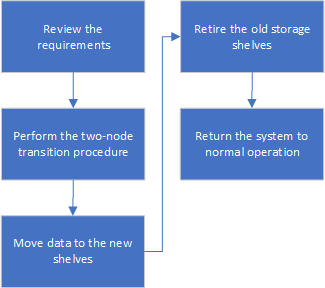

= Transição do MetroCluster FC para o MetroCluster IP sem interrupções ao desativar as gavetas de storage (ONTAP 9.8 e posterior)
:allow-uri-read: 
:icons: font
:imagesdir: ../media/

[role="lead"]
A partir do ONTAP 9.8, você pode fazer a transição de uma configuração de FC MetroCluster de dois nós para uma configuração IP MetroCluster de quatro nós e desativar as gavetas de storage existentes. O procedimento inclui etapas para mover dados dos compartimentos de unidades existentes para a nova configuração e desativar as gavetas antigas.

* Esse procedimento é usado quando você planeja desativar os compartimentos de storage existentes e mover todos os dados para as novas gavetas na configuração IP do MetroCluster.
* Os modelos de gaveta de storage existentes devem ser compatíveis com os novos nós IP do MetroCluster.
* Este procedimento é suportado em sistemas que executam o ONTAP 9.8 e posterior.
* Este procedimento é disruptivo.
* Esse procedimento se aplica apenas a uma configuração de FC MetroCluster de dois nós.
+
Se você tiver uma configuração de FC MetroCluster de quatro nós, link:concept_choosing_your_transition_procedure_mcc_transition.html["Escolhendo seu procedimento de transição"]consulte .

* Você deve atender a todos os requisitos e seguir todas as etapas do procedimento.

== Ativar o registo da consola

O NetApp recomenda fortemente que você ative o log do console nos dispositivos que você está usando e execute as seguintes ações ao executar este procedimento:

* Deixe o AutoSupport ativado durante a manutenção.
* Acione uma mensagem de manutenção do AutoSupport antes e depois da manutenção para desativar a criação de casos durante a atividade de manutenção.
+
Consulte o artigo da base de dados de Conhecimento link:https://kb.netapp.com/Support_Bulletins/Customer_Bulletins/SU92["Como suprimir a criação automática de casos durante as janelas de manutenção programada"^].

* Ative o registo de sessão para qualquer sessão CLI. Para obter instruções sobre como ativar o registo de sessão, consulte a secção "saída de sessão de registo" no artigo da base de dados de conhecimento link:https://kb.netapp.com/on-prem/ontap/Ontap_OS/OS-KBs/How_to_configure_PuTTY_for_optimal_connectivity_to_ONTAP_systems["Como configurar o PuTTY para uma conetividade ideal aos sistemas ONTAP"^].

== Requisitos para a transição ao retirar prateleiras antigas

Antes de iniciar o processo de transição, certifique-se de que a configuração MetroCluster FC existente atenda aos requisitos.

* Ele precisa ser uma configuração de MetroCluster elástico ou conectado à malha de dois nós e todos os nós precisam estar executando o ONTAP 9.8 ou posterior.
+
Os novos módulos do controlador IP MetroCluster devem estar executando a mesma versão do ONTAP 9.8.

* As plataformas existentes e novas devem ser uma combinação suportada para a transição.
+
link:concept_supported_platforms_for_transition.html["Plataformas compatíveis para transição sem interrupções"]

* Ele deve atender a todos os requisitos e cabeamento, conforme descrito em _Guias de Instalação e Configuração do MetroCluster_.
+
link:../install-fc/index.html["Instalação e configuração do MetroCluster conectado à malha"]

A nova configuração também deve atender aos seguintes requisitos:

* Os novos modelos de plataforma IP MetroCluster devem ser compatíveis com os modelos de gaveta de storage antigos.
+
https://hwu.netapp.com["NetApp Hardware Universe"^]

* Dependendo dos discos sobressalentes disponíveis nas gavetas existentes, é necessário adicionar unidades adicionais.
+
Isso pode exigir gavetas de unidade adicionais.

+
Você precisa ter 14 a 18 unidades adicionais para cada controlador:

+
** Três unidades de pool de 0 TB
** Três unidades de pool de 1 TB
** Duas unidades de reserva
** Seis a dez unidades para o volume do sistema

* Você deve garantir que a configuração, incluindo os novos nós, não exceda os limites da plataforma para a configuração, incluindo contagem de unidades, capacidade de tamanho de agregado raiz, etc.
+
Esta informação está disponível para cada modelo de plataforma em https://hwu.netapp.com["NetApp Hardware Universe"^]

Você precisa ter acesso remoto ao console para todos os seis nós do site MetroCluster ou Planejar a viagem entre os locais conforme necessário pelo procedimento.

== Fluxo de trabalho para transição disruptiva ao mover dados e desativar compartimentos de storage antigos

Você deve seguir o fluxo de trabalho específico para garantir uma transição bem-sucedida.

Enquanto você se prepara para a transição, Planeje viagens entre os sites. Observe que depois que os nós remotos forem colocados em rack e cabeados, você precisará ter acesso ao terminal serial aos nós. O acesso ao processador de serviço não estará disponível até que os nós sejam configurados.

== Fazendo a transição da configuração

Você deve seguir o procedimento detalhado de transição.

.Sobre esta tarefa
Nas etapas a seguir, você será direcionado a outros procedimentos. Você deve executar as etapas em cada procedimento referenciado na ordem indicada.

.Passos
. Planeje o mapeamento de portas usando as etapas em link:../transition/concept_requirements_for_fc_to_ip_transition_2n_mcc_transition.html#mapping-ports-from-the-metrocluster-fc-nodes-to-the-metrocluster-ip-nodes["Mapeamento de portas dos nós FC do MetroCluster para os nós IP do MetroCluster"].
. Prepare os controladores IP do MetroCluster usando as etapas em link:../transition/concept_requirements_for_fc_to_ip_transition_2n_mcc_transition.html#preparing-the-metrocluster-ip-controllers["Preparação dos controladores IP MetroCluster"].
. Verifique a integridade da configuração do MetroCluster FC.
+
Execute as etapas em link:../transition/concept_requirements_for_fc_to_ip_transition_2n_mcc_transition.html#verifying-the-health-of-the-metrocluster-fc-configuration["Verificando a integridade da configuração do MetroCluster FC"].

. Colete informações da configuração do MetroCluster FC.
+
Execute as etapas em link:task_transition_the_mcc_fc_nodes_2n_mcc_transition_supertask.html#gathering-information-from-the-existing-controller-modules-before-the-transition["Recolha de informações dos módulos do controlador existentes antes da transição"].

. Remova a monitorização do desempate, se necessário.
+
Execute as etapas em link:../transition/concept_requirements_for_fc_to_ip_transition_2n_mcc_transition.html#verifying-the-health-of-the-metrocluster-fc-configuration["Remoção da configuração existente do tiebreaker ou de outro software de monitoramento"].

. Preparar e remover os nós FC do MetroCluster existentes.
+
Execute as etapas em link:task_transition_the_mcc_fc_nodes_2n_mcc_transition_supertask.html["Fazendo a transição dos nós do MetroCluster FC"].

. Conete os novos nós IP do MetroCluster.
+
Execute as etapas em link:task_connect_the_mcc_ip_controller_modules_2n_mcc_transition_supertask.html["Ligar os módulos do controlador IP MetroCluster"].

. Configure os novos nós IP do MetroCluster e conclua a transição.
+
Execute as etapas em link:task_configure_the_new_nodes_and_complete_transition.html["Configurar os novos nós e concluir a transição"].

== Migrando os agregados raiz

Após a conclusão da transição, migre os agregados de raiz existentes que sobraram da configuração MetroCluster FC para novas gavetas na configuração MetroCluster IP.

.Sobre esta tarefa
Essa tarefa move os agregados raiz para node_A_1-FC e node_B_1-FC para compartimentos de disco pertencentes às novas controladoras IP MetroCluster:

.Passos
. Atribuir discos do pool 0 no novo compartimento de armazenamento local à controladora que tem a raiz sendo migrada (por exemplo, se a raiz do node_A_1-FC estiver sendo migrada, atribua discos do pool 0 no novo compartimento a node_A_1-IP)
+
Observe que a migração _remove e não cria novamente o espelho raiz_, portanto, os discos do pool 1 não precisam ser atribuídos antes de emitir o comando Migrate

. Defina o modo de privilégio como avançado:
+
`set priv advanced`

. Migrar o agregado raiz:
+
`system node migrate-root -node node-name -disklist disk-id1,disk-id2,diskn -raid-type raid-type`

+
** O nome do nó é o nó para o qual o agregado raiz está sendo migrado.
** O ID do disco identifica os discos do pool 0 na nova gaveta.
** O tipo raid normalmente é o mesmo que o tipo raid do agregado raiz existente.
** Você pode usar o comando `job show -idjob-id-instance` para verificar o status da migração, em que o id da tarefa é o valor fornecido quando o comando migrate-root é emitido.
+
Por exemplo, se o agregado raiz para node_A_1-FC consistia em três discos com raid_dp, o seguinte comando seria usado para migrar raiz para um novo shelf 11:

+
[listing]
----
system node migrate-root -node node_A_1-IP -disklist 3.11.0,3.11.1,3.11.2 -raid-type raid_dp
----

. Aguarde até que a operação de migração seja concluída e o nó seja reinicializado automaticamente.
. Atribua discos do pool 1 para o agregado raiz em um novo compartimento diretamente conetado ao cluster remoto.
. Espelhar o agregado raiz migrado.
. Aguarde até que o agregado raiz conclua a ressincronização.
+
Você pode usar o comando storage Aggregate show para verificar o status de sincronização dos agregados.

. Repita essas etapas para o outro agregado de raiz.

== Migração dos agregados de dados

Criar agregados de dados nas novas gavetas e usar a movimentação de volume para transferir os volumes de dados das prateleiras antigas para os agregados nas novas gavetas.

. Mova os volumes de dados para agregados nas novas controladoras, um volume de cada vez.
+
http://docs.netapp.com/platstor/topic/com.netapp.doc.hw-upgrade-controller/GUID-AFE432F6-60AD-4A79-86C0-C7D12957FA63.html["Criando um agregado e movendo volumes para os novos nós"^]

== A remoção de compartimentos foi movida de node_A_1-FC e node_A_2-FC

Remova as gavetas de storage antigas da configuração original do MetroCluster FC. Essas gavetas eram originalmente propriedade de node_A_1-FC e node_A_2-FC.

. Identifique os agregados nas prateleiras antigas no cluster_B que precisam ser excluídos.
+
Neste exemplo, os seguintes agregados de dados são hospedados pelo cluster_B do MetroCluster FC e precisam ser excluídos: aggr_data_A1 e aggr_data_A2.

+

NOTE: Você precisa executar as etapas para identificar, off-line e excluir os agregados de dados nas gavetas. O exemplo é apenas para um cluster.

+
[listing]
----
cluster_B::> aggr show

Aggregate     Size Available Used% State   #Vols  Nodes            RAID Status
--------- -------- --------- ----- ------- ------ ---------------- ------------
aggr0_node_A_1-FC
           349.0GB   16.83GB   95% online       1 node_A_1-IP      raid_dp,
                                                                   mirrored,
                                                                   normal
aggr0_node_A_2-IP
           349.0GB   16.83GB   95% online       1 node_A_2-IP      raid_dp,
                                                                   mirrored,
                                                                   normal
...
8 entries were displayed.

cluster_B::>
----
. Verifique se os agregados de dados têm quaisquer volumes MDV_aud e elimine-os antes de eliminar os agregados.
+
Você deve excluir os volumes MDV_aud porque eles não podem ser movidos.

. Coloque cada um dos agregados offline e, em seguida, exclua-os:
+
.. Coloque o agregado off-line:
+
`storage aggregate offline -aggregate aggregate-name`

+
O exemplo a seguir mostra o nó agregado_B_1_aggr0 sendo colocado off-line:

+
[listing]
----
cluster_B::> storage aggregate offline -aggregate node_B_1_aggr0

Aggregate offline successful on aggregate: node_B_1_aggr0
----
.. Eliminar o agregado:
+
`storage aggregate delete -aggregate aggregate-name`

+
Você pode destruir o Plex quando solicitado.

+
O exemplo a seguir mostra o nó agregado_B_1_aggr0 sendo excluído.

+
[listing]
----
cluster_B::> storage aggregate delete -aggregate node_B_1_aggr0
Warning: Are you sure you want to destroy aggregate "node_B_1_aggr0"? {y|n}: y
[Job 123] Job succeeded: DONE

cluster_B::>
----

. Depois de excluir todos os agregados, desligue, desconete e remova as gavetas.
. Repita as etapas acima para desativar as prateleiras cluster_A.

== Concluir a transição

Com os módulos de controlador antigos removidos, você pode concluir o processo de transição.

.Passo
. Conclua o processo de transição.
+
Execute as etapas em link:task_return_the_system_to_normal_operation_2n_mcc_transition_supertask.html["Voltar a colocar o sistema em funcionamento normal"].

