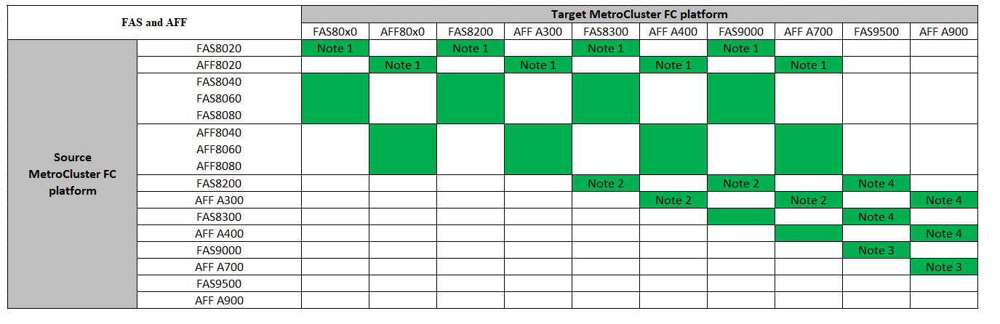

= Escolha um procedimento de atualização da controladora
:allow-uri-read: 
:icons: font
:imagesdir: ../media/

[role="lead"]
O procedimento de atualização da controladora que você usa depende do modelo da plataforma e do tipo de configuração do MetroCluster.

Em um procedimento de atualização, os controladores são substituídos por um novo modelo de controlador. Os modelos de prateleiras de armazenamento não são atualizados.

* Nos procedimentos de comutação e switchback, a operação de switchover do MetroCluster é usada para fornecer serviços sem interrupções aos clientes enquanto os módulos do controlador no cluster de parceiros são atualizados.
* Em um procedimento de atualização de controladora baseado em ARL, as operações de realocação agregada são usadas para mover dados da configuração antiga para a configuração nova e atualizada sem interrupções.

== Atualizações de controladora compatíveis

Saiba mais sobre as combinações de atualização de controladora FC e IP do MetroCluster compatíveis.

=== Atualizações suportadas do controlador IP MetroCluster usando os comandos "System controller replace"

Consulte a tabela em link:task_upgrade_controllers_system_control_commands_in_a_four_node_mcc_ip.html["Atualizar controladores em uma configuração IP MetroCluster de quatro nós usando switchover e switchback com comandos "System controller replace" (ONTAP 9.13,1 e posterior)"] para obter as plataformas suportadas.

=== Todas as outras atualizações suportadas do controlador IP MetroCluster

Encontre sua plataforma *Source* nas tabelas de atualização do controlador MetroCluster nesta seção. Se a interseção da linha da plataforma *Source* e da coluna da plataforma *Target* estiver em branco, a atualização não será suportada.

* Se a sua plataforma não estiver listada, não há combinação de atualização de controladora suportada.
* Quando você executa uma atualização de controlador, o tipo de plataforma *deve* antigo e novo corresponde:
+
** Você pode atualizar um sistema FAS para um sistema FAS ou um AFF A-Series para um AFF A-Series.
** Não é possível atualizar um sistema FAS para um AFF A-Series ou um AFF A-Series para um AFF C-Series.
+
Por exemplo, se a plataforma que você deseja atualizar for um FAS8200, você pode fazer upgrade para um FAS9000. Não é possível atualizar um sistema FAS8200 para um sistema AFF A700.

* Todos os nós (antigos e novos) na configuração do MetroCluster devem estar executando a mesma versão do ONTAP. Consulte link:https://hwu.netapp.com["Hardware Universe"^]a para obter a versão mínima suportada do ONTAP para a sua combinação.

==== Atualizações suportadas do controlador IP AFF e FAS MetroCluster

As tabelas a seguir mostram as combinações de plataforma suportadas para atualizar um sistema AFF ou FAS manualmente em uma configuração IP MetroCluster, dividida em dois grupos.

* *O Grupo 1* mostra combinações de atualizações para sistemas AFF A150, AFF A20, FAS2750, FAS8300, FAS500f, AFF C250, AFF A250, FAS50, AFF C30, AFF A30, FAS8200, AFF A300, AFF A320, AFF A220, AFF C400, AFF A400 e FAS8700.
* *O Grupo 2* mostra combinações de atualizações para sistemas AFF C60, AFF A50, FAS70, FAS9000, AFF A700, AFF A70, AFF C800, AFF A800, FAS9500, AFF A900, AFF C80, FAS90, AFF A90 e AFF A1K.

As notas a seguir se aplicam a ambos os grupos:

* Nota 1: Para esta atualização, utilize o procedimento link:task_upgrade_A700_to_A900_in_a_four_node_mcc_ip_us_switchover_and_switchback.html["Atualizar controladores de AFF A700/FAS9000 para AFF A900/FAS9500 em uma configuração IP MetroCluster usando switchover e switchback (ONTAP 9.10,1 ou posterior)"]
* Observação 2: Atualizações de controladora são suportadas em sistemas que executam o ONTAP 9.13,1 ou posterior.
* Nota 3: A plataforma de destino não pode ter unidades internas até que a atualização da controladora esteja concluída. Você pode adicionar as unidades internas após a atualização.
* Nota 4: Requer a substituição dos módulos do controlador.
* Observação 5: Requer módulos IOM para converter as controladoras antigas em uma gaveta SAS externa. Consulte a link:https://hwu.netapp.com/["Hardware Universe"^] para obter os módulos IOM suportados.

[role="tabbed-block"]
====
.Combinações AFF e FAS grupo 1
--
Analise as combinações compatíveis para atualizações para sistemas AFF A150, AFF A20, FAS2750, FAS8300, FAS500f, AFF C250, AFF A250, FAS50, AFF C30, AFF A30, FAS8200, AFF A300, AFF A400, AFF A220, AFF C400, AFF A320 e FAS8700.

image:../media/manual-upgrade-combination-group-1.png["Mostra as combinações de atualização suportadas para as plataformas do grupo 1"]

--
.Combinações AFF e FAS grupo 2
--
Analise as combinações compatíveis para atualizações para os sistemas AFF C60, AFF A50, FAS70, FAS9000, AFF A700, AFF A70, AFF C800, AFF A800, FAS9500, AFF A900, AFF C80, FAS90, AFF A90 e AFF A1K.

--
====

==== Atualizações suportadas do controlador IP ASA MetroCluster

A tabela a seguir mostra as combinações de plataforma suportadas para atualizar um sistema ASA manualmente em uma configuração IP do MetroCluster:

image:../media/mcc-ip-upgrade-asa-comb-9161.png["Mostra as combinações da plataforma de atualização do controlador MetroCluster IP suportado pela ASA"]

* Observação 1: Atualizações de controladora são suportadas em sistemas que executam o ONTAP 9.13,1 ou posterior.

=== Atualizações de controladora MetroCluster FC compatíveis

Encontre sua plataforma *Source* nas tabelas de atualização do controlador MetroCluster nesta seção. Se a interseção da linha da plataforma *Source* e da coluna da plataforma *Target* estiver em branco, a atualização não será suportada.

* Se a sua plataforma não estiver listada, não há combinação de atualização de controladora suportada.
* Quando você executa uma atualização de controlador, o tipo de plataforma *deve* antigo e novo corresponde:
+
** Você pode atualizar um sistema FAS para um sistema FAS ou um AFF A-Series para um AFF A-Series.
** Não é possível atualizar um sistema FAS para um AFF A-Series ou um AFF A-Series para um AFF C-Series.
+
Por exemplo, se a plataforma que você deseja atualizar for um FAS8200, você pode fazer upgrade para um FAS9000. Não é possível atualizar um sistema FAS8200 para um sistema AFF A700.

* Todos os nós (antigos e novos) na configuração do MetroCluster devem estar executando a mesma versão do ONTAP. Consulte link:https://hwu.netapp.com["Hardware Universe"^]a para obter a versão mínima suportada do ONTAP para a sua combinação.

==== Atualizações compatíveis de controladora AFF e FAS MetroCluster FC

A tabela a seguir mostra as combinações de plataforma compatíveis para atualizar um sistema AFF ou FAS em uma configuração MetroCluster FC:

* Observação 1: Para atualizar controladores quando as conexões FCVI em nós FAS8020 ou AFF8020 existentes usam as portas 1c e 1D, consulte o seguinte https://kb.netapp.com/Advice_and_Troubleshooting/Data_Protection_and_Security/MetroCluster/Upgrading_controllers_when_FCVI_connections_on_existing_FAS8020_or_AFF8020_nodes_use_ports_1c_and_1d["artigo da base de conhecimento"^].
* Observação 2: Atualizações de controladora de plataformas AFF A300 ou FAS8200 usando as portas integradas 0e e 0f como conexões FC-VI só são compatíveis com os seguintes sistemas:
+
** ONTAP 9.9,1 e anteriores
** ONTAP 9.10.1P9
** ONTAP 9.11.1P5
** ONTAP 9.12.1GA
** ONTAP 9.13,1 e posterior
+
Para obter mais informações, consulte o link:https://mysupport.netapp.com/site/bugs-online/product/ONTAP/BURT/1507088["Relatório público"^].

* Nota 3: Para esta atualização, consulte link:task_upgrade_A700_to_A900_in_a_four_node_mcc_fc_us_switchover_and_switchback.html["Atualizar controladores de AFF A700/FAS9000 para AFF A900/FAS9500 em uma configuração MetroCluster FC usando switchover e switchback (ONTAP 9.10,1 ou posterior)"]
* Observação 4: Atualizações de controladora são suportadas em sistemas que executam o ONTAP 9.13,1 ou posterior.

==== Atualizações de controladora ASA MetroCluster FC compatíveis

A tabela a seguir mostra as combinações de plataforma compatíveis para atualizar um sistema ASA em uma configuração MetroCluster FC:

[cols="3*"]
|===
| Fonte da plataforma MetroCluster FC | Plataforma FC MetroCluster de destino | Suportado? 

.2+| ASA A400 | ASA A400 | Sim 

| ASA A900 | Não 

.2+| ASA A900 | ASA A400 | Não 

| ASA A900 | Sim (consulte a Nota 1) 
|===
* Observação 1: Atualizações de controladora são suportadas em sistemas que executam o ONTAP 9.14,1 ou posterior.

== Escolha um procedimento que use o processo de comutação e switchback

Depois de analisar as combinações de atualização suportadas, escolha o procedimento correto de atualização do controlador para a sua configuração.

[cols="2,1,1,2"]
|===

| Tipo MetroCluster | Método de atualização | Versão de ONTAP | Procedimento 

 a| 
IP
 a| 
Atualize com os comandos 'stystem controller replace'
 a| 
9.13.1 e mais tarde
 a| 
link:task_upgrade_controllers_system_control_commands_in_a_four_node_mcc_ip.html["Ligação ao procedimento"]

 a| 
FC
 a| 
Atualize com os comandos 'stystem controller replace'
 a| 
9.10.1 e mais tarde
 a| 
link:task_upgrade_controllers_system_control_commands_in_a_four_node_mcc_fc.html["Ligação ao procedimento"]

 a| 
FC
 a| 
Atualização manual com comandos CLI (somente AFF A700/FAS9000 para AFF A900/FAS9500)
 a| 
9.10.1 e mais tarde
 a| 
link:task_upgrade_A700_to_A900_in_a_four_node_mcc_fc_us_switchover_and_switchback.html["Ligação ao procedimento"]

 a| 
IP
 a| 
Atualização manual com comandos CLI (somente AFF A700/FAS9000 para AFF A900/FAS9500)
 a| 
9.10.1 e mais tarde
 a| 
link:task_upgrade_A700_to_A900_in_a_four_node_mcc_ip_us_switchover_and_switchback.html["Ligação ao procedimento"]

 a| 
FC
 a| 
Atualização manual com comandos CLI
 a| 
9,8 e mais tarde
 a| 
link:task_upgrade_controllers_in_a_four_node_fc_mcc_us_switchover_and_switchback_mcc_fc_4n_cu.html["Ligação ao procedimento"]

 a| 
IP
 a| 
Atualização manual com comandos CLI
 a| 
9,8 e mais tarde
 a| 
link:task_upgrade_controllers_in_a_four_node_ip_mcc_us_switchover_and_switchback_mcc_ip.html["Ligação ao procedimento"]

|===

== Escolhendo um procedimento usando realocação agregada

Em um procedimento de atualização de controladora baseado em ARL, as operações de realocação agregada são usadas para mover dados da configuração antiga para a configuração nova e atualizada sem interrupções.

|===
| Tipo MetroCluster | Realocação de agregados | Versão de ONTAP | Procedimento 

 a| 
FC
 a| 
Usando comandos "System controller replace" para atualizar modelos de controladora no mesmo chassi
 a| 
9.10.1 e mais tarde
 a| 
https://docs.netapp.com/us-en/ontap-systems-upgrade/upgrade-arl-auto-affa900/index.html["Ligação ao procedimento"^]

 a| 
FC
 a| 
Usando `system controller replace` comandos
 a| 
9,8 e mais tarde
 a| 
https://docs.netapp.com/us-en/ontap-systems-upgrade/upgrade-arl-auto-app/index.html["Ligação ao procedimento"^]

 a| 
FC
 a| 
Usando `system controller replace` comandos
 a| 
9,5 a 9,7
 a| 
https://docs.netapp.com/us-en/ontap-systems-upgrade/upgrade-arl-auto/index.html["Ligação ao procedimento"^]

 a| 
FC
 a| 
Usando comandos ARL manuais
 a| 
9,8
 a| 
https://docs.netapp.com/us-en/ontap-systems-upgrade/upgrade-arl-manual-app/index.html["Ligação ao procedimento"^]

 a| 
FC
 a| 
Usando comandos ARL manuais
 a| 
9,7 e anteriores
 a| 
https://docs.netapp.com/us-en/ontap-systems-upgrade/upgrade-arl-manual/index.html["Ligação ao procedimento"^]

|===