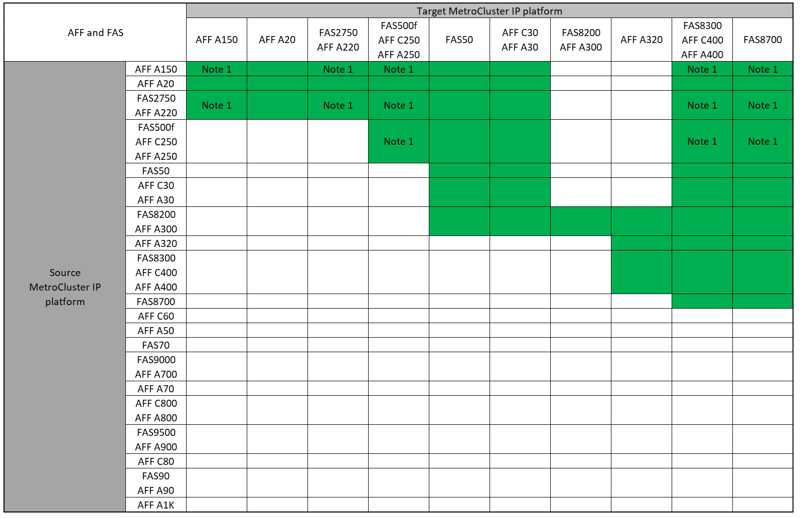

= Escolher um método de atualização do sistema
:allow-uri-read: 
:icons: font
:imagesdir: ../media/

[role="lead"]
O procedimento de atualização do sistema que você usa depende do modelo da plataforma e do tipo de configuração do MetroCluster. Os procedimentos de atualização se aplicam aos controladores e às gavetas de storage. Nos procedimentos de atualização, novos controladores e compartimentos são adicionados à configuração do MetroCluster, criando um segundo grupo de DR e migrando os dados para os novos nós sem interrupções. Os controladores originais são então desativados.

== Combinações de atualização técnica IP MetroCluster suportadas

* Você deve concluir o procedimento de atualização técnica antes de adicionar uma nova carga.
* Todos os nós na configuração do MetroCluster devem estar executando a mesma versão do ONTAP. Por exemplo, se você tiver uma configuração de oito nós, todos os oito nós devem estar executando a mesma versão do ONTAP. Consulte link:https://hwu.netapp.com["Hardware Universe"^]a para obter a versão mínima suportada do ONTAP para a sua combinação.
* Não exceda quaisquer limites de objeto do "inferior" das plataformas na combinação. Aplique o limite inferior de objetos das duas plataformas.
* Se os limites da plataforma de destino forem inferiores aos limites do MetroCluster, você deverá reconfigurar o MetroCluster para estar nos limites da plataforma de destino ou abaixo antes de adicionar os novos nós.
* Consulte a link:https://hwu.netapp.com["Hardware Universe"^]para obter os limites da plataforma.

=== Combinações de atualização técnica AFF e FAS MetroCluster IP suportadas

A tabela a seguir mostra as combinações de plataforma suportadas para atualizar um sistema AFF ou FAS em uma configuração IP MetroCluster. As tabelas são divididas em dois grupos:

* *O Grupo 1* mostra combinações para sistemas AFF A150, AFF A20, FAS2750, FAS8300, FAS500f, AFF C250, AFF A250, FAS50, AFF C30, AFF A30, FAS8200, AFF A300, AFF A320, AFF A220, AFF C400, AFF A400 e FAS8700.
* *O Grupo 2* mostra combinações para os sistemas AFF C60, AFF A50, FAS70, FAS9000, AFF A700, AFF A70, AFF C800, AFF A800, FAS9500, AFF A900, AFF C80, FAS90, AFF A90 e AFF A1K.

As notas a seguir se aplicam a ambos os grupos:

* Nota 1: Esta combinação requer o ONTAP 9.13.1 ou posterior.

[role="tabbed-block"]
====
.Combinações AFF e FAS grupo 1
--
Analise as combinações de atualização do sistema para sistemas AFF A150, AFF A20, FAS2750, FAS8300, FAS500f, AFF C250, AFF A250, FAS50, AFF C30, AFF A30, FAS8200, AFF A300, AFF A320, AFF A220, AFF C400, AFF A400 e FAS8700.

--
.Combinações AFF e FAS grupo 2
--
Reveja as combinações de atualização do sistema para sistemas AFF C60, AFF A50, FAS70, FAS9000, AFF A700, AFF A70, AFF C800, AFF A800, FAS9500, AFF A900, AFF C80, FAS90, AFF A90 e AFF A1K.

image:../media/tech-refresh-ip-group-2.png[""]

--
====

=== Combinações de atualização técnica IP ASA MetroCluster suportadas

A tabela a seguir mostra as combinações de plataforma suportadas para atualizar um sistema ASA em uma configuração IP do MetroCluster:

image::../media/mcc-ip-techrefresh-asa-9161.png[Combinações de atualização técnica do MetroCluster IP ASA]

== Combinações de atualização técnica do MetroCluster FC compatíveis

* Você deve concluir o procedimento de atualização técnica antes de adicionar uma nova carga.
* Todos os nós na configuração do MetroCluster devem estar executando a mesma versão do ONTAP. Por exemplo, se você tiver uma configuração de oito nós, todos os oito nós devem estar executando a mesma versão do ONTAP. Consulte link:https://hwu.netapp.com["Hardware Universe"^]a para obter a versão mínima suportada do ONTAP para a sua combinação.
* Não exceda quaisquer limites de objeto do "inferior" das plataformas na combinação. Aplique o limite inferior de objetos das duas plataformas.
* Se os limites da plataforma de destino forem inferiores aos limites do MetroCluster, você deverá reconfigurar o MetroCluster para estar nos limites da plataforma de destino ou inferiores antes de adicionar os novos nós.
* Consulte a link:https://hwu.netapp.com["Hardware Universe"^]para obter os limites da plataforma.

=== Combinações de atualização técnica compatíveis com AFF e FAS MetroCluster FC

A tabela a seguir mostra as combinações de plataforma compatíveis para atualizar um sistema AFF ou FAS em uma configuração MetroCluster FC:

image::../media/metrocluster_fc_tech_refresh.png[atualização técnica do MetroCluster fc]

=== Combinações de atualização técnica do ASA MetroCluster FC compatíveis

A tabela a seguir mostra as combinações de plataforma compatíveis para atualizar um sistema ASA em uma configuração MetroCluster FC:

[cols="3*"]
|===
| Fonte da plataforma MetroCluster FC | Plataforma FC MetroCluster de destino | Suportado? 

.2+| ASA A400 | ASA A400 | Sim 

| ASA A900 | Não 

.2+| ASA A900 | ASA A400 | Não 

| ASA A900 | Sim 
|===

== Escolha um procedimento de atualização

Escolha o procedimento de atualização para sua configuração na tabela a seguir:

[cols="2,1,1,2"]
|===
| Atualizar método | Tipo de configuração | Versão de ONTAP | Procedimento 

 a| 
* Método: Expanda a configuração do MetroCluster e remova os nós antigos

 a| 
FC de quatro nós
 a| 
9,6 e mais tarde
 a| 
link:task_refresh_4n_mcc_fc.html["Ligação ao procedimento"]

 a| 
* Método: Expanda a configuração do MetroCluster e remova os nós antigos

 a| 
IP de quatro nós
 a| 
9,8 e mais tarde
 a| 
link:task_refresh_4n_mcc_ip.html["Ligação ao procedimento"]

|===