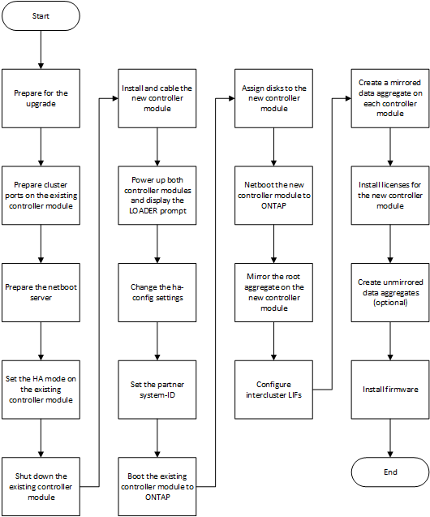

= Adicionar um novo módulo de controlador a cada cluster
:allow-uri-read: 
:icons: font
:imagesdir: ../media/

[role="lead"]
É necessário adicionar um novo módulo de controladora a cada local, criando um par de HA em cada local. Este é um processo de várias etapas envolvendo alterações de hardware e software que devem ser realizadas na ordem correta em cada local.

.Sobre esta tarefa
* O novo módulo do controlador deve ser recebido da NetApp como parte do kit de atualização.
+
Você deve verificar se as placas PCIe no novo módulo de controladora são compatíveis e suportadas pelo novo módulo de controladora.

+
https://hwu.netapp.com["NetApp Hardware Universe"]

* O sistema precisa ter um slot vazio disponível para o novo módulo de controladora ao fazer a atualização para um par de HA de chassi único (um par de HA no qual ambos os módulos de controladora residem no mesmo chassi).
+

NOTE: Esta configuração não é suportada em todos os sistemas. As plataformas com configurações de chassi único compatíveis com ONTAP 9 são AFF A300, FAS8200, FAS8300, AFF A400, AFF80xx, FAS8020, FAS8060, FAS8080 e FAS9000.

* É necessário ter espaço em rack e cabos para o novo módulo de controladora ao fazer a atualização para um par de HA de chassi duplo (um par de HA no qual os módulos da controladora residem em chassi separado).
+

NOTE: Esta configuração não é suportada em todos os sistemas.

* Você deve conetar cada módulo do controlador à rede de gerenciamento por meio de sua porta e0a ou, se o sistema tiver uma, você pode se conetar à porta e0M como a porta de gerenciamento.
* Essas tarefas devem ser repetidas em cada local.
* Os módulos do controlador pré-existentes são referidos como módulos do controlador _existing_.
+
Os exemplos deste procedimento têm o prompt do console `existing_ctlr>` .

* Os módulos do controlador que estão sendo adicionados são chamados de módulos do controlador _new_; os exemplos deste procedimento têm o prompt do console `new_ctlr>` .
* Esta tarefa utiliza o seguinte fluxo de trabalho:

