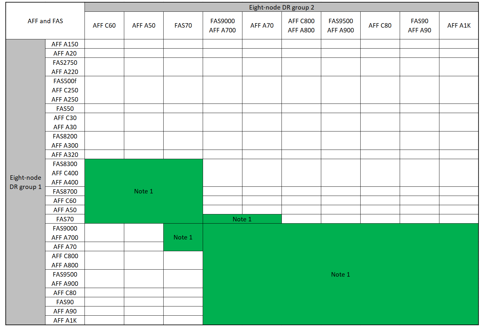

= Expanda uma configuração IP do MetroCluster
:allow-uri-read: 
:icons: font
:imagesdir: ../media/

[role="lead"]
Dependendo da versão do ONTAP, você pode expandir sua configuração IP do MetroCluster adicionando quatro novos nós como um novo grupo de DR.

A partir do ONTAP 9.13,1, é possível expandir temporariamente uma configuração MetroCluster de oito nós para atualizar os controladores e o armazenamento. Consulte link:task_refresh_4n_mcc_ip.html["Atualizando uma configuração de IP MetroCluster de quatro ou oito nós (ONTAP 9.8 e posterior)"] para obter mais informações.

A partir do ONTAP 9.9,1, é possível adicionar quatro novos nós à configuração IP do MetroCluster como um segundo grupo de DR. Isso cria uma configuração MetroCluster de oito nós.

.Informações importantes
A orientação a seguir é para um cenário incomum em que você precisa adicionar um modelo de plataforma mais antigo (plataformas lançadas antes do ONTAP 9.15.1) a uma configuração existente do MetroCluster que contém um modelo de plataforma mais recente (plataformas lançadas no ONTAP 9.15.1 ou posterior).

Se a sua configuração existente do MetroCluster contiver uma plataforma que usa *portas de cluster/HA compartilhadas* (plataformas lançadas no ONTAP 9.15.1 ou posterior), você não poderá adicionar uma plataforma que usa *portas de MetroCluster/HA compartilhadas* (plataformas lançadas antes do ONTAP 9.15.1) sem atualizar todos os nós na configuração para o ONTAP 9.15.1P11 ou ONTAP 9.16.1P4 ou posterior.

[CAUTION]
====
Adicionar um modelo de plataforma mais antigo que usa *portas HA compartilhadas/ do MetroCluster * a um MetroCluster que contém um modelo de plataforma mais novo que usa *portas HA/do cluster compartilhadas* é um cenário incomum e a maioria das combinações não é afetada.

====
Use a tabela a seguir para verificar se sua combinação é afetada.  Se sua plataforma existente estiver listada na primeira coluna e a plataforma que você deseja adicionar à configuração estiver listada na segunda coluna, todos os nós na configuração deverão estar executando o ONTAP 9.15.1P11 ou ONTAP 9.16.1P4 ou posterior para adicionar o novo grupo de DR.

[cols="20,20,20,20,20"]
|===
2+| Se o seu MetroCluster existente contiver... 2+| E a plataforma que você está adicionando é... | Então... 

 a| 
Um sistema AFF usando *portas de cluster/HA compartilhadas*:

* AFF A20
* AFF A30
* AFF C30
* AFF A50
* AFF C60
* AFF C80
* AFF A70
* AFF A90
* AFF A1K

 a| 
Um sistema FAS usando *portas de cluster/HA compartilhadas*:

* FAS50
* FAS70
* FAS90

 a| 
Um sistema AFF usando *portas MetroCluster/HA compartilhadas*:

* AFF A150, ASA A150
* AFF A220
* AFF C250, ASA C250
* AFF A250, ASA A250
* AFF A300
* AFF A320
* AFF C400, ASA C400
* AFF A400, ASA A400
* AFF A700
* AFF C800, ASA C800
* AFF A800, ASA A800
* AFF A900, ASA A900

 a| 
Um sistema FAS usando *portas MetroCluster/HA compartilhadas*:

* FAS2750
* FAS500f
* FAS8200
* FAS8300
* FAS8700
* FAS9000
* FAS9500

| Antes de adicionar a nova plataforma à sua configuração existente do MetroCluster, atualize todos os nós na configuração existente e nova para ONTAP 9.15.1P11 ou ONTAP 9.16.1P4 ou posterior. 
|===
.Antes de começar
* Os nós antigos e novos devem estar executando a mesma versão do ONTAP.
* Este procedimento descreve as etapas necessárias para adicionar um grupo de DR de quatro nós a uma configuração IP do MetroCluster existente. Se você estiver atualizando uma configuração de oito nós, repita todo o procedimento para cada grupo de DR, adicionando um de cada vez.
* Verifique se os modelos de plataforma antigos e novos são suportados para mistura de plataforma.
+
https://hwu.netapp.com["NetApp Hardware Universe"^]

* Verifique se os modelos de plataforma antigos e novos são suportados pelos switches IP.
+
https://hwu.netapp.com["NetApp Hardware Universe"^]

* Se você estiver link:task_refresh_4n_mcc_ip.html["Atualizando uma configuração de IP MetroCluster de quatro ou oito nós"], os novos nós precisam ter storage suficiente para acomodar os dados dos nós antigos, juntamente com discos adequados para agregados de raiz e discos sobressalentes.
* Verifique se você tem um domínio de broadcast padrão criado nos nós antigos.
+
Quando você adiciona novos nós a um cluster existente sem um domínio de broadcast padrão, as LIFs de gerenciamento de nós são criadas para os novos nós usando identificadores únicos universais (UUIDs) em vez dos nomes esperados. Para obter mais informações, consulte o artigo da base de dados de Conhecimento https://kb.netapp.com/onprem/ontap/os/Node_management_LIFs_on_newly-added_nodes_generated_with_UUID_names["LIFs de gerenciamento de nós em nós recém-adicionados gerados com nomes UUID"^] .

== Ativar o registo da consola

O NetApp recomenda fortemente que você ative o log do console nos dispositivos que você está usando e execute as seguintes ações ao executar este procedimento:

* Deixe o AutoSupport ativado durante a manutenção.
* Acione uma mensagem de manutenção do AutoSupport antes e depois da manutenção para desativar a criação de casos durante a atividade de manutenção.
+
Consulte o artigo da base de dados de Conhecimento link:https://kb.netapp.com/Support_Bulletins/Customer_Bulletins/SU92["Como suprimir a criação automática de casos durante as janelas de manutenção programada"^].

* Ative o registo de sessão para qualquer sessão CLI. Para obter instruções sobre como ativar o registo de sessão, consulte a secção "saída de sessão de registo" no artigo da base de dados de conhecimento link:https://kb.netapp.com/on-prem/ontap/Ontap_OS/OS-KBs/How_to_configure_PuTTY_for_optimal_connectivity_to_ONTAP_systems["Como configurar o PuTTY para uma conetividade ideal aos sistemas ONTAP"^].

== Exemplo de nomeação neste procedimento

Este procedimento usa nomes de exemplo em todo o para identificar os grupos de DR, nós e switches envolvidos.

|===

| Grupos DR | Cluster_A no site_A | Cluster_B no local_B 

 a| 
dr_group_1-old
 a| 
* Node_A_1-old
* Node_A_2-old

 a| 
* Node_B_1-old
* Node_B_2-old

 a| 
dr_group_2-novo
 a| 
* Node_A_3-novo
* Node_A_4-novo

 a| 
* Node_B_3-novo
* Node_B_4-novo

|===

== Combinações de plataforma compatíveis ao adicionar um segundo grupo de DR

As tabelas a seguir mostram as combinações de plataforma suportadas para configurações IP MetroCluster de oito nós.

[IMPORTANT]
====
* Todos os nós na configuração do MetroCluster devem estar executando a mesma versão do ONTAP. Por exemplo, se você tiver uma configuração de oito nós, todos os oito nós devem estar executando a mesma versão do ONTAP. Consulte link:https://hwu.netapp.com["Hardware Universe"^]a para obter a versão mínima suportada do ONTAP para a sua combinação.
* As combinações nesta tabela aplicam-se apenas a configurações de oito nós regulares ou permanentes.
* As combinações de plataforma mostradas nesta tabela *não* se aplicam se você estiver usando os procedimentos de transição ou atualização.
* Todos os nós em um grupo de DR devem ter o mesmo tipo e configuração.

====

=== Combinações de expansão IP AFF e FAS MetroCluster suportadas

As tabelas a seguir mostram as combinações de plataforma suportadas para expandir um sistema AFF ou FAS em uma configuração IP MetroCluster. As tabelas são divididas em dois grupos:

* *O Grupo 1* mostra combinações para sistemas AFF A150, AFF A20, FAS2750, FAS8300, FAS500f, AFF C250, AFF A250, FAS50, AFF C30, AFF A30, FAS8200, AFF A300, AFF A320, AFF A220, AFF C400, AFF A400 e FAS8700.
* *O Grupo 2* mostra combinações para os sistemas AFF C60, AFF A50, FAS70, FAS9000, AFF A700, AFF A70, AFF C800, AFF A800, FAS9500, AFF A900, AFF C80, FAS90, AFF A90 e AFF A1K.

As notas a seguir se aplicam a ambos os grupos:

* Nota 1: ONTAP 9.9.1 ou posterior (ou a versão mínima do ONTAP suportada na plataforma) é necessária para estas combinações.
* Nota 2: ONTAP 9.13.1 ou posterior (ou a versão mínima do ONTAP suportada na plataforma) é necessária para estas combinações.

[role="tabbed-block"]
====
.Combinações AFF e FAS grupo 1
--
Revise as combinações de expansão para sistemas AFF A150, AFF A20, FAS2750, FAS8300, FAS500f, AFF C250, AFF A250, FAS50, AFF C30, AFF A30, FAS8200, AFF A300, AFF A320, AFF A220, AFF C400, AFF A400 e FAS8700.

image:../media/expand-ip-group-1-updated.png["Combinações de expansão para plataformas AFF e FAS grupo 1 no MetroCluster IP"]

--
.Combinações AFF e FAS grupo 2
--
Revise as combinações de expansão para sistemas AFF C60, AFF A50, FAS70, FAS9000, AFF A700, AFF A70, AFF C800, AFF A800, FAS9500, AFF A900, AFF C80, FAS90, AFF A90 e AFF A1K.

--
====

=== Combinações de expansão IP ASA MetroCluster suportadas

A tabela a seguir mostra as combinações de plataforma suportadas para expandir um sistema ASA em uma configuração IP do MetroCluster:

image::../media/8node_comb_ip_asa.png[Combinações de plataforma para configurações de 8 nós]

== Enviar uma mensagem AutoSupport personalizada antes da manutenção

Antes de executar a manutenção, você deve emitir uma mensagem AutoSupport para notificar o suporte técnico da NetApp de que a manutenção está em andamento. Informar o suporte técnico de que a manutenção está em andamento impede que ele abra um caso partindo do pressuposto de que ocorreu uma interrupção.

.Sobre esta tarefa
Esta tarefa deve ser executada em cada site do MetroCluster.

.Passos
. Para impedir a geração automática de casos de suporte, envie uma mensagem AutoSupport para indicar que a atualização está em andamento.
+
.. Emita o seguinte comando:
+
`system node autosupport invoke -node * -type all -message "MAINT=10h Upgrading <old-model> to <new-model>`

+
Este exemplo especifica uma janela de manutenção de 10 horas. Você pode querer permitir tempo adicional, dependendo do seu plano.

+
Se a manutenção for concluída antes do tempo decorrido, você poderá invocar uma mensagem AutoSupport indicando o fim do período de manutenção:

+
`system node autosupport invoke -node * -type all -message MAINT=end`

.. Repita o comando no cluster de parceiros.

== Considerações para VLANs ao adicionar um novo grupo de DR

* As considerações de VLAN a seguir se aplicam ao expandir uma configuração de IP MetroCluster:
+
Certas plataformas usam uma VLAN para a interface IP do MetroCluster. Por padrão, cada uma das duas portas usa uma VLAN diferente: 10 e 20.

+
Se suportado, você também pode especificar uma VLAN diferente (não padrão) maior que 100 (entre 101 e 4095) usando o `-vlan-id` parâmetro no `metrocluster configuration-settings interface create` comando.

+
As seguintes plataformas *não* suportam o `-vlan-id` parâmetro:

+
** FAS8200 e AFF A300
** AFF A320
** FAS9000 e AFF A700
** AFF C800, ASA C800, AFF A800 e ASA A800
+
Todas as outras plataformas suportam o `-vlan-id` parâmetro.

+
As atribuições de VLAN padrão e válidas dependem se a plataforma suporta o `-vlan-id` parâmetro:

+
[role="tabbed-block"]
====
.Plataformas que suportam <code>-vlan-id</code>
--
VLAN predefinida:

*** Quando o `-vlan-id` parâmetro não é especificado, as interfaces são criadas com VLAN 10 para as portas "A" e VLAN 20 para as portas "B".
*** A VLAN especificada deve corresponder à VLAN selecionada no RCF.

Intervalos de VLAN válidos:

*** VLAN 10 e 20 padrão
*** VLANs 101 e superior (entre 101 e 4095)

--
.Plataformas que não suportam <code>-vlan-id</code>
--
VLAN predefinida:

*** Não aplicável. A interface não requer que uma VLAN seja especificada na interface MetroCluster. A porta do switch define a VLAN que é usada.

Intervalos de VLAN válidos:

*** Todas as VLANs não explicitamente excluídas ao gerar o RCF. O RCF alerta-o se a VLAN for inválida.

--
====

* Ambos os grupos de DR usam as mesmas VLANs quando você expande de uma configuração de MetroCluster de quatro nós para oito nós.
* Se ambos os grupos de DR não puderem ser configurados usando a mesma VLAN, você deverá atualizar o grupo de DR que não suporta o `vlan-id` parâmetro para usar uma VLAN suportada pelo outro grupo de DR.

== Verificando a integridade da configuração do MetroCluster

Você deve verificar a integridade e a conectividade da configuração do MetroCluster antes de executar a expansão.

.Passos
. Verifique a operação da configuração do MetroCluster no ONTAP:
+
.. Verifique se o sistema é multipathed:
+
`node run -node <node-name> sysconfig -a`

.. Verifique se há alertas de integridade em ambos os clusters:
+
`system health alert show`

.. Confirme a configuração do MetroCluster e se o modo operacional está normal:
+
`metrocluster show`

.. Execute uma verificação MetroCluster:
+
`metrocluster check run`

.. Apresentar os resultados da verificação MetroCluster:
+
`metrocluster check show`

.. Execute o Config Advisor.
+
https://mysupport.netapp.com/site/tools/tool-eula/activeiq-configadvisor["NetApp Downloads: Config Advisor"]

.. Depois de executar o Config Advisor, revise a saída da ferramenta e siga as recomendações na saída para resolver quaisquer problemas descobertos.

. Verifique se o cluster está em bom estado:
+
`cluster show`

+
[listing]
----
cluster_A::> cluster show
Node           Health  Eligibility
-------------- ------  -----------
node_A_1       true    true
node_A_2       true    true

cluster_A::>
----
. Verifique se todas as portas do cluster estão ativas:
+
`network port show -ipspace Cluster`

+
[listing]
----
cluster_A::> network port show -ipspace Cluster

Node: node_A_1-old

                                                  Speed(Mbps) Health
Port      IPspace      Broadcast Domain Link MTU  Admin/Oper  Status
--------- ------------ ---------------- ---- ---- ----------- --------
e0a       Cluster      Cluster          up   9000  auto/10000 healthy
e0b       Cluster      Cluster          up   9000  auto/10000 healthy

Node: node_A_2-old

                                                  Speed(Mbps) Health
Port      IPspace      Broadcast Domain Link MTU  Admin/Oper  Status
--------- ------------ ---------------- ---- ---- ----------- --------
e0a       Cluster      Cluster          up   9000  auto/10000 healthy
e0b       Cluster      Cluster          up   9000  auto/10000 healthy

4 entries were displayed.

cluster_A::>
----
. Verifique se todas as LIFs de cluster estão ativas e operacionais:
+
`network interface show -vserver Cluster`

+
Cada LIF de cluster deve exibir True para is Home e ter um Administrador de Status/Oper de up/up

+
[listing]
----
cluster_A::> network interface show -vserver cluster

            Logical      Status     Network          Current       Current Is
Vserver     Interface  Admin/Oper Address/Mask       Node          Port    Home
----------- ---------- ---------- ------------------ ------------- ------- -----
Cluster
            node_A_1-old_clus1
                       up/up      169.254.209.69/16  node_A_1   e0a     true
            node_A_1-old_clus2
                       up/up      169.254.49.125/16  node_A_1   e0b     true
            node_A_2-old_clus1
                       up/up      169.254.47.194/16  node_A_2   e0a     true
            node_A_2-old_clus2
                       up/up      169.254.19.183/16  node_A_2   e0b     true

4 entries were displayed.

cluster_A::>
----
. Verifique se a reversão automática está ativada em todas as LIFs do cluster:
+
`network interface show -vserver Cluster -fields auto-revert`

+
[listing]
----
cluster_A::> network interface show -vserver Cluster -fields auto-revert

          Logical
Vserver   Interface     Auto-revert
--------- ------------- ------------
Cluster
           node_A_1-old_clus1
                        true
           node_A_1-old_clus2
                        true
           node_A_2-old_clus1
                        true
           node_A_2-old_clus2
                        true

    4 entries were displayed.

cluster_A::>
----

== Removendo a configuração dos aplicativos de monitoramento

Se a configuração existente for monitorada com o software tiebreaker do MetroCluster, o Mediador do ONTAP ou outros aplicativos de terceiros (por exemplo, o ClusterLion) que possam iniciar um switchover, você deverá remover a configuração do MetroCluster do software de monitoramento antes da atualização.

.Passos
. Remova a configuração do MetroCluster existente do tiebreaker, Mediator ou outro software que possa iniciar o switchover.
+
[cols="2*"]
|===

| Se você estiver usando... | Use este procedimento... 

 a| 
Desempate
 a| 
link:../tiebreaker/concept_configuring_the_tiebreaker_software.html#commands-for-modifying-metrocluster-tiebreaker-configurations["Remoção das configurações do MetroCluster"].

 a| 
Mediador
 a| 
Execute o seguinte comando no prompt do ONTAP:

`metrocluster configuration-settings mediator remove`

 a| 
Aplicativos de terceiros
 a| 
Consulte a documentação do produto.

|===
. Remova a configuração do MetroCluster existente de qualquer aplicativo de terceiros que possa iniciar o switchover.
+
Consulte a documentação da aplicação.

== Preparar os novos módulos do controlador

Você deve preparar os quatro novos nós do MetroCluster e instalar a versão correta do ONTAP.

.Sobre esta tarefa
Esta tarefa deve ser executada em cada um dos novos nós:

* Node_A_3-novo
* Node_A_4-novo
* Node_B_3-novo
* Node_B_4-novo

Nestas etapas, você limpa a configuração nos nós e limpa a região da caixa de correio em novas unidades.

.Passos
. Colocar em rack os novos controladores.
. Faça o cabeamento dos novos nós IP do MetroCluster aos switches IP, conforme mostrado na link:../install-ip/using_rcf_generator.html["Cable os switches IP"].
. Configure os nós IP do MetroCluster usando os seguintes procedimentos:
+
.. link:../install-ip/task_sw_config_gather_info.html["Reúna as informações necessárias"]
.. link:../install-ip/task_sw_config_restore_defaults.html["Restaure os padrões do sistema em um módulo do controlador"]
.. link:../install-ip/task_sw_config_verify_haconfig.html["Verifique o estado ha-config dos componentes"]
.. link:../install-ip/task_sw_config_assign_pool0.html#manually-assigning-drives-for-pool-0-ontap-9-4-and-later["Atribuir manualmente unidades para o pool 0 (ONTAP 9.4 e posterior)"]

. No modo Manutenção, emita o comando halt para sair do modo Manutenção e, em seguida, emita o comando boot_ONTAP para inicializar o sistema e chegar à configuração do cluster.
+
Não conclua o assistente de cluster ou o assistente de nó neste momento.

== Atualize arquivos RCF

Se você estiver instalando o novo firmware do switch, você deve instalar o firmware do switch antes de atualizar o arquivo RCF.

.Sobre esta tarefa
Este procedimento interrompe o tráfego no switch onde o arquivo RCF é atualizado. O tráfego será retomado quando o novo arquivo RCF for aplicado.

.Passos
. Verifique a integridade da configuração.
+
.. Verifique se os componentes do MetroCluster estão em bom estado:
+
`metrocluster check run`

+
[listing]
----
cluster_A::*> metrocluster check run

----

+
A operação é executada em segundo plano.

+
.. Após a `metrocluster check run` conclusão da operação, execute `metrocluster check show` para visualizar os resultados.
+
Após cerca de cinco minutos, são apresentados os seguintes resultados:

+
[listing]
----
-----------
::*> metrocluster check show

Component           Result
------------------- ---------
nodes               ok
lifs                ok
config-replication  ok
aggregates          ok
clusters            ok
connections         not-applicable
volumes             ok
7 entries were displayed.
----
.. Verificar o estado do funcionamento da verificação do MetroCluster em curso:
+
`metrocluster operation history show -job-id 38`

.. Verifique se não há alertas de saúde:
+
`system health alert show`

. Preparar os comutadores IP para a aplicação dos novos ficheiros RCF.
+
Siga as etapas para o fornecedor do switch:

+
** link:../install-ip/task_switch_config_broadcom.html["Redefina o switch IP Broadcom para os padrões de fábrica"]
** link:../install-ip/task_switch_config_cisco.html["Redefina o switch IP Cisco para os padrões de fábrica"]
** link:../install-ip/task_switch_config_nvidia.html["Redefina o switch NVIDIA IP SN2100 para os padrões de fábrica"]

. Baixe e instale o arquivo RCF IP, dependendo do fornecedor do switch.
+

NOTE: Atualize os interrutores pela seguinte ordem: Switch_A_1, Switch_B_1, Switch_A_2, Switch_B_2

+
** link:../install-ip/task_switch_config_broadcom.html["Baixe e instale os arquivos Broadcom IP RCF"]
** link:../install-ip/task_switch_config_cisco.html["Transfira e instale os ficheiros Cisco IP RCF"]
** link:../install-ip/task_switch_config_nvidia.html["Transfira e instale os ficheiros NVIDIA IP RCF"]
+

NOTE: Se você tiver uma configuração de rede L2 compartilhada ou L3, talvez seja necessário ajustar as portas ISL nos switches intermediários/clientes. O modo de porta do switch pode mudar de modo 'Access' para 'trunk'. Apenas prossiga para atualizar o segundo par de switches (A_2, B_2) se a conetividade de rede entre os switches A_1 e B_1 estiver totalmente operacional e a rede estiver em bom estado.

== Junte os novos nós aos clusters

Você deve adicionar os quatro novos nós IP do MetroCluster à configuração existente do MetroCluster.

.Sobre esta tarefa
Você deve executar essa tarefa em ambos os clusters.

.Passos
. Adicione os novos nós IP do MetroCluster à configuração do MetroCluster existente.
+
.. Junte o primeiro novo nó IP do MetroCluster (node_A_1-novo) à configuração IP do MetroCluster existente.
+
[listing]
----

Welcome to the cluster setup wizard.

You can enter the following commands at any time:
  "help" or "?" - if you want to have a question clarified,
  "back" - if you want to change previously answered questions, and
  "exit" or "quit" - if you want to quit the cluster setup wizard.
     Any changes you made before quitting will be saved.

You can return to cluster setup at any time by typing "cluster setup".
To accept a default or omit a question, do not enter a value.

This system will send event messages and periodic reports to NetApp Technical
Support. To disable this feature, enter
autosupport modify -support disable
within 24 hours.

Enabling AutoSupport can significantly speed problem determination and
resolution, should a problem occur on your system.
For further information on AutoSupport, see:
http://support.netapp.com/autosupport/

Type yes to confirm and continue {yes}: yes

Enter the node management interface port [e0M]: 172.17.8.93

172.17.8.93 is not a valid port.

The physical port that is connected to the node management network. Examples of
node management ports are "e4a" or "e0M".

You can type "back", "exit", or "help" at any question.

Enter the node management interface port [e0M]:
Enter the node management interface IP address: 172.17.8.93
Enter the node management interface netmask: 255.255.254.0
Enter the node management interface default gateway: 172.17.8.1
A node management interface on port e0M with IP address 172.17.8.93 has been created.

Use your web browser to complete cluster setup by accessing https://172.17.8.93

Otherwise, press Enter to complete cluster setup using the command line
interface:

Do you want to create a new cluster or join an existing cluster? {create, join}:
join

Existing cluster interface configuration found:

Port    MTU     IP              Netmask
e0c     9000    169.254.148.217 255.255.0.0
e0d     9000    169.254.144.238 255.255.0.0

Do you want to use this configuration? {yes, no} [yes]: yes
.
.
.
----
.. Junte o segundo novo nó IP do MetroCluster (node_A_2-novo) à configuração IP do MetroCluster existente.

. Repita estas etapas para unir node_B_1-novo e node_B_2-novo ao cluster_B.

== Configurando LIFs entre clusters, criando interfaces MetroCluster e espelhando agregados de raiz

Você deve criar LIFs de peering de cluster, criar as interfaces MetroCluster nos novos nós IP do MetroCluster.

.Sobre esta tarefa
* A porta inicial usada nos exemplos é específica da plataforma. Você deve usar a porta inicial específica para sua plataforma de nó IP do MetroCluster.
* Reveja as informações em <<Considerações para VLANs ao adicionar um novo grupo de DR>> antes de executar esta tarefa.

.Passos
. Nos novos nós IP do MetroCluster, configure as LIFs entre clusters usando os seguintes procedimentos:
+
link:../install-ip/task_sw_config_configure_clusters.html#peering-the-clusters["Configurando LIFs entre clusters em portas dedicadas"]

+
link:../install-ip/task_sw_config_configure_clusters.html#peering-the-clusters["Configurando LIFs entre clusters em portas de dados compartilhados"]

. Em cada site, verifique se o peering de cluster está configurado:
+
`cluster peer show`

+
O exemplo a seguir mostra a configuração de peering de cluster no cluster_A:

+
[listing]
----
cluster_A:> cluster peer show
Peer Cluster Name         Cluster Serial Number Availability   Authentication
------------------------- --------------------- -------------- --------------
cluster_B                 1-80-000011           Available      ok
----
+
O exemplo a seguir mostra a configuração de peering de cluster no cluster_B:

+
[listing]
----
cluster_B:> cluster peer show
Peer Cluster Name         Cluster Serial Number Availability   Authentication
------------------------- --------------------- -------------- --------------
cluster_A                 1-80-000011           Available      ok
cluster_B::>
----
. Crie o grupo de DR para os nós IP do MetroCluster:
+
`metrocluster configuration-settings dr-group create -partner-cluster`

+
Para obter mais informações sobre as configurações e conexões do MetroCluster, consulte o seguinte:

+
link:../install-ip/concept_considerations_mcip.html["Considerações para configurações IP do MetroCluster"]

+
link:../install-ip/task_sw_config_configure_clusters.html#creating-the-dr-group["Criando o grupo DR"]

+
[listing]
----
cluster_A::> metrocluster configuration-settings dr-group create -partner-cluster
cluster_B -local-node node_A_1-new -remote-node node_B_1-new
[Job 259] Job succeeded: DR Group Create is successful.
cluster_A::>
----
. Verifique se o grupo de DR foi criado.
+
`metrocluster configuration-settings dr-group show`

+
[listing]
----
cluster_A::> metrocluster configuration-settings dr-group show

DR Group ID Cluster                    Node               DR Partner Node
----------- -------------------------- ------------------ ------------------
1           cluster_A
                                       node_A_1-old        node_B_1-old
                                       node_A_2-old        node_B_2-old
            cluster_B
                                       node_B_1-old        node_A_1-old
                                       node_B_2-old        node_A_2-old
2           cluster_A
                                       node_A_1-new        node_B_1-new
                                       node_A_2-new        node_B_2-new
            cluster_B
                                       node_B_1-new        node_A_1-new
                                       node_B_2-new        node_A_2-new
8 entries were displayed.

cluster_A::>
----
. Configure as interfaces IP do MetroCluster para os nós IP do MetroCluster recém-ingressados:
+
[NOTE]
====
** Não use endereços IP 169.254.17.x ou 169.254.18.x ao criar interfaces IP MetroCluster para evitar conflitos com endereços IP de interface gerados automaticamente pelo sistema no mesmo intervalo.
** Se suportado, você pode especificar uma VLAN diferente (não padrão) maior que 100 (entre 101 e 4095) usando o `-vlan-id` parâmetro no `metrocluster configuration-settings interface create` comando. <<Considerações para VLANs ao adicionar um novo grupo de DR>>Consulte para obter informações sobre a plataforma suportada.
** Você pode configurar as interfaces IP do MetroCluster a partir de qualquer cluster.

====
+
`metrocluster configuration-settings interface create -cluster-name`

+
[listing]
----
cluster_A::> metrocluster configuration-settings interface create -cluster-name cluster_A -home-node node_A_1-new -home-port e1a -address 172.17.26.10 -netmask 255.255.255.0
[Job 260] Job succeeded: Interface Create is successful.

cluster_A::> metrocluster configuration-settings interface create -cluster-name cluster_A -home-node node_A_1-new -home-port e1b -address 172.17.27.10 -netmask 255.255.255.0
[Job 261] Job succeeded: Interface Create is successful.

cluster_A::> metrocluster configuration-settings interface create -cluster-name cluster_A -home-node node_A_2-new -home-port e1a -address 172.17.26.11 -netmask 255.255.255.0
[Job 262] Job succeeded: Interface Create is successful.

cluster_A::> :metrocluster configuration-settings interface create -cluster-name cluster_A -home-node node_A_2-new -home-port e1b -address 172.17.27.11 -netmask 255.255.255.0
[Job 263] Job succeeded: Interface Create is successful.

cluster_A::> metrocluster configuration-settings interface create -cluster-name cluster_B -home-node node_B_1-new -home-port e1a -address 172.17.26.12 -netmask 255.255.255.0
[Job 264] Job succeeded: Interface Create is successful.

cluster_A::> metrocluster configuration-settings interface create -cluster-name cluster_B -home-node node_B_1-new -home-port e1b -address 172.17.27.12 -netmask 255.255.255.0
[Job 265] Job succeeded: Interface Create is successful.

cluster_A::> metrocluster configuration-settings interface create -cluster-name cluster_B -home-node node_B_2-new -home-port e1a -address 172.17.26.13 -netmask 255.255.255.0
[Job 266] Job succeeded: Interface Create is successful.

cluster_A::> metrocluster configuration-settings interface create -cluster-name cluster_B -home-node node_B_2-new -home-port e1b -address 172.17.27.13 -netmask 255.255.255.0
[Job 267] Job succeeded: Interface Create is successful.
----

. Verifique se as interfaces IP do MetroCluster são criadas:
+
`metrocluster configuration-settings interface show`

+
[listing]
----
cluster_A::>metrocluster configuration-settings interface show

DR                                                                    Config
Group Cluster Node    Network Address Netmask         Gateway         State
----- ------- ------- --------------- --------------- --------------- ---------
1     cluster_A
             node_A_1-old
                 Home Port: e1a
                      172.17.26.10    255.255.255.0   -               completed
                 Home Port: e1b
                      172.17.27.10    255.255.255.0   -               completed
              node_A_2-old
                 Home Port: e1a
                      172.17.26.11    255.255.255.0   -               completed
                 Home Port: e1b
                      172.17.27.11    255.255.255.0   -               completed
      cluster_B
             node_B_1-old
                 Home Port: e1a
                      172.17.26.13    255.255.255.0   -               completed
                 Home Port: e1b
                      172.17.27.13    255.255.255.0   -               completed
              node_B_1-old
                 Home Port: e1a
                      172.17.26.12    255.255.255.0   -               completed
                 Home Port: e1b
                      172.17.27.12    255.255.255.0   -               completed
2     cluster_A
             node_A_3-new
                 Home Port: e1a
                      172.17.28.10    255.255.255.0   -               completed
                 Home Port: e1b
                      172.17.29.10    255.255.255.0   -               completed
              node_A_3-new
                 Home Port: e1a
                      172.17.28.11    255.255.255.0   -               completed
                 Home Port: e1b
                      172.17.29.11    255.255.255.0   -               completed
      cluster_B
             node_B_3-new
                 Home Port: e1a
                      172.17.28.13    255.255.255.0   -               completed
                 Home Port: e1b
                      172.17.29.13    255.255.255.0   -               completed
              node_B_3-new
                 Home Port: e1a
                      172.17.28.12    255.255.255.0   -               completed
                 Home Port: e1b
                      172.17.29.12    255.255.255.0   -               completed
8 entries were displayed.

cluster_A>
----
. Conete as interfaces IP do MetroCluster:
+
`metrocluster configuration-settings connection connect`

+

NOTE: Esse comando pode levar vários minutos para ser concluído.

+
[listing]
----
cluster_A::> metrocluster configuration-settings connection connect

cluster_A::>
----
. Verifique se as conexões estão corretamente estabelecidas: `metrocluster configuration-settings connection show`
+
[listing]
----
cluster_A::> metrocluster configuration-settings connection show

DR                    Source          Destination
Group Cluster Node    Network Address Network Address Partner Type Config State
----- ------- ------- --------------- --------------- ------------ ------------
1     cluster_A
              node_A_1-old
                 Home Port: e1a
                      172.17.28.10    172.17.28.11    HA Partner   completed
                 Home Port: e1a
                      172.17.28.10    172.17.28.12    DR Partner   completed
                 Home Port: e1a
                      172.17.28.10    172.17.28.13    DR Auxiliary completed
                 Home Port: e1b
                      172.17.29.10    172.17.29.11    HA Partner   completed
                 Home Port: e1b
                      172.17.29.10    172.17.29.12    DR Partner   completed
                 Home Port: e1b
                      172.17.29.10    172.17.29.13    DR Auxiliary completed
              node_A_2-old
                 Home Port: e1a
                      172.17.28.11    172.17.28.10    HA Partner   completed
                 Home Port: e1a
                      172.17.28.11    172.17.28.13    DR Partner   completed
                 Home Port: e1a
                      172.17.28.11    172.17.28.12    DR Auxiliary completed
                 Home Port: e1b
                      172.17.29.11    172.17.29.10    HA Partner   completed
                 Home Port: e1b
                      172.17.29.11    172.17.29.13    DR Partner   completed
                 Home Port: e1b
                      172.17.29.11    172.17.29.12    DR Auxiliary completed

DR                    Source          Destination
Group Cluster Node    Network Address Network Address Partner Type Config State
----- ------- ------- --------------- --------------- ------------ ------------
1     cluster_B
              node_B_2-old
                 Home Port: e1a
                      172.17.28.13    172.17.28.12    HA Partner   completed
                 Home Port: e1a
                      172.17.28.13    172.17.28.11    DR Partner   completed
                 Home Port: e1a
                      172.17.28.13    172.17.28.10    DR Auxiliary completed
                 Home Port: e1b
                      172.17.29.13    172.17.29.12    HA Partner   completed
                 Home Port: e1b
                      172.17.29.13    172.17.29.11    DR Partner   completed
                 Home Port: e1b
                      172.17.29.13    172.17.29.10    DR Auxiliary completed
              node_B_1-old
                 Home Port: e1a
                      172.17.28.12    172.17.28.13    HA Partner   completed
                 Home Port: e1a
                      172.17.28.12    172.17.28.10    DR Partner   completed
                 Home Port: e1a
                      172.17.28.12    172.17.28.11    DR Auxiliary completed
                 Home Port: e1b
                      172.17.29.12    172.17.29.13    HA Partner   completed
                 Home Port: e1b
                      172.17.29.12    172.17.29.10    DR Partner   completed
                 Home Port: e1b
                      172.17.29.12    172.17.29.11    DR Auxiliary completed

DR                    Source          Destination
Group Cluster Node    Network Address Network Address Partner Type Config State
----- ------- ------- --------------- --------------- ------------ ------------
2     cluster_A
              node_A_1-new**
                 Home Port: e1a
                      172.17.26.10    172.17.26.11    HA Partner   completed
                 Home Port: e1a
                      172.17.26.10    172.17.26.12    DR Partner   completed
                 Home Port: e1a
                      172.17.26.10    172.17.26.13    DR Auxiliary completed
                 Home Port: e1b
                      172.17.27.10    172.17.27.11    HA Partner   completed
                 Home Port: e1b
                      172.17.27.10    172.17.27.12    DR Partner   completed
                 Home Port: e1b
                      172.17.27.10    172.17.27.13    DR Auxiliary completed
              node_A_2-new
                 Home Port: e1a
                      172.17.26.11    172.17.26.10    HA Partner   completed
                 Home Port: e1a
                      172.17.26.11    172.17.26.13    DR Partner   completed
                 Home Port: e1a
                      172.17.26.11    172.17.26.12    DR Auxiliary completed
                 Home Port: e1b
                      172.17.27.11    172.17.27.10    HA Partner   completed
                 Home Port: e1b
                      172.17.27.11    172.17.27.13    DR Partner   completed
                 Home Port: e1b
                      172.17.27.11    172.17.27.12    DR Auxiliary completed

DR                    Source          Destination
Group Cluster Node    Network Address Network Address Partner Type Config State
----- ------- ------- --------------- --------------- ------------ ------------
2     cluster_B
              node_B_2-new
                 Home Port: e1a
                      172.17.26.13    172.17.26.12    HA Partner   completed
                 Home Port: e1a
                      172.17.26.13    172.17.26.11    DR Partner   completed
                 Home Port: e1a
                      172.17.26.13    172.17.26.10    DR Auxiliary completed
                 Home Port: e1b
                      172.17.27.13    172.17.27.12    HA Partner   completed
                 Home Port: e1b
                      172.17.27.13    172.17.27.11    DR Partner   completed
                 Home Port: e1b
                      172.17.27.13    172.17.27.10    DR Auxiliary completed
              node_B_1-new
                 Home Port: e1a
                      172.17.26.12    172.17.26.13    HA Partner   completed
                 Home Port: e1a
                      172.17.26.12    172.17.26.10    DR Partner   completed
                 Home Port: e1a
                      172.17.26.12    172.17.26.11    DR Auxiliary completed
                 Home Port: e1b
                      172.17.27.12    172.17.27.13    HA Partner   completed
                 Home Port: e1b
                      172.17.27.12    172.17.27.10    DR Partner   completed
                 Home Port: e1b
                      172.17.27.12    172.17.27.11    DR Auxiliary completed
48 entries were displayed.

cluster_A::>
----
. Verifique a atribuição automática e o particionamento do disco:
+
`disk show -pool Pool1`

+
[listing]
----
cluster_A::> disk show -pool Pool1
                     Usable           Disk    Container   Container
Disk                   Size Shelf Bay Type    Type        Name      Owner
---------------- ---------- ----- --- ------- ----------- --------- --------
1.10.4                    -    10   4 SAS     remote      -         node_B_2
1.10.13                   -    10  13 SAS     remote      -         node_B_2
1.10.14                   -    10  14 SAS     remote      -         node_B_1
1.10.15                   -    10  15 SAS     remote      -         node_B_1
1.10.16                   -    10  16 SAS     remote      -         node_B_1
1.10.18                   -    10  18 SAS     remote      -         node_B_2
...
2.20.0              546.9GB    20   0 SAS     aggregate   aggr0_rha1_a1 node_a_1
2.20.3              546.9GB    20   3 SAS     aggregate   aggr0_rha1_a2 node_a_2
2.20.5              546.9GB    20   5 SAS     aggregate   rha1_a1_aggr1 node_a_1
2.20.6              546.9GB    20   6 SAS     aggregate   rha1_a1_aggr1 node_a_1
2.20.7              546.9GB    20   7 SAS     aggregate   rha1_a2_aggr1 node_a_2
2.20.10             546.9GB    20  10 SAS     aggregate   rha1_a1_aggr1 node_a_1
...
43 entries were displayed.

cluster_A::>
----
. Espelhar os agregados de raiz:
+
`storage aggregate mirror -aggregate aggr0_node_A_1-new`

+

NOTE: Você deve concluir esta etapa em cada nó IP do MetroCluster.

+
[listing]
----
cluster_A::> aggr mirror -aggregate aggr0_node_A_1-new

Info: Disks would be added to aggregate "aggr0_node_A_1-new"on node "node_A_1-new"
      in the following manner:

      Second Plex

        RAID Group rg0, 3 disks (block checksum, raid_dp)
                                                            Usable Physical
          Position   Disk                      Type           Size     Size
          ---------- ------------------------- ---------- -------- --------
          dparity    4.20.0                    SAS               -        -
          parity     4.20.3                    SAS               -        -
          data       4.20.1                    SAS         546.9GB  558.9GB

      Aggregate capacity available forvolume use would be 467.6GB.

Do you want to continue? {y|n}: y

cluster_A::>
----
. Verifique se os agregados raiz estão espelhados:
+
`storage aggregate show`

+
[listing]
----
cluster_A::> aggr show

Aggregate     Size Available Used% State   #Vols  Nodes            RAID Status
--------- -------- --------- ----- ------- ------ ---------------- ------------
aggr0_node_A_1-old
           349.0GB   16.84GB   95% online       1 node_A_1-old      raid_dp,
                                                                   mirrored,
                                                                   normal
aggr0_node_A_2-old
           349.0GB   16.84GB   95% online       1 node_A_2-old      raid_dp,
                                                                   mirrored,
                                                                   normal
aggr0_node_A_1-new
           467.6GB   22.63GB   95% online       1 node_A_1-new      raid_dp,
                                                                   mirrored,
                                                                   normal
aggr0_node_A_2-new
           467.6GB   22.62GB   95% online       1 node_A_2-new      raid_dp,
                                                                   mirrored,
                                                                   normal
aggr_data_a1
            1.02TB    1.01TB    1% online       1 node_A_1-old      raid_dp,
                                                                   mirrored,
                                                                   normal
aggr_data_a2
            1.02TB    1.01TB    1% online       1 node_A_2-old      raid_dp,
                                                                   mirrored,
----

== Finalizando a adição dos novos nós

Você precisa incorporar o novo grupo de DR à configuração do MetroCluster e criar agregados de dados espelhados nos novos nós.

.Passos
. Atualize a configuração do MetroCluster:
+
.. Entrar no modo de privilégio avançado:
+
`set -privilege advanced`

.. Atualize a configuração do MetroCluster em qualquer um dos nós recém-adicionados:
+
[cols="30,70"]
|===

| Se a sua configuração do MetroCluster tiver... | Então faça isso... 

 a| 
Vários agregados de dados
 a| 
A partir do prompt de qualquer nó, execute:

`metrocluster configure <node-name>`

 a| 
Um único agregado de dados espelhados em um ou ambos os locais
 a| 
A partir do prompt de qualquer nó, configure o MetroCluster com o `-allow-with-one-aggregate true` parâmetro:

`metrocluster configure -allow-with-one-aggregate true <node-name>`

|===
.. Reinicie cada um dos novos nós:
+
`node reboot -node <node_name> -inhibit-takeover true`

+

NOTE: Você não precisa reiniciar os nós em uma ordem específica, mas você deve esperar até que um nó seja totalmente inicializado e todas as conexões sejam estabelecidas antes de reiniciar o próximo nó.

.. Voltar ao modo de privilégios de administrador:
+
`set -privilege admin`

. Crie agregados de dados espelhados em cada um dos novos nós MetroCluster:
+
`storage aggregate create -aggregate <aggregate-name> -node <node-name> -diskcount <no-of-disks> -mirror true`

+

NOTE: Você deve criar pelo menos um agregado de dados espelhados por local. Recomenda-se ter dois agregados de dados espelhados por local em nós IP do MetroCluster para hospedar os volumes MDV. No entanto, um único agregado por local é suportado (mas não recomendado). É aceitável que um site do MetroCluster tenha um único agregado de dados espelhados e o outro site tenha mais de um agregado de dados espelhados.

+
O exemplo a seguir mostra a criação de um agregado em node_A_1-novo.

+
[listing]
----
cluster_A::> storage aggregate create -aggregate data_a3 -node node_A_1-new -diskcount 10 -mirror t

Info: The layout for aggregate "data_a3" on node "node_A_1-new" would be:

      First Plex

        RAID Group rg0, 5 disks (block checksum, raid_dp)
                                                            Usable Physical
          Position   Disk                      Type           Size     Size
          ---------- ------------------------- ---------- -------- --------
          dparity    5.10.15                   SAS               -        -
          parity     5.10.16                   SAS               -        -
          data       5.10.17                   SAS         546.9GB  547.1GB
          data       5.10.18                   SAS         546.9GB  558.9GB
          data       5.10.19                   SAS         546.9GB  558.9GB

      Second Plex

        RAID Group rg0, 5 disks (block checksum, raid_dp)
                                                            Usable Physical
          Position   Disk                      Type           Size     Size
          ---------- ------------------------- ---------- -------- --------
          dparity    4.20.17                   SAS               -        -
          parity     4.20.14                   SAS               -        -
          data       4.20.18                   SAS         546.9GB  547.1GB
          data       4.20.19                   SAS         546.9GB  547.1GB
          data       4.20.16                   SAS         546.9GB  547.1GB

      Aggregate capacity available for volume use would be 1.37TB.

Do you want to continue? {y|n}: y
[Job 440] Job succeeded: DONE

cluster_A::>
----
. Verifique se os nós são adicionados ao grupo de DR.
+
[listing]
----
cluster_A::*> metrocluster node show

DR                               Configuration  DR
Group Cluster Node               State          Mirroring Mode
----- ------- ------------------ -------------- --------- --------------------
1     cluster_A
              node_A_1-old        configured     enabled   normal
              node_A_2-old        configured     enabled   normal
      cluster_B
              node_B_1-old        configured     enabled   normal
              node_B_2-old        configured     enabled   normal
2     cluster_A
              node_A_3-new        configured     enabled   normal
              node_A_4-new        configured     enabled   normal
      cluster_B
              node_B_3-new        configured     enabled   normal
              node_B_4-new        configured     enabled   normal
8 entries were displayed.

cluster_A::*>
----
. Mova os volumes MDV_CRS no modo de privilégio avançado.
+
.. Apresentar os volumes para identificar os volumes MDV:
+
Se você tiver um único agregado de dados espelhados por local, mova ambos os volumes MDV para esse único agregado. Se você tiver dois ou mais agregados de dados espelhados, mova cada volume MDV para um agregado diferente.

+
Se você estiver expandindo uma configuração MetroCluster de quatro nós para uma configuração permanente de oito nós, mova um dos volumes MDV para o novo grupo de DR.

+
O exemplo a seguir mostra os volumes MDV na `volume show` saída:

+
[listing]
----
cluster_A::> volume show
Vserver   Volume       Aggregate    State      Type       Size  Available Used%
--------- ------------ ------------ ---------- ---- ---------- ---------- -----
...

cluster_A   MDV_CRS_2c78e009ff5611e9b0f300a0985ef8c4_A
                       aggr_b1      -          RW            -          -     -
cluster_A   MDV_CRS_2c78e009ff5611e9b0f300a0985ef8c4_B
                       aggr_b2      -          RW            -          -     -
cluster_A   MDV_CRS_d6b0b313ff5611e9837100a098544e51_A
                       aggr_a1      online     RW         10GB     9.50GB    0%
cluster_A   MDV_CRS_d6b0b313ff5611e9837100a098544e51_B
                       aggr_a2      online     RW         10GB     9.50GB    0%
...
11 entries were displayed.mple
----
.. Defina o nível de privilégio avançado:
+
`set -privilege advanced`

.. Mova os volumes MDV, um de cada vez:
+
`volume move start -volume <mdv-volume> -destination-aggregate <aggr-on-new-node> -vserver <svm-name>`

+
O exemplo a seguir mostra o comando e a saída para mover "MDV_CRS_d6b0b313ff5611e9837100a098544e51_A" para agregar "data_A3" em "node_A_3".

+
[listing]
----
cluster_A::*> vol move start -volume MDV_CRS_d6b0b313ff5611e9837100a098544e51_A -destination-aggregate data_a3 -vserver cluster_A

Warning: You are about to modify the system volume
         "MDV_CRS_d6b0b313ff5611e9837100a098544e51_A". This might cause severe
         performance or stability problems. Do not proceed unless directed to
         do so by support. Do you want to proceed? {y|n}: y
[Job 494] Job is queued: Move "MDV_CRS_d6b0b313ff5611e9837100a098544e51_A" in Vserver "cluster_A" to aggregate "data_a3". Use the "volume move show -vserver cluster_A -volume MDV_CRS_d6b0b313ff5611e9837100a098544e51_A" command to view the status of this operation.
----
.. Use o comando volume show para verificar se o volume MDV foi movido com sucesso:
+
`volume show <mdv-name>`

+
A saída seguinte mostra que o volume MDV foi movido com sucesso.

+
[listing]
----
cluster_A::*> vol show MDV_CRS_d6b0b313ff5611e9837100a098544e51_B
Vserver     Volume       Aggregate    State      Type       Size  Available Used%
---------   ------------ ------------ ---------- ---- ---------- ---------- -----
cluster_A   MDV_CRS_d6b0b313ff5611e9837100a098544e51_B
                       aggr_a2      online     RW         10GB     9.50GB    0%
----

. Mova o epsilon de um nó antigo para um novo nó:
+
.. Identificar qual nó tem atualmente o epsilon:
+
`cluster show -fields epsilon`

+
[listing]
----
cluster_B::*> cluster show -fields epsilon
node             epsilon
---------------- -------
node_A_1-old      true
node_A_2-old      false
node_A_3-new      false
node_A_4-new      false
4 entries were displayed.
----
.. Defina epsilon como false no nó antigo (node_A_1-old):
+
`cluster modify -node <old-node> -epsilon false*`

.. Defina epsilon como true no novo nó (node_A_3-novo):
+
`cluster modify -node <new-node> -epsilon true`

.. Verifique se o epsilon foi movido para o nó correto:
+
`cluster show -fields epsilon`

+
[listing]
----
cluster_A::*> cluster show -fields epsilon
node             epsilon
---------------- -------
node_A_1-old      false
node_A_2-old      false
node_A_3-new      true
node_A_4-new      false
4 entries were displayed.
----

. Se o sistema oferecer suporte a criptografia completa, você poderá link:../maintain/task-configure-encryption.html#enable-end-to-end-encryption["Ative a criptografia de ponta a ponta"] no novo grupo de DR.

