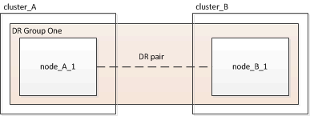

= Expansão de uma configuração de FC MetroCluster de dois nós para uma configuração de quatro nós
:allow-uri-read: 
:icons: font
:imagesdir: ../media/

[role="lead"]
A expansão de uma configuração de FC MetroCluster de dois nós para uma configuração de FC MetroCluster de quatro nós envolve a adição de uma controladora a cada cluster para formar um par de HA em cada local do MetroCluster e, em seguida, a atualização da configuração de FC MetroCluster.

.Antes de começar
* Os nós precisam estar executando o ONTAP 9 ou posterior em uma configuração de MetroCluster FC.
+
Este procedimento não é suportado em versões anteriores do ONTAP ou em configurações IP do MetroCluster.

* Se as plataformas em sua configuração de dois nós não forem suportadas no ONTAP 9.2 e você planeja atualizar para plataformas compatíveis com o ONTAP 9.2 _e_ expandir para um cluster de quatro nós, você deve atualizar as plataformas na configuração de dois nós _before_ expandindo a configuração do MetroCluster FC.
* A configuração existente do MetroCluster FC deve estar correta.
* O equipamento que você está adicionando deve ser suportado e atender a todos os requisitos descritos nos procedimentos a seguir:
+
link:../install-fc/index.html["Instalação e configuração do MetroCluster conectado à malha"]

+
link:../install-stretch/concept_considerations_differences.html["Instalação e configuração do Stretch MetroCluster"]

* Você precisa ter portas de switch FC disponíveis para acomodar as novas controladoras e todas as novas pontes.
* Verifique se você tem um domínio de broadcast padrão criado nos nós antigos.
+
Quando você adiciona novos nós a um cluster existente sem um domínio de broadcast padrão, as LIFs de gerenciamento de nós são criadas para os novos nós usando identificadores únicos universais (UUIDs) em vez dos nomes esperados. Para obter mais informações, consulte o artigo da base de dados de Conhecimento https://kb.netapp.com/onprem/ontap/os/Node_management_LIFs_on_newly-added_nodes_generated_with_UUID_names["LIFs de gerenciamento de nós em nós recém-adicionados gerados com nomes UUID"^] .

* Você precisa da senha de administrador e acesso a um servidor FTP ou SCP.

.Sobre esta tarefa
* Este procedimento aplica-se apenas às configurações do MetroCluster FC.
* Este procedimento é disruptivo e leva aproximadamente quatro horas para ser concluído.
* Antes de executar esse procedimento, a configuração do MetroCluster FC consiste em dois clusters de nó único:
+

+
Após concluir este procedimento, a configuração do MetroCluster FC consiste em dois pares de HA, um em cada local:

+
image::../media/mcc_dr_groups_4_node.gif[nó de grupos de dr de mcc 4]

* Ambos os locais devem ser igualmente expandidos.
+
Uma configuração do MetroCluster não pode consistir em um número irregular de nós.

* Este procedimento pode demorar mais de uma hora por local, com tempo adicional para tarefas como inicializar os discos e inicializar os novos nós.
+
O tempo para inicializar os discos depende do tamanho dos discos.

* Este procedimento utiliza o seguinte fluxo de trabalho:

image::../media/workflow_mcc_2_to_4_node_expansion_high_level.gif[fluxo de trabalho mcc de 2 a 4 nós de expansão de alto nível]
