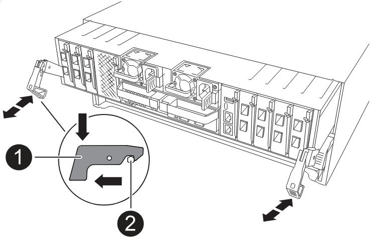

= Atualização de controladores em uma configuração IP MetroCluster usando switchover e switchback (ONTAP 9.8 e posterior)
:allow-uri-read: 
:icons: font
:imagesdir: ../media/

[role="lead"]
A partir do ONTAP 9.8, você pode usar a operação de switchover do MetroCluster para fornecer serviços sem interrupções aos clientes enquanto os módulos de controladora no cluster de parceiros são atualizados. Outros componentes (como prateleiras de armazenamento ou switches) não podem ser atualizados como parte deste procedimento.

== Plataformas suportadas por este procedimento

* As plataformas devem estar executando o ONTAP 9.8 ou posterior.
* A plataforma alvo (nova) deve ser um modelo diferente da plataforma original.
* Você só pode atualizar modelos de plataforma específicos usando este procedimento em uma configuração IP do MetroCluster.
+
** Para obter informações sobre quais combinações de atualização de plataforma são suportadas, consulte a tabela de atualização IP do MetroCluster no link:concept_choosing_controller_upgrade_mcc.html["Escolha um procedimento de atualização da controladora"].
+
 https://docs.netapp.com/us-en/ontap-metrocluster/upgrade/concept_choosing_controller_upgrade_mcc.html#choosing-a-procedure-that-uses-the-switchover-and-switchback-process["Escolher um método de atualização ou atualização"]Consulte para obter mais procedimentos.

== Sobre esta tarefa

* Este procedimento aplica-se aos módulos do controlador numa configuração IP do MetroCluster.
* Todos os controladores na configuração devem ser atualizados durante o mesmo período de manutenção.
+
A operação da configuração do MetroCluster com diferentes tipos de controlador não é suportada fora desta atividade de manutenção.

* Os switches IP MetroCluster (tipo de switch, fornecedor e modelo) e a versão do firmware devem ser suportados nos controladores existentes e novos na configuração de atualização.
+
Consulte a link:https://hwu.netapp.com["NetApp Hardware Universe"^]ou a link:https://imt.netapp.com/matrix/["IMT"^] para obter informações sobre switches e versões de firmware compatíveis.

* Se estiver ativado no seu sistema, link:../maintain/task-configure-encryption.html#disable-end-to-end-encryption["desative a criptografia de ponta a ponta"] antes de executar a atualização.
* Se a nova plataforma tiver menos slots do que o sistema original, ou se tiver menos ou diferentes tipos de portas, talvez seja necessário adicionar um adaptador ao novo sistema.
* Você reutiliza os endereços IP, as máscaras de rede e os gateways das plataformas originais nas novas plataformas.

Os seguintes nomes de exemplo são usados neste procedimento:

* Local_A
+
** Antes da atualização:
+
*** Node_A_1-old
*** Node_A_2-old

** Após a atualização:
+
*** Node_A_1-novo
*** Node_A_2-novo

* Local_B
+
** Antes da atualização:
+
*** Node_B_1-old
*** Node_B_2-old

** Após a atualização:
+
*** Node_B_1-novo
*** Node_B_2-novo

== Ativar o registo da consola

O NetApp recomenda fortemente que você ative o log do console nos dispositivos que você está usando e execute as seguintes ações ao executar este procedimento:

* Deixe o AutoSupport ativado durante a manutenção.
* Acione uma mensagem de manutenção do AutoSupport antes e depois da manutenção para desativar a criação de casos durante a atividade de manutenção.
+
Consulte o artigo da base de dados de Conhecimento link:https://kb.netapp.com/Support_Bulletins/Customer_Bulletins/SU92["Como suprimir a criação automática de casos durante as janelas de manutenção programada"^].

* Ative o registo de sessão para qualquer sessão CLI. Para obter instruções sobre como ativar o registo de sessão, consulte a secção "saída de sessão de registo" no artigo da base de dados de conhecimento link:https://kb.netapp.com/on-prem/ontap/Ontap_OS/OS-KBs/How_to_configure_PuTTY_for_optimal_connectivity_to_ONTAP_systems["Como configurar o PuTTY para uma conetividade ideal aos sistemas ONTAP"^].

== Defina o bootarg necessário no sistema existente

Se você estiver atualizando para um sistema AFF A70, AFF A90 ou AFF A1K, siga as etapas para definir o `hw.cxgbe.toe_keepalive_disable=1` bootarg.

CAUTION: Se você estiver atualizando para um sistema AFF A70, AFF A90 ou AFF A1K, *deve* concluir esta tarefa antes de executar a atualização. Esta tarefa *somente* se aplica a atualizações para um sistema AFF A70, AFF A90 ou AFF A1K a partir de um sistema suportado. Para todas as outras atualizações, você pode pular esta tarefa e ir diretamente para <<prepare_so_sb_upgrade,Prepare-se para a atualização>>.

.Passos
. Pare um nó em cada local e permita que seu parceiro de HA faça um takeover do nó:
+
`halt  -node <node_name>`

. No `LOADER` prompt do nó interrompido, digite o seguinte:
+
`setenv hw.cxgbe.toe_keepalive_disable 1`

+
`saveenv`

+
`printenv hw.cxgbe.toe_keepalive_disable`

. Inicialize o nó:
+
`boot_ontap`

. Quando o nó for inicializado, execute um giveback para o nó no prompt:
+
`storage failover giveback -ofnode <node_name>`

. Repita as etapas em cada nó no grupo DR que está sendo atualizado.

== Prepare-se para a atualização

Antes de fazer quaisquer alterações na configuração do MetroCluster existente, você deve verificar a integridade da configuração, preparar as novas plataformas e executar outras tarefas diversas.

=== Fluxo de trabalho para atualizar controladores em uma configuração IP MetroCluster

Você pode usar o diagrama de fluxo de trabalho para ajudá-lo a Planejar as tarefas de atualização.

image::../media/workflow_ip_upgrade.png[atualização do ip do fluxo de trabalho]

=== Atualize os arquivos RCF do switch MetroCluster antes de atualizar os controladores

Dependendo dos modelos de plataforma antigos, ou se a configuração do switch não estiver na versão mínima, ou se você quiser alterar IDs de VLAN usados pelas conexões MetroCluster back-end, você deve atualizar os arquivos RCF do switch antes de iniciar o procedimento de atualização da plataforma.

.Sobre esta tarefa
Você deve atualizar o arquivo RCF nos seguintes cenários:

* Para determinados modelos de plataforma, os switches devem estar usando um ID VLAN suportado para as conexões IP MetroCluster back-end. Se os modelos de plataforma antigos ou novos estiverem na tabela a seguir, *e não* usando um ID VLAN suportado, você deverá atualizar os arquivos RCF do switch.
+

NOTE: As conexões de cluster locais podem usar qualquer VLAN, elas não precisam estar no intervalo especificado.

+
|===

| Modelo de plataforma (antigo ou novo) | IDs de VLAN suportadas 

 a| 
** AFF A400

 a| 
** 10
** 20
** Qualquer valor no intervalo de 101 a 4096 inclusive.

|===
* A configuração do switch não foi configurada com a versão RCF mínima suportada:
+
|===

| Modelo do interrutor | Versão necessária do ficheiro RCF 

 a| 
Cisco 3132Q-V
 a| 
1,7 ou posterior

 a| 
Cisco 3232C
 a| 
1,7 ou posterior

 a| 
Broadcom BES-53248
 a| 
1,3 ou posterior

|===
* Você deseja alterar a configuração da VLAN.
+
O intervalo de ID de VLAN é de 101 a 4096 inclusive.

Os switches no site_A serão atualizados quando os controladores no site_A forem atualizados.

.Passos
. Preparar os comutadores IP para a aplicação dos novos ficheiros RCF.
+
Siga as etapas na seção para o fornecedor do switch:

+
** link:../install-ip/task_switch_config_broadcom.html#resetting-the-broadcom-ip-switch-to-factory-defaults["Redefina o switch IP Broadcom para os padrões de fábrica"]
** link:../install-ip/task_switch_config_cisco.html#resetting-the-cisco-ip-switch-to-factory-defaults["Redefina o switch IP Cisco para os padrões de fábrica"]
** link:../install-ip/task_switch_config_nvidia.html#reset-the-nvidia-ip-sn2100-switch-to-factory-defaults["Redefina o switch NVIDIA IP SN2100 para os padrões de fábrica"]

. Baixe e instale os arquivos RCF.
+
Siga as etapas na seção para o fornecedor do switch:

+
** link:../install-ip/task_switch_config_broadcom.html#downloading-and-installing-the-broadcom-rcf-files["Baixe e instale os arquivos Broadcom RCF"]
** link:../install-ip/task_switch_config_cisco.html#downloading-and-installing-the-cisco-ip-rcf-files["Transfira e instale os ficheiros Cisco IP RCF"]
** link:../install-ip/task_switch_config_nvidia.html#download-and-install-the-nvidia-rcf-files["Transfira e instale os ficheiros NVIDIA IP RCF"]

=== Mapear portas dos nós antigos para os novos nós

Você deve verificar se as portas físicas no node_A_1-old mapeiam corretamente para as portas físicas no node_A_1-novo, o que permitirá que node_A_1-novo se comunique com outros nós no cluster e com a rede após a atualização.

.Sobre esta tarefa
Quando o novo nó é inicializado pela primeira vez durante o processo de atualização, ele reproduzirá a configuração mais recente do nó antigo que está substituindo. Quando você inicializa node_A_1-novo, o ONTAP tenta hospedar LIFs nas mesmas portas que foram usadas no node_A_1-old. Portanto, como parte da atualização, você deve ajustar a configuração de porta e LIF para que seja compatível com a do nó antigo. Durante o procedimento de atualização, você executará etapas nos nós antigos e novos para garantir a configuração correta de cluster, gerenciamento e LIF de dados.

A tabela a seguir mostra exemplos de alterações de configuração relacionadas aos requisitos de porta dos novos nós.

|===

3+| Portas físicas de interconexão de cluster 

| Controlador antigo | Novo controlador | Ação necessária 

 a| 
e0a, e0b
 a| 
e3a, e3b
 a| 
Nenhuma porta correspondente. Após a atualização, você deve recriar as portas do cluster.

 a| 
e0c, e0d
 a| 
e0a, e0b, e0c, e0d
 a| 
e0c e e0d são portas correspondentes. Você não precisa alterar a configuração, mas após a atualização, você pode espalhar suas LIFs de cluster pelas portas de cluster disponíveis.

|===
.Passos
. Determine quais portas físicas estão disponíveis nos novos controladores e quais LIFs podem ser hospedados nas portas.
+
O uso da porta do controlador depende do módulo da plataforma e quais switches você usará na configuração IP do MetroCluster. Você pode coletar o uso de portas das novas plataformas do link:https://hwu.netapp.com["NetApp Hardware Universe"].

. Planeje o uso da porta e preencha as tabelas a seguir para referência para cada um dos novos nós.
+
Irá consultar a tabela à medida que realizar o procedimento de atualização.

+
|===

|  3+| Node_A_1-old 3+| Node_A_1-novo 

| LIF | Portas | IPspaces | Domínios de broadcast | Portas | IPspaces | Domínios de broadcast 

 a| 
Cluster 1
 a| 
 a| 
 a| 
 a| 
 a| 
 a| 

 a| 
Cluster 2
 a| 
 a| 
 a| 
 a| 
 a| 
 a| 

 a| 
Cluster 3
 a| 
 a| 
 a| 
 a| 
 a| 
 a| 

 a| 
Cluster 4
 a| 
 a| 
 a| 
 a| 
 a| 
 a| 

 a| 
Gerenciamento de nós
 a| 
 a| 
 a| 
 a| 
 a| 
 a| 

 a| 
Gerenciamento de clusters
 a| 
 a| 
 a| 
 a| 
 a| 
 a| 

 a| 
Dados 1
 a| 
 a| 
 a| 
 a| 
 a| 
 a| 

 a| 
Dados 2
 a| 
 a| 
 a| 
 a| 
 a| 
 a| 

 a| 
Dados 3
 a| 
 a| 
 a| 
 a| 
 a| 
 a| 

 a| 
Dados 4
 a| 
 a| 
 a| 
 a| 
 a| 
 a| 

 a| 
SAN
 a| 
 a| 
 a| 
 a| 
 a| 
 a| 

 a| 
Porta entre clusters
 a| 
 a| 
 a| 
 a| 
 a| 
 a| 

|===

=== Netboot os novos controladores

Depois de instalar os novos nós, você precisa netboot para garantir que os novos nós estejam executando a mesma versão do ONTAP que os nós originais. O termo netboot significa que você está inicializando a partir de uma imagem ONTAP armazenada em um servidor remoto. Ao se preparar para netboot, você deve colocar uma cópia da imagem de inicialização do ONTAP 9 em um servidor da Web que o sistema possa acessar.

.Passos
. Netboot os novos controladores:
+
.. Acesse o https://mysupport.netapp.com/site/["Site de suporte da NetApp"] para baixar os arquivos usados para executar o netboot do sistema.
.. Transfira o software ONTAP adequado a partir da secção de transferência de software do site de suporte da NetApp e guarde o `ontap-version_image.tgz` ficheiro num diretório acessível pela Web.
.. Mude para o diretório acessível pela Web e verifique se os arquivos necessários estão disponíveis.
+
Sua lista de diretórios deve conter uma pasta netboot com um arquivo do kernel:

+
`_ontap-version_image.tgz`

+
Você não precisa extrair o `_ontap-version_image.tgz` arquivo.

.. No prompt Loader, configure a conexão netboot para um LIF de gerenciamento:
+
|===

| Se o endereço IP for... | Então... 

 a| 
DHCP
 a| 
Configurar a ligação automática:

`ifconfig e0M -auto`

 a| 
Estático
 a| 
Configurar a ligação manual:

`ifconfig e0M -addr=_ip_addr_ -mask=_netmask_ -gw=_gateway_`

|===
.. Execute o netboot.
+
`netboot \http://_web_server_ip/path_to_web-accessible_directory/ontap-version_image.tgz`

.. No menu de inicialização, selecione a opção **(7) instale primeiro o novo software** para baixar e instalar a nova imagem de software no dispositivo de inicialização.
+
Ignore a seguinte mensagem:

+
`"This procedure is not supported for Non-Disruptive Upgrade on an HA pair"`. Isso se aplica a atualizações de software sem interrupções, e não a atualizações de controladores.

.. Se você for solicitado a continuar o procedimento, digite `y` e, quando solicitado a fornecer o pacote, digite o URL do arquivo de imagem:
+
`http://__web_server_ip/path_to_web-accessible_directory/ontap-version___image.tgz`

.. Introduza o nome de utilizador e a palavra-passe, se aplicável, ou prima Enter para continuar.
.. Certifique-se de entrar `n` para ignorar a recuperação de backup quando você vir um prompt semelhante ao seguinte:
+
[listing]
----
Do you want to restore the backup configuration now? {y|n} n
----
.. Reinicie entrando `*y*` quando você vir um prompt semelhante ao seguinte:
+
[listing]
----
The node must be rebooted to start using the newly installed software. Do you want to reboot now? {y|n}
----

=== Limpe a configuração de um módulo do controlador

[role="lead"]
Antes de usar um novo módulo de controlador na configuração do MetroCluster, você deve limpar a configuração existente.

.Passos
. Se necessário, interrompa o nó para exibir o prompt Loader:
+
`halt`

. No prompt Loader, defina as variáveis ambientais como valores padrão:
+
`set-defaults`

. Salvar o ambiente:
+
`saveenv`

. No prompt DO Loader, inicie o menu de inicialização:
+
`boot_ontap menu`

. No prompt do menu de inicialização, desmarque a configuração:
+
`wipeconfig`

+
Responda `yes` ao prompt de confirmação.

+
O nó reinicializa e o menu de inicialização é exibido novamente.

. No menu de inicialização, selecione a opção *5* para inicializar o sistema no modo Manutenção.
+
Responda `yes` ao prompt de confirmação.

=== Verifique a integridade do MetroCluster antes da atualização do site

Você deve verificar a integridade e a conectividade da configuração do MetroCluster antes de executar a atualização.

.Passos
. Verifique a operação da configuração do MetroCluster no ONTAP:
+
.. Verifique se os nós são multipathed: Mais
`node run -node <node_name> sysconfig -a`
+
Você deve emitir este comando para cada nó na configuração do MetroCluster.

.. Verifique se não há discos quebrados na configuração
`storage disk show -broken`
+
Você deve emitir este comando em cada nó na configuração do MetroCluster.

.. Verifique se existem alertas de saúde:
+
`system health alert show`

+
Você deve emitir este comando em cada cluster.

.. Verifique as licenças nos clusters:
+
`system license show`

+
Você deve emitir este comando em cada cluster.

.. Verifique os dispositivos conetados aos nós:
+
`network device-discovery show`

+
Você deve emitir este comando em cada cluster.

.. Verifique se o fuso horário e a hora estão definidos corretamente em ambos os sites:
+
`cluster date show`

+
Você deve emitir este comando em cada cluster. Pode utilizar os `cluster date` comandos para configurar a hora e o fuso horário.

. Confirme o modo operacional da configuração do MetroCluster e efetue uma verificação do MetroCluster.
+
.. Confirme a configuração do MetroCluster e se o modo operacional é `normal`
`metrocluster show`
.. Confirme que todos os nós esperados são mostrados
`metrocluster node show`
.. Emita o seguinte comando:
+
`metrocluster check run`

.. Apresentar os resultados da verificação MetroCluster:
+
`metrocluster check show`

. Verifique o cabeamento do MetroCluster com a ferramenta Config Advisor.
+
.. Baixe e execute o Config Advisor.
+
https://mysupport.netapp.com/site/tools/tool-eula/activeiq-configadvisor["NetApp Downloads: Config Advisor"]

.. Depois de executar o Config Advisor, revise a saída da ferramenta e siga as recomendações na saída para resolver quaisquer problemas descobertos.

=== Reúna informações antes da atualização

Antes de atualizar, você deve reunir informações para cada um dos nós e, se necessário, ajustar os domínios de broadcast de rede, remover quaisquer VLANs e grupos de interfaces e reunir informações de criptografia.

.Passos
. Registre o cabeamento físico de cada nó, rotulando os cabos conforme necessário para permitir o cabeamento correto dos novos nós.
. Reunir informações de interconexão, porta e LIF para cada nó.
+
Você deve reunir a saída dos seguintes comandos para cada nó:

+
** `metrocluster interconnect show`
** `metrocluster configuration-settings connection show`
** `network interface show -role cluster,node-mgmt`
** `network port show -node <node_name> -type physical`
** `network port vlan show -node <node_name>`
** `network port ifgrp show -node <node_name> -instance`
** `network port broadcast-domain show`
** `network port reachability show -detail`
** `network ipspace show`
** `volume show`
** `storage aggregate show`
** `system node run -node <node_name> sysconfig -a`
** `aggr show -r`
** `disk show`
** `system node run <node-name> disk show`
** `vol show -fields type`
** `vol show -fields type , space-guarantee`
** `vserver fcp initiator show`
** `storage disk show`
** `metrocluster configuration-settings interface show`

. Reúna os UUIDs para o site_B (o site cujas plataformas estão sendo atualizadas):
+
`metrocluster node show -fields node-cluster-uuid, node-uuid`

+
Esses valores devem ser configurados com precisão nos novos módulos do controlador site_B para garantir uma atualização bem-sucedida. Copie os valores para um arquivo para que você possa copiá-los para os comandos apropriados posteriormente no processo de atualização.

+
O exemplo a seguir mostra a saída do comando com os UUIDs:

+
[listing]
----
cluster_B::> metrocluster node show -fields node-cluster-uuid, node-uuid
  (metrocluster node show)
dr-group-id cluster     node   node-uuid                            node-cluster-uuid
----------- --------- -------- ------------------------------------ ------------------------------
1           cluster_A node_A_1 f03cb63c-9a7e-11e7-b68b-00a098908039 ee7db9d5-9a82-11e7-b68b-00a098908039
1           cluster_A node_A_2 aa9a7a7a-9a81-11e7-a4e9-00a098908c35 ee7db9d5-9a82-11e7-b68b-00a098908039
1           cluster_B node_B_1 f37b240b-9ac1-11e7-9b42-00a098c9e55d 07958819-9ac6-11e7-9b42-00a098c9e55d
1           cluster_B node_B_2 bf8e3f8f-9ac4-11e7-bd4e-00a098ca379f 07958819-9ac6-11e7-9b42-00a098c9e55d
4 entries were displayed.
cluster_B::*
----
+
É recomendável que você grave os UUIDs em uma tabela semelhante à seguinte.

+
|===

| Cluster ou nó | UUID 

 a| 
Cluster_B
 a| 
07958819-9ac6-11e7-9b42-00a098c9e55d

 a| 
node_B_1
 a| 
f37b240b-9ac1-11e7-9b42-00a098c9e55d

 a| 
node_B_2
 a| 
bf8e3f8f-9ac4-11e7-bd4e-00a098ca379f

 a| 
Cluster_A
 a| 
ee7db9d5-9a82-11e7-b68b-00a098908039

 a| 
node_A_1
 a| 
f03cb63c-9a7e-11e7-b68b-00a098908039

 a| 
node_A_2
 a| 
a9a7a7a-9a81-11e7-a4e9-00a098908c35

|===
. Se os nós de MetroCluster estiverem em uma configuração de SAN, colete as informações relevantes.
+
Você deve reunir a saída dos seguintes comandos:

+
** `fcp adapter show -instance`
** `fcp interface show -instance`
** `iscsi interface show`
** `ucadmin show`

. Se o volume raiz estiver criptografado, colete e salve a senha usada para o gerenciador de chaves:
+
`security key-manager backup show`

. Se os nós do MetroCluster estiverem usando criptografia para volumes ou agregados, copie informações sobre as chaves e senhas.
+
Para obter informações adicionais, https://docs.netapp.com/ontap-9/topic/com.netapp.doc.pow-nve/GUID-1677AE0A-FEF7-45FA-8616-885AA3283BCF.html["Fazer backup manual de informações de gerenciamento de chaves integradas"]consulte .

+
.. Se o Gerenciador de chaves integrado estiver configurado
`security key-manager onboard show-backup`
+
Você precisará da senha mais tarde no procedimento de atualização.

.. Se o gerenciamento de chaves empresariais (KMIP) estiver configurado, emita os seguintes comandos:
+
`security key-manager external show -instance`
`security key-manager key query`

. Reúna as IDs do sistema dos nós existentes:
+
`metrocluster node show -fields node-systemid,ha-partner-systemid,dr-partner-systemid,dr-auxiliary-systemid`

+
A saída a seguir mostra as unidades reatribuídas.

+
[listing]
----
::> metrocluster node show -fields node-systemid,ha-partner-systemid,dr-partner-systemid,dr-auxiliary-systemid

dr-group-id cluster     node     node-systemid ha-partner-systemid dr-partner-systemid dr-auxiliary-systemid
----------- ----------- -------- ------------- ------------------- ------------------- ---------------------
1           cluster_A node_A_1   537403324     537403323           537403321           537403322
1           cluster_A node_A_2   537403323     537403324           537403322           537403321
1           cluster_B node_B_1   537403322     537403321           537403323           537403324
1           cluster_B node_B_2   537403321     537403322           537403324           537403323
4 entries were displayed.
----

=== Remova a monitorização do Mediator ou do tiebreaker

Antes de atualizar as plataformas, você deve remover o monitoramento se a configuração do MetroCluster for monitorada com o utilitário tiebreaker ou Mediator.

.Passos
. Colete a saída para o seguinte comando:
+
`storage iscsi-initiator show`

. Remova a configuração do MetroCluster existente do tiebreaker, Mediator ou outro software que possa iniciar o switchover.
+
|===

| Se você estiver usando... | Use este procedimento... 

 a| 
Desempate
 a| 
link:../tiebreaker/concept_configuring_the_tiebreaker_software.html#removing-metrocluster-configurations["Remoção das configurações do MetroCluster"]

 a| 
Mediador
 a| 
Execute o seguinte comando no prompt do ONTAP:

`metrocluster configuration-settings mediator remove`

 a| 
Aplicativos de terceiros
 a| 
Consulte a documentação do produto.

|===

=== Envie uma mensagem AutoSupport personalizada antes da manutenção

Antes de executar a manutenção, você deve emitir uma mensagem AutoSupport para notificar o suporte técnico da NetApp de que a manutenção está em andamento. Informar o suporte técnico de que a manutenção está em andamento impede que ele abra um caso partindo do pressuposto de que ocorreu uma interrupção.

.Sobre esta tarefa
Esta tarefa deve ser executada em cada site do MetroCluster.

.Passos
. Inicie sessão no cluster.
. Chame uma mensagem AutoSupport indicando o início da manutenção:
+
`system node autosupport invoke -node * -type all -message MAINT=__maintenance-window-in-hours__`

+
O `maintenance-window-in-hours` parâmetro especifica o comprimento da janela de manutenção, com um máximo de 72 horas. Se a manutenção for concluída antes do tempo decorrido, você poderá invocar uma mensagem AutoSupport indicando o fim do período de manutenção:

+
`system node autosupport invoke -node * -type all -message MAINT=end`

. Repita estas etapas no site do parceiro.

== Alterne a configuração do MetroCluster

Você deve alternar a configuração para site_A para que as plataformas no site_B possam ser atualizadas.

.Sobre esta tarefa
Esta tarefa tem de ser executada no site_A.

Depois de concluir esta tarefa, o cluster_A está ativo e fornecendo dados para ambos os sites. O cluster_B está inativo e pronto para iniciar o processo de atualização.

image::../media/mcc_upgrade_cluster_a_in_switchover.png[cluster a de atualização do mcc em switchover]

.Passos
. Alterne a configuração do MetroCluster para site_A para que os nós do site_B possam ser atualizados:
+
.. Execute o seguinte comando no cluster_A:
+
`metrocluster switchover -controller-replacement true`

+
A operação pode levar vários minutos para ser concluída.

.. Monitorize a operação de comutação:
+
`metrocluster operation show`

.. Após a conclusão da operação, confirme se os nós estão no estado de comutação:
+
`metrocluster show`

.. Verifique o status dos nós MetroCluster:
+
`metrocluster node show`

+
A recuperação automática de agregados após o switchover negociado é desativada durante a atualização do controlador.

== Remova as configurações de interface e desinstale os controladores antigos

Verifique a colocação correta de LIF. Em seguida, remova as VLANs e os grupos de interface nos controladores antigos e desinstale fisicamente os controladores.

.Sobre esta tarefa
* Essas etapas são executadas nos controladores antigos (node_B_1-old, node_B_2-old).
* Consulte as informações coletadas no link:task_upgrade_controllers_in_a_four_node_ip_mcc_us_switchover_and_switchback_mcc_ip.html["Mapear portas dos nós antigos para os novos nós"].

.Passos
. Inicialize os nós antigos e faça login nos nós:
+
`boot_ontap`

. Modifique as LIFs entre clusters nos controladores antigos para usar uma porta inicial diferente das portas usadas para interconexão de HA ou interconexão de DR IP MetroCluster nos novos controladores.
+

NOTE: Esta etapa é necessária para uma atualização bem-sucedida.

+
As LIFs entre clusters nos controladores antigos devem usar uma porta inicial diferente das portas usadas para interconexão de HA ou interconexão de DR IP MetroCluster nos novos controladores. Por exemplo, quando você faz upgrade para controladoras AFF A90, as portas de interconexão de HA são e1a e e7a e as portas de interconexão de DR IP MetroCluster são E2B e e3b. Você deve mover as LIFs entre clusters nos controladores antigos se eles estiverem hospedados nas portas e1a, e7a, E2B ou e3b.

+
Para a distribuição e alocação de portas nos novos nós, consulte o https://hwu.netapp.com["NetApp Hardware Universe"].

+
.. Nos controladores antigos, veja os LIFs entre clusters:
+
`network interface show  -role intercluster`

+
Execute uma das ações a seguir, dependendo se as LIFs entre clusters nos controladores antigos usam as mesmas portas que as portas usadas para interconexão de HA ou interconexão de DR IP MetroCluster nas novas controladoras.

+
[cols="2*"]
|===
| Se os LIFs entre clusters... | Ir para... 

| Use a mesma porta inicial | <<controller_manual_upgrade_prepare_network_ports_2b,Subpasso b>> 

| Utilize uma porta inicial diferente | <<controller_manual_upgrade_prepare_network_ports_3,Passo 3>> 
|===
.. [[controller_manual_upgrade_prepare_network_ports_2b]]modifique os LIFs entre clusters para usar uma porta inicial diferente:
+
`network interface modify -vserver <vserver> -lif <intercluster_lif> -home-port <port-not-used-for-ha-interconnect-or-mcc-ip-dr-interconnect-on-new-nodes>`

.. Verifique se todas as LIFs entre clusters estão em suas novas portas residenciais:
+
`network interface show -role intercluster -is-home  false`

+
A saída do comando deve estar vazia, indicando que todas as LIFs entre clusters estão em suas respetivas portas residenciais.

.. Se houver LIFs que não estejam em suas portas residenciais, reverta-os usando o seguinte comando:
+
`network interface revert -lif <intercluster_lif>`

+
Repita o comando para cada LIF entre clusters que não está na porta inicial.

. [[controller_manual_upgrade_prepare_network_ports_3]]atribua a porta inicial de todos os LIFs de dados no controlador antigo a uma porta comum que é a mesma nos módulos de controladora antigos e novos.
+

CAUTION: Se os controladores antigos e novos não tiverem uma porta comum, não será necessário modificar as LIFs de dados. Pule esta etapa e vá diretamente para <<upgrades_manual_without_matching_ports,Passo 4>>.

+
.. Apresentar os LIFs:
+
`network interface show`

+
Todos os LIFS de dados, incluindo SAN e nas, serão administradores acima e operacionalmente inativos, uma vez que eles estão ativos no local de switchover (cluster_A).

.. Revise a saída para encontrar uma porta de rede física comum que seja a mesma nos controladores antigos e novos que não seja usada como uma porta de cluster.
+
Por exemplo, e0d é uma porta física em controladores antigos e também está presente em novos controladores. e0d não é usado como uma porta de cluster ou de outra forma nos novos controladores.

+
Para obter informações sobre a utilização de portas para modelos de plataforma, consulte a. https://hwu.netapp.com/["NetApp Hardware Universe"]

.. Modifique todos os dados LIFS para usar a porta comum como a porta inicial
`network interface modify -vserver <svm-name> -lif <data-lif> -home-port <port-id>`
+
No exemplo a seguir, isso é "e0d".

+
Por exemplo:

+
[listing]
----
network interface modify -vserver vs0 -lif datalif1 -home-port e0d
----

. [[Upgrades_manual_without_Matching_ports]] Modificar domínios de broadcast para remover a VLAN e as portas físicas que precisam ser excluídas:
+
`broadcast-domain remove-ports -broadcast-domain <broadcast-domain-name> -ports <node-name:port-id>`

+
Repita esta etapa para todas as portas VLAN e físicas.

. Remova quaisquer portas VLAN usando portas de cluster como portas membro e ifgrps usando portas de cluster como portas membro.
+
.. Excluir portas VLAN
`network port vlan delete -node <node_name> -vlan-name <portid-vlandid>`
+
Por exemplo:

+
[listing]
----
network port vlan delete -node node1 -vlan-name e1c-80
----
.. Remover portas físicas dos grupos de interface:
+
`network port ifgrp remove-port -node <node_name> -ifgrp <interface-group-name> -port <portid>`

+
Por exemplo:

+
[listing]
----
network port ifgrp remove-port -node node1 -ifgrp a1a -port e0d
----
.. Remova as portas VLAN e grupo de interfaces do domínio de broadcast:
+
`network port broadcast-domain remove-ports -ipspace <ipspace> -broadcast-domain <broadcast-domain-name> -ports <nodename:portname,nodename:portnamee>,..`

.. Modifique as portas do grupo de interfaces para usar outras portas físicas como membro, conforme necessário:
+
`ifgrp add-port -node <node_name> -ifgrp <interface-group-name> -port <port-id>`

. Interrompa os nós para o prompt DO Loader:
+
`halt -inhibit-takeover true`

. Conete-se ao console serial dos controladores antigos (node_B_1-old e node_B_2-old) no site_B e verifique se ele está exibindo o prompt Loader.
. Reúna os valores do bootarg:
+
`printenv`

. Desconete as conexões de storage e rede em node_B_1-old e node_B_2-old e rotule os cabos para que possam ser reconetados aos novos nós.
. Desconete os cabos de alimentação do node_B_1-old e node_B_2-old.
. Remova os controladores node_B_1-old e node_B_2-old do rack.

=== Configure os novos controladores

É necessário colocar em rack e cabo as novas controladoras.

.Passos
. Planeje o posicionamento dos novos módulos de controladora e compartimentos de armazenamento conforme necessário.
+
O espaço em rack depende do modelo de plataforma dos módulos de controladora, dos tipos de switch e do número de compartimentos de storage em sua configuração.

. Aterre-se corretamente.
. Se a atualização exigir a substituição dos módulos da controladora, por exemplo, a atualização de um sistema AFF 800 para um sistema AFF A90, você deve remover o módulo da controladora do chassi quando substituir o módulo da controladora. Para todas as outras atualizações, vá para <<ip_upgrades_so_sb_4,Passo 4>>.
+
Na parte frontal do chassis, utilize os polegares para empurrar firmemente cada unidade até sentir um batente positivo. Isto confirma que as unidades estão firmemente assentadas contra o plano médio do chassis.

+
image::../media/drw_a800_drive_seated.png[Mostra a remoção do módulo do controlador do chassis]

. [[IP_Upgrades_SO_SB_4]] instale os módulos do controlador.
+

NOTE: As etapas de instalação que você seguir dependem se a atualização requer a substituição dos módulos da controladora, como uma atualização de um sistema AFF 800 para um sistema AFF A90.

+
[role="tabbed-block"]
====
.Substituição dos módulos do controlador
--
A instalação dos novos controladores separadamente não se aplica a atualizações de sistemas integrados com discos e controladores no mesmo chassi, por exemplo, de um sistema AFF A800 para um sistema AFF A90. Os novos módulos do controlador e as placas de e/S devem ser trocados após desligar os controladores antigos, como mostrado na imagem abaixo.

A imagem de exemplo a seguir é apenas para representação, os módulos do controlador e as placas de e/S podem variar entre sistemas.

--
.Todas as outras atualizações
--
Instale os módulos do controlador no rack ou gabinete.

--
====
. Faça o cabeamento das conexões de alimentação, console serial e gerenciamento dos controladores, conforme descrito em link:../install-ip/using_rcf_generator.html["Cabeamento dos switches IP MetroCluster"]
+
Não conete nenhum outro cabo que tenha sido desconetado dos controladores antigos neste momento.

+
https://docs.netapp.com/us-en/ontap-systems/index.html["Documentação dos sistemas de hardware da ONTAP"^]

. Ligue os novos nós e inicialize-os no modo Manutenção.

=== Restaure a configuração do HBA

Dependendo da presença e configuração das placas HBA no módulo controlador, você precisa configurá-las corretamente para uso do seu site.

.Passos
. No modo de manutenção, configure as definições para quaisquer HBAs no sistema:
+
.. Verifique as definições atuais das portas:
+
`ucadmin show`

.. Atualize as definições da porta conforme necessário.

+
|===

| Se você tem este tipo de HBA e modo desejado... | Use este comando... 

 a| 
CNA FC
 a| 
`ucadmin modify -m fc -t initiator <adapter-name>`

 a| 
CNA Ethernet
 a| 
`ucadmin modify -mode cna <adapter-name>`

 a| 
Destino de FC
 a| 
`fcadmin config -t target <adapter-name>`

 a| 
Iniciador FC
 a| 
`fcadmin config -t initiator <adapter-name>`

|===
. Sair do modo de manutenção:
+
`halt`

+
Depois de executar o comando, aguarde até que o nó pare no prompt DO Loader.

. Inicialize o nó novamente no modo Manutenção para permitir que as alterações de configuração entrem em vigor:
+
`boot_ontap maint`

. Verifique as alterações feitas:
+
|===

| Se você tem este tipo de HBA... | Use este comando... 

 a| 
CNA
 a| 
`ucadmin show`

 a| 
FC
 a| 
`fcadmin show`

|===

=== Defina o estado de HA nos novos controladores e chassi

É necessário verificar o estado de HA dos controladores e do chassi e, se necessário, atualizar o estado para corresponder à configuração do sistema.

.Passos
. No modo de manutenção, apresentar o estado HA do módulo do controlador e do chassis:
+
`ha-config show`

+
O estado HA para todos os componentes deve ser `mccip`.

. Se o estado do sistema apresentado do controlador ou do chassis não estiver correto, defina o estado HA:
+
`ha-config modify controller mccip`

+
`ha-config modify chassis mccip`

. Verifique e modifique as portas Ethernet conetadas a gavetas NS224 ou switches de storage.
+
.. Verifique as portas Ethernet conetadas a gavetas NS224 ou switches de armazenamento:
+
`storage port show`

.. Defina todas as portas Ethernet conetadas a gavetas Ethernet ou switches de armazenamento, incluindo switches compartilhados para armazenamento e cluster, para o `storage` modo:
+
`storage port modify -p <port> -m storage`

+
Exemplo:

+
[listing]
----
*> storage port modify -p e5b -m storage
Changing NVMe-oF port e5b to storage mode
----
+

NOTE: Isso deve ser definido em todas as portas afetadas para uma atualização bem-sucedida.

+
Os discos das gavetas conetadas às portas Ethernet são reportados `sysconfig -v` na saída.

+
Consulte a link:https://hwu.netapp.com["NetApp Hardware Universe"^] para obter informações sobre as portas de armazenamento para o sistema para o qual está a atualizar.

.. Verifique se `storage` o modo está definido e confirme se as portas estão no estado online:
+
`storage port show`

. Parar o nó: `halt`
+
O nó deve parar no `LOADER>` prompt.

. Em cada nó, verifique a data, a hora e o fuso horário do sistema: `show date`
. Se necessário, defina a data em UTC ou GMT: `set date <mm/dd/yyyy>`
. Verifique a hora usando o seguinte comando no prompt do ambiente de inicialização: `show time`
. Se necessário, defina a hora em UTC ou GMT: `set time <hh:mm:ss>`
. Guarde as definições: `saveenv`
. Reunir variáveis de ambiente: `printenv`

=== Atualize os RCFs do switch para acomodar as novas plataformas

Você deve atualizar os switches para uma configuração que suporte os novos modelos de plataforma.

.Sobre esta tarefa
Você executa essa tarefa no site que contém os controladores que estão sendo atualizados no momento. Nos exemplos mostrados neste procedimento, estamos atualizando site_B primeiro.

Os switches no site_A serão atualizados quando os controladores no site_A forem atualizados.

.Passos
. Preparar os comutadores IP para a aplicação dos novos ficheiros RCF.
+
Siga as etapas do procedimento para o fornecedor do switch:

+
link:../install-ip/concept_considerations_differences.html["Instalação e configuração IP do MetroCluster"]

+
** link:../install-ip/task_switch_config_broadcom.html#resetting-the-broadcom-ip-switch-to-factory-defaults["[Redefina o switch IP Broadcom para os padrões de fábrica"]
** link:../install-ip/task_switch_config_cisco.html#resetting-the-cisco-ip-switch-to-factory-defaults["Redefina o switch IP Cisco para os padrões de fábrica"]
** link:../install-ip/task_switch_config_nvidia.html#reset-the-nvidia-ip-sn2100-switch-to-factory-defaults["Redefina o switch NVIDIA IP SN2100 para os padrões de fábrica"]

. Baixe e instale os arquivos RCF.
+
Siga as etapas na seção para o fornecedor do switch:

+
** link:../install-ip/task_switch_config_broadcom.html#downloading-and-installing-the-broadcom-rcf-files["Baixe e instale os arquivos Broadcom RCF"]
** link:../install-ip/task_switch_config_cisco.html#downloading-and-installing-the-cisco-ip-rcf-files["Transfira e instale os ficheiros Cisco IP RCF"]
** link:../install-ip/task_switch_config_nvidia.html#download-and-install-the-nvidia-rcf-files["Transfira e instale os ficheiros RCF switch IP SN2100 da NVIDIA"]

=== Defina as variáveis MetroCluster IP bootarg

Certos valores de inicialização IP do MetroCluster devem ser configurados nos novos módulos do controlador. Os valores devem corresponder aos configurados nos módulos do controlador antigos.

.Sobre esta tarefa
Nesta tarefa, você usará os UUIDs e IDs do sistema identificados anteriormente no procedimento de atualização no <<gather_info_so_sb,Reúna informações antes da atualização>>.

.Passos
. Se os nós que estão sendo atualizados forem modelos AFF A400, FAS8300 ou FAS8700, defina os seguintes bootargs no prompt Loader:
+
`setenv bootarg.mcc.port_a_ip_config <local-IP-address/local-IP-mask,0,HA-partner-IP-address,DR-partner-IP-address,DR-aux-partnerIP-address,vlan-id>`

+
`setenv bootarg.mcc.port_b_ip_config <local-IP-address/local-IP-mask,0,HA-partner-IP-address,DR-partner-IP-address,DR-aux-partnerIP-address,vlan-id>`

+

NOTE: Se as interfaces estiverem usando as VLANs padrão, o vlan-id não será necessário.

+
Os comandos a seguir definem os valores para node_B_1-novo usando VLAN 120 para a primeira rede e VLAN 130 para a segunda rede:

+
[listing]
----
setenv bootarg.mcc.port_a_ip_config 172.17.26.10/23,0,172.17.26.11,172.17.26.13,172.17.26.12,120
setenv bootarg.mcc.port_b_ip_config 172.17.27.10/23,0,172.17.27.11,172.17.27.13,172.17.27.12,130
----
+
Os comandos a seguir definem os valores para node_B_2-novo usando VLAN 120 para a primeira rede e VLAN 130 para a segunda rede:

+
[listing]
----
setenv bootarg.mcc.port_a_ip_config 172.17.26.11/23,0,172.17.26.10,172.17.26.12,172.17.26.13,120
setenv bootarg.mcc.port_b_ip_config 172.17.27.11/23,0,172.17.27.10,172.17.27.12,172.17.27.13,130
----
+
O exemplo a seguir mostra os comandos para node_B_1-novo quando a VLAN padrão é usada:

+
[listing]
----
setenv bootarg.mcc.port_a_ip_config 172.17.26.10/23,0,172.17.26.11,172.17.26.13,172.17.26.12
setenv bootarg.mcc.port_b_ip_config 172.17.27.10/23,0,172.17.27.11,172.17.27.13,172.17.27.12
----
+
O exemplo a seguir mostra os comandos para node_B_2-novo quando a VLAN padrão é usada:

+
[listing]
----
setenv bootarg.mcc.port_a_ip_config 172.17.26.11/23,0,172.17.26.10,172.17.26.12,172.17.26.13
setenv bootarg.mcc.port_b_ip_config 172.17.27.11/23,0,172.17.27.10,172.17.27.12,172.17.27.13
----
. Se os nós que estão sendo atualizados não forem sistemas listados na etapa anterior, no prompt Loader para cada um dos nós sobreviventes, defina os seguintes bootargs com local_IP/mask:
+
`setenv bootarg.mcc.port_a_ip_config <local-IP-address/local-IP-mask,0,HA-partner-IP-address,DR-partner-IP-address,DR-aux-partnerIP-address>`

+
`setenv bootarg.mcc.port_b_ip_config <local-IP-address/local-IP-mask,0,HA-partner-IP-address,DR-partner-IP-address,DR-aux-partnerIP-address>`

+
Os comandos a seguir definem os valores para node_B_1-novo:

+
[listing]
----
setenv bootarg.mcc.port_a_ip_config 172.17.26.10/23,0,172.17.26.11,172.17.26.13,172.17.26.12
setenv bootarg.mcc.port_b_ip_config 172.17.27.10/23,0,172.17.27.11,172.17.27.13,172.17.27.12
----
+
Os comandos a seguir definem os valores para node_B_2-novo:

+
[listing]
----
setenv bootarg.mcc.port_a_ip_config 172.17.26.11/23,0,172.17.26.10,172.17.26.12,172.17.26.13
setenv bootarg.mcc.port_b_ip_config 172.17.27.11/23,0,172.17.27.10,172.17.27.12,172.17.27.13
----
. No prompt Loader dos novos nós, defina os UUIDs:
+
`setenv bootarg.mgwd.partner_cluster_uuid <partner-cluster-UUID>`

+
`setenv bootarg.mgwd.cluster_uuid <local-cluster-UUID>`

+
`setenv bootarg.mcc.pri_partner_uuid <DR-partner-node-UUID>`

+
`setenv bootarg.mcc.aux_partner_uuid <DR-aux-partner-node-UUID>`

+
`setenv bootarg.mcc_iscsi.node_uuid <local-node-UUID>`

+
.. Defina os UUIDs em node_B_1-novo.
+
O exemplo a seguir mostra os comandos para definir os UUIDs em node_B_1-novo:

+
[listing]
----
setenv bootarg.mgwd.cluster_uuid ee7db9d5-9a82-11e7-b68b-00a098908039
setenv bootarg.mgwd.partner_cluster_uuid 07958819-9ac6-11e7-9b42-00a098c9e55d
setenv bootarg.mcc.pri_partner_uuid f37b240b-9ac1-11e7-9b42-00a098c9e55d
setenv bootarg.mcc.aux_partner_uuid bf8e3f8f-9ac4-11e7-bd4e-00a098ca379f
setenv bootarg.mcc_iscsi.node_uuid f03cb63c-9a7e-11e7-b68b-00a098908039
----
.. Defina os UUIDs em node_B_2-novo:
+
O exemplo a seguir mostra os comandos para definir os UUIDs em node_B_2-novo:

+
[listing]
----
setenv bootarg.mgwd.cluster_uuid ee7db9d5-9a82-11e7-b68b-00a098908039
setenv bootarg.mgwd.partner_cluster_uuid 07958819-9ac6-11e7-9b42-00a098c9e55d
setenv bootarg.mcc.pri_partner_uuid bf8e3f8f-9ac4-11e7-bd4e-00a098ca379f
setenv bootarg.mcc.aux_partner_uuid f37b240b-9ac1-11e7-9b42-00a098c9e55d
setenv bootarg.mcc_iscsi.node_uuid aa9a7a7a-9a81-11e7-a4e9-00a098908c35
----

. Determine se os sistemas originais foram configurados para o Advanced Drive Partitioning (ADP) executando o seguinte comando a partir do site que está ativo:
+
`disk show`

+
A coluna "container type" (tipo de contentor) apresenta "shared" (partilhado `disk show`) na saída se o ADP estiver configurado. Se o "tipo de contentor" tiver qualquer outro valor, o ADP não está configurado no sistema. A saída de exemplo a seguir mostra um sistema configurado com ADP:

+
[listing]
----
::> disk show
                    Usable               Disk    Container   Container
Disk                Size       Shelf Bay Type    Type        Name      Owner

Info: This cluster has partitioned disks. To get a complete list of spare disk
      capacity use "storage aggregate show-spare-disks".
----------------    ---------- ----- --- ------- ----------- --------- --------
1.11.0              894.0GB    11    0   SSD      shared     testaggr  node_A_1
1.11.1              894.0GB    11    1   SSD      shared     testaggr  node_A_1
1.11.2              894.0GB    11    2   SSD      shared     testaggr  node_A_1
----
. Se os sistemas originais foram configurados com discos particionados para ADP, ative-o `LOADER` no prompt para cada nó de substituição:
+
`setenv bootarg.mcc.adp_enabled true`

. Defina as seguintes variáveis:
+
`setenv bootarg.mcc.local_config_id <original-sys-id>`

+
`setenv bootarg.mcc.dr_partner <dr-partner-sys-id>`

+

NOTE: A `setenv bootarg.mcc.local_config_id` variável deve ser definida como o sys-id do módulo controlador *original*, node_B_1-old.

+
.. Defina as variáveis em node_B_1-novo.
+
O exemplo a seguir mostra os comandos para definir os valores em node_B_1-novo:

+
[listing]
----
setenv bootarg.mcc.local_config_id 537403322
setenv bootarg.mcc.dr_partner 537403324
----
.. Defina as variáveis em node_B_2-novo.
+
O exemplo a seguir mostra os comandos para definir os valores em node_B_2-novo:

+
[listing]
----
setenv bootarg.mcc.local_config_id 537403321
setenv bootarg.mcc.dr_partner 537403323
----

. Se estiver usando criptografia com gerenciador de chaves externo, defina os bootargs necessários:
+
`setenv bootarg.kmip.init.ipaddr`

+
`setenv bootarg.kmip.kmip.init.netmask`

+
`setenv bootarg.kmip.kmip.init.gateway`

+
`setenv bootarg.kmip.kmip.init.interface`

=== Reatribuir discos agregados de raiz

Reatribua os discos agregados de raiz ao novo módulo de controladora, usando os sysids reunidos anteriormente.

.Sobre esta tarefa
Estes passos são executados no modo de manutenção.

NOTE: Os discos agregados de raiz são os únicos discos que devem ser reatribuídos durante o processo de atualização da controladora. A propriedade de disco de agregados de dados é tratada como parte da operação de comutação/switchback.

.Passos
. Inicialize o sistema no modo de manutenção:
+
`boot_ontap maint`

. Exiba os discos no node_B_1-novo no prompt do modo de manutenção:
+
`disk show -a`

+

CAUTION: Antes de prosseguir com a reatribuição de disco, você deve verificar se os discos pool0 e pool1 pertencentes ao agregado raiz do nó são exibidos na `disk show` saída. No exemplo a seguir, a saída lista os discos pool0 e pool1 de propriedade do node_B_1-old.

+
A saída do comando mostra a ID do sistema do novo módulo do controlador (1574774970). No entanto, os discos agregados de raiz ainda são propriedade do ID do sistema antigo (537403322). Este exemplo não mostra unidades de propriedade de outros nós na configuração do MetroCluster.

+
[listing]
----
*> disk show -a
Local System ID: 1574774970
DISK                  OWNER                 POOL   SERIAL NUMBER   HOME                  DR HOME
------------          ---------             -----  -------------   -------------         -------------
prod3-rk18:9.126L44   node_B_1-old(537403322)  Pool1  PZHYN0MD     node_B_1-old(537403322)  node_B_1-old(537403322)
prod4-rk18:9.126L49   node_B_1-old(537403322)  Pool1  PPG3J5HA     node_B_1-old(537403322)  node_B_1-old(537403322)
prod4-rk18:8.126L21   node_B_1-old(537403322)  Pool1  PZHTDSZD     node_B_1-old(537403322)  node_B_1-old(537403322)
prod2-rk18:8.126L2    node_B_1-old(537403322)  Pool0  S0M1J2CF     node_B_1-old(537403322)  node_B_1-old(537403322)
prod2-rk18:8.126L3    node_B_1-old(537403322)  Pool0  S0M0CQM5     node_B_1-old(537403322)  node_B_1-old(537403322)
prod1-rk18:9.126L27   node_B_1-old(537403322)  Pool0  S0M1PSDW     node_B_1-old(537403322)  node_B_1-old(537403322)
.
.
.
----
. Reatribua os discos agregados de raiz nos compartimentos de unidades às novas controladoras.
+
|===

| Se você estiver usando ADP... | Em seguida, use este comando... 

 a| 
Sim
 a| 
`disk reassign -s <old-sysid> -d <new-sysid> -r <dr-partner-sysid>`

 a| 
Não
 a| 
`disk reassign -s <old-sysid> -d <new-sysid>`

|===
. Reatribua os discos agregados de raiz nos compartimentos de unidades às novas controladoras:
+
`disk reassign -s <old-sysid> -d <new-sysid>`

+
O exemplo a seguir mostra a reatribuição de unidades em uma configuração não ADP:

+
[listing]
----
*> disk reassign -s 537403322 -d 1574774970
Partner node must not be in Takeover mode during disk reassignment from maintenance mode.
Serious problems could result!!
Do not proceed with reassignment if the partner is in takeover mode. Abort reassignment (y/n)? n

After the node becomes operational, you must perform a takeover and giveback of the HA partner node to ensure disk reassignment is successful.
Do you want to continue (y/n)? y
Disk ownership will be updated on all disks previously belonging to Filer with sysid 537403322.
Do you want to continue (y/n)? y
----
. Verifique se os discos do agregado raiz estão corretamente reatribuídos à remoção antiga:
+
`disk show`

+
`storage aggr status`

+
[listing]
----

*> disk show
Local System ID: 537097247

  DISK                    OWNER                    POOL   SERIAL NUMBER   HOME                     DR HOME
------------              -------------            -----  -------------   -------------            -------------
prod03-rk18:8.126L18 node_B_1-new(537097247)  Pool1  PZHYN0MD        node_B_1-new(537097247)   node_B_1-new(537097247)
prod04-rk18:9.126L49 node_B_1-new(537097247)  Pool1  PPG3J5HA        node_B_1-new(537097247)   node_B_1-new(537097247)
prod04-rk18:8.126L21 node_B_1-new(537097247)  Pool1  PZHTDSZD        node_B_1-new(537097247)   node_B_1-new(537097247)
prod02-rk18:8.126L2  node_B_1-new(537097247)  Pool0  S0M1J2CF        node_B_1-new(537097247)   node_B_1-new(537097247)
prod02-rk18:9.126L29 node_B_1-new(537097247)  Pool0  S0M0CQM5        node_B_1-new(537097247)   node_B_1-new(537097247)
prod01-rk18:8.126L1  node_B_1-new(537097247)  Pool0  S0M1PSDW        node_B_1-new(537097247)   node_B_1-new(537097247)
::>
::> aggr status
           Aggr          State           Status                Options
aggr0_node_B_1           online          raid_dp, aggr         root, nosnap=on,
                                         mirrored              mirror_resync_priority=high(fixed)
                                         fast zeroed
                                         64-bit
----

=== Inicialize os novos controladores

Você deve inicializar os novos controladores, tomando cuidado para garantir que as variáveis bootarg estão corretas e, se necessário, executar as etapas de recuperação de criptografia.

.Passos
. Parar os novos nós:
+
`halt`

. Se o gerenciador de chaves externo estiver configurado, defina os bootargs relacionados:
+
`setenv bootarg.kmip.init.ipaddr <ip-address>`

+
`setenv bootarg.kmip.init.netmask <netmask>`

+
`setenv bootarg.kmip.init.gateway <gateway-addres>`

+
`setenv bootarg.kmip.init.interface <interface-id>`

. Verifique se o parceiro-sysid é o atual:
+
`printenv partner-sysid`

+
Se o parceiro-sysid não estiver correto, defina-o:

+
`setenv partner-sysid <partner-sysID>`

. Exiba o menu de inicialização do ONTAP:
+
`boot_ontap menu`

. Se a criptografia raiz for usada, selecione a opção do menu de inicialização para a configuração de gerenciamento de chaves.
+
|===

| Se você estiver usando... | Selecione esta opção do menu de arranque... 

 a| 
Gerenciamento de chaves integrado
 a| 
Opção `10`

Siga as instruções para fornecer as entradas necessárias para recuperar e restaurar a configuração do gerenciador de chaves.

 a| 
Gerenciamento de chaves externas
 a| 
Opção `11`

Siga as instruções para fornecer as entradas necessárias para recuperar e restaurar a configuração do gerenciador de chaves.

|===
. No menu de inicialização, selecione "'(6) Atualizar flash a partir da configuração de backup".
+

NOTE: A opção 6 reiniciará o nó duas vezes antes de concluir.

+
Responda "y" aos prompts de alteração de ID do sistema. Aguarde a segunda mensagem de reinicialização:

+
[listing]
----
Successfully restored env file from boot media...

Rebooting to load the restored env file...
----
. NO Loader, verifique novamente os valores do bootarg e atualize os valores conforme necessário.
+
Siga as etapas em link:task_upgrade_controllers_in_a_four_node_ip_mcc_us_switchover_and_switchback_mcc_ip.html["Configurando as variáveis de inicialização IP do MetroCluster"].

. Verifique se o parceiro-sysid está correto:
+
`printenv partner-sysid`

+
Se o parceiro-sysid não estiver correto, defina-o:

+
`setenv partner-sysid <partner-sysID>`

. Se a criptografia raiz for usada, selecione a opção do menu de inicialização novamente para a configuração de gerenciamento de chaves.
+
|===

| Se você estiver usando... | Selecione esta opção do menu de arranque... 

 a| 
Gerenciamento de chaves integrado
 a| 
Opção `10`

Siga as instruções para fornecer as entradas necessárias para recuperar e restaurar a configuração do gerenciador de chaves.

 a| 
Gerenciamento de chaves externas
 a| 
Opção "'11"

Siga as instruções para fornecer as entradas necessárias para recuperar e restaurar a configuração do gerenciador de chaves.

|===
+
Dependendo da configuração do gerenciador de chaves, execute o procedimento de recuperação selecionando a opção ""10"" ou a opção ""11"", seguida da opção `6` no primeiro prompt do menu de inicialização. Para inicializar os nós completamente, você pode precisar repetir o procedimento de recuperação continuado pela opção "'1'" (inicialização normal).

. Aguarde que os nós substituídos iniciem.
+
Se um dos nós estiver no modo de aquisição, execute um giveback usando o `storage failover giveback` comando.

. Se a criptografia for usada, restaure as chaves usando o comando correto para sua configuração de gerenciamento de chaves.
+
|===

| Se você estiver usando... | Use este comando... 

 a| 
Gerenciamento de chaves integrado
 a| 
`security key-manager onboard sync`

Para obter mais informações, https://docs.netapp.com/ontap-9/topic/com.netapp.doc.pow-nve/GUID-E4AB2ED4-9227-4974-A311-13036EB43A3D.html["Restaurar chaves de criptografia integradas de gerenciamento de chaves"]consulte .

 a| 
Gerenciamento de chaves externas
 a| 
`security key-manager external restore -vserver <SVM> -node <node> -key-server <host_name|IP_address:port> -key-id key_id -key-tag key_tag <node_name>`

Para obter mais informações, https://docs.netapp.com/ontap-9/topic/com.netapp.doc.pow-nve/GUID-32DA96C3-9B04-4401-92B8-EAF323C3C863.html["Restaurar chaves de criptografia de gerenciamento de chaves externas"]consulte .

|===
. Verifique se todas as portas estão em um domínio de broadcast:
+
.. Veja os domínios de broadcast:
+
`network port broadcast-domain show`

.. Se um novo domínio de broadcast for criado para as portas de dados nos controladores recém-atualizados, exclua o domínio de broadcast:
+

NOTE: Exclua apenas o novo domínio de broadcast. Não exclua nenhum dos domínios de broadcast que existiam antes de iniciar a atualização.

+
`broadcast-domain delete -broadcast-domain <broadcast_domain_name>`

.. Adicione quaisquer portas a um domínio de broadcast conforme necessário.
+
https://docs.netapp.com/ontap-9/topic/com.netapp.doc.dot-cm-nmg/GUID-003BDFCD-58A3-46C9-BF0C-BA1D1D1475F9.html["Adicionar ou remover portas de um domínio de broadcast"]

.. Recrie VLANs e grupos de interface conforme necessário.
+
A associação de VLAN e grupo de interface pode ser diferente da do nó antigo.

+
https://docs.netapp.com/ontap-9/topic/com.netapp.doc.dot-cm-nmg/GUID-8929FCE2-5888-4051-B8C0-E27CAF3F2A63.html["Criando um VLAN"]

+
https://docs.netapp.com/ontap-9/topic/com.netapp.doc.dot-cm-nmg/GUID-DBC9DEE2-EAB7-430A-A773-4E3420EE2AA1.html["Combinando portas físicas para criar grupos de interface"]

=== Verifique e restaure a configuração do LIF

Verifique se os LIFs estão hospedados em nós e portas apropriados, conforme mapeados no início do procedimento de atualização.

.Sobre esta tarefa
* Esta tarefa é executada no site_B.
* Consulte o plano de mapeamento de portas criado no link:task_upgrade_controllers_in_a_four_node_ip_mcc_us_switchover_and_switchback_mcc_ip.html["Mapeamento de portas dos nós antigos para os novos nós"].

CAUTION: Você deve verificar se o local das LIFs de dados está correto nos novos nós antes de executar um switchback. Quando você alterna a configuração, o ONTAP tenta retomar o tráfego na porta inicial usada pelos LIFs. A falha de e/S pode ocorrer quando a conexão da porta inicial com a porta do switch e VLAN estiver incorreta.

.Passos
. Verifique se os LIFs estão hospedados no nó e portas apropriados antes do switchback.
+
.. Mude para o nível de privilégio avançado:
+
`set -privilege advanced`

.. Exiba os LIFs e confirme se cada data LIF está usando a porta inicial correta:
+
`network interface show`

.. Modifique quaisquer LIFs que não estejam usando a porta inicial correta:
+
`network interface modify -vserver <svm-name> -lif <data-lif> -home-port <port-id>`

+
Se o comando retornar um erro, você pode substituir a configuração da porta:

+
`vserver config override -command "network interface modify -vserver <svm-name> -home-port <active_port_after_upgrade> -lif <lif_name> -home-node <new_node_name>"`

+
Ao entrar no comando Network Interface Modify dentro `vserver config override` do comando, não é possível usar o recurso Tab Autocomplete. Você pode criar a rede `interface modify` usando o autocomplete e, em seguida, incorporá-la no `vserver config override` comando.

.. Confirme se todas as LIFs de dados estão agora na porta inicial correta:
+
`network interface show`

.. Voltar ao nível de privilégio de administrador:
+
`set -privilege admin`

. Reverter as interfaces para o seu nó inicial:
+
`network interface revert * -vserver <svm-name>`

+
Execute esta etapa em todas as SVMs, conforme necessário.

== Volte a ativar a configuração do MetroCluster

Nesta tarefa, você executará a operação de switchback e a configuração do MetroCluster retornará à operação normal. Os nós no site_A ainda estão aguardando atualização.

image::../media/mcc_upgrade_cluster_a_switchback.png[cluster de atualização do mcc a switchback]

.Passos
. Emita o `metrocluster node show` comando no site_B e verifique a saída.
+
.. Verifique se os novos nós estão representados corretamente.
.. Verifique se os novos nós estão em "aguardando pelo estado de switchback".

. Execute a recuperação e o switchback executando os comandos necessários de qualquer nó no cluster ativo (o cluster que não está sendo atualizado).
+
.. Curar os agregados de dados
`metrocluster heal aggregates`
.. Curar os agregados de raiz:
+
`metrocluster heal root`

.. Comutar o cluster:
+
`metrocluster switchback`

. Verifique o progresso do funcionamento do interrutor de comutação:
+
`metrocluster show`

+
A operação de switchback ainda está em andamento quando a saída exibe `waiting-for-switchback`:

+
[listing]
----
cluster_B::> metrocluster show
Cluster                   Entry Name          State
------------------------- ------------------- -----------
 Local: cluster_B         Configuration state configured
                          Mode                switchover
                          AUSO Failure Domain -
Remote: cluster_A         Configuration state configured
                          Mode                waiting-for-switchback
                          AUSO Failure Domain -
----
+
A operação de comutação está concluída quando a saída exibe normal:

+
[listing]
----
cluster_B::> metrocluster show
Cluster                   Entry Name          State
------------------------- ------------------- -----------
 Local: cluster_B         Configuration state configured
                          Mode                normal
                          AUSO Failure Domain -
Remote: cluster_A         Configuration state configured
                          Mode                normal
                          AUSO Failure Domain -
----
+
Se um switchback levar muito tempo para terminar, você pode verificar o status das linhas de base em andamento usando o `metrocluster config-replication resync-status show` comando. Este comando está no nível de privilégio avançado.

== Verifique a integridade da configuração do MetroCluster

Depois de atualizar os módulos do controlador, você deve verificar a integridade da configuração do MetroCluster.

.Sobre esta tarefa
Esta tarefa pode ser executada em qualquer nó na configuração do MetroCluster.

.Passos
. Verifique o funcionamento da configuração do MetroCluster:
+
.. Confirme a configuração do MetroCluster e se o modo operacional está normal
`metrocluster show`
.. Execute uma verificação MetroCluster
`metrocluster check run`
.. Apresentar os resultados da verificação MetroCluster:
+
`metrocluster check show`

. Verifique a conetividade e o status do MetroCluster.
+
.. Verifique as conexões IP do MetroCluster:
+
`storage iscsi-initiator show`

.. Verifique se os nós estão operando:
+
`metrocluster node show`

.. Verifique se as interfaces IP do MetroCluster estão ativas:
+
`metrocluster configuration-settings interface show`

.. Verifique se o failover local está ativado:
+
`storage failover show`

== Atualize os nós no cluster_A

Você deve repetir as tarefas de atualização no cluster_A.

.Passos
. Repita as etapas para atualizar os nós no cluster_A, começando com link:task_upgrade_controllers_in_a_four_node_ip_mcc_us_switchover_and_switchback_mcc_ip.html["Preparando-se para a atualização"].
+
À medida que você executa as tarefas, todas as referências de exemplo aos clusters e nós são invertidas. Por exemplo, quando o exemplo é dado para o switchover de cluster_A, você irá mudar de cluster_B.

== Restaure o monitoramento do tiebreaker ou do Mediator

Depois de concluir a atualização da configuração do MetroCluster, você pode retomar o monitoramento com o utilitário tiebreaker ou Mediator.

.Passos
. Restaure o monitoramento, se necessário, usando o procedimento para sua configuração.
+
|===
| Se você estiver usando... | Use este procedimento 

 a| 
Desempate
 a| 
link:../tiebreaker/concept_configuring_the_tiebreaker_software.html#adding-metrocluster-configurations["Adição de configurações do MetroCluster"].

 a| 
Mediador
 a| 
link:../install-ip/concept_mediator_requirements.html["Configurando o serviço do Mediador ONTAP a partir de uma configuração IP do MetroCluster"].

 a| 
Aplicativos de terceiros
 a| 
Consulte a documentação do produto.

|===

== Envie uma mensagem AutoSupport personalizada após a manutenção

Depois de concluir a atualização, você deve enviar uma mensagem AutoSupport indicando o fim da manutenção, para que a criação automática de casos possa ser retomada.

.Passos
. Para retomar a geração de casos de suporte automático, envie uma mensagem AutoSupport para indicar que a manutenção está concluída.
+
.. Execute o seguinte comando
`system node autosupport invoke -node * -type all -message MAINT=end`
.. Repita o comando no cluster de parceiros.

== Configurar criptografia de ponta a ponta

Se for compatível com o sistema, você poderá criptografar o tráfego de back-end, como NVlog e dados de replicação de armazenamento, entre os sites IP do MetroCluster. link:../maintain/task-configure-encryption.html["Configurar criptografia de ponta a ponta"]Consulte para obter mais informações.
