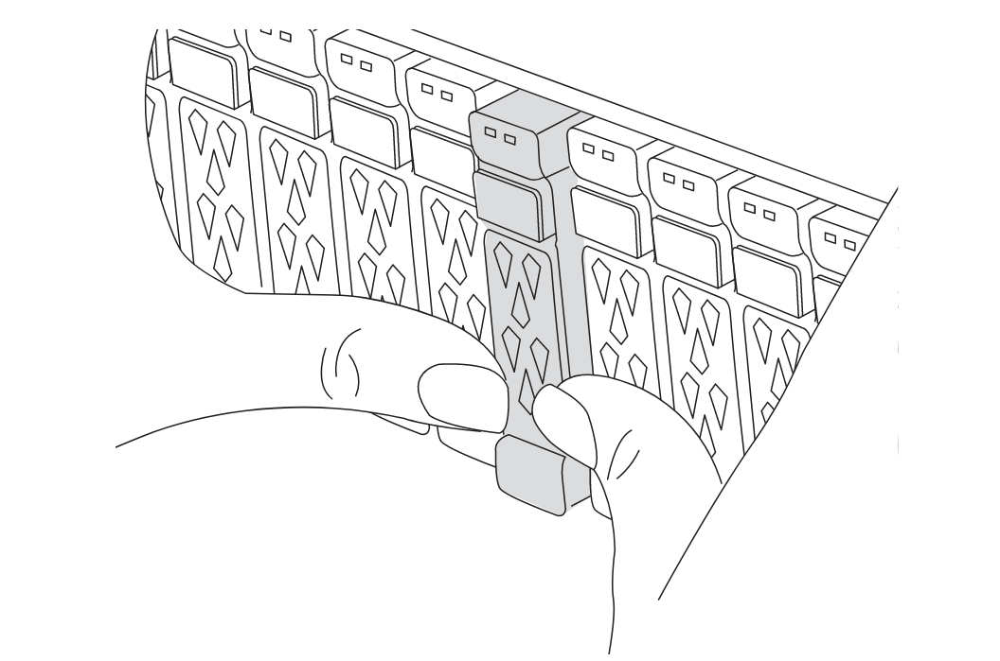

= Atualizar controladores em uma configuração IP MetroCluster de quatro nós usando switchover e switchback com comandos "System controller replace" (ONTAP 9.13,1 e posterior)
:allow-uri-read: 
:icons: font
:imagesdir: ../media/

[role="lead"]
Você pode usar essa operação de switchover automatizado guiado por MetroCluster para executar uma atualização sem interrupções do controlador em uma configuração de IP MetroCluster de quatro nós. Outros componentes (como prateleiras de armazenamento ou switches) não podem ser atualizados como parte deste procedimento.

== Atualizações suportadas do controlador IP MetroCluster usando os comandos "System controller replace"

Encontre sua plataforma *Source* nas tabelas de atualização do controlador MetroCluster nesta seção. Se a interseção da linha da plataforma *Source* e da coluna da plataforma *Target* estiver em branco, a atualização não será suportada.

Antes de iniciar a atualização, reveja as seguintes considerações para verificar se a sua configuração é suportada.

* Se a sua plataforma não estiver listada, não há combinação de atualização de controladora suportada.
* Quando você executa uma atualização de controlador, o tipo de plataforma *deve* antigo e novo corresponde:
+
** Você pode atualizar um sistema FAS para um sistema FAS ou um AFF A-Series para um AFF A-Series.
** Não é possível atualizar um sistema FAS para um AFF A-Series ou um AFF A-Series para um AFF C-Series.
+
Por exemplo, se a plataforma que você deseja atualizar for um FAS8200, você pode fazer upgrade para um FAS9000. Não é possível atualizar um sistema FAS8200 para um sistema AFF A700.

* Todos os nós (antigos e novos) na configuração do MetroCluster devem estar executando a mesma versão do ONTAP.

.Atualizações suportadas do controlador IP AFF e FAS MetroCluster
A tabela a seguir mostra as combinações de plataforma suportadas para atualizar um sistema AFF ou FAS em uma configuração IP MetroCluster usando comandos "System controller replace":

image::../media/mcc_ip_system_controller_replace_aff_fas.png[controlador do sistema ip mcc substitui o AFF FAS]

* Observação 1: Atualizações de controladora são suportadas em sistemas que executam o ONTAP 9.13,1 ou posterior.
* Nota 2: A plataforma de destino não pode ter unidades internas até que a atualização da controladora esteja concluída. Você pode adicionar as unidades internas após a atualização.
* Nota 3: Requer a substituição dos módulos do controlador.

.Atualizações suportadas do controlador IP ASA MetroCluster
A atualização de controladores usando `system controller replace` comandos em sistemas ASA não é suportada.

link:https://docs.netapp.com/us-en/ontap-metrocluster/upgrade/concept_choosing_an_upgrade_method_mcc.html["Escolher um método de atualização ou atualização"]Consulte para obter mais procedimentos.

== Sobre esta tarefa

* Você pode usar este procedimento apenas para atualização do controlador.
+
Outros componentes na configuração, como compartimentos de armazenamento ou switches, não podem ser atualizados ao mesmo tempo.

* Os switches IP MetroCluster (tipo de switch, fornecedor e modelo) e a versão de firmware devem ser suportados nos controladores existentes e novos na configuração de atualização.
+
Consulte a link:https://hwu.netapp.com["NetApp Hardware Universe"^]ou a link:https://imt.netapp.com/matrix/["IMT"^] para obter informações sobre switches e versões de firmware compatíveis.

* Os sistemas MetroCluster devem estar executando a mesma versão do ONTAP em ambos os sites.
* Você pode usar este procedimento para atualizar controladores em uma configuração IP MetroCluster de quatro nós usando o switchover automatizado baseado em NSO e o switchback.
+

NOTE: A realização de uma atualização usando ARL (Aggregate relocation) com comandos "Systems controller replace" não é suportada para uma configuração IP MetroCluster de quatro nós.

* Se estiver ativado no seu sistema, link:../maintain/task-configure-encryption.html#disable-end-to-end-encryption["desative a criptografia de ponta a ponta"] antes de executar a atualização.
* Você deve usar o procedimento automatizado de atualização do controlador NSO para atualizar os controladores em ambos os locais em sequência.
* Esse procedimento automatizado de atualização de controladora baseada em NSO oferece a capacidade de iniciar a substituição da controladora para um local de recuperação de desastres (DR) da MetroCluster. Você só pode iniciar uma substituição de controlador em um local de cada vez.
* Para iniciar uma substituição de controladora no local A, você precisa executar o comando de inicialização de substituição de controladora a partir do local B. a operação orienta você a substituir os controladores de ambos os nós apenas no local A. Para substituir os controladores no local B, é necessário executar o comando de inicialização de substituição do controlador do local A. Uma mensagem é exibida identificando o local no qual os controladores estão sendo substituídos.

Os seguintes nomes de exemplo são usados neste procedimento:

* Local_A
+
** Antes da atualização:
+
*** Node_A_1-old
*** Node_A_2-old

** Após a atualização:
+
*** Node_A_1-novo
*** Node_A_2-novo

* Local_B
+
** Antes da atualização:
+
*** Node_B_1-old
*** Node_B_2-old

** Após a atualização:
+
*** Node_B_1-novo
*** Node_B_2-novo

== Ativar o registo da consola

O NetApp recomenda fortemente que você ative o log do console nos dispositivos que você está usando e execute as seguintes ações ao executar este procedimento:

* Deixe o AutoSupport ativado durante a manutenção.
* Acione uma mensagem de manutenção do AutoSupport antes e depois da manutenção para desativar a criação de casos durante a atividade de manutenção.
+
Consulte o artigo da base de dados de Conhecimento link:https://kb.netapp.com/Support_Bulletins/Customer_Bulletins/SU92["Como suprimir a criação automática de casos durante as janelas de manutenção programada"^].

* Ative o registo de sessão para qualquer sessão CLI. Para obter instruções sobre como ativar o registo de sessão, consulte a secção "saída de sessão de registo" no artigo da base de dados de conhecimento link:https://kb.netapp.com/on-prem/ontap/Ontap_OS/OS-KBs/How_to_configure_PuTTY_for_optimal_connectivity_to_ONTAP_systems["Como configurar o PuTTY para uma conetividade ideal aos sistemas ONTAP"^].

== Defina o bootarg necessário no sistema existente

Se você estiver atualizando para um sistema AFF A70, AFF A90 ou AFF A1K, siga as etapas para definir o `hw.cxgbe.toe_keepalive_disable=1` bootarg.

CAUTION: Se você estiver atualizando para um sistema AFF A70, AFF A90 ou AFF A1K, *deve* concluir esta tarefa antes de executar a atualização. Esta tarefa *somente* se aplica a atualizações para um sistema AFF A70, AFF A90 ou AFF A1K a partir de um sistema suportado. Para todas as outras atualizações, você pode pular esta tarefa e ir diretamente para <<prepare_system_replace_upgrade,Prepare-se para a atualização>>.

.Passos
. Pare um nó em cada local e permita que seu parceiro de HA faça um takeover do nó:
+
`halt  -node <node_name>`

. No `LOADER` prompt do nó interrompido, digite o seguinte:
+
`setenv hw.cxgbe.toe_keepalive_disable 1`

+
`saveenv`

+
`printenv hw.cxgbe.toe_keepalive_disable`

. Inicialize o nó:
+
`boot_ontap`

. Quando o nó for inicializado, execute um giveback para o nó no prompt:
+
`storage failover giveback -ofnode <node_name>`

. Repita as etapas em cada nó no grupo DR que está sendo atualizado.

== Prepare-se para a atualização

Para se preparar para a atualização da controladora, é necessário realizar pré-verificações do sistema e coletar as informações de configuração.

Antes de iniciar as pré-verificações, se o Mediador ONTAP estiver instalado, ele será automaticamente detetado e removido. Para confirmar a remoção, você será solicitado a digitar um nome de usuário e senha. Ao concluir a atualização, ou se as pré-verificações falharem ou optar por não prosseguir com a atualização, é <<man_reconfig_mediator,Reconfigure manualmente o Mediador ONTAP>>necessário .

Em qualquer estágio durante a atualização, você pode executar o `system controller replace show` comando ou `system controller replace show-details` do site A para verificar o status. Se os comandos devolverem uma saída em branco, aguarde alguns minutos e execute novamente o comando.

.Passos
. Inicie o procedimento de substituição automática do controlador A partir do local A para substituir os controladores no local B:
+
`system controller replace start -nso true`

+
A operação automatizada executa as pré-verificações. Se não forem encontrados problemas, a operação será interrompida para que você possa coletar manualmente as informações relacionadas à configuração.

+
[NOTE]
====
** Se você não executar o `system controller replace start -nso true` comando, o procedimento de atualização do controlador escolhe o switchover automatizado baseado em NSO e o switchback como o procedimento padrão em sistemas IP MetroCluster.
** O sistema de origem atual e todos os sistemas de destino compatíveis são apresentados. Se você substituiu o controlador de origem por um controlador que tenha uma versão diferente do ONTAP ou uma plataforma não compatível, a operação de automação pára e relata um erro após os novos nós serem inicializados. Para voltar a colocar o cluster num estado saudável, tem de seguir o procedimento de recuperação manual.
+
O `system controller replace start` comando pode relatar o seguinte erro de pré-verificação:

+
[listing]
----
Cluster-A::*>system controller replace show
Node        Status         Error-Action
----------- -------------- ------------------------------------
Node-A-1    Failed         MetroCluster check failed. Reason : MCC check showed errors in component aggregates
----
+
Verifique se esse erro ocorreu porque você tem agregados sem espelhamento ou devido a outro problema agregado. Verifique se todos os agregados espelhados estão saudáveis e não degradados ou degradados por espelho. Se esse erro for devido apenas a agregados sem espelhamento, você pode substituir esse erro selecionando a `-skip-metrocluster-check true` opção no `system controller replace start` comando. Se o storage remoto estiver acessível, os agregados sem espelhamento estarão online após o switchover. Se o link de storage remoto falhar, os agregados sem espelhamento não estarão online.

====
. Colete manualmente as informações de configuração fazendo login no local B e seguindo os comandos listados na mensagem do console sob o `system controller replace show` comando ou `system controller replace show-details`.

=== Reúna informações antes da atualização

Antes de atualizar, se o volume raiz estiver criptografado, você deverá reunir a chave de backup e outras informações para inicializar os novos controladores com os antigos volumes de raiz criptografados.

.Sobre esta tarefa
Esta tarefa é executada na configuração IP do MetroCluster existente.

.Passos
. Identifique os cabos dos controladores existentes para que possa identificar facilmente os cabos ao configurar os novos controladores.
. Exiba os comandos para capturar a chave de backup e outras informações:
+
`system controller replace show`

+
Execute os comandos listados sob o `show` comando do cluster de parceiros.

+
O `show` comando output exibe três tabelas contendo os IPs de interface MetroCluster, IDs de sistema e UUIDs de sistema. Esta informação é necessária mais tarde no procedimento para definir os bootargs quando você inicializar o novo nó.

. Reúna as IDs do sistema dos nós na configuração do MetroCluster:
+
--
`metrocluster node show -fields node-systemid,dr-partner-systemid`

Durante o procedimento de atualização, você substituirá esses IDs de sistema antigos pelos IDs de sistema dos novos módulos de controladora.

Neste exemplo para uma configuração IP MetroCluster de quatro nós, os seguintes IDs de sistema antigos são recuperados:

** Node_A_1-old: 4068741258
** Node_A_2-old: 4068741260
** Node_B_1-old: 4068741254
** Node_B_2-old: 4068741256

[listing]
----
metrocluster-siteA::> metrocluster node show -fields node-systemid,ha-partner-systemid,dr-partner-systemid,dr-auxiliary-systemid
dr-group-id        cluster           node            node-systemid     ha-partner-systemid     dr-partner-systemid    dr-auxiliary-systemid
-----------        ---------------   ----------      -------------     -------------------     -------------------    ---------------------
1                    Cluster_A       Node_A_1-old    4068741258        4068741260              4068741256             4068741256
1                    Cluster_A       Node_A_2-old    4068741260        4068741258              4068741254             4068741254
1                    Cluster_B       Node_B_1-old    4068741254        4068741256              4068741258             4068741260
1                    Cluster_B       Node_B_2-old    4068741256        4068741254              4068741260             4068741258
4 entries were displayed.
----
Neste exemplo para uma configuração IP MetroCluster de dois nós, os seguintes IDs de sistema antigos são recuperados:

** Node_A_1: 4068741258
** Nó_B_1: 4068741254

[listing]
----
metrocluster node show -fields node-systemid,dr-partner-systemid

dr-group-id cluster    node          node-systemid dr-partner-systemid
----------- ---------- --------      ------------- ------------
1           Cluster_A  Node_A_1-old  4068741258    4068741254
1           Cluster_B  node_B_1-old  -             -
2 entries were displayed.
----
--
. Reúna informações de porta e LIF para cada nó antigo.
+
Você deve reunir a saída dos seguintes comandos para cada nó:

+
** `network interface show -role cluster,node-mgmt`
** `network port show -node <node-name> -type physical`
** `network port vlan show -node <node-name>`
** `network port ifgrp show -node <node-name> -instance`
** `network port broadcast-domain show`
** `network port reachability show -detail`
** `network ipspace show`
** `volume show`
** `storage aggregate show`
** `system node run -node <node-name> sysconfig -a`
** `aggr show -r`
** `disk show`
** `system node run <node-name> disk show`
** `vol show -fields type`
** `vol show -fields type , space-guarantee`
** `vserver fcp initiator show`
** `storage disk show`
** `metrocluster configuration-settings interface show`

. Se os nós de MetroCluster estiverem em uma configuração de SAN, colete as informações relevantes.
+
Você deve reunir a saída dos seguintes comandos:

+
** `fcp adapter show -instance`
** `fcp interface show -instance`
** `iscsi interface show`
** `ucadmin show`

. Se o volume raiz estiver criptografado, colete e salve a senha usada para o gerenciador de chaves:
+
`security key-manager backup show`

. Se os nós do MetroCluster estiverem usando criptografia para volumes ou agregados, copie informações sobre as chaves e senhas.
+
Para obter informações adicionais, https://docs.netapp.com/ontap-9/topic/com.netapp.doc.pow-nve/GUID-1677AE0A-FEF7-45FA-8616-885AA3283BCF.html["Fazer backup manual de informações de gerenciamento de chaves integradas"^]consulte .

+
.. Se o Gerenciador de chaves integrado estiver configurado:
+
`security key-manager onboard show-backup`

+
Você precisará da senha mais tarde no procedimento de atualização.

.. Se o gerenciamento de chaves empresariais (KMIP) estiver configurado, emita os seguintes comandos:
+
`security key-manager external show -instance`

+
`security key-manager key query`

. Depois de concluir a recolha das informações de configuração, retome a operação:
+
`system controller replace resume`

=== Remova a configuração existente do tiebreaker ou de outro software de monitoramento

Se a configuração existente for monitorada com a configuração tiebreaker do MetroCluster ou outros aplicativos de terceiros (por exemplo, o ClusterLion) que possam iniciar um switchover, você deverá remover a configuração do MetroCluster do tiebreaker ou de outro software antes de substituir a controladora antiga.

.Passos
. link:../tiebreaker/concept_configuring_the_tiebreaker_software.html#removing-metrocluster-configurations["Remova a configuração existente do MetroCluster"] Do software tiebreaker.
. Remova a configuração do MetroCluster existente de qualquer aplicativo de terceiros que possa iniciar o switchover.
+
Consulte a documentação da aplicação.

== Substitua os controladores antigos e inicialize os novos controladores

Depois de reunir informações e retomar a operação, a automação prossegue com a operação de comutação.

.Sobre esta tarefa
A operação de automação inicia as operações de comutação. Depois que essas operações forem concluídas, a operação será interrompida em *pausado para intervenção do usuário* para que você possa montar e instalar os controladores, inicializar os controladores do parceiro e reatribuir os discos agregados raiz ao novo módulo do controlador a partir do backup flash usando o `sysids` coletado anteriormente.

.Antes de começar
Antes de iniciar o switchover, a operação de automação é interrompida para que você possa verificar manualmente se todos os LIFs estão "up" no local B. se necessário, traga quaisquer LIFs que são "próprios" para "'up" e retome a operação de automação usando o `system controller replace resume` comando.

=== Prepare a configuração de rede dos controladores antigos

Para permitir que a rede seja retomada de forma limpa nos novos controladores, verifique se o posicionamento de LIF está correto e remova a configuração de rede dos controladores antigos.

.Sobre esta tarefa
* Esta tarefa deve ser executada em cada um dos nós antigos.
* Você usará as informações coletadas em <<prepare_system_replace_upgrade,Prepare-se para a atualização>>.

.Passos
. Inicialize os nós antigos e faça login nos nós:
+
`boot_ontap`

. Modifique as LIFs entre clusters nos controladores antigos para usar uma porta inicial diferente das portas usadas para interconexão de HA ou interconexão de DR IP MetroCluster nos novos controladores.
+

NOTE: Esta etapa é necessária para uma atualização bem-sucedida.

+
As LIFs entre clusters nos controladores antigos devem usar uma porta inicial diferente das portas usadas para interconexão de HA ou interconexão de DR IP MetroCluster nos novos controladores. Por exemplo, quando você faz upgrade para controladoras AFF A90, as portas de interconexão de HA são e1a e e7a e as portas de interconexão de DR IP MetroCluster são E2B e e3b. Você deve mover as LIFs entre clusters nos controladores antigos se eles estiverem hospedados nas portas e1a, e7a, E2B ou e3b.

+
Para a distribuição e alocação de portas nos novos nós, consulte o https://hwu.netapp.com["NetApp Hardware Universe"].

+
.. Nos controladores antigos, veja os LIFs entre clusters:
+
`network interface show  -role intercluster`

+
Execute uma das ações a seguir, dependendo se as LIFs entre clusters nos controladores antigos usam as mesmas portas que as portas usadas para interconexão de HA ou interconexão de DR IP MetroCluster nas novas controladoras.

+
[cols="2*"]
|===
| Se os LIFs entre clusters... | Ir para... 

| Use a mesma porta inicial | <<controller_replace_upgrade_prepare_network_ports_2b,Subpasso b>> 

| Utilize uma porta inicial diferente | <<controller_replace_upgrade_prepare_network_ports_3,Passo 3>> 
|===
.. [[controller_replace_upgrade_prepare_network_ports_2b]]modifique os LIFs entre clusters para usar uma porta inicial diferente:
+
`network interface modify -vserver <vserver> -lif <intercluster_lif> -home-port <port-not-used-for-ha-interconnect-or-mcc-ip-dr-interconnect-on-new-nodes>`

.. Verifique se todas as LIFs entre clusters estão em suas novas portas residenciais:
+
`network interface show -role intercluster -is-home  false`

+
A saída do comando deve estar vazia, indicando que todas as LIFs entre clusters estão em suas respetivas portas residenciais.

.. Se houver LIFs que não estejam em suas portas residenciais, reverta-os usando o seguinte comando:
+
`network interface revert -lif <intercluster_lif>`

+
Repita o comando para cada LIF entre clusters que não está na porta inicial.

. [[controller_replace_upgrade_prepare_network_ports_3]]atribua a porta inicial de todos os LIFs de dados no controlador antigo a uma porta comum que é a mesma nos módulos de controladora antigos e novos.
+

CAUTION: Se os controladores antigos e novos não tiverem uma porta comum, não será necessário modificar as LIFs de dados. Pule esta etapa e vá diretamente para <<upgrades_assisted_without_matching_ports,Passo 4>>.

+
.. Apresentar os LIFs:
+
`network interface show`

+
Todos os dados LIFS, incluindo SAN e nas, serão administradores e operacionais "próprios", uma vez que eles estão ativos no local de comutação (cluster_A).

.. Revise a saída para encontrar uma porta de rede física comum que seja a mesma nos controladores antigos e novos que não seja usada como uma porta de cluster.
+
Por exemplo, "'e0d'" é uma porta física em controladores antigos e também está presente em novos controladores. "e0d" não é usado como uma porta de cluster ou de outra forma nos novos controladores.

+
Para obter informações sobre a utilização de portas para modelos de plataforma, consulte a. link:https://hwu.netapp.com/["NetApp Hardware Universe"^]

.. Modifique todos os dados LIFS para usar a porta comum como a porta inicial:
+
`network interface modify -vserver <svm-name> -lif <data-lif> -home-port <port-id>`

+
No exemplo a seguir, isso é ""e0d"".

+
Por exemplo:

+
[listing]
----
network interface modify -vserver vs0 -lif datalif1 -home-port e0d
----

. [[Upgrades_Assisted_without_Matching_ports]] Modificar domínios de broadcast para remover a VLAN e as portas físicas que precisam ser excluídas:
+
`broadcast-domain remove-ports -broadcast-domain <broadcast-domain-name>-ports <node-name:port-id>`

+
Repita esta etapa para todas as portas VLAN e físicas.

. Remova quaisquer portas VLAN usando portas de cluster como portas membros e grupos de interfaces usando portas de cluster como portas membros.
+
.. Eliminar portas VLAN:
+
`network port vlan delete -node <node-name> -vlan-name <portid-vlandid>`

+
Por exemplo:

+
[listing]
----
network port vlan delete -node node1 -vlan-name e1c-80
----
.. Remover portas físicas dos grupos de interface:
+
`network port ifgrp remove-port -node <node-name> -ifgrp <interface-group-name> -port <portid>`

+
Por exemplo:

+
[listing]
----
network port ifgrp remove-port -node node1 -ifgrp a1a -port e0d
----
.. Remova as portas VLAN e grupo de interfaces do domínio de broadcast:
+
`network port broadcast-domain remove-ports -ipspace <ipspace> -broadcast-domain <broadcast-domain-name>-ports <nodename:portname,nodename:portname>,..`

.. Modifique as portas do grupo de interfaces para usar outras portas físicas como membro, conforme necessário.:
+
`ifgrp add-port -node <node-name> -ifgrp <interface-group-name> -port <port-id>`

. Parar os nós:
+
`halt -inhibit-takeover true -node <node-name>`

+
Esta etapa deve ser executada em ambos os nós.

. Verifique se os nós estão no `LOADER` prompt e colete e preserve as variáveis de ambiente atuais.
. Reúna os valores do bootarg:
+
`printenv`

. Desligue os nós e as gavetas no local em que a controladora está sendo atualizada.

=== Configure os novos controladores

É necessário colocar em rack e cabo as novas controladoras.

.Passos
. Planeje o posicionamento dos novos módulos de controladora e compartimentos de armazenamento conforme necessário.
+
O espaço em rack depende do modelo de plataforma dos módulos de controladora, dos tipos de switch e do número de compartimentos de storage em sua configuração.

. Aterre-se corretamente.
. Se a atualização exigir a substituição dos módulos da controladora, por exemplo, a atualização de um sistema AFF 800 para um sistema AFF A90, você deve remover o módulo da controladora do chassi quando substituir o módulo da controladora. Para todas as outras atualizações, vá para <<ip_upgrades_replace_4,Passo 4>>.
+
Na parte frontal do chassis, utilize os polegares para empurrar firmemente cada unidade até sentir um batente positivo. Isto confirma que as unidades estão firmemente assentadas contra o plano médio do chassis.

+

. [[IP_Upgrades_replace_4]] instale os módulos do controlador.
+

NOTE: As etapas de instalação que você seguir dependem se a atualização requer a substituição dos módulos da controladora, como uma atualização de um sistema AFF 800 para um sistema AFF A90.

+
[role="tabbed-block"]
====
.Atualizações que exigem substituição do módulo do controlador
--
A instalação dos novos controladores separadamente não se aplica a atualizações de sistemas integrados com discos e controladores no mesmo chassi, por exemplo, de um sistema AFF A800 para um sistema AFF A90. Os novos módulos do controlador e as placas de e/S devem ser trocados após desligar os controladores antigos, como mostrado na imagem abaixo.

A imagem de exemplo a seguir é apenas para representação, os módulos do controlador e as placas de e/S podem variar entre sistemas.

image::../media/a90_a70_pcm_swap.png[Mostra a troca do módulo do controlador]

--
.Todas as outras atualizações
--
Instale os módulos do controlador no rack ou gabinete.

--
====
. Faça o cabeamento das conexões de alimentação, console serial e gerenciamento dos controladores, conforme descrito em link:../install-ip/using_rcf_generator.html["Cabeamento dos switches IP MetroCluster"]
+
Não conete nenhum outro cabo que tenha sido desconetado dos controladores antigos neste momento.

+
https://docs.netapp.com/us-en/ontap-systems/index.html["Documentação dos sistemas de hardware da ONTAP"^]

. Ligue os novos nós e pressione Ctrl-C quando solicitado a exibir o `LOADER` prompt.

=== Netboot os novos controladores

Depois de instalar os novos nós, você precisa netboot para garantir que os novos nós estejam executando a mesma versão do ONTAP que os nós originais. O termo netboot significa que você está inicializando a partir de uma imagem ONTAP armazenada em um servidor remoto. Ao se preparar para netboot, você deve colocar uma cópia da imagem de inicialização do ONTAP 9 em um servidor da Web que o sistema possa acessar.

Esta tarefa é executada em cada um dos novos módulos do controlador.

.Passos
. Acesse o link:https://mysupport.netapp.com/site/["Site de suporte da NetApp"^] para baixar os arquivos usados para executar o netboot do sistema.
. Transfira o software ONTAP adequado a partir da secção de transferência de software do site de suporte da NetApp e guarde o ficheiro ONTAP-version_image.tgz num diretório acessível à Web.
. Vá para o diretório acessível pela Web e verifique se os arquivos que você precisa estão disponíveis.
+
Sua lista de diretórios deve conter uma pasta netboot com um arquivo do kernel: ONTAP-version_image.tgz

+
Você não precisa extrair o arquivo ONTAP-version_image.tgz.

.  `LOADER`No prompt, configure a conexão netboot para um LIF de gerenciamento:
+
** Se o endereçamento IP for DHCP, configure a conexão automática:
+
`ifconfig e0M -auto`

** Se o endereçamento IP for estático, configure a conexão manual:
+
`ifconfig e0M -addr=ip_addr -mask=netmask` `-gw=gateway`

. Execute o netboot.
+
`netboot \http://web_server_ip/path_to_web-accessible_directory/ontap-version_image.tgz`

. No menu de arranque, selecione a opção *(7) Instalar primeiro o novo software* para transferir e instalar a nova imagem de software no dispositivo de arranque.
+
 Disregard the following message: "This procedure is not supported for Non-Disruptive Upgrade on an HA pair". It applies to nondisruptive upgrades of software, not to upgrades of controllers.
. Se você for solicitado a continuar o procedimento, digite `y` e, quando solicitado a fornecer o pacote, digite o URL do arquivo de imagem: `\http://web_server_ip/path_to_web-accessible_directory/ontap-version_image.tgz`
+
....
Enter username/password if applicable, or press Enter to continue.
....
. Certifique-se de entrar `n` para ignorar a recuperação de backup quando você vir um prompt semelhante ao seguinte:
+
....
Do you want to restore the backup configuration now? {y|n}
....
. Reinicie entrando `y` quando você vir um prompt semelhante ao seguinte:
+
....
The node must be rebooted to start using the newly installed software. Do you want to reboot now? {y|n}
....

=== Limpe a configuração de um módulo do controlador

[role="lead"]
Antes de usar um novo módulo de controlador na configuração do MetroCluster, você deve limpar a configuração existente.

.Passos
. Se necessário, interrompa o nó para exibir o prompt Loader:
+
`halt`

. No prompt Loader, defina as variáveis ambientais como valores padrão:
+
`set-defaults`

. Salvar o ambiente:
+
`saveenv`

. No prompt DO Loader, inicie o menu de inicialização:
+
`boot_ontap menu`

. No prompt do menu de inicialização, desmarque a configuração:
+
`wipeconfig`

+
Responda `yes` ao prompt de confirmação.

+
O nó reinicializa e o menu de inicialização é exibido novamente.

. No menu de inicialização, selecione a opção *5* para inicializar o sistema no modo Manutenção.
+
Responda `yes` ao prompt de confirmação.

=== Restaure a configuração do HBA

Dependendo da presença e configuração das placas HBA no módulo controlador, você precisa configurá-las corretamente para uso do seu site.

.Passos
. No modo de manutenção, configure as definições para quaisquer HBAs no sistema:
+
.. Verifique as definições atuais das portas: `ucadmin show`
.. Atualize as definições da porta conforme necessário.

+
|===

| Se você tem este tipo de HBA e modo desejado... | Use este comando... 

 a| 
CNA FC
 a| 
`ucadmin modify -m fc -t initiator <adapter-name>`

 a| 
CNA Ethernet
 a| 
`ucadmin modify -mode cna <adapter-name>`

 a| 
Destino de FC
 a| 
`fcadmin config -t target <adapter-name>`

 a| 
Iniciador FC
 a| 
`fcadmin config -t initiator <adapter-name>`

|===
. Sair do modo de manutenção:
+
`halt`

+
Depois de executar o comando, aguarde até que o nó pare no `LOADER` prompt.

. Inicialize o nó novamente no modo Manutenção para permitir que as alterações de configuração entrem em vigor:
+
`boot_ontap maint`

. Verifique as alterações feitas:
+
|===

| Se você tem este tipo de HBA... | Use este comando... 

 a| 
CNA
 a| 
`ucadmin show`

 a| 
FC
 a| 
`fcadmin show`

|===

=== Defina o estado de HA nos novos controladores e chassi

É necessário verificar o estado de HA dos controladores e do chassi e, se necessário, atualizar o estado para corresponder à configuração do sistema.

.Passos
. No modo de manutenção, apresentar o estado HA do módulo do controlador e do chassis:
+
`ha-config show`

+
O estado HA para todos os componentes deve ser `mccip`.

. Se o estado do sistema apresentado do controlador ou do chassis não estiver correto, defina o estado HA:
+
`ha-config modify controller mccip`

+
`ha-config modify chassis mccip`

. Verifique e modifique as portas Ethernet conetadas a gavetas NS224 ou switches de storage.
+
.. Verifique as portas Ethernet conetadas a gavetas NS224 ou switches de armazenamento:
+
`storage port show`

.. Defina todas as portas Ethernet conetadas a gavetas Ethernet ou switches de armazenamento, incluindo switches compartilhados para armazenamento e cluster, para o `storage` modo:
+
`storage port modify -p <port> -m storage`

+
Exemplo:

+
[listing]
----
*> storage port modify -p e5b -m storage
Changing NVMe-oF port e5b to storage mode
----
+

NOTE: Isso deve ser definido em todas as portas afetadas para uma atualização bem-sucedida.

+
Os discos das gavetas conetadas às portas Ethernet são reportados `sysconfig -v` na saída.

+
Consulte a link:https://hwu.netapp.com["NetApp Hardware Universe"^] para obter informações sobre as portas de armazenamento para o sistema para o qual está a atualizar.

.. Verifique se `storage` o modo está definido e confirme se as portas estão no estado online:
+
`storage port show`

. Parar o nó: `halt`
+
O nó deve parar no `LOADER>` prompt.

. Em cada nó, verifique a data, a hora e o fuso horário do sistema: `show date`
. Se necessário, defina a data em UTC ou GMT: `set date <mm/dd/yyyy>`
. Verifique a hora usando o seguinte comando no prompt do ambiente de inicialização: `show time`
. Se necessário, defina a hora em UTC ou GMT: `set time <hh:mm:ss>`
. Guarde as definições: `saveenv`
. Reunir variáveis de ambiente: `printenv`

=== Atualize os arquivos RCF do switch para acomodar as novas plataformas

Você deve atualizar os switches para uma configuração que suporte os novos modelos de plataforma.

.Sobre esta tarefa
Você executa essa tarefa no site que contém os controladores que estão sendo atualizados no momento. Nos exemplos mostrados neste procedimento, estamos atualizando site_B primeiro.

Os switches no site_A serão atualizados quando os controladores no site_A forem atualizados.

.Passos
. Preparar os comutadores IP para a aplicação dos novos ficheiros RCF.
+
Siga as etapas na seção para o fornecedor do switch:

+
** link:../install-ip/task_switch_config_broadcom.html#resetting-the-broadcom-ip-switch-to-factory-defaults["Redefina o switch IP Broadcom para os padrões de fábrica"]
** link:../install-ip/task_switch_config_cisco.html#resetting-the-cisco-ip-switch-to-factory-defaults["Redefina o switch IP Cisco para os padrões de fábrica"]
** link:../install-ip/task_switch_config_nvidia.html#reset-the-nvidia-ip-sn2100-switch-to-factory-defaults["Redefina o switch NVIDIA IP SN2100 para os padrões de fábrica"]

. Baixe e instale os arquivos RCF.
+
Siga as etapas na seção para o fornecedor do switch:

+
** link:../install-ip/task_switch_config_broadcom.html#downloading-and-installing-the-broadcom-rcf-files["Baixe e instale os arquivos Broadcom RCF"]
** link:../install-ip/task_switch_config_cisco.html#downloading-and-installing-the-cisco-ip-rcf-files["Transfira e instale os ficheiros Cisco IP RCF"]
** link:../install-ip/task_switch_config_nvidia.html#download-and-install-the-nvidia-rcf-files["Transfira e instale os ficheiros NVIDIA IP RCF"]

=== Defina as variáveis MetroCluster IP bootarg

Certos valores de inicialização IP do MetroCluster devem ser configurados nos novos módulos do controlador. Os valores devem corresponder aos configurados nos módulos do controlador antigos.

.Sobre esta tarefa
Nesta tarefa, você usará os UUIDs e IDs do sistema identificados anteriormente no procedimento de atualização no <<gather_info_system_replace,Reúna informações antes da atualização>>.

.Passos
.  `LOADER>`No prompt, defina os seguintes bootargs nos novos nós no site_B:
+
`setenv bootarg.mcc.port_a_ip_config <local-IP-address/local-IP-mask,0,HA-partner-IP-address,DR-partner-IP-address,DR-aux-partnerIP-address,vlan-id>`

+
`setenv bootarg.mcc.port_b_ip_config <local-IP-address/local-IP-mask,0,HA-partner-IP-address,DR-partner-IP-address,DR-aux-partnerIP-address,vlan-id>`

+
O exemplo a seguir define os valores para node_B_1 usando VLAN 120 para a primeira rede e VLAN 130 para a segunda rede:

+
[listing]
----
setenv bootarg.mcc.port_a_ip_config 172.17.26.10/23,0,172.17.26.11,172.17.26.13,172.17.26.12,120
setenv bootarg.mcc.port_b_ip_config 172.17.27.10/23,0,172.17.27.11,172.17.27.13,172.17.27.12,130
----
+
O exemplo a seguir define os valores para node_B_2 usando VLAN 120 para a primeira rede e VLAN 130 para a segunda rede:

+
[listing]
----
setenv bootarg.mcc.port_a_ip_config 172.17.26.11/23,0,172.17.26.10,172.17.26.12,172.17.26.13,120
setenv bootarg.mcc.port_b_ip_config 172.17.27.11/23,0,172.17.27.10,172.17.27.12,172.17.27.13,130
----
+
O exemplo a seguir define os valores para node_B_1 usando VLANs padrão para todas as conexões de DR IP MetroCluster:

+
[listing]
----
setenv bootarg.mcc.port_a_ip_config
172.17.26.10/23,0,172.17.26.11,172.17.26.13,172.17.26.12
setenv bootarg.mcc.port_b_ip_config
172.17.27.10/23,0,172.17.27.11,172.17.27.13,172.17.27.12
----
+
O exemplo a seguir define os valores para node_B_2 usando VLANs padrão para todas as conexões de DR IP MetroCluster:

+
[listing]
----
setenv bootarg.mcc.port_a_ip_config
172.17.26.11/23,0,172.17.26.10,172.17.26.12,172.17.26.13
setenv bootarg.mcc.port_b_ip_config
172.17.27.11/23,0,172.17.27.10,172.17.27.12,172.17.27.13
----
. No prompt dos novos nós `LOADER`, defina os UUIDs:
+
`setenv bootarg.mgwd.partner_cluster_uuid <partner-cluster-UUID>`

+
`setenv bootarg.mgwd.cluster_uuid <local-cluster-UUID>`

+
`setenv bootarg.mcc.pri_partner_uuid <DR-partner-node-UUID>`

+
`setenv bootarg.mcc.aux_partner_uuid <DR-aux-partner-node-UUID>`

+
`setenv bootarg.mcc_iscsi.node_uuid <local-node-UUID>`

+
.. Defina os UUIDs em node_B_1.
+
O exemplo a seguir mostra os comandos para definir os UUIDs em node_B_1:

+
[listing]
----
setenv bootarg.mgwd.cluster_uuid ee7db9d5-9a82-11e7-b68b-00a098908039
setenv bootarg.mgwd.partner_cluster_uuid 07958819-9ac6-11e7-9b42-00a098c9e55d
setenv bootarg.mcc.pri_partner_uuid f37b240b-9ac1-11e7-9b42-00a098c9e55d
setenv bootarg.mcc.aux_partner_uuid bf8e3f8f-9ac4-11e7-bd4e-00a098ca379f
setenv bootarg.mcc_iscsi.node_uuid f03cb63c-9a7e-11e7-b68b-00a098908039
----
.. Defina os UUIDs em node_B_2:
+
O exemplo a seguir mostra os comandos para definir os UUIDs em node_B_2:

+
[listing]
----
setenv bootarg.mgwd.cluster_uuid ee7db9d5-9a82-11e7-b68b-00a098908039
setenv bootarg.mgwd.partner_cluster_uuid 07958819-9ac6-11e7-9b42-00a098c9e55d
setenv bootarg.mcc.pri_partner_uuid bf8e3f8f-9ac4-11e7-bd4e-00a098ca379f
setenv bootarg.mcc.aux_partner_uuid f37b240b-9ac1-11e7-9b42-00a098c9e55d
setenv bootarg.mcc_iscsi.node_uuid aa9a7a7a-9a81-11e7-a4e9-00a098908c35
----

. Determine se os sistemas originais foram configurados para o Advanced Drive Partitioning (ADP) executando o seguinte comando a partir do site que está ativo:
+
`disk show`

+
A coluna "container type" (tipo de contentor) apresenta "shared" (partilhado `disk show`) na saída se o ADP estiver configurado. Se o "tipo de contentor" tiver qualquer outro valor, o ADP não está configurado no sistema. A saída de exemplo a seguir mostra um sistema configurado com ADP:

+
[listing]
----
::> disk show
                    Usable               Disk    Container   Container
Disk                Size       Shelf Bay Type    Type        Name      Owner

Info: This cluster has partitioned disks. To get a complete list of spare disk
      capacity use "storage aggregate show-spare-disks".
----------------    ---------- ----- --- ------- ----------- --------- --------
1.11.0              894.0GB    11    0   SSD      shared     testaggr  node_A_1
1.11.1              894.0GB    11    1   SSD      shared     testaggr  node_A_1
1.11.2              894.0GB    11    2   SSD      shared     testaggr  node_A_1
----
. Se os sistemas originais foram configurados para ADP, em cada um dos nós de substituição `LOADER`, ative o ADP:
+
`setenv bootarg.mcc.adp_enabled true`

. Defina as seguintes variáveis:
+
`setenv bootarg.mcc.local_config_id <original-sys-id>`

+
`setenv bootarg.mcc.dr_partner <dr-partner-sys-id>`

+

NOTE: A `setenv bootarg.mcc.local_config_id` variável deve ser definida para o sys-id do módulo controlador *original*, node_B_1.

+
.. Defina as variáveis em node_B_1.
+
O exemplo a seguir mostra os comandos para definir os valores em node_B_1:

+
[listing]
----
setenv bootarg.mcc.local_config_id 537403322
setenv bootarg.mcc.dr_partner 537403324
----
.. Defina as variáveis em node_B_2.
+
O exemplo a seguir mostra os comandos para definir os valores em node_B_2:

+
[listing]
----
setenv bootarg.mcc.local_config_id 537403321
setenv bootarg.mcc.dr_partner 537403323
----

. Se estiver usando criptografia com gerenciador de chaves externo, defina os bootargs necessários:
+
`setenv bootarg.kmip.init.ipaddr`

+
`setenv bootarg.kmip.kmip.init.netmask`

+
`setenv bootarg.kmip.kmip.init.gateway`

+
`setenv bootarg.kmip.kmip.init.interface`

=== Reatribuir discos agregados de raiz

Reatribua os discos agregados raiz ao novo módulo de controladora, usando o `sysids` recolhido anteriormente

.Sobre esta tarefa
Esta tarefa é executada no modo Manutenção.

As IDs de sistema antigas foram identificadas no <<gather_info_system_replace,Reúna informações antes da atualização>>.

Os exemplos neste procedimento usam controladores com as seguintes IDs de sistema:

|===

| Nó | ID do sistema antigo | Nova ID do sistema 

 a| 
node_B_1
 a| 
4068741254
 a| 
1574774970

|===
.Passos
. Cable todas as outras conexões aos novos módulos de controladora (FC-VI, armazenamento, interconexão de cluster, etc.).
. Interrompa o sistema e inicie para o modo de manutenção a partir do `LOADER` prompt:
+
`boot_ontap maint`

. Exiba os discos de propriedade de node_B_1-old:
+
`disk show -a`

+
A saída do comando mostra a ID do sistema do novo módulo do controlador (1574774970). No entanto, os discos agregados de raiz ainda são propriedade do ID do sistema antigo (4068741254). Este exemplo não mostra unidades de propriedade de outros nós na configuração do MetroCluster.

+

CAUTION: Antes de prosseguir com a reatribuição de disco, você deve verificar se os discos pool0 e pool1 pertencentes ao agregado raiz do nó são exibidos na `disk show` saída. No exemplo a seguir, a saída lista os discos pool0 e pool1 de propriedade do node_B_1-old.

+
[listing]
----
*> disk show -a
Local System ID: 1574774970

  DISK         OWNER                     POOL   SERIAL NUMBER    HOME                      DR HOME
------------   -------------             -----  -------------    -------------             -------------
...
rr18:9.126L44 node_B_1-old(4068741254)   Pool1  PZHYN0MD         node_B_1-old(4068741254)  node_B_1-old(4068741254)
rr18:9.126L49 node_B_1-old(4068741254)   Pool1  PPG3J5HA         node_B_1-old(4068741254)  node_B_1-old(4068741254)
rr18:8.126L21 node_B_1-old(4068741254)   Pool1  PZHTDSZD         node_B_1-old(4068741254)  node_B_1-old(4068741254)
rr18:8.126L2  node_B_1-old(4068741254)   Pool0  S0M1J2CF         node_B_1-old(4068741254)  node_B_1-old(4068741254)
rr18:8.126L3  node_B_1-old(4068741254)   Pool0  S0M0CQM5         node_B_1-old(4068741254)  node_B_1-old(4068741254)
rr18:9.126L27 node_B_1-old(4068741254)   Pool0  S0M1PSDW         node_B_1-old(4068741254)  node_B_1-old(4068741254)
...
----
. Reatribua os discos agregados de raiz nas gavetas de unidades à nova controladora:
+
`disk reassign -s <old-sysid> -d <new-sysid>`

+

NOTE: Se o sistema IP do MetroCluster estiver configurado com particionamento de disco avançado, você deverá incluir o ID do sistema do parceiro DR executando o `disk reassign -s old-sysid -d new-sysid -r dr-partner-sysid` comando.

+
O exemplo a seguir mostra a reatribuição de unidades:

+
[listing]
----
*> disk reassign -s 4068741254 -d 1574774970
Partner node must not be in Takeover mode during disk reassignment from maintenance mode.
Serious problems could result!!
Do not proceed with reassignment if the partner is in takeover mode. Abort reassignment (y/n)? n

After the node becomes operational, you must perform a takeover and giveback of the HA partner node to ensure disk reassignment is successful.
Do you want to continue (y/n)? Jul 14 19:23:49 [localhost:config.bridge.extra.port:error]: Both FC ports of FC-to-SAS bridge rtp-fc02-41-rr18:9.126L0 S/N [FB7500N107692] are attached to this controller.
y
Disk ownership will be updated on all disks previously belonging to Filer with sysid 4068741254.
Do you want to continue (y/n)? y
----
. Verifique se todos os discos estão reatribuídos conforme esperado:
+
`disk show`

+
[listing]
----
*> disk show
Local System ID: 1574774970

  DISK        OWNER                      POOL   SERIAL NUMBER   HOME                      DR HOME
------------  -------------              -----  -------------   -------------             -------------
rr18:8.126L18 node_B_1-new(1574774970)   Pool1  PZHYN0MD        node_B_1-new(1574774970)  node_B_1-new(1574774970)
rr18:9.126L49 node_B_1-new(1574774970)   Pool1  PPG3J5HA        node_B_1-new(1574774970)  node_B_1-new(1574774970)
rr18:8.126L21 node_B_1-new(1574774970)   Pool1  PZHTDSZD        node_B_1-new(1574774970)  node_B_1-new(1574774970)
rr18:8.126L2  node_B_1-new(1574774970)   Pool0  S0M1J2CF        node_B_1-new(1574774970)  node_B_1-new(1574774970)
rr18:9.126L29 node_B_1-new(1574774970)   Pool0  S0M0CQM5        node_B_1-new(1574774970)  node_B_1-new(1574774970)
rr18:8.126L1  node_B_1-new(1574774970)   Pool0  S0M1PSDW        node_B_1-new(1574774970)  node_B_1-new(1574774970)
*>
----
. Exibir o status agregado:
+
`aggr status`

+
[listing]
----
*> aggr status
           Aggr            State       Status           Options
aggr0_node_b_1-root        online      raid_dp, aggr    root, nosnap=on,
                           mirrored                     mirror_resync_priority=high(fixed)
                           fast zeroed
                           64-bit
----
. Repita as etapas acima no nó do parceiro (node_B_2-novo).

=== Inicialize os novos controladores

Você deve reiniciar os controladores a partir do menu de inicialização para atualizar a imagem flash do controlador. Etapas adicionais são necessárias se a criptografia estiver configurada.

Você pode reconfigurar VLANs e grupos de interface. Se necessário, modifique manualmente as portas para os LIFs de cluster e os detalhes do domínio de broadcast antes de retomar a operação usando o `system controller replace resume` comando.

.Sobre esta tarefa
Esta tarefa deve ser executada em todos os novos controladores.

.Passos
. Parar o nó:
+
`halt`

. Se o gerenciador de chaves externo estiver configurado, defina os bootargs relacionados:
+
`setenv bootarg.kmip.init.ipaddr <ip-address>`

+
`setenv bootarg.kmip.init.netmask <netmask>`

+
`setenv bootarg.kmip.init.gateway <gateway-address>`

+
`setenv bootarg.kmip.init.interface <interface-id>`

. Apresentar o menu de arranque:
+
`boot_ontap menu`

. Se a criptografia raiz for usada, selecione a opção do menu de inicialização para a configuração de gerenciamento de chaves.
+
|===

| Se você estiver usando... | Selecione esta opção do menu de arranque... 

 a| 
Gerenciamento de chaves integrado
 a| 
Opção "'10"

Siga as instruções para fornecer as entradas necessárias para recuperar e restaurar a configuração do gerenciador de chaves.

 a| 
Gerenciamento de chaves externas
 a| 
Opção "'11"

Siga as instruções para fornecer as entradas necessárias para recuperar e restaurar a configuração do gerenciador de chaves.

|===
. No menu de inicialização, execute a opção "'6".
+

NOTE: A opção "'6" reiniciará o nó duas vezes antes de concluir.

+
Responda "y" aos prompts de alteração de ID do sistema. Aguarde a segunda mensagem de reinicialização:

+
[listing]
----
Successfully restored env file from boot media...

Rebooting to load the restored env file...
----
+
Durante uma das reinicializações após a opção "'6", o prompt de confirmação `Override system ID? {y|n}` aparece. Introduza `y`.

. Se a criptografia raiz for usada, selecione a opção do menu de inicialização novamente para a configuração de gerenciamento de chaves.
+
|===

| Se você estiver usando... | Selecione esta opção do menu de arranque... 

 a| 
Gerenciamento de chaves integrado
 a| 
Opção "'10"

Siga as instruções para fornecer as entradas necessárias para recuperar e restaurar a configuração do gerenciador de chaves.

 a| 
Gerenciamento de chaves externas
 a| 
Opção "'11"

Siga as instruções para fornecer as entradas necessárias para recuperar e restaurar a configuração do gerenciador de chaves.

|===
+
Dependendo da configuração do gerenciador de chaves, execute o procedimento de recuperação selecionando a opção ""10"" ou a opção ""11"", seguida da opção ""6"" no primeiro prompt do menu de inicialização. Para inicializar os nós completamente, você pode precisar repetir o procedimento de recuperação continuado pela opção "'1'" (inicialização normal).

. Inicialize os nós:
+
`boot_ontap`

. Aguarde que os nós substituídos iniciem.
+
Se um dos nós estiver no modo de aquisição, execute um giveback usando o `storage failover giveback` comando.

. Verifique se todas as portas estão em um domínio de broadcast:
+
.. Veja os domínios de broadcast:
+
`network port broadcast-domain show`

.. Se um novo domínio de broadcast for criado para as portas de dados nos controladores recém-atualizados, exclua o domínio de broadcast:
+

NOTE: Exclua apenas o novo domínio de broadcast. Não exclua nenhum dos domínios de broadcast que existiam antes de iniciar a atualização.

+
`broadcast-domain delete -broadcast-domain <broadcast_domain_name>`

.. Adicione quaisquer portas a um domínio de broadcast conforme necessário.
+
https://docs.netapp.com/ontap-9/topic/com.netapp.doc.dot-cm-nmg/GUID-003BDFCD-58A3-46C9-BF0C-BA1D1D1475F9.html["Adicionar ou remover portas de um domínio de broadcast"^]

.. Adicione a porta física que hospedará os LIFs entre clusters ao domínio de broadcast correspondente.
.. Modifique LIFs entre clusters para usar a nova porta física como porta inicial.
.. Depois que os LIFs entre clusters estiverem ativos, verifique o status de peer do cluster e restabeleça o peering de cluster conforme necessário.
+
Talvez seja necessário reconfigurar o peering de cluster.

+
link:../install-ip/task_sw_config_configure_clusters.html#peering-the-clusters["Criando um relacionamento de cluster peer"]

.. Recrie VLANs e grupos de interface conforme necessário.
+
A associação de VLAN e grupo de interface pode ser diferente da do nó antigo.

+
https://docs.netapp.com/ontap-9/topic/com.netapp.doc.dot-cm-nmg/GUID-8929FCE2-5888-4051-B8C0-E27CAF3F2A63.html["Criando um VLAN"^]

+
https://docs.netapp.com/ontap-9/topic/com.netapp.doc.dot-cm-nmg/GUID-DBC9DEE2-EAB7-430A-A773-4E3420EE2AA1.html["Combinando portas físicas para criar grupos de interface"^]

.. Verifique se o cluster de parceiros está acessível e se a configuração é ressincronizada com êxito no cluster de parceiros:
+
`metrocluster switchback -simulate true`

. Se a criptografia for usada, restaure as chaves usando o comando correto para sua configuração de gerenciamento de chaves.
+
|===

| Se você estiver usando... | Use este comando... 

 a| 
Gerenciamento de chaves integrado
 a| 
`security key-manager onboard sync`

Para obter mais informações, https://docs.netapp.com/ontap-9/topic/com.netapp.doc.pow-nve/GUID-E4AB2ED4-9227-4974-A311-13036EB43A3D.html["Restaurar chaves de criptografia integradas de gerenciamento de chaves"^]consulte .

 a| 
Gerenciamento de chaves externas
 a| 
`security key-manager external restore -vserver <svm-name> -node <node-name> -key-server <host_name|IP_address:port> -key-id <key_id> -key-tag key_tag <node-name>`

Para obter mais informações, https://docs.netapp.com/ontap-9/topic/com.netapp.doc.pow-nve/GUID-32DA96C3-9B04-4401-92B8-EAF323C3C863.html["Restaurar chaves de criptografia de gerenciamento de chaves externas"^]consulte .

|===
. Verifique se o MetroCluster está configurado corretamente. Verifique o status do nó:
+
`metrocluster node show`

+
Verifique se os novos nós (site_B) estão em *aguardando o estado switchback* do site_A.

=== Verifique e restaure a configuração do LIF

Verifique se os LIFs estão hospedados em nós apropriados antes de prosseguir com a operação de switchback automatizado.

.Sobre esta tarefa
* Esta tarefa é executada no site_B.

CAUTION: Você deve verificar se o local das LIFs de dados está correto nos novos nós antes de executar um switchback. Quando você alterna a configuração, o ONTAP tenta retomar o tráfego na porta inicial usada pelos LIFs. A falha de e/S pode ocorrer quando a conexão da porta inicial com a porta do switch e VLAN estiver incorreta.

.Passos
. Verifique se os LIFs estão hospedados no nó e portas apropriados antes do switchback.
+
.. Mude para o nível de privilégio avançado:
+
`set -privilege advanced`

.. Exiba os LIFs e confirme se cada data LIF está usando a porta inicial correta:
+
`network interface show`

.. Modifique quaisquer LIFs que não estejam usando a porta inicial correta:
+
`network interface modify -vserver <svm-name> -lif <data-lif> -home-port <port-id>`

+
Se o comando retornar um erro, você pode substituir a configuração da porta:

+
`vserver config override -command "network interface modify -vserver <svm-name> -home-port <active_port_after_upgrade> -lif <lif_name> -home-node <new_node_name>"`

+
Ao entrar no comando Network Interface Modify dentro `vserver config override` do comando, não é possível usar o recurso Tab Autocomplete. Você pode criar a rede `interface modify` usando o autocomplete e, em seguida, incorporá-la no `vserver config override` comando.

.. Confirme se todas as LIFs de dados estão agora na porta inicial correta:
+
`network interface show`

.. Voltar ao nível de privilégio de administrador:
+
`set -privilege admin`

. Reverter as interfaces para o seu nó inicial:
+
`network interface revert * -vserver <svm-name>`

+
Execute esta etapa em todas as SVMs, conforme necessário.

. Retomar a operação:
+
`system controller replace resume`

== Conclua a atualização

A operação de automação executa verificações do sistema e, em seguida, pausa para que você possa verificar a acessibilidade da rede. Após a verificação, a fase de recuperação de recursos é iniciada e a operação de automação executa switchback no local A e pausa nas verificações pós-atualização. Depois de retomar a operação de automação, ele executa as verificações de pós-atualização e, se nenhum erro for detetado, marca a atualização como concluída.

.Passos
. Verifique a acessibilidade da rede seguindo a mensagem do console.
. Após concluir a verificação, retome a operação:
+
`system controller replace resume`

. A operação de automação executa `heal-aggregate` operações de switchback , `heal-root-aggregate` e no local A e as verificações pós-atualização. Quando a operação for interrompida, verifique manualmente o status do SAN LIF e verifique a configuração da rede seguindo a mensagem do console.
. Após concluir a verificação, retome a operação:
+
`system controller replace resume`

. Verifique o status das verificações de pós-atualização:
+
`system controller replace show`

+
Se as verificações pós-atualização não reportaram erros, a atualização está concluída.

. Depois de concluir a atualização do controlador, inicie sessão no local B e verifique se os controladores substituídos estão configurados corretamente.

=== Reconfigure o Mediador ONTAP

Configure manualmente o ONTAP Mediator que foi removido automaticamente antes de iniciar a atualização.

. Siga as etapas em link:../install-ip/task_configuring_the_ontap_mediator_service_from_a_metrocluster_ip_configuration.html["Configure o serviço do Mediador ONTAP a partir de uma configuração IP do MetroCluster"].

=== Restaure o monitoramento do tiebreaker

Se a configuração do MetroCluster tiver sido configurada anteriormente para monitoramento pelo software tiebreaker, você poderá restaurar a conexão tiebreaker.

. Siga as etapas em http://docs.netapp.com/ontap-9/topic/com.netapp.doc.hw-metrocluster-tiebreaker/GUID-7259BCA4-104C-49C6-BAD0-1068CA2A3DA5.html["Adição de configurações do MetroCluster"].

=== Configurar criptografia de ponta a ponta

Se for compatível com o sistema, você poderá criptografar o tráfego de back-end, como NVlog e dados de replicação de armazenamento, entre os sites IP do MetroCluster. link:../maintain/task-configure-encryption.html["Configurar criptografia de ponta a ponta"]Consulte para obter mais informações.
