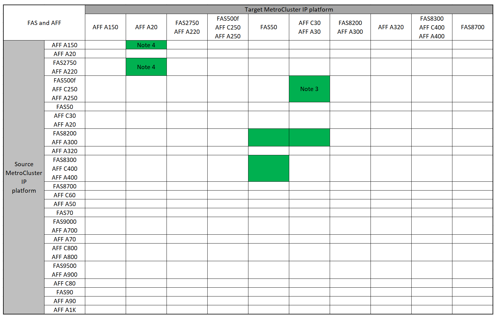

= Atualizações suportadas do controlador IP MetroCluster usando os comandos "System controller replace"
:allow-uri-read: 
:icons: font
:imagesdir: ../media/

[role="lead"]
Antes de iniciar a atualização do controlador IP do MetroCluster, é necessário verificar se a combinação de atualização é suportada.

Encontre sua plataforma *Source* nas tabelas de atualização do controlador MetroCluster nesta seção. Se a interseção da linha da plataforma *Source* e da coluna da plataforma *Target* estiver em branco, a atualização não será suportada.

Antes de iniciar a atualização, reveja as seguintes considerações para verificar se a sua configuração é suportada.

* Se a sua plataforma não estiver listada, não há combinação de atualização de controladora suportada.
* Quando você executa uma atualização de controlador, o tipo de plataforma *deve* antigo e novo corresponde:
+
** Você pode atualizar um sistema FAS para um sistema FAS ou um AFF A-Series para um AFF A-Series.
** Não é possível atualizar um sistema FAS para um AFF A-Series ou um AFF A-Series para um AFF C-Series.
+
Por exemplo, se a plataforma que você deseja atualizar for um FAS8200, você pode fazer upgrade para um FAS9000. Não é possível atualizar um sistema FAS8200 para um sistema AFF A700.

* Todos os nós (antigos e novos) na configuração do MetroCluster devem estar executando a mesma versão do ONTAP. Consulte link:https://hwu.netapp.com["Hardware Universe"^]a para obter a versão mínima suportada do ONTAP para a sua combinação.

== Atualizações suportadas do controlador IP AFF e FAS MetroCluster

A tabela a seguir mostra as combinações de plataforma suportadas para atualizar um sistema AFF ou FAS em uma configuração IP MetroCluster usando comandos "System controller replace", divididos em dois grupos.

* *O Grupo 1* mostra combinações de atualizações para sistemas AFF A150, AFF A20, FAS2750, FAS8300, FAS500f, AFF C250, AFF A250, FAS50, AFF C30, AFF A30, FAS8200, AFF A300, AFF A320, AFF A220, AFF C400, AFF A400 e FAS8700.
* *O Grupo 2* mostra combinações de atualizações para sistemas AFF C60, AFF A50, FAS70, FAS9000, AFF A700, AFF A70, AFF C800, AFF A800, FAS9500, AFF A900, AFF C80, FAS90, AFF A90 e AFF A1K.

As notas a seguir se aplicam a ambos os grupos:

* Observação 1: Atualizações de controladora são suportadas em sistemas que executam o ONTAP 9.13,1 ou posterior.
* Nota 2: A plataforma de destino não pode ter unidades internas até que a atualização da controladora esteja concluída. Você pode adicionar as unidades internas após a atualização.
* Nota 3: As atualizações de sistemas integrados (discos e controladores no mesmo chassi) exigem a substituição dos módulos controladores, mantendo o chassi e os discos existentes.
* Nota 4: Requer módulos IOM para converter os controladores antigos em um shelf SAS externo. Consulte a link:https://hwu.netapp.com/["Hardware Universe"^] para obter informações sobre os módulos IOM compatíveis.
* Nota 5: requer ONTAP 9.18.1GA ou posterior.

[role="tabbed-block"]
====
.Combinações AFF e FAS grupo 1
--
Analise as combinações compatíveis para atualizações para sistemas AFF A150, AFF A20, FAS2750, FAS8300, FAS500f, AFF C250, AFF A250, FAS50, AFF C30, AFF A30, FAS8200, AFF A300, AFF A400, AFF A220, AFF C400, AFF A320 e FAS8700.

--
.Combinações AFF e FAS grupo 2
--
Analise as combinações compatíveis para atualizações para os sistemas AFF C60, AFF A50, FAS70, FAS9000, AFF A700, AFF A70, AFF C800, AFF A800, FAS9500, AFF A900, AFF C80, FAS90, AFF A90 e AFF A1K.

image:../media/assisted-group-2-a70-a90-updated.png["Mostra combinações de atualização AFF e FAS grupo 2"]

--
====

== Atualizações suportadas do controlador IP ASA MetroCluster

A atualização de controladores usando `system controller replace` comandos em sistemas ASA não é suportada.

link:https://docs.netapp.com/us-en/ontap-metrocluster/upgrade/concept_choosing_an_upgrade_method_mcc.html["Escolha um método de atualização ou atualização"]Consulte para obter mais procedimentos.

.O que se segue?
Reveja o link:upgrade-mcc-ip-system-controller-replace-requirements.html["requisitos para utilizar este procedimento de atualização"].
